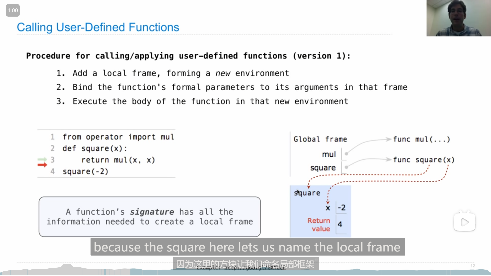
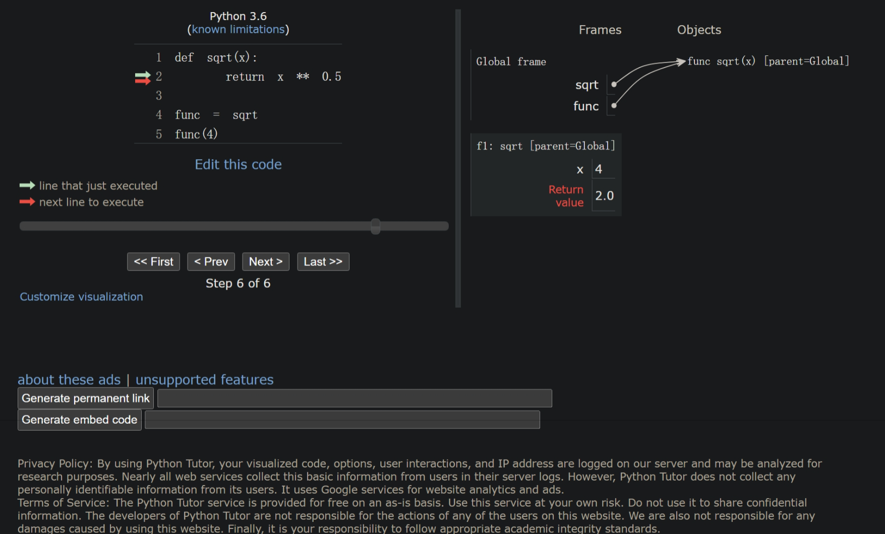
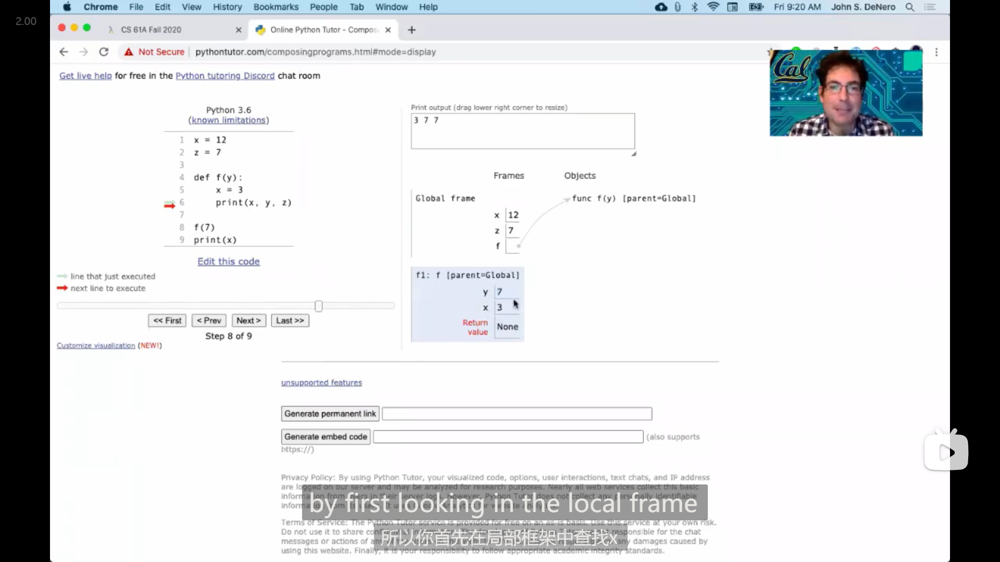
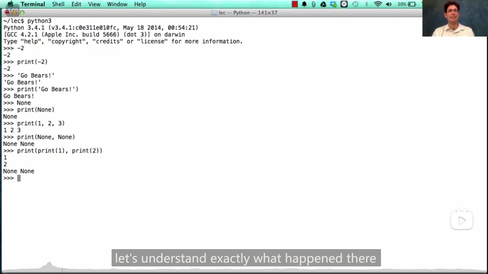
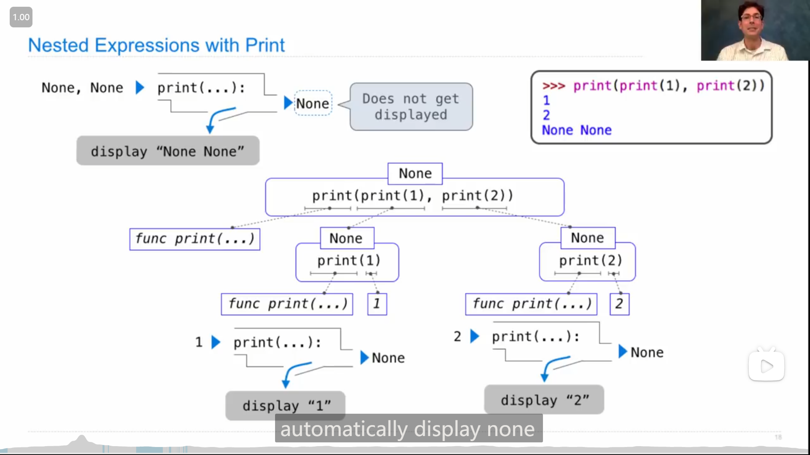
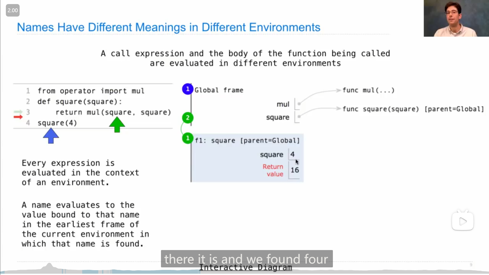
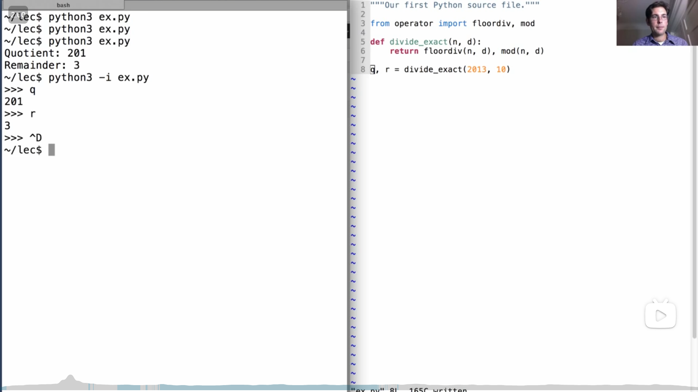
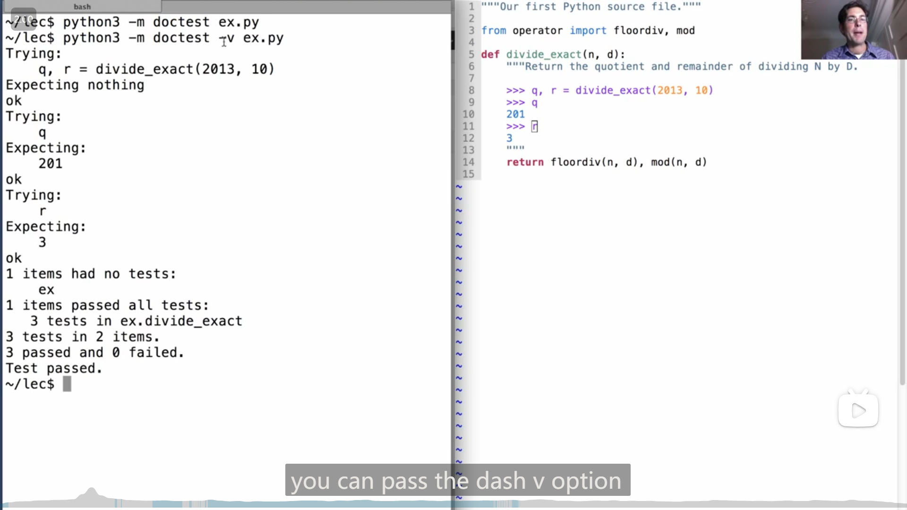
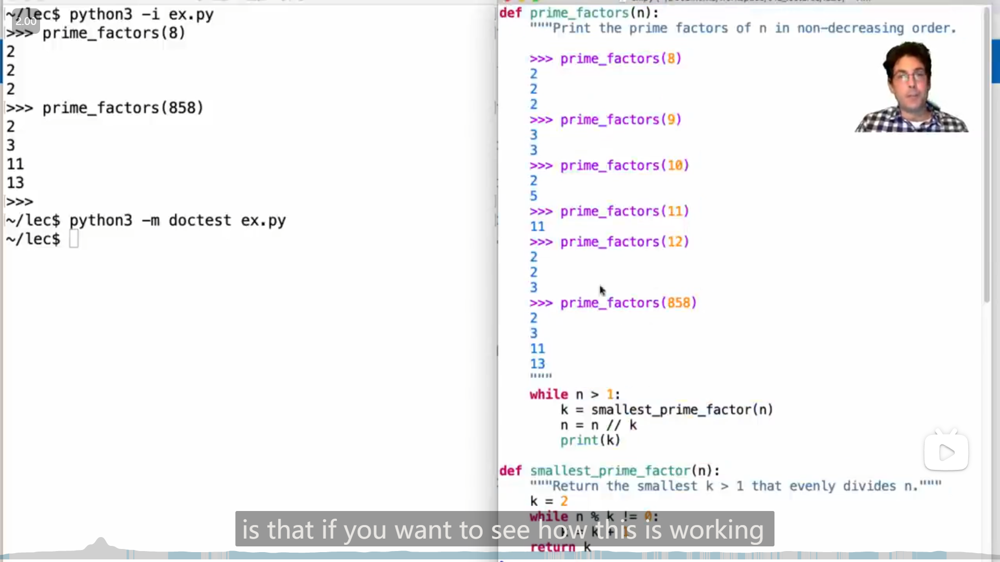

# Lab 00 --- Lecture 3 Q&A

## Lab 00

### 1

运行hw或者lab任务的对应命令时，都加上 `--local` ，就只在本地运行，不会上传然后要求输入邮箱，如

```bash
python ok [-q xxx] [-u] --local
```

## Lecture 2 Functions

### 1

变量可以 “指向” 一个函数

{ loading=lazy }

### 2

cs61a中使用的可以显示python程序中 environment 、 frame 等信息的在线网站：

[Online Python Tutor - Composing Programs - Python 3](https://pythontutor.com/cp/composingprograms.html#mode=edit)

>   John DeNero 编写的cs61a的配套英文原版教材：
>
>   [Composing Programs](https://www.composingprograms.com/)
>
>   在github上发现的其对应仓库：
>
>   [DestructHub/composing-programs: Annotation and code about SICP Python (github.com)](https://github.com/DestructHub/composing-programs)
>
>   github上发现的非官方的还在翻译(23/7/21发现)的中文版的仓库：
>
>   [csfive/composing-programs-zh: 🚧 CS61A 教材《Composing Programs》即《计算机程序的构造与解释》Python 版本的中文翻译 (github.com)](https://github.com/csfive/composing-programs-zh)
>
>   其对应网页：
>
>   [CSfive | CSfive](https://sicp.csfive.works/)

### 3

调用函数时，会创建一个新的frame，且frame的名字为函数本身的名字(即创建时的名字 (如果是lambda匿名函数则 没有名字/名字为lambda))，

{ loading=lazy }

即如果用某个变量指向了函数，在用变量调用函数的时，创建的frame名字仍为原函数名

{ loading=lazy }

### 4

{ loading=lazy }

python中，赋值可以同时对两个变量进行，会使交换变量的值等操作更方便，如

```python
a, b = b, a
```

## Lecture 2 Q&A

### 1

{ loading=lazy }

在哪个frame中定义(define)的函数，其parent就是哪个frame，除了Global frame其他都有parent

## HW 01

### 1

Q3，可以用总的减去最大的，得到最小的两个

::: details 代码
```python
def two_of_three(x, y, z):
    return x * x + y * y + z * z - max(x, y, z) ** 2
```
:::

### 2

Q5

```python
def with_if_function():
    """
    >>> result = with_if_function()
    42
    47
    >>> print(result)
    None
    """
    return if_function(cond(), true_func(), false_func())
```

由于在 `return` 语句中，填入的时调用的函数( `true_func()` 和 `false_func()` )，运行的顺序是 先进行 `true_func()` 和 `false_func()` 两个函数的调用，再将他们的返回值传递给 `if_function()` 中，所以(由于两个函数被调用了) 42和47都会输出

```python
def with_if_statement():
    """
    >>> result = with_if_statement()
    47
    >>> print(result)
    None
    """
    if cond():
        return true_func()
    else:
        return false_func()
```

而在这个函数中，则只会调用 `true_func()` 和 `false_func()` 其中一个函数，因此只会输出一个数字

::: details 代码
```python
def if_function(condition, true_result, false_result):
    """Return true_result if condition is a true value, and
    false_result otherwise.

    >>> if_function(True, 2, 3)
    2
    >>> if_function(False, 2, 3)
    3
    >>> if_function(3==2, 3+2, 3-2)
    1
    >>> if_function(3>2, 3+2, 3-2)
    5
    """
    if condition:
        return true_result
    else:
        return false_result


def with_if_statement():
    """
    >>> result = with_if_statement()
    47
    >>> print(result)
    None
    """
    if cond():
        return true_func()
    else:
        return false_func()


def with_if_function():
    """
    >>> result = with_if_function()
    42
    47
    >>> print(result)
    None
    """
    return if_function(cond(), true_func(), false_func())


def cond():
    "*** YOUR CODE HERE ***"
    return False

def true_func():
    "*** YOUR CODE HERE ***"
    print(42)


def false_func():
    "*** YOUR CODE HERE ***"
    print(47)
```
:::

## Homework 1 Hints

### 1

Q3 的两种思路：

1.   全部的结果取最小
2.   全部平方和减去最大平方

{ loading=lazy }

## Lecture 3 Control

### 1

{ loading=lazy }

`print()` 可以传入多个参数，打印时每个参数之间会空一个空格

### 2

{ loading=lazy }

-   在 a函数 参数调用的位置填入 被调用的b函数 ，实际上使先运行 b函数 ，再将b的返回值传入 a函数

-   `print()` 的返回值是 `None` 

补充：

{ loading=lazy }

### 3

::: info 引述
An environment is a sequence of frames.

-   The global frame alone
-   A local, then the global frame
:::

{ loading=lazy }

{ loading=lazy }

变量名在查找对应的值的时候，会从当前的 frame 依次向上(parent frame) 查找值，并绑定最早找到的值，如图中的 `square` 先在f1中查找(如果f1没有再在Global frame中查找)，并绑定了4 (如果f1中没有 `square` 对应的值，则会绑定到global frame中的func square)

<mark>此外</mark>，

图中也可以发现，frame的parent是根据代码的结构来确定的，而不是根据调用的关系来确定的，如 第一张图中 `square(square(3))` 里面和外面的 `square` 的 parent 都是 global frame

>   跟 Lecture 2 Q&A 中一样

### 4

{ loading=lazy }

-   ```bash
    python -i xxx.py
    ```

    可以将 `xxx.py` 文件中的代码引入命令行或者终端

-   命令行/终端中使用python时，++ctrl+d++ `^D` 可以清空界面

{ loading=lazy }

-   ```bash
    python -m doctest [-v] xxx.py
    ```

    可以运行 `xxx.py` 中函数说明语句部分的代码(用于测试函数能否输入正确预期结果)，如果报错会显示出报错信息，如果不报错则不显示信息 而正常显示下一行(如果死循环就一直不显示下一行)，

    `-v` 选项是不报错也能显示每个输入的测试结果，如上图

### 5

真值为**假**的值： `False` , `0` , `''` , `None` 等等

其余其他值基本上都为真

### 6

{ loading=lazy }

老师写分解质因数的思路值得学习：

将问题分解成两步：

1.   一个数的最小因数(因为要求要升序)
2.   再循环找最小因数，从而获得升序的分解质因数

并且将找最小的因数这个功能单独写成一个函数，这样看起来就很清晰

```python
def prime_factors(n):
    """Print the prime factors of n in non-decreasing order.
    
    >>> prime_factors(8)
    2
    2
    2
    >>> prime_factors(9)
    3
    3
    >>> prime_factors(10)
    2
    5
    >>> prime_factors(11)
    11
    >>> prime_factors(12)
    2
    2
    3
    >>> prime_factors(858)
    2
    3
    11
    13
    """
    while n > 1:
        k = smallest_prime_factor(n)
        n = n // k
        print(k)
        
def smallest_prime_factor(n):
    """Return the smallest k > 1 that evenly divides n."""
    k = 2
    while n % k != 0:
        k = k + 1
    return k
```

## Lecture 3 Q&A

### 1

{ loading=lazy }

由于**同一个函数内的同一个变量名必须指向同一个框架下的东西**，所以

```python
x = 2

def f():
    print(x)
    x = 3
    print(x)
    
f()
```

`x = 3` 这行已经对local框架下的x赋值，所以 f 函数内的x就都只能绑定local框架下的值，不能绑定母框架下的值

而第一个 `print(x)` 在执行时，(local框架下的)变量x还并未赋值，所以会报错，

如果去掉 `x = 3` 那么程序就不会报错

<mark>[Lecture 16](https://ronaldln.github.io/MyPamphlet/Notes%20of%20Courses/CS61A/#3_12)中也说到了这一点</mark>
