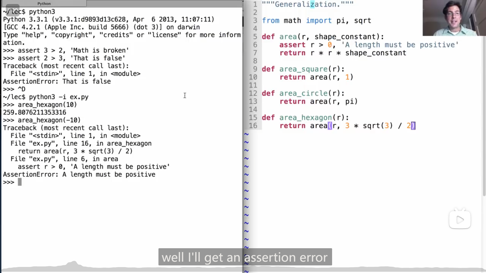
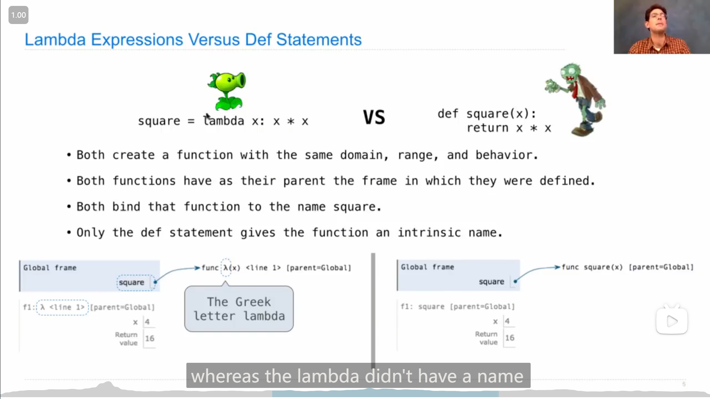
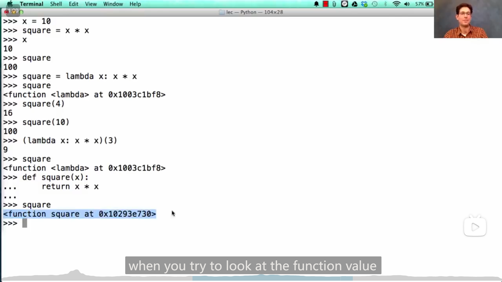
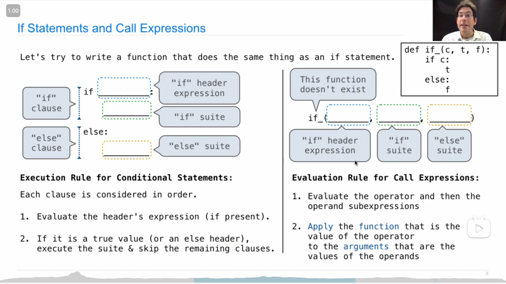
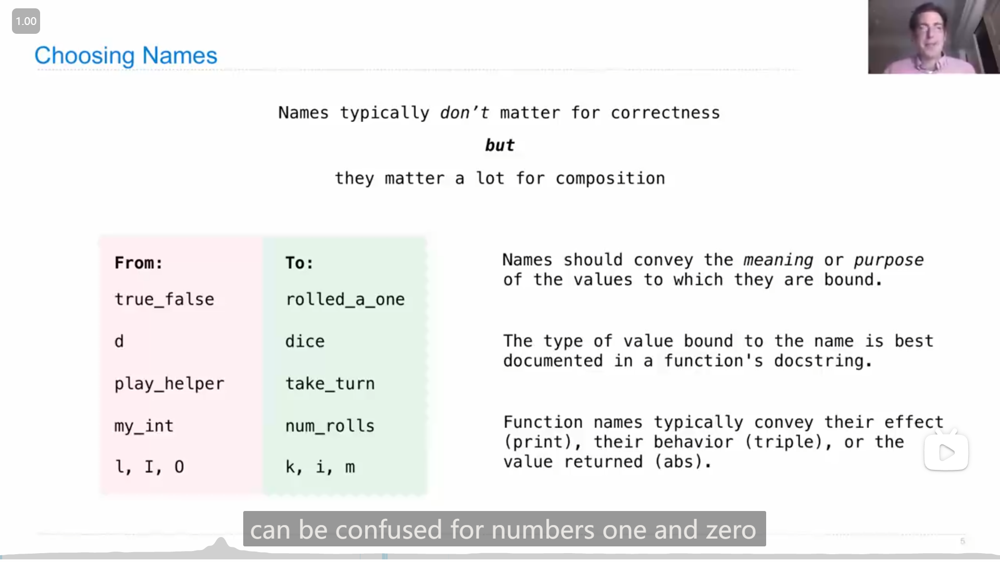
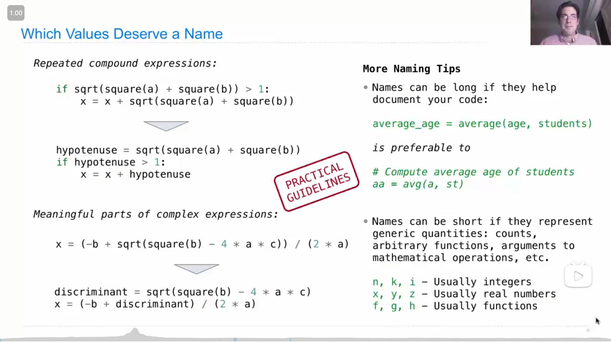
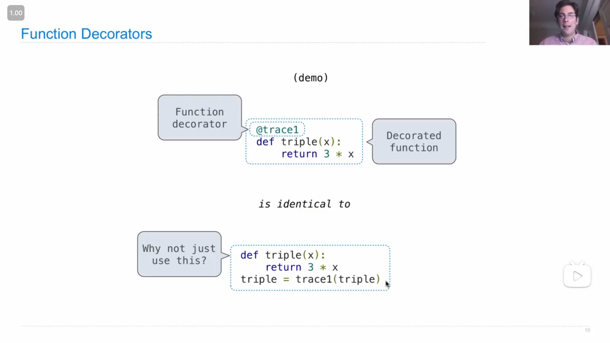
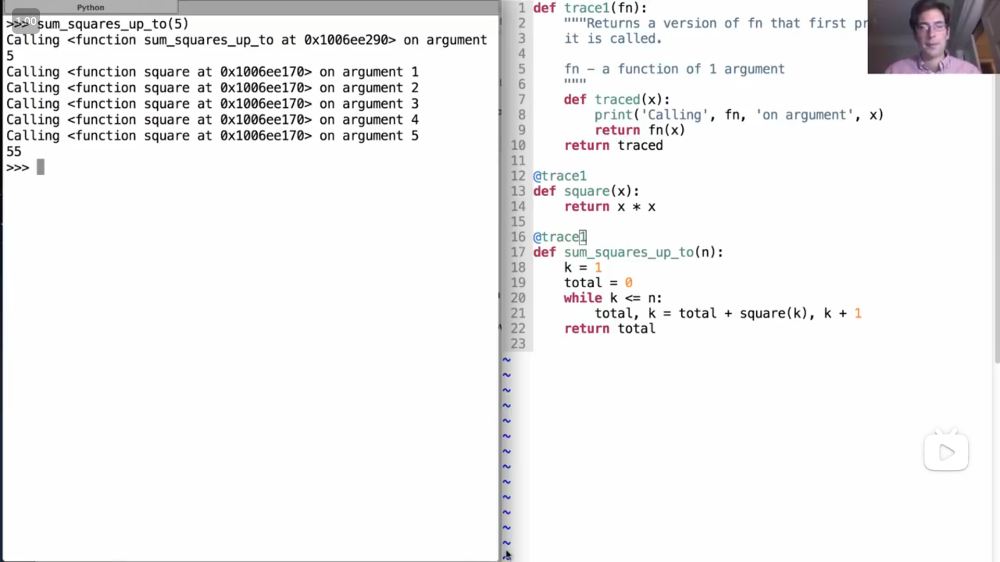

# Lecture 4 --- Lecture 7 Q&A

## Lecture 4 Higher-Order Functions

### 1

John提到设计函数时需要注意的几点

>   -   Give each function exactly one job
>   -   Don't repeat yourself (DRY). Implement a process just once, but execute it many times.
>   -   Define functions generally.

-   确保每个函数只做一个事情。
-   避免重复代码（遵循DRY原则）。将一个过程实现一次，然后多次执行它。
-   定义通用的函数。

### 2

{ loading=lazy }

`assert` 语句，如果 `assert` 之后表达式的值为假，那么就会报错，并显示对应的信息，如上图

### 3

John演示 `def` 创建出来的函数有固有的名字，而 `lambda` 创建出来的函数没有

{ loading=lazy }

{ loading=lazy }

### 4

{ loading=lazy }

`if` 语句只会执行 `if` 或者 `else` 语句中的一个，而另一个不会被执行，

而如果像上图一样定义一个类似于 `if` 语句的函数，并把表达式放在参数中，那么**两个表达式都会被<mark>执行</mark>**，而**传入的是表达式的结果/对应的值**

### 5

`and` 和 `or` 语句，

`and` / `or` 语句中，如果靠前的表达式结果计算为假/真，那么就会返回**这个结果**，而靠后的表达式就不再会执行，而如果所有表达式全对应为真/假，那么就会返回最后表达式的结果

### 6

`... if ... else ...` 语句(感觉很像c语言中的三目运算符)，

判断条件在中间，为真就执行左边的表达式并返回，为假就是右边

## Project Hog

### 1

Problem 7，这题需要实现 `announce_highest` 函数，返回一个函数，

这题可以参考已经实现好的 `annouce_lead_changes` 函数，代码的结构和这个函数大致相同

::: details 代码
```python
def announce_highest(who, last_score=0, running_high=0):
    assert who == 0 or who == 1, 'The who argument should indicate a player.'
    # BEGIN PROBLEM 7
    "*** YOUR CODE HERE ***"
    def say(score0, score1):
        gain = (score0 if not who else score1) - last_score
        if gain > running_high:
            print(gain, "point(s)! The most yet for Player", who)
        return announce_highest(who, last_score + gain, gain if gain > running_high else running_high)
    return say
    # END PROBLEM 7
```
:::

### 2

Problem 8中提到，可以使用 `*args` 来传入和使用不定个数的参数

>   Instead of listing formal parameters for a function, you can write `*args` . To call another function using exactly those arguments, you call it again with `*args` . For example,
>
>   ```python
>   >>> def printed(f):
>   ...     def print_and_return(*args):
>   ...         result = f(*args)
>   ...         print('Result:', result)
>   ...         return result
>   ...     return print_and_return
>   >>> printed_pow = printed(pow)
>   >>> printed_pow(2, 8)
>   Result: 256
>   256
>   >>> printed_abs = printed(abs)
>   >>> printed_abs(-10)
>   Result: 10
>   10
>   ```

::: details 代码
```python
def make_averaged(original_function, trials_count=1000):
    # BEGIN PROBLEM 8
    "*** YOUR CODE HERE ***"
    def averaged(*args):
        i = 0
        sum = 0
        while i < trials_count:
            sum += original_function(*args)
            i += 1
        return sum / trials_count
    return averaged
    # END PROBLEM 8
```
:::

### 3

Problem 9中需要使用Problem 8中实现的 `make_averaged` 来 **<mark>避免代码的重复</mark>**

::: details 代码
```python
def max_scoring_num_rolls(dice=six_sided, trials_count=1000):
    # BEGIN PROBLEM 9
    "*** YOUR CODE HERE ***"
    best_nums_rolls = 0
    max_average_score = 0
    averaged_roll_dice = make_averaged(roll_dice, trials_count)
    i = 1
    while i <= 10:
        average_score = averaged_roll_dice(i, dice)
        if average_score > max_average_score:
            max_average_score = average_score
            best_nums_rolls = i
        i += 1
    return best_nums_rolls
    # END PROBLEM 9
```
:::

## Lecture 5 Environments

### 1

John提到*框架 frame*

>   -   Every user-defined function has a parent frame (often global)
>   -   The parent of a function is the frame in which it was defined
>   -   Every local frame has a parent frame (often global)
>   -   The parent of a frame is the parent of the function called

-   每个自定义函数都有一个母框架(通常是全局框架)
-   函数的父级就是它被定义时所处的框架
-   每个本地框架都有一个母框架(通常是全局框架)
-   框架的父级是被调用函数的父级

## Lecture 6 Design

### 1

{ loading=lazy }

John提到如何对函数以及变量命名，分别举出了正反例

---

{ loading=lazy }

John指出了什么样的东西值得去命名，以及命名时(更多的)一些注意点

## Lecture 6 Q&A

### 1

John在演示时使用了 `round` 这个函数，作用是能四舍五入取整/去掉剩余的位数，

第一个参数传入需要取整的数，第二个参数表示取到第几位小数，例如

```python
>>> 1/3
0.3333333333333333
>>> round(1/3, 4)
0.3333
>>> 2/3
0.6666666666666666
>>> round(2/3, 5)
0.66667
```

## Lecture 7 Function Examples

### 1

*函数修饰符 Function Decorator*

{ loading=lazy }

如果在某个函数定义时， `@` 另一个已有的函数，就会把这个函数名对应的变量绑定成被 `@` 的函数传入这个函数后的返回值，

例如下图中John的demo演示

{ loading=lazy }

## Lecture 7 Q&A

### 1

有人提问18秋季第一次期中考试的第6题的a题

::: info 引述
**This Again?**

**Definitions.** A *repeatable integer* function takes an integer argument and returns a repeatable integer function.

**(a) (6 pt)** Implement `repeat` , which is a repeatable integer function that detects repeated arguments. As a side effect of repeated calls, it prints each argument that has been used before in a sequence of repeated calls. Therefore, if an argument appears *n* times, it is printed *n* − 1 times in total, each time other than the first. The `detector` function is part of the implementation of `repeat` ; you must determine how it is used.

**Important: You may** <u>**not**</u> **use a list, set, or any other data type not covered yet in the course.** 

```python
def repeat(k):
    """When called repeatedly, print each repeated argument.

    >>> f = repeat(1)(7)(7)(3)(4)(2)(5)(1)(6)(5)(1) 
    7
    1
    5
    1
    """ 
    return _____________________________________________________________________________(k) 

def detector(f): 
    def g(i): 
        if ________________________________________________________________________________: 
            _______________________________________________________________________________ 
        return ____________________________________________________________________________ 
    return g
```
:::

尝试自己做了一下，

由于 `detector` 的参数是 `f` ，所以想到应该是通过这个函数 `f` 来记录 `repeat` 传入过的参数，

而每次调用 `g` 时，应该是返回一个新的 `g` (这样才能重复调用)，所以 `g` 最后 `return` 时应该要调用 `detector` 来更新记录的信息，那么 `g` 中大概就可以得到

```python
def g(i):
    if f(i):
        print(i)
    return detector(...)
```

而 `repeat` 中，应该是最初始的状态，所以应该给 `detector` 传入没有信息的函数 `lambda x: False` ，因此 `g` 中要给 `detector` 传入的函数就是需要添加当前的 `i` 就行了

::: details 代码
```python
def repeat(k):
    return detector(lambda x: False)(k) 

def detector(f): 
    def g(i): 
        if f(i): 
            print(i) 
        return detector(lambda x: x == i or f(x)) 
    return g
```
:::
