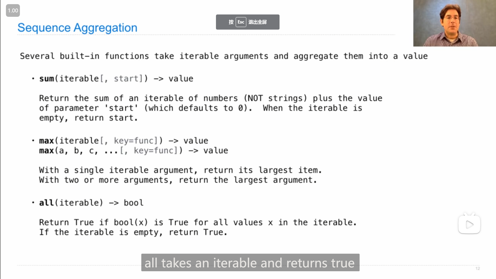

# Project Cats --- Lab 05

## Project Cats

::: tip
需要了解 Lec 12 Trees 中的数据抽象(data abstraction)部分的内容
:::

### 1

Problem 5 中使用 `min()` (序列聚合函数)会很方便，

但要注意 使用 `key` 参数传入判断函数时，需要写上 `key=` 

### 2

Problem 9 中尝试了列表推导式的嵌套使用

```python
def time_per_word(times_per_player, words):
    """Given timing data, return a game data abstraction, which contains a list
    of words and the amount of time each player took to type each word.

    Arguments:
        times_per_player: A list of lists of timestamps including the time
                          the player started typing, followed by the time
                          the player finished typing each word.
        words: a list of words, in the order they are typed.
    """
    # BEGIN PROBLEM 9
    "*** YOUR CODE HERE ***"
    times = [[timestamp[i + 1] - timestamp[i] for i in range(len(timestamp) - 1)] for timestamp in times_per_player]
    return game(words, times)
    # END PROBLEM 9
```

### 3

Problem 10 中如果要把一个string加入(使用 `+` 运算符)到list中，不能直接*加*string (否则会把只含有单个字母的string作为元素加入到列表中)，应该 `+ [str]` 或 `+= [str]` (创建一个含该字符串的列表)

### 4

Problem 6

看了hint视频后，将原本需要借助内部helper函数的写法改成了不需要helper的，关键之处在于 想到了limit可以用于计数(拿来减)

```python
def shifty_shifts(start, goal, limit):
    """A diff function for autocorrect that determines how many letters
    in START need to be substituted to create GOAL, then adds the difference in
    their lengths.
    """
    # BEGIN PROBLEM 6
    # assert False, 'Remove this line'
    # def helper(start, goal, count):
    #     if count > limit:
    #         return count
    #     # elif not start:
    #     #     return count + len(goal)
    #     # elif not goal:
    #     #     return count + len(start)
    #     elif not start or not goal:
    #         return count + len(start + goal)
    #     else:
    #         return helper(start[1:], goal[1:], count if start[0] == goal[0] else count + 1)
    # return helper(start, goal, 0)

    # if limit == 0:
    #     return 1
    if limit < 0:
        return 0
    elif not start or not goal:
        return len(start + goal)
    elif start[0] == goal[0]:
        return shifty_shifts(start[1:], goal[1:], limit)
    else:
        return 1 + shifty_shifts(start[1:], goal[1:], limit - 1)
    # END PROBLEM 6
```

>   下图有一点启发作用(对problem 7如何找到*降解*的方法也有一定帮助)
>
>   { loading=lazy }

### 5

Problem 7

由提示视频中problem 6中的，助教*降解* **替换** 操作的方法如下：

```python
#   "range", "rungs"  2
#    "ange",  "ungs"  2
#     "nge",   "ngs"  1
#      "ge",    "gs"  1
#       "e",     "s"  1
#        "",      ""  0
```

>   { loading=lazy }

即*降解*的关键一步为：

```python
#   "range", "rungs"  1 + x
#    "ange",  "ungs"  1 + x
#     "nge",   "ngs"  x
#       ...,     ...  ...
```

那么，类似的， **添加** 操作的降解，拿 `cats` 作为start 以及 `scat` 作为goal 举例，可理解为：

cats在开头添加一个s，变成scats (添加的字母一定是goal的第一个字母)，

**那么需要判断的部分，就从 <mark>cats</mark> 、 <mark>scat</mark>，变成了 s <mark>cats</mark> 、 s <mark>cat</mark>**

则降解的关键一步就应该是：

```python
#       ...,     ...  ...
#    "cats",  "scat"  1 + x
#    "cats",   "cat"  x
#       ...,     ...  ...
```

则同理，**删除** 操作的降解，拿 ckiteus 、 kittens 举例，

操作前后，**需要判断的部分，从 <mark>ckiteus</mark> 、 <mark>kittens</mark>，变成了 <mark>kiteus</mark> 、 <mark>kittens</mark>**

则降解的关键一步就应该是：

```python
#          ...,        ...  ...
#    "ckiteus",  "kittens"  1 + x
#     "kiteus",  "kittens"  x
#          ...,        ...  ...
```

则最后根据模板修改的代码为：

```python
def pawssible_patches(start, goal, limit):
    """A diff function that computes the edit distance from START to GOAL."""
    # assert False, 'Remove this line'

    if limit < 0: # Fill in the condition
        # BEGIN
        "*** YOUR CODE HERE ***"
        return 0
        # END

    elif not start or not goal: # Feel free to remove or add additional cases
        # BEGIN
        "*** YOUR CODE HERE ***"
        return len(start + goal)
        # END

    elif start[0] == goal[0]:
        return pawssible_patches(start[1:], goal[1:], limit)
    else:
        add_diff = 1 + pawssible_patches(start, goal[1:], limit - 1) # ... # Fill in these lines
        remove_diff = 1 + pawssible_patches(start[1:], goal, limit - 1) # ...
        substitute_diff = 1 + pawssible_patches(start[1:], goal[1:], limit - 1) # ...
        # BEGIN
        "*** YOUR CODE HERE ***"
        return min(add_diff, remove_diff, substitute_diff)
        # END
```

>   最后发现思路与助教提示的一样
>
>   { loading=lazy }

::: info 引述
...("ats" and "cats") we see thats adding one letter to the front, is actually the exact same as just chopping off letter from the front of the second word. so what do I mean by that, this is what I mean, I mean if I add one letter to the front, I might as well just be taking off one letter from the back, so instead of adding C to this word I can just say, well I'm just going to take off the first letter of whatever this word is, because I know that, if I add that letter to this word, then I know that it's going to be the correct letter, so I don't even need to add it, I can just go ahead and chop off the letter from the second word, and I know that it'll be okay. right, so doing comparing cats and cats, is the exact same thing as comparing ats and ats, there will be no more difference. so that's the add example right there...

...the last is the substitute example("hello" and "mello"). so this should be pretty familiar from our previous problem. remember for the previous problem we just took out the first letter of both, so it said that if they were different, then we're just gonna take them all out, and say that we had one edit distance, we had one substitution needed. and so you see that, substituting the first letter to an M to make it match the second, is the exact same thing as just taking out both letters. we don't care what they are, we see that they're different, we're just gonna take out both and call it a day. and so we see that we end with ello and ello, and then we're done...
:::

### 6

字典可以这样写，更清晰

```python
report = {
    "id": user_id,
    "progress": progress,
}
```

(最后一个逗号有没有不影响)

>   { loading=lazy }

### 7

一个小发现

`...` 可以赋值给变量，如

```python
a = 
```

会报错，

而

```python
a = ...
```

则不会报错

## Lecture 12 Trees

### 1

{ loading=lazy }

`[...]` 中括号/方括号(square brackets)中的内容表示为可选的(optional)

### 2

序列聚合函数(Sequence Aggregation)

{ loading=lazy }

`sum()` 函数，可以用于除字符串以外的序表，将序表中的元素以其对应的 `+` 法求和并返回(默认初始值为0，如果是其他类型，需要设置初始值，如列表需要传入空列表 `[]` 座位 `start` 参数)

{ loading=lazy }

`max()` 函数，可以返回最大值，或者是使key函数返回值最大的值(自变量)

{ loading=lazy }

>   对应的还有 `min()` 和 `any()`

### 3

**树抽象(Tree Abstaction)的实现**

{ loading=lazy }

### 4

递归在树中的运用，

要**<mark>直接假想函数能返回所需要返回的东西(即假想返回的东西是已知的)</mark>**，然后直接在函数内部去**直接使用**这个返回的东西，

并且需要记住树的孩子也是树。

例如

```python
def count_leaves(t):
    """Count the leaves of a tree."""
    if is_leaf(t):
        return 1
    else:
        branch_counts = [count_leaves(b) for b in branches(t)]
        return sum(branch_counts)
```

>   Hint: 假想该函数一定能返回树的叶子数(即假想已知子树叶子数)，然后对子树的叶子数和即得到本树的叶子数

```python
def leaves(tree):
    """Return a list containing the leaves labels of tree.
    
    >>> leaves(fib_tree(5))
    [1, 0, 1, 0, 1, 1, 0, 1]
    """
    if is_leaf(tree):
        return [label(tree)]
    else:
        return sum([leaves(b) for b in branches(tree)], [])
```

>   Hint: 假想该函数能返回 一个含 *树的所有叶子的值/标签* 的list 

```python
def increment_leaves(t):
    """Return a tree like t but with leaf labels incremented."""
    if is_leaf(t):
        return tree(label(t) + 1)
    else:
        bs = [increment_leaves(b) for b in branches(t)]
        return tree(label(t), bs)
```

```python
def increment(t):
    """Return a tree like t but with all labels incremented"""
    return tree(label(t) + 1, [increment(b) for b in branches(t)])
```

>   Hint: 假想能返回一个 ... 的树

```python
def fib_tree(n):
    if n <= 1:
        return tree(n)
    else:
        left, right = fib_tree(n - 2), fib_tree(n - 1)
        return tree(label(left) + label(right), [left, right])
```

>   Hint同上

### 5

还有另一种**不使用函数本身返回的值**的递归函数

{ loading=lazy }

```python
def fact(n):
    return fact_times(n, 1)

def fact_times(n, k):
    """Return k * n * (n - 1) * ... * 1"""
    if n == 0:
        return k
    else:
        return fact_times(n - 1, k * n)
```

{ loading=lazy }

(打印每个叶子(从根开始)的路径)

```python
def print_sums(t, so_far):
    so_far = so_far + label(t)
    if is_leaf(t):
        print(so_far)
    else:
        for b in branches(t):
            print_sums(b, so_far)
```

>   应该是将要迭代的变量作为参数传入函数中

## Lecture 12 Q&A

### 1

11:06

关于lab04 Q6

::: info 引述
...by the way this is this is sort of a classic recursion problem, where you can see, you know, you think about the problem as what if i have a, you know, just there's one letter in each, and those match, what do i do, right, and then what do you do otherwise. it's, it's that classic recursion where you, you sort of simplify the problem to the simplest possible cases. the base case, one of them is empty, and then here there's there's sort of like two base cases almost, not quite because that second one is a recursion but it's that really really simple case, and then you build in the complexity after that. um, so that i, that's what's sort of really cool about these recursive solutions...

---

...顺便说一句，这是一个经典的递归问题，你可以看到，你知道，你认为这个问题是，如果我有一个，你知道的，每个只有一个字母，这些匹配，我该怎么做，对吧，然后你该怎么做。这是一个经典的递归，你可以将问题简化为最简单的情况。基本情况，其中一个是空的，然后这里几乎有两个基本情况，不完全是因为第二个是递归，但这是一个非常简单的情况，然后你构建复杂度。嗯，所以我，这就是这些递归解决方案真正酷的地方...
:::

### 2

18:16

关于hw02 Q5，匿名函数的递归

::: info 引述
**John**:

```python
lambda n: 1 if n == 1 else n * fact(n - 1)
```

...uh how would we give this thing a different name, well, instead of assigning we could have it be fact, 

```python
lambda fact: lambda n: 1 if n == 1 else n * fact(n - 1)
```

but then, how would we like, pass that in, i guess instead of putting it here, maybe, maybe the best place to put it is here,

```python
lambda n, fact: 1 if n == 1 else n * fact(n - 1)
```

so, basically in order to run this, we need an n and we need factorial. i'll just let that sink in, if factorial is not already defined, then somebody needs to pass it in, in order for us to call it. i'm gonna need a little bit more space than this i'm afraid. now, that we have a function that takes n and factorial. we need to be a little bit careful, we want this to be our factorial function, but it takes two arguments, and here we're calling it with only one argument, so that seems like a mismatch. what should be the second argument every time we call fact, well it should be the same function again, that's kind of how we get that recursive structure,

```python
lambda n, fact: 1 if n == 1 else n * fact(n - 1, fact)
```

is that every time we call this thing that takes in a number and the function that we're going to call recursively, it needs to be called on a new number and the function that we're going to call recursively. so we've actually made some progress even though all we've done is kind of like move a name in here, and uh, pass it around. the last part is that we need to figure out, how to write a function, that takes only n, and somehow uh, calls this one instead,

```python
lambda n: (lambda n, fact: 1 if n == 1 else n * fact(n - 1, fact))
```

and that's actually not so bad, this says, uh, give me a function, and call that function, on both n and itself.

```python
lambda n: (lambda f: f(n, f))(lambda n, fact: 1 if n == 1 else n * fact(n - 1, fact))
```

so if i have a function, and i call it on n and itself, where n comes from here, now i just need to know which function i'm supposed to be calling on n in itself. and the answer is, this guy (`(lambda n, fact: 1 if n == 1 else n * fact(n - 1, fact))`).

```python
g = lambda n: (lambda f: f(n, f))(lambda n, fact: 1 if n == 1 else n * fact(n - 1, fact))
```

so let's see what g does now. g computes n factorial, if we really wanted to get rid of that assignment statement, 

```python
print((lambda n: (lambda f: f(n, f))(lambda n, fact: 1 if n == 1 else n * fact(n - 1, fact)))(4))
```

then we could compute four factorial this way, by taking this function and calling it on four, and then, hopefully, if everything went right, we will have printed four factorial, or five factorial, or whatever. <mark>so, what was the key moments in figuring this out, one was, if we can't have fact defined already, then we have to pass it in as an argument, and the second was, if we have a function that takes two arguments, and we really want a function that takes one argument, then we should write a function that takes one argument, and calls the function that takes two arguments. and, then, the last part really is kind of a trick, which is to say like if you had a function and an argument, you would then call the function on the argument in itself, this is basically how you create recursion, without using assignment statements</mark> is this little part right here...
    
&nbsp;

**Hany**:

...i i think john's right here. by the way, look there's a couple of things that you've seen before, <mark>essentially there's the helper function in here. you have a function that, uh, only takes one parameter and, you really need to pass two, so you put a helper function in</mark>, that's basically what you have here with the lambda. um, you've got sort of the notion of recursion and then there's just that little trick there, um, which you see with, uh, this, uh, lambda f of f of nf. so don't, don't get too worried if you didn't see that obvi, it obvious, i don't think it's at all obvious actually.
    
&nbsp;

**John**:

one thing that's exciting about this while it's not obvious at all, is that it allows you to create iteration out of just functions, like of course there's no assignment here, there's also no while statement or for statement here. but we are doing something repetitively, and, so, um, this is kind of, uh, this idea right here, is a building block for the claim, that once you can define functions you can kind of write any program that you want, you can perform any computation, and you might wonder was that really true, like don't i need a while statement or a for statement. it turns out technically you don't, that does not mean we should get rid of while statements and for statements, they're a lot more readable than this i think, but, um, they're not strictly necessary in order to perform interesting computations.
    
&nbsp;

**Hany**:

yes, and some in the chat just pointed out scheme and lisp is this is sort of the premise of these functional programming languages, that don't have looping, explicit looping constructs as you do everything, with these types of constructs, and it's a little bit mind-bending, but, it turns out it's expressive enough...

---

**John**:

```python
lambda n: 1 if n == 1 else n * fact(n - 1)
```

...呃，我们怎么给这个东西取一个不同的名字呢，好吧，与其指定，我们可以让它成为fact，

```python
lambda fact: lambda n: 1 if n == 1 else n * fact(n - 1)
```

但是，我们会怎么想，把它传进来，我想与其把它放在这里，也许，也许最好的地方放在这里，

```python
lambda n, fact: 1 if n == 1 else n * fact(n - 1)
```

所以，基本上，为了运行这个，我们需要一个n，我们需要fact。我会让它沉下去，如果fact还没有定义，那么需要有人把它传进来，这样我们才能调用它。恐怕我需要更多的空间。现在，我们有一个函数，它取n和fact。我们需要小心一点，我们希望这是我们的阶乘函数，但它需要两个参数，而这里我们只用一个参数来调用它，所以这看起来不匹配。每次我们调用fact时，第二个参数应该是什么，它应该是同一个函数，这就是我们得到递归结构的方式，

```python
lambda n, fact: 1 if n == 1 else n * fact(n - 1, fact)
```

每次我们调用这个包含一个数字和我们要递归调用的函数的东西时，都需要对一个新的数字和我们将递归调用的功能进行调用。所以我们实际上已经取得了一些进展，尽管我们所做的只是把一个名字移到这里，然后把它传来传去。最后一部分是，我们需要弄清楚，如何编写一个只需要n的函数，并以某种方式调用这个函数，

```python
lambda n: (lambda n, fact: 1 if n == 1 else n * fact(n - 1, fact))
```

这其实还不错，这说，给我一个函数，并调用这个函数，对n和它本身。

```python
lambda n: (lambda f: f(n, f))(lambda n, fact: 1 if n == 1 else n * fact(n - 1, fact))
```

如果我有一个函数，我在n和它本身上调用它，n来自这里，现在我只需要知道我应该在n本身上调用哪个函数。答案是，这家伙 (`(lambda n, fact: 1 if n == 1 else n * fact(n - 1, fact))`)。

```python
g = lambda n: (lambda f: f(n, f))(lambda n, fact: 1 if n == 1 else n * fact(n - 1, fact))
```

让我们看看g现在做什么。g计算n阶乘，如果我们真的想去掉赋值语句，

```python
print((lambda n: (lambda f: f(n, f))(lambda n, fact: 1 if n == 1 else n * fact(n - 1, fact)))(4))
```

然后我们可以用这种方式计算4的阶乘，通过取这个函数并在4上调用它，然后，如果一切顺利，我们将打印出4的阶乘，或5的阶乘，或其他什么。<mark>那么，弄清楚这一点的关键时刻是什么，一个是，如果我们还不能定义fact，那么我们必须将其作为一个参数传递，第二个是，我们有一个接受两个参数的函数，我们真的想要一个接受一个参数的函式，那么我们应该写一个接受了一个参数，并调用接受两个变量的函数。然后，最后一部分实际上是一种技巧，也就是说，如果你有一个函数和一个参数，你会在参数本身上调用函数，这基本上就是你创建递归的方法，而不使用赋值语句</mark>，这就是这个小部分...
    
&nbsp;

**Hany**:

...我觉得约翰是对的。顺便说一下，这里有你以前见到过一些东西，最基本地 <mark>这里有helper函数。你有一个函数，呃，只接受一个参数，你需要传递两个，所以你在里面放了一个辅助函数</mark>，这基本上就是lambda。嗯，你已经有了递归的概念，然后有一个小技巧，你可以看到，这个，这个，lambda f of f of nf。所以不要，不要太担心，如果你没有清楚地看到，我认为它实际上一点也不明显。
    
&nbsp;

**John**:

虽然这一点并不明显，但有一点令人兴奋，那就是它允许你仅从函数中创建迭代，当然这里没有赋值，这里也没有while语句或for语句。但我们在重复地做一些事情，这是一种，嗯，这个想法，是这个主张的一个构建块，一旦你定义了函数，你就可以编写任何你想要的程序，你可以执行任何计算，你可能会想，这真的是真的吗，比如我不需要while语句或for语句。事实证明，从技术上讲，你没有，这并不意味着我们应该去掉while语句，对于语句，它们比这更可读，但是，嗯，为了执行有趣的计算，它们并不是严格必要的。
    
&nbsp;

**Hany**:

是的，聊天中的一些人刚刚指出scheme和lisp，这是这些函数式编程语言的前提，它们在做任何事情时都没有循环、显式的循环结构，有这些类型的结构，这有点让人费解，但事实证明它足够有表达力...
:::

我的理解是，匿名函数的递归，由于无法声明变量和给变量赋值，所以需要将函数作为参数传入匿名函数，然后再在内部调用，而由于此时匿名函数测参数中有一个函数参数，所以在调用以参数传入的函数时，参数也要与自身相匹配(即加上该函数自身)，如

```python
lambda n, f: 1 if n == 1 else f(n, f)
```

下一步我的理解是，由于需要去调用匿名函数自身，而又不能赋值，那么就智能将函数作为参数传入另一个函数，再在后者内部调用前者，即

```python
(lambda f: f(n, f))(lambda n, f: 1 if n == 1 else f(n, f))
```

最后，由于n是最终想要设置的参数，所以在最外面最后包上一层

```python
lambda n: (lambda f: f(n, f))(lambda n, f: 1 if n == 1 else f(n, f))
```

### 3

23:52

关于lecture 12最后提及的递归函数的构建方式

::: info 引述
{ loading=lazy }

```python
def fact(n):
    if n == 0:
        return 1
    else:
        return n * fact(n - 1)

def fact_times(n, k):
    """Return k times n factorial
                k *     n * (n-1) * ... * 1
    """
    if n == 0:
        return k
    else:
        return fact_times(n - 1, k * n)
```

**John**:

...yeah, so the reason we did something a little bit different here, was so that we could show an example, of a recursive function, that just called itself, without doing anything with it, so there kind of wasn't anything outside of the call, everything happened inside the call, where we subtracted one from n and we multiplied k by n. but we didn't like add anything or multiply anything afterwards, which was different than the original version of factorial, which did multiply the result of the recursive call by n. the original one looked like this, right, it was like if n equals zero return one, else return n times fact n minus one. so here we make the recursive call and then we like do some work afterwards, and that means the recursive call doesn't really know where it came from. it doesn't know anything about which factorial result you're constructing, whereas this one does. at the end, when you hit the base case, you have computed k times n factorial for whatever n in k you started with, and that is now named k, which is a little confusing, but that's how it goes sometimes with recursion. but the point is that the whole answer is, uh, built up by the time you hit the base
case, at which point you just have to return return return return, all the work is done.
    
&nbsp;

**Hany**:

and notice, by the way, <mark>in that first one</mark> that's not true, as you're doing recursion, <mark>there is a delayed gratification of the evaluation of that product, so when you hit the base case in the first fact, you then have to go back and now multiply all those numbers between n and one</mark>. yeah because you built an expression, whereas <mark>in the fact times</mark>, you basically have an assignment operator, it's that you're, you're just <mark>using the parameters as the assignment operator</mark>, and so <mark>when you hit that base case, done, i've got the answer</mark>. so, so you're right, <mark>of course, we could have done it differently, we didn't have to do it this way, but you see that the structurally the recursion is subtly different here</mark>, and it turns out this has a real implication too by the way, downstream, and i think, i think we'll eventually do that, right john.
    
&nbsp;

**John**:

yeah so <mark>this is called, uh, tail recursion</mark>, and this is not, and we'll talk about this later when we talk about interpreters. um, so the goal here wasn't to implement fact times, it was actually to re-implement fact. but <mark>in order to re-implement fact you'd have to have a helper function, that's what fact times is. that keeps track of two arguments instead of one. the thing you're trying to compute the factorial of, and the result the answer of computing n.</mark>

---

**John**：

...是的，我们在这里做了一些不同的事情，是为了展示一个递归函数的示例，它只是调用了自己，而没有对它做任何事情，所以在调用之外几乎没有什么东西，所有事情都发生在调用内部，我们从n中减去了1并将k乘以n。但是我们没有添加或乘以任何其他东西，这与阶乘的原始版本不同，原始版本通过乘以递归调用的结果来计算。原始版本看起来像这样，如果n等于零，则返回1，否则返回n乘以fact（n-1）。所以在这里，我们进行递归调用，然后在之后进行一些工作，这意味着递归调用不知道它来自哪里。它不知道你正在构建哪个阶乘结果，而这个版本知道。最后，当你到达基本情况时，你已经计算出了对于任何以k为n开始的n，k乘以n的阶乘，现在它被命名为k，这有点令人困惑，但有时就是这样递归。但是重点是整个答案在达到基本情况时就已经构建完成，此时你只需要返回，返回，返回，所有的工作都已完成。
    
&nbsp;

**Hany**：

顺便提一下，<mark>在第一个函数中</mark>，当你进行递归时，<mark>有一个乘积的评估延迟，所以当你在第一个fact中达到基本情况时，你需要回去现在乘以n和1之间的所有数字</mark>。是的，因为你构建了一个表达式，而 <mark>在fact times中</mark>，你基本上有一个赋值运算符，你只是 <mark>将参数用作赋值运算符</mark>，所以当你 <mark>到达基本情况时，完成了，我得到了答案</mark>。所以，当然，你是对的，<mark>我们本来可以用不同的方式做这个，但你可以看到，递归的结构在这里是微妙不同的</mark>，这在下游也有实际影响，我认为我们最终会做，对吧，John。
    
&nbsp;

**John**：

是的，所以 <mark>这被称为尾递归</mark>，而这不是尾递归，我们将在讨论解释器时再谈论这个问题。所以这里的目标不是实现fact times，而是重新实现fact。但是 <mark>为了重新实现fact，您必须有一个辅助函数，即fact times。与一个参数不同，它保留了要计算阶乘的元素和计算n结果的答案这两个参数。</mark>
:::

## Lab 05

### 1

Q6 中，借鉴了 `lab05.py` 文件底部 `Tree ADT` 中最后一个函数 `copy_tree()` 的函数构造思路

>   ```python
>   def copy_tree(t):
>       """Returns a copy of t. Only for testing purposes.
>   
>       >>> t = tree(5)
>       >>> copy = copy_tree(t)
>       >>> t = tree(6)
>       >>> print_tree(copy)
>       5
>       """
>       return tree(label(t), [copy_tree(b) for b in branches(t)])
>   ```

由于Q6中是需要返回一个新的树，所以直接用树的构造函数根据原树去**递归地**(参考 `copy_tree()` )构造一个新树

>   (先构建好基本的递归，再考虑基本情况(basic situation)下如何处理)
>
>   1
> 
>   ```python
>   def sprout_leaves(t, leaves):
>       return tree(label(t), [... sprout_leaves(branch, leaves) for branch in branches(t)])
>   ```
>
>   2
> 
>   ```python
>   def sprout_leaves(t, leaves):
>       return tree(label(t), [... if is_leaf(branch) else sprout_leaves(branch, leaves) for branch in branches(t)])
>   ```
>
>   3
> 
>   ```python
>   def sprout_leaves(t, leaves):
>       return tree(label(t), [tree(label(branch), [...]) if is_leaf(branch) else sprout_leaves(branch, leaves) for branch in branches(t)])
>   ```
>
>   4
> 
>   ```python
>   def sprout_leaves(t, leaves):
>       return tree(label(t), [tree(label(branch), [tree(leaf) for leaf in leaves]) if is_leaf(branch) else sprout_leaves(branch, leaves) for branch in branches(t)])
>   ```

### 2

Q9

(可以利用下标来构建推导式)

::: info 引述
<mark>*Hint:* To write this as a single comprehension, you may find the expression `k%2`, which evaluates to 0 on even numbers and 1 on odd numbers, to be useful. Consider how you can use the 0 or 1 returned by `k%2` to alternatively access the beginning and the middle of the list.</mark>
:::

::: details 代码
```python
def riffle(deck):
    """Produces a single, perfect riffle shuffle of DECK, consisting of
    DECK[0], DECK[M], DECK[1], DECK[M+1], ... where M is position of the
    second half of the deck.  Assume that len(DECK) is even.
    >>> riffle([3, 4, 5, 6])
    [3, 5, 4, 6]
    >>> riffle(range(20))
    [0, 10, 1, 11, 2, 12, 3, 13, 4, 14, 5, 15, 6, 16, 7, 17, 8, 18, 9, 19]
    """
    "*** YOUR CODE HERE ***"
    return [deck[i // 2] if i % 2 == 0 else deck[(len(deck) + i) // 2] for i in range(len(deck))]
```
:::

### 3

在 [Lecture 14 Q&A](#Lecture 14 Q&A) 中 John 有提到此题的解法，在看了一部分(使用下标的方法)之后，用列表推导式写出了一个可用的方法(结构有点类似于Q6)：

```python
def add_trees(t1, t2):
    return tree(label(t1) + label(t2), [add_trees(branches(t1)[i] if i < len(branches(t1)) else tree(0), branches(t2)[i] if i < len(branches(t2)) else tree(0)) for i in range(max(len(branches(t1)), len(branches(t2))))])
```

### 4

Q11中

```python
def build_successors_table(tokens):
    """Return a dictionary: keys are words; values are lists of successors.

    >>> text = ['We', 'came', 'to', 'investigate', ',', 'catch', 'bad', 'guys', 'and', 'to', 'eat', 'pie', '.']
    >>> table = build_successors_table(text)
    >>> sorted(table)
    [',', '.', 'We', 'and', 'bad', 'came', 'catch', 'eat', 'guys', 'investigate', 'pie', 'to']
    >>> table['to']
    ['investigate', 'eat']
    >>> table['pie']
    ['.']
    >>> table['.']
    ['We']
    """
    table = {}
    prev = '.'
    for word in tokens:
        if prev not in table:
            "*** YOUR CODE HERE ***"
        "*** YOUR CODE HERE ***"
        prev = word
    return table
```

中的 `sorted()` 函数如果以字典为传入参数，输出的 应该 是一个含有所有key并且排序好的列表
