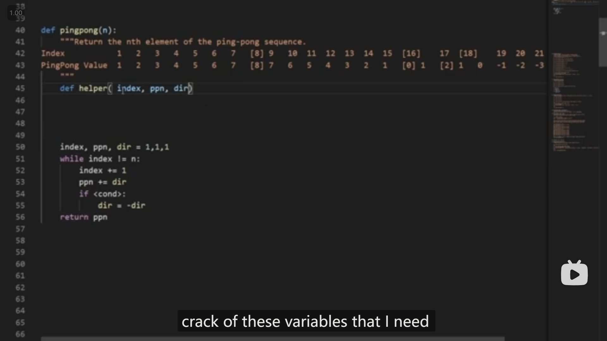
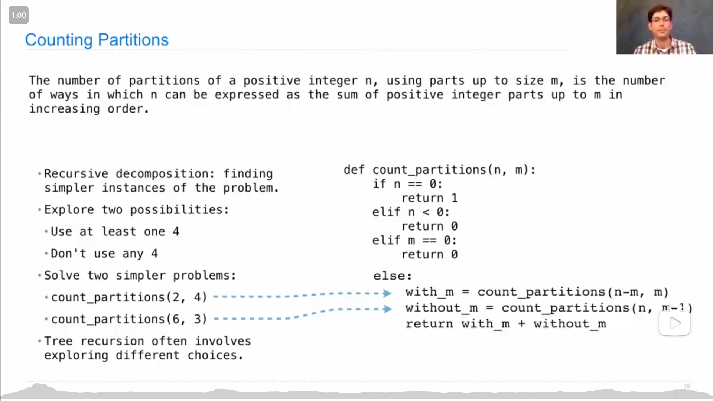
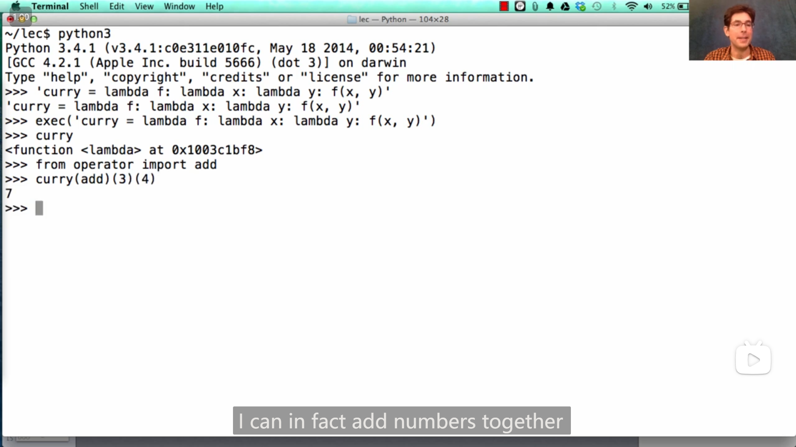
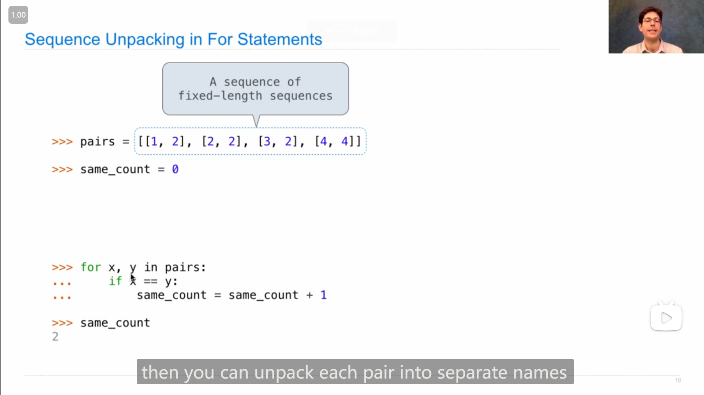
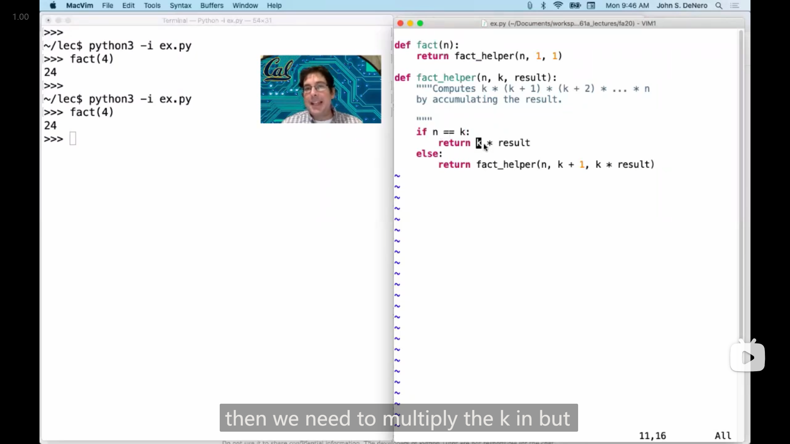
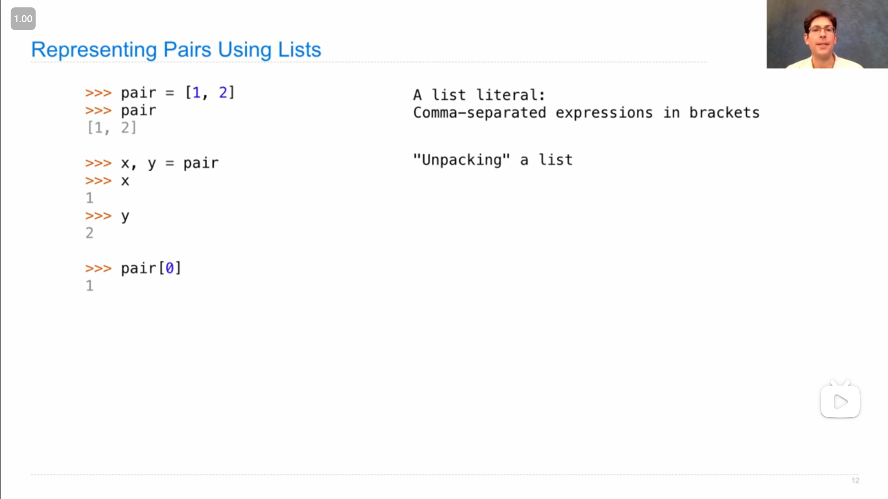
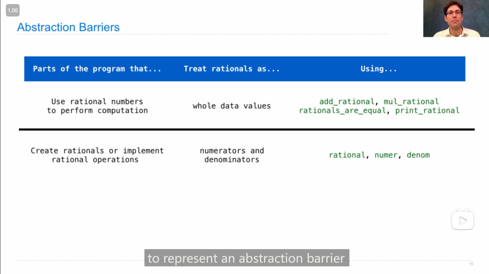
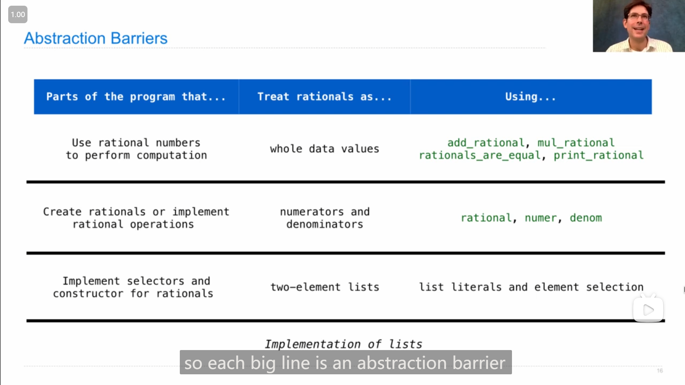
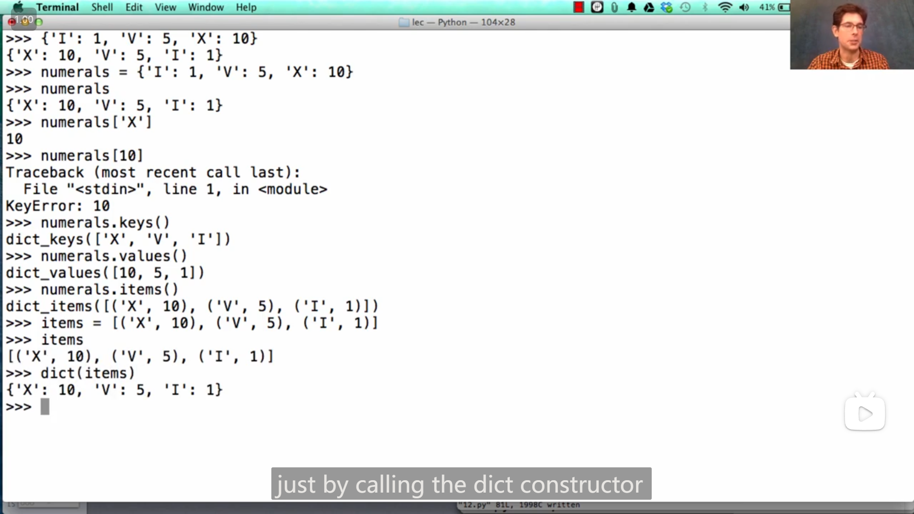
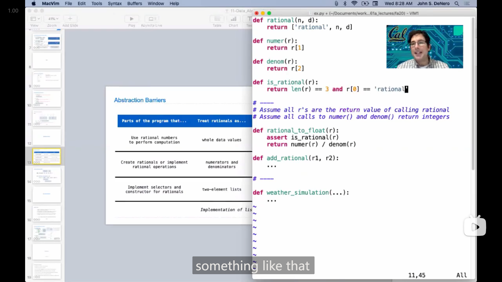

# HW 02 --- Lecture 11 Q&A

## HW 02

### 1

Q2这题，一开始自己做的时候没有做出来，尝试了很多次都没能成功，

于是就去看了提示视频，然后助教老师说道，可以写一个 `helper` 函数来追踪需要的信息

{ loading=lazy }

于是看到这里我大概就有思路了，最后就完成了

::: details 代码
```python
def pingpong(n):
    "*** YOUR CODE HERE ***"
    def helper(index, pingpong_num, direction):
        if index == n:
            return pingpong_num + direction
        else:
            return helper(index + 1, pingpong_num + direction, direction * (-1 if index % 8 == 0 or num_eights(index) else 1))
    return helper(1, 0, 1)
```
:::

### 2

Q4这题，感觉和第9节Tree Recursion课上最后展示的例子很像，

{ loading=lazy }

但是一开始也是没做出这题，之后发现需要写一个 `helper` 函数来辅助记录信息，最后仿照上图例子的大致结构就写出来了

::: details 代码
```python
def count_coins(total):
    "*** YOUR CODE HERE ***"
    def helper(index, largest_coin):
        if index == total:
            return 1
        elif index > total:
            return 0
        elif largest_coin == None:
            return 0
        else:
            return helper(index + largest_coin, largest_coin) + helper(index, next_largest_coin(largest_coin))
    return helper(0, 1)
```
:::

### 3

Q5这题没有想出来，最后是在网上找到了差不多的( `lambda` 函数递归的)代码，

```python
def make_anonymous_factorial():
    return (lambda f: lambda n: f(f, n))(lambda f, i: 1 if i == 0 else i * f(f, i - 1))
```

后来再回来看这个代码，大概能理解为什么要这么做了，由于递归需要调用自己，所以在 `lambda` 函数中只能借助外部，**<mark>通过参数把自己传进来</mark>**(通过参数来传递信息比较常见)，所以核心部分就写成了

```python
(lambda f, i: 1 if i == 0 else i * f(f, i - 1))
```

剩下的部分就是去开始递归的过程。

---

在第12节的Q&A中也有人问到了这一题，John也进行了解答

## Lecture 10 Containers

### 1

`exec()` 函数可以执行字符串中的语句，如

```python
exec("curry = lambda f: lambda x: lambda y: f(x, y)")
```

可以让 `curry` 变量指向一个匿名函数

{ loading=lazy }

### 2

例

```python
for _ in range(3):
    ...
```

可以用 `_` 变量表示 `for` 循环中执行的语句与迭代的变量无关

### 3

string字符串的元素也是字符串，list的元素就是元素，即有

```python
>>> str = "hello"
>>> str[3][0][0]
'l'
```

### 4

{ loading=lazy }

记忆技巧 *“下标”* 对应元素之前，

对有序结构切片也适用，其中的负数也适用，如

```python
>>> l = list(range(5))
>>> l
[0, 1, 2, 3, 4]
>>> l[1:-1]
[1, 2, 3]
```

### 5

列表推导式(list comprehension)可以用 `if` ：

```python
>>> l2 = [x for x in [0, 1, 2, 5, 6] if x % 3 == 0]
>>> l2
[0, 6]
```

### 6

如果列表有子列表，且元素个数都固定，那么 `for` 可以直接获取子列表的元素/unpack子列表，如子列表都含两个元素：

{ loading=lazy }

## Lecture 10 Q&A

### 1

递增的递归写阶乘：

```python
def fact(n):
    return fact_helper(n, 1, 1)

def fact_helper(n, k, result):
    """Computes k * (k + 1) * (k + 2) * ... * n
    by accumulating the result
    """
    if n == k:
        return k * result
    else:
        return fact_helper(n, k + 1, k * result)
```

{ loading=lazy }

>   or
>
>   ```python
>   def fact(n, k=1, result=1):
>       """Computes k * (k + 1) * (k + 2) * ... * n
>       by accumulating the result
>       """
>       if n == k:
>           return k * result
>       else:
>           return fact(n, k + 1, k * result)
>   ```

这种(递增的递归)更像循环语句

(也可以将helper写入函数内部)

```python
def fact(n):
    def helper(k, result):
        if k == n:
            return k * result
        else:
            return helper(k + 1, k * result)
    return helper(1, 1)
```

or

```python
def fact(n):
    def helper(k):
        if k == n:
            return k
        else:
            return k * helper(k + 1)
    return helper(1)
```

## Lab 04

lab04中的Q4-Q6 在掌握了 *假想函数能返回所需要返回的东西(即假想返回的东西是已知的)* 的诀窍(在lecture12中)之后，做的很顺畅。

1.   先假想函数能返回所需的东西/值
2.   再想如何把情况分解成另一个或几个差不多(形式一样)但简单了一点的情况(有点类似于动态规划的找递推式)，如Q4中一般情况可以分成两个行/列减一的情况(即向上或向右走一步)
3.   再想 “基本情况” (最简单/特殊的情况(作为递归的终止情况))
4.   最后调整一般情况的返回的值

::: details 代码
Q4

```python
def paths(m, n):
    """Return the number of paths from one corner of an
    M by N grid to the opposite corner.

    >>> paths(2, 2)
    2
    >>> paths(5, 7)
    210
    >>> paths(117, 1)
    1
    >>> paths(1, 157)
    1
    """
    "*** YOUR CODE HERE ***"
    if m == 1 or n == 1:
        return 1
    else:
        return paths(m - 1, n) + paths(m, n - 1)
```

Q5

```python
def max_subseq(n, t):
    """
    Return the maximum subsequence of length at most t that can be found in the given number n.
    For example, for n = 20125 and t = 3, we have that the subsequences are
        2
        0
        1
        2
        5
        20
        21
        22
        25
        01
        02
        05
        12
        15
        25
        201
        202
        205
        212
        215
        225
        012
        015
        025
        125
    and of these, the maxumum number is 225, so our answer is 225.

    >>> max_subseq(20125, 3)
    225
    >>> max_subseq(20125, 5)
    20125
    >>> max_subseq(20125, 6) # note that 20125 == 020125
    20125
    >>> max_subseq(12345, 3)
    345
    >>> max_subseq(12345, 0) # 0 is of length 0
    0
    >>> max_subseq(12345, 1)
    5
    """
    "*** YOUR CODE HERE ***"
    if t == 0:
        return 0
    elif n < 10:
        return n
    else:
        return max(max_subseq(n // 10, t - 1) * 10 + n % 10, max_subseq(n // 10, t))
```

Q6

```python
def add_chars(w1, w2):
    """
    Return a string containing the characters you need to add to w1 to get w2.

    You may assume that w1 is a subsequence of w2.

    >>> add_chars("owl", "howl")
    'h'
    >>> add_chars("want", "wanton")
    'on'
    >>> add_chars("rat", "radiate")
    'diae'
    >>> add_chars("a", "prepare")
    'prepre'
    >>> add_chars("resin", "recursion")
    'curo'
    >>> add_chars("fin", "effusion")
    'efuso'
    >>> add_chars("coy", "cacophony")
    'acphon'
    >>> from construct_check import check
    >>> # ban iteration and sets
    >>> check(LAB_SOURCE_FILE, 'add_chars',
    ...       ['For', 'While', 'Set', 'SetComp']) # Must use recursion
    True
    """
    "*** YOUR CODE HERE ***"
    if not w1:
        return w2
    elif w1[0] == w2[0]:
        return add_chars(w1[1:], w2[1:])
    else:
        return w2[0] + add_chars(w1, w2[1:])
```
:::

## Lecture 11 Data Abstraction

### 1

**"Unpacking" a list**

{ loading=lazy }

### 2

抽象思想

{ loading=lazy }

{ loading=lazy }

>   **<mark>... you should know that when you're writing one part of a large program, that it should use the level abstraction appropriate to what you're trying to do,</mark>**
>
>   **<mark>and the higher you stay up, without crossing of these boundaries, the easier it will be to change your program</mark>**

要 *向下解构*，和 *向上抽象*

### 3

{ loading=lazy }

字典可以通过特定的列表构造( 二元元组 组成的列表)

### 4

字典也有推导式

{ loading=lazy }

## Lecture 11 Q&A

### 1

抽象可以使得修改某一层(layer)代码时带来的冲击/影响被隔离(isolate the impact)，有时可以使得修改所产生的影响只在这一层上。

冲击被隔离的例子：python dictionary的底层代码经常改变，但并不影响python中的使用

### 2

添加判断功能可以这样设计

{ loading=lazy }
