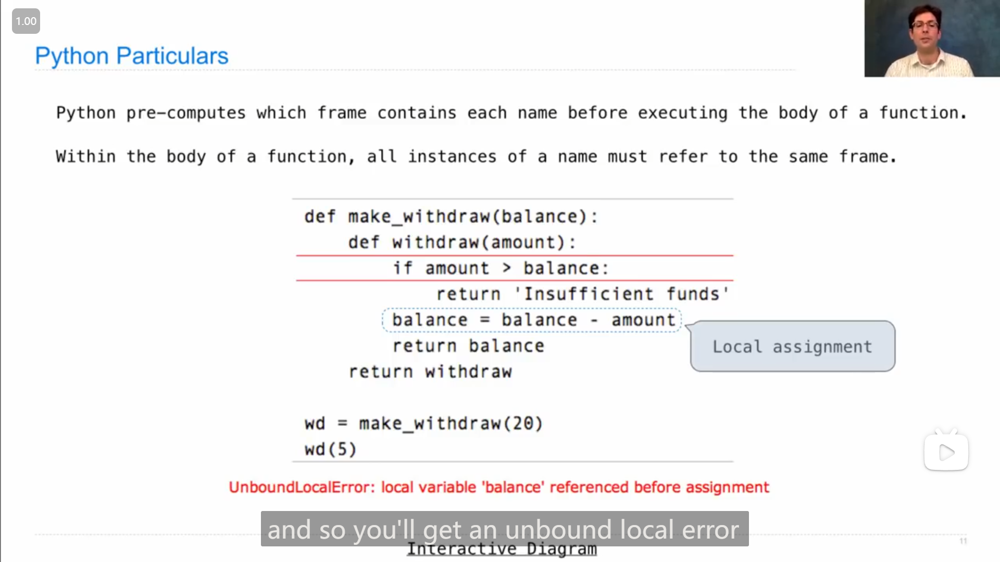
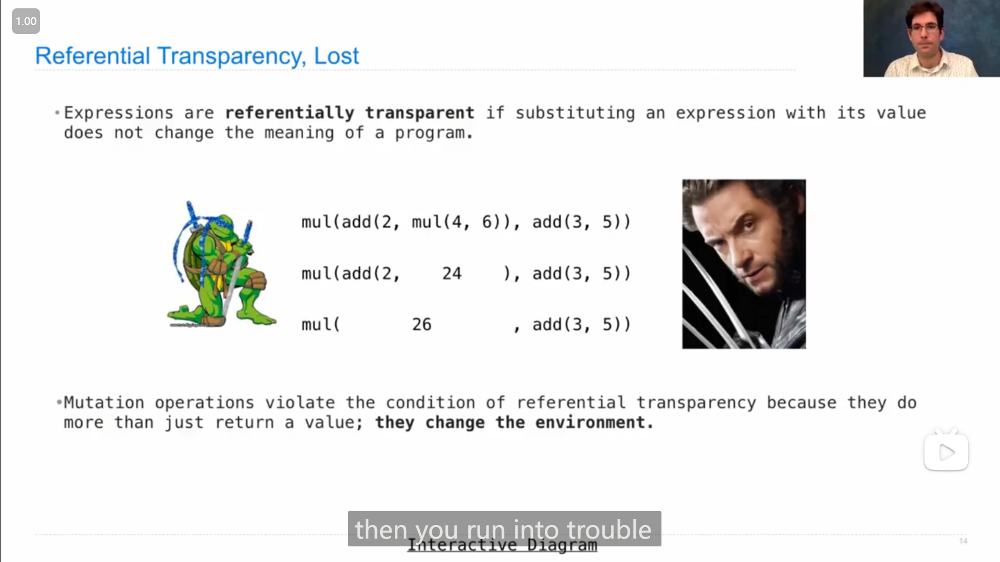

# HW 03 --- Lab 06

## HW 03

### 1

**减少递归中的冗余部分**

::: info 引述
**Arms-length recursion (sidenote)**

Before we get started, a quick comment on recursion with tree data structures. Consider the following function.

```python
def min_depth(t):
    """A simple function to return the distance between t's root and its closest leaf"""
    if is_leaf(t):
        return 0 # Base case---the distance between a node and itself is zero
    h = float('inf') # Python's version of infinity
    for b in branches(t):
        if is_leaf(b): return 1 # !!!
        h = min(h, 1 + min_depth(b))
    return h
```

The line flagged with `!!!` is an "arms-length" recursion violation. Although our code works correctly when it is present, by performing this check we are doing work that should be done by the next level of recursion—we already have an if-statement that handles any inputs to `min_depth` that are leaves, so we should not include this line to eliminate redundancy in our code.

```python
def min_depth(t):
    """A simple function to return the distance between t's root and its closest leaf"""
    if is_leaf(t):
        return 0
    h = float('inf')
    for b in branches(t):
        # Still works fine!
        h = min(h, 1 + min_depth(b))
    return h
```

Arms-length recursion is not only redundant but often complicates our code and obscures the functionality of recursive functions, making writing recursive functions much more difficult. We always want our recursive case to be handling one and only one recursive level.

---

**臂长递归 (旁注)**

在我们开始之前，先简要介绍一下树数据结构的递归。考虑以下函数。

```python
def min_depth(t):
    """A simple function to return the distance between t's root and its closest leaf"""
    if is_leaf(t):
        return 0 # Base case---the distance between a node and itself is zero
    h = float('inf') # Python's version of infinity
    for b in branches(t):
        if is_leaf(b): return 1 # !!!
        h = min(h, 1 + min_depth(b))
    return h
```

该行标记为 `!!!` 是一种“臂长”递归冲突。尽管我们的代码在存在时可以正常工作，但通过执行此检查，我们正在做下一级递归应该做的工作——我们已经有了一个if语句，它处理 `min_depth` 的任何叶子输入，所以我们不应该包括这一行来消除代码中的冗余。

```python
def min_depth(t):
    """A simple function to return the distance between t's root and its closest leaf"""
    if is_leaf(t):
        return 0
    h = float('inf')
    for b in branches(t):
        # Still works fine!
        h = min(h, 1 + min_depth(b))
    return h
```

臂长递归不仅是多余的，而且经常使我们的代码复杂化，并模糊递归函数的功能，使编写递归函数变得更加困难。我们总是希望我们的递归情况是处理一个并且只有一个递归级别。
:::

### 2

Q2 中我将计算力矩的代码独立成了一个函数

```python
def balanced(m):
    ...
    def torque(s):
        assert is_arm(s), "must call torque on a arm"
        return length(s) * total_weight(end(s))
    ...
```

::: details 代码
```python
def balanced(m):
    """Return whether m is balanced.

    >>> t, u, v = examples()
    >>> balanced(t)
    True
    >>> balanced(v)
    True
    >>> w = mobile(arm(3, t), arm(2, u))
    >>> balanced(w)
    False
    >>> balanced(mobile(arm(1, v), arm(1, w)))
    False
    >>> balanced(mobile(arm(1, w), arm(1, v)))
    False
    >>> from construct_check import check
    >>> # checking for abstraction barrier violations by banning indexing
    >>> check(HW_SOURCE_FILE, 'balanced', ['Index'])
    True
    """
    "*** YOUR CODE HERE ***"
    def torque(s):
        assert is_arm(s), "must call torque on a arm"
        return length(s) * total_weight(end(s))

    if is_planet(m):
        return True
    else:
        if torque(left(m)) != torque(right(m)):
            return False
        else:
            return balanced(end(left(m))) and balanced(end(right(m)))
```
:::

### 3

Q5中，使用构造一个helper函数来传递结果列表

```python
def preorder(t):
    ...
    def preorder_helper(t, res):
        res += [label(t)]
        for branch in branches(t):
            res += preorder_helper(branch, [])
        return res
    ...
```

::: details 代码
```python
def preorder(t):
    """Return a list of the entries in this tree in the order that they
    would be visited by a preorder traversal (see problem description).

    >>> numbers = tree(1, [tree(2), tree(3, [tree(4), tree(5)]), tree(6, [tree(7)])])
    >>> preorder(numbers)
    [1, 2, 3, 4, 5, 6, 7]
    >>> preorder(tree(2, [tree(4, [tree(6)])]))
    [2, 4, 6]
    """
    "*** YOUR CODE HERE ***"
    def preorder_helper(t, res):
        res += [label(t)]
        # if is_leaf(t):
        #     return res
        # else:
        #     for branch in branches(t):
        #         res += preorder_helper(branch, res)
        #     return res

        for branch in branches(t):
            res += preorder_helper(branch, [])
        return res
    return preorder_helper(t, [])
```
:::

### 4

Q6

(居然能只用一行)

```python
def has_path(t, word):
    assert len(word) > 0, 'no path for empty word.'
    "*** YOUR CODE HERE ***"
    return word[0] == label(t) and True if len(word) == 1 else True in [has_path(b, word[1:]) for b in branches(t)]
```

### 5

Q8

题目是需要求x和y的差值的范围

方法就是将y取负数，上/下界的负值作为新下/上界，然后使用之前的加法函数

(由于没理解题目意思被卡了很久...)

```python
def sub_interval(x, y):
    """Return the interval that contains the difference between any value in x
    and any value in y."""
    "*** YOUR CODE HERE ***"
    return add_interval(x, interval(-upper_bound(y), -lower_bound(y)))
```

## Homework 3 Hints

### 1

助教在提示Q5时，也说到了，**要假设/假想递归能返回正确的结果**

::: info 引述
so when we look at this problem. we see that the preordering of any tree always starts at the root, so it makes sense to make this our starting point, we want to add the current label to our pre ordering. so we want to maintain a list of the pre order, and we want to add our current label to the first element in our pre ordering. after we do that, we want to go through all of our children, so remember that we always go down the left most child, all the way to the right most child, in order. so we do pre order of this child, and then we do pre order of this left child, and then we do pre order the right child. so it makes sense to recurs down each child from left most to right most. and think about what you want to do with the recursive result, **remember that by the cursive leap of faith, we, remember that the pre ordering of any child, is assumed to return the correct value**. so think about what you expect the pre ordering of any child to be, and think about what you want to do with our result, and just a hint, that the call of pre order on any child is going to return a list, because pre ordering returns a list, based on the numbers there. so think about what you want to do the recursive result, and then maybe appending them or extending them, you want to return the pre ordering. so first you add the current label, then you add the results from each pre order on each child, and then we return the pre ordering of all of them. after you do all of this think about your base case, is there a base case you need to handle, maybe when the tree is a leaf, or maybe something similar to that. and I think that's enough for this problem good luck.

---

在解决这个问题时，我们可以看到，任何树的前序遍历始终从根节点开始，因此将根节点作为我们的起始点是有意义的。我们希望将当前节点的标签添加到我们的前序遍历列表中，所以我们需要维护一个前序遍历的列表，并将当前节点的标签添加到前序遍历列表的第一个位置。在这之后，我们需要遍历所有的子节点。请记住，我们总是从最左边的子节点开始，一直遍历到最右边的子节点，按顺序进行。因此，我们首先对最左边的子节点进行前序遍历，然后对左子节点进行前序遍历，接着对右子节点进行前序遍历。这样，从最左边到最右边的子节点递归调用是有意义的。接下来，考虑如何处理递归结果。**请记住，按照递归的“跳跃信仰”，我们假定任何子节点的前序遍历都返回了正确的值**。因此，需要思考对递归结果要做什么，记住调用子节点的前序遍历会返回一个列表，根据这一点思考如何处理递归结果。一种可能的方式是将它们添加或扩展到当前前序遍历列表中。最终，我们需要返回前序遍历的结果。具体来说，操作顺序是：首先添加当前标签，然后添加每个子节点的前序遍历结果，最后返回所有子节点的前序遍历结果。在解决这个问题时，还需要考虑基本情况。是否有需要处理的基本情况，例如当树是叶子节点时，或者类似情况。在考虑完所有这些方面后，就可以着手解决问题了。祝你好运！
:::

## Lecture 16 Mutable Functions

### 1

{ loading=lazy }

**函数中的赋值语句，只能影响到函数所在的frame**，不能影响到母框架里的变量

### 2

{ loading=lazy }

**<mark>`nonlocal` 语句</mark>**

感觉是能在一个函数中声明要使用 ***非当前框架内的变量(名)***，从而之后在使用的时候，就不会在当前的框架内创建这个变量，而是在上级框架中寻找

### 3

{ loading=lazy }

**在函数体中，名称的所有实例都必须引用同一框架**

所以不能像图里面一样，一开始使用了母框架中的值--绑定了母框架中的变量，而后又在**未使用 `nonlocal` 语句**的情况下，进行赋值

### 4

另一种实现使用并更改母框架中的数据并且**不使用 `nonlocal` 语句**的方法

{ loading=lazy }

在母框架中使用可改变的数据类型，如列表或字典，然后在子函数中对其的元素进行更改，以达到需求

### 5

*参考透明度 (Referential Transparency)*

{ loading=lazy }

这个概念好像是指，如果表达式是*参考透明(referentially transparent)*的，那么在**直接用与返回值相同的值替换表达式中的函数**后，能**得到和原来一样的结果**，即**不改变程序的意义(not change the meaning of a program)**

而*突变(mutation)*可能会破坏表达式的参考透明，因为**突变可以改变环境(中的属性/值)**，

比如

```python
def f(x):
    x = 4
    def g(y):
        def h(z):
            nonlocal x
            x = x + 1
            return x + y + z
        return h
    return g
a = f(1)
b = a(2)
total = b(3) + b(4)
```

运行出来，`total` 结果是22(10+12)

但如果将 `b(3)` 替换成 `10`

```python
def f(x):
    x = 4
    def g(y):
        def h(z):
            nonlocal x
            x = x + 1
            return x + y + z
        return h
    return g
a = f(1)
b = a(2)
total = 10 + b(4)
```

`total` 结果就变成了21(10+11)

这是由于，前者 `b(3)` 在调用 `h` 函数的时候，改动了母框架中的 `x` 的值，使得两处代码中 `b(4)` 在调用 `h` 函数时，使用的值不一样，因此`total` 结果就不一样

### 6

这节课最后，教授提到的一题

{ loading=lazy }

教授提到，在开始做这题时，可以寻找base cases是什么，

然后从输入示例中可以得到，base case是当其中一个为零的时候

---

开始写代码时，我是先注意到最后的 `return` 的语句的形式，再联想到教授说到的 *tree recursion* ，所以我感觉括号外应该是一个 `min` ，然后括号里面是比较两种递归返回的值哪个更小，所以我就暂且填上：

```python
def combo(a, b):
    if a == 0 or b == 0:
        return a + b
    elif ...:
        return combo(...)
    return min(combo(a // 10, b) * 10 + a % 10, combo(a, b // 10) * 10 + b % 10)
```

但是 `elif` 之后填什么一直没想到，(因为不知道有相同数字还有不同的数字要怎么分割怎么处理，以及a只剩一种数字的情况下，怎么判断放在b前面还是后面，感觉要分非常多种情况特别复杂，之后发现其实情况很简单...)

直到三天之后

开始继续思考这题时，我开始思考到达 base case 的最后一种情况，即 a 是个一位数，而 b 是 321，想到如果a和b某个数位相同，那么可以想*快速排序*一样将b分成两边去递归(但是好像对数字分割很难操作起来)，然后由分割就进一步开始想a和b的最后一位去比较(将b分割成前面和最后一位)，那么(要使得结果最小)应该是将大的那个放在最后，所以开始尝试编写代码

但是发现 `elif` 后填不上东西，所以打算先不按它提供的结构自己写：

```python
def combo(a, b):
    if a == 0 or b == 0:
        return a + b
    else:
        if a % 10 < b % 10:
            ...
        else:
            ...
    # elif ...:
    #     return combo(...)
    # return min(combo(a // 10, b) * 10 + a % 10, combo(a, b // 10) * 10 + b % 10)
```

<mark>然后发现 `...` 处的代码就是最后 `return` 中之前写的代码，并且能实现对应的处理功能</mark>，所以 `elif` 后应该考虑的是a b最后一位相同的情况，故

```python
def combo(a, b):
    """Return the smallest integer with all of the digits of a and b (in order).

    >>> combo(531, 432)    # 45312 contains both _531_ and 4_3_2.
    45312
    >>> combo(531, 4321)   # 45321 contains both _531_ and 4_321.
    45321
    >>> combo(1234, 9123)  # 91234 contains both _1234 and 9123_.
    91234
    >>> combo(0, 321)      # The number 0 has no digits, so 0 is not in the result.
    321
    """
    if a == 0 or b == 0:
        return a + b
    elif a % 10 == b % 10:
        return combo(a // 10, b // 10) * 10 + a % 10
    return min(combo(a // 10, b) * 10 + a % 10, combo(a, b // 10) * 10 + b % 10)
```

然后半信半疑地进行了测试，发现这竟然就是答案

最后总结反思了一下，递归还是**得牢记要假设函数能返回所需要的东西**(我感觉这样可能就更好能想到分割出最后一位)

## Lecture 16 Q&A

### 1

{ loading=lazy }

列表的 `+=` 和 `=` 的一些区别，

图中左侧，`a = a + b` 可以理解成，**先是 `a + b` 得到一个新的列表，然后将变量名 `a` 绑定到这个新的列表上**，所以 `c` 绑定的原列表没有被改变

而右侧，`a += b` 可以类比成 `a.extend(b)` ，是**对 `a` 指向的列表本身进行了修改**，所以通过 `c` 也能看到列表改变了

## Lab 06

### 1

Q4，我采用先取出和 `entry` 相同的元素的下标存在一个列表中，再将这些下标应用到 `insert` 方法上

```python
def insert_items(lst, entry, elem):
    entries_indices = [i for i in range(len(lst)) if lst[i] == entry]
    for index in entries_indices:
        lst.insert(index, elem)
    return lst
```

但是发现有两个地方需要修正：

-   插入时，由于是在相应的元素之后插入，所以 `index` 需要改成 `index + 1` 

-   由于如果按照从前到后插入新的元素，那么在前面插入时，会引起后面的元素的下标的改变，所以我改成从后往前插入，即把存储下标的列表顺序反过来

    ```python
        entries_indices = entries_indices[::-1]
    ```

::: details 代码
```python
def insert_items(lst, entry, elem):
    """
    >>> test_lst = [1, 5, 8, 5, 2, 3]
    >>> new_lst = insert_items(test_lst, 5, 7)
    >>> new_lst
    [1, 5, 7, 8, 5, 7, 2, 3]
    >>> large_lst = [1, 4, 8]
    >>> large_lst2 = insert_items(large_lst, 4, 4)
    >>> large_lst2
    [1, 4, 4, 8]
    >>> large_lst3 = insert_items(large_lst2, 4, 6)
    >>> large_lst3
    [1, 4, 6, 4, 6, 8]
    >>> large_lst3 is large_lst
    True
    """
    "*** YOUR CODE HERE ***"
    entries_indices = [i for i in range(len(lst)) if lst[i] == entry]
    entries_indices = entries_indices[::-1]
    for index in entries_indices:
        lst.insert(index + 1, elem)
    return lst
```
:::
