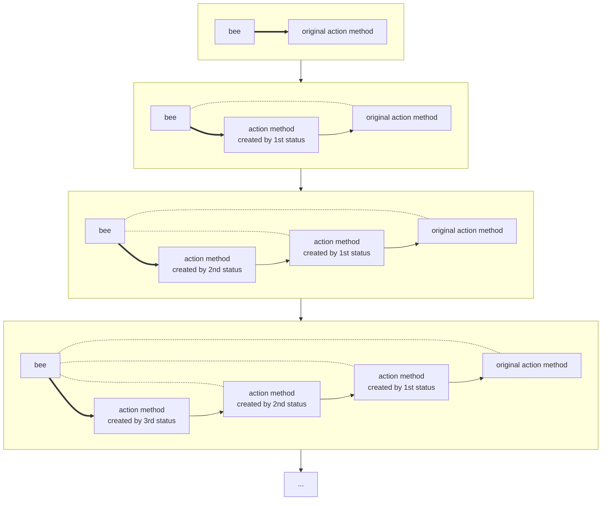

# Lab 07 --- Project Ants

## Lab 07

### 1

在做Q1时，本来使用

```python
yield from [x * multiplier for x in it]
```

但是当 `it` 是能无穷迭代的生成器时(如要测试的 `naturals()` )，就会超时，

但我询问 chatgpt ，它提供的代码与我上面的代码很像，只是把列表换成了元组，然后测试竟然不会超时，

**所以使用 `yield from` 时可以使用元组来避免可以无穷迭代的迭代器造成的超时**

下面是询问 chatgpt 为什么会这样的原因的记录

::: details chat log
**You**:

Generators also allow us to represent infinite sequences, such as the sequence of natural numbers (1, 2, ...) shown in the function below!

```python
def naturals():
    """A generator function that yields the infinite sequence of natural
    numbers, starting at 1.

    >>> m = naturals()
    >>> type(m)
    <class 'generator'>
    >>> [next(m) for _ in range(10)]
    [1, 2, 3, 4, 5, 6, 7, 8, 9, 10]
    """
    i = 1
    while True:
        yield i
        i += 1
```

**Q1: Scale**

Implement the generator function `scale(it, multiplier)`, which yields elements of the given iterable `it`, scaled by `multiplier`. As an extra challenge, try writing this function using a `yield from` statement!

```python
def scale(it, multiplier):
    """Yield elements of the iterable it scaled by a number multiplier.

    >>> m = scale([1, 5, 2], 5)
    >>> type(m)
    <class 'generator'>
    >>> list(m)
    [5, 25, 10]

    >>> m = scale(naturals(), 2)
    >>> [next(m) for _ in range(5)]
    [2, 4, 6, 8, 10]
    """
    "*** YOUR CODE HERE ***"
```

&nbsp;

**ChatGPT**:

Certainly! You can implement the `scale` generator function using a `yield from` statement. Here's one way to do it:

```python
def scale(it, multiplier):
    """Yield elements of the iterable it scaled by a number multiplier."""
    yield from (element * multiplier for element in it)

# Test cases
m = scale([1, 5, 2], 5)
print(type(m))  # <class 'generator'>
print(list(m))  # [5, 25, 10]

m = scale(naturals(), 2)
print([next(m) for _ in range(5)])  # [2, 4, 6, 8, 10]
```

In this implementation, the `scale` function uses a generator expression with `yield from` to yield elements of the iterable `it` scaled by the given `multiplier`. The generator expression `(element * multiplier for element in it)` generates scaled elements one by one, and `yield from` is used to yield each element from this expression.

&nbsp;

**You**:

why timeout by using list type while not by using tuple type?

&nbsp;

**ChatGPT**:

If you are experiencing a timeout when using a list type but not when using a tuple type, it might be due to the differences in how lists and tuples are handled in Python. Lists are mutable, meaning their elements can be changed after the list is created, while tuples are immutable, and their elements cannot be changed.

When you use a list comprehension with a generator expression and `yield from`, the entire list needs to be generated in memory before any elements can be yielded. This might be problematic for an infinite generator, as attempting to generate an infinite list in memory can lead to a timeout.

On the other hand, when using a tuple, it is immutable. Python can optimize and generate each element of the tuple on-the-fly without needing to create an entire list in memory. This can be more efficient, especially when dealing with infinite sequences.

Here's an example to illustrate the difference:

```python
# Using a list
def scale_list(it, multiplier):
    yield from [x * multiplier for x in it]

# Using a tuple
def scale_tuple(it, multiplier):
    yield from (x * multiplier for x in it)

# Test cases
m_list = scale_list(naturals(), 2)
# This may lead to a timeout because it attempts to generate an infinite list in memory.
# print(list(m_list))

m_tuple = scale_tuple(naturals(), 2)
# This is more efficient because it generates each element on-the-fly without creating an entire list.
print([next(m_tuple) for _ in range(5)])
```

In the commented-out line for `scale_list`, attempting to convert an infinite list to a list object might cause the program to run out of memory or take a very long time, leading to a timeout. Using a tuple can avoid this issue because it doesn't try to create an entire list in memory.

&nbsp;

**You**:

translate to chinese

&nbsp;

**ChatGPT**:

如果你在使用列表类型时遇到超时问题，但在使用元组类型时却没有，这可能是由于 Python 处理列表和元组的方式不同。列表是可变的，意味着它们的元素在列表创建后可以被修改，而元组是不可变的，它们的元素不能被修改。

当你使用列表解析与生成器表达式以及 `yield from` 时，在产生任何元素之前需要在内存中生成整个列表。对于无限生成器，尝试在内存中生成无限列表可能导致超时。

另一方面，使用元组是不可变的。Python 可以优化并在需要时即时生成元组的每个元素，而无需创建整个列表在内存中。这可能更有效率，尤其是在处理无限序列时。

以下是一个示例，用以说明这种差异：

```python
# 使用列表
def scale_list(it, multiplier):
    yield from [x * multiplier for x in it]

# 使用元组
def scale_tuple(it, multiplier):
    yield from (x * multiplier for x in it)

# 测试案例
m_list = scale_list(naturals(), 2)
# 这可能导致超时，因为它试图在内存中生成一个无限列表。
# print(list(m_list))

m_tuple = scale_tuple(naturals(), 2)
# 这更加有效，因为它在不创建整个列表的情况下即时生成每个元素。
print([next(m_tuple) for _ in range(5)])
```

在注释掉的 `scale_list` 的行中，试图将无限列表转换为列表对象可能导致程序耗尽内存或花费很长时间，从而导致超时。使用元组可以避免这个问题，因为它不会尝试在内存中创建整个列表。
:::

### 2

Q5中，我利用列表的 `.pop()` 方法来实现 `Player.play()` 方法，

在之前课程视频里介绍列表的 `.pop()` 方法是只能移除并返回列表的最后一个元素，但上网查询发现 `.pop()` 方法只是默认最后一个，还可以传入下标指定要移除并返回的元素，例如

```python
>>> list = [1, 2, 3, 4, 5]
>>> list.pop()
5
>>> list
[1, 2, 3, 4]
>>> list.pop(1)
2
>>> list
[1, 3, 4]
```

## Project Ants

### 1

Problem 4 中，有一点值得注意

::: info 引述
A good way to approach the implementation to `ShortThrower` and `LongThrower` is to have it inherit the `nearest_bee` method from the base `ThrowerAnt` class. The logic of choosing which bee a thrower ant will attack is essentially the same, except the `ShortThrower` and `LongThrower` ants have maximum and minimum ranges, respectively.

To implement these behaviors, you will need to modify the `nearest_bee` method to reference `min_range` and `max_range` attributes, and only return a bee that is in range.
:::

这题中要求实现两个 *蚂蚁射手* 的子类的寻找射击目标的方法，我本来差点就是想的在原有的代码上进行修改，看到上面这段话，我才想到有更好的方法--去**使用父类的方法**，

**教程中建议的方法是**，在父类中添加属性，再在子类中(有需要的话)进行覆写

>   最后发现采用教程中的思路，居然可以在子类中不用重新实现方法，直接使用父类中的方法即可
>
>   所以说，**<mark>能用父类的属性(值或者方法)，就用父类的，尽可能的不要去重新实现</mark>**
>

::: details 代码
```python
class ThrowerAnt(Ant):
    ...
    # ADD/OVERRIDE CLASS ATTRIBUTES HERE
    food_cost = 3
    min_range = 0
    max_range = float('inf')
    
    def nearest_bee(self, beehive):
        """Return the nearest Bee in a Place that is not the HIVE (beehive), connected to
        the ThrowerAnt's Place by following entrances.

        This method returns None if there is no such Bee (or none in range).
        """
        # BEGIN Problem 3 and 4
        # return rANTdom_else_none(self.place.bees) # REPLACE THIS LINE
        place = self.place
        dist = 0
        while place is not beehive:
            if place.bees and dist >= self.min_range and dist <= self.max_range:
                return rANTdom_else_none(place.bees)
            place = place.entrance
            dist += 1
        return None
        # END Problem 3 and 4
    
    ...

class ShortThrower(ThrowerAnt):
    """A ThrowerAnt that only throws leaves at Bees at most 3 places away."""

    name = 'Short'
    food_cost = 2
    # OVERRIDE CLASS ATTRIBUTES HERE
    # BEGIN Problem 4
    max_range = 3
    # implemented = False   # Change to True to view in the GUI
    implemented = True
    # END Problem 4

class LongThrower(ThrowerAnt):
    """A ThrowerAnt that only throws leaves at Bees at least 5 places away."""

    name = 'Long'
    food_cost = 2
    # OVERRIDE CLASS ATTRIBUTES HERE
    # BEGIN Problem 4
    min_range = 5
    # implemented = False   # Change to True to view in the GUI
    implemented = True
    # END Problem 4
```
:::

### 2

Problem 4 中有一点提示，

可以使用 `float('inf')` 来获得一个*无穷大*的值

### 3

在 Extra Credit 中，

>   Some hints:
>
>   All instances of the same class share the same class attributes. How can you use this information to tell whether a QueenAnt instance is the true QueenAnt?
>
>   ...

基于这一点提示，所以我采取的方法是，在 `Ant` 类中设置一个类属性 `true_queen = None` 默认值是 `None` ，当第一个/真蚁后被创建时(通过判断 `true_queen` 是否为 `None` 来确定是否是真蚁后)， `true_queen` 就会指向它，而之后的蚁后就可以依据这个属性来判断出是*假蚁后*(impostor)

::: details 代码
```python
class Ant(Insect):
    ...
    # ADD CLASS ATTRIBUTES HERE
    true_queen = None
    
    ...
    def remove_from(self, place):
        if self == self.true_queen:
            return
                if place.ant is self:
            place.ant = None
        elif place.ant is None:
            assert False, '{0} is not in {1}'.format(self, place)
        else:
            # queen or container (optional) or other situation
            place.ant.remove_ant(self)
        Insect.remove_from(self, place)
        
...

# BEGIN Problem EC
# class QueenAnt(Ant):  # You should change this line
class QueenAnt(ScubaThrower):
# END Problem EC
    """The Queen of the colony. The game is over if a bee enters her place."""

    name = 'Queen'
    food_cost = 7
    # OVERRIDE CLASS ATTRIBUTES HERE
    # BEGIN Problem EC
    # implemented = False   # Change to True to view in the GUI
    implemented = True
    # END Problem EC

    def __init__(self, armor=1):
        # BEGIN Problem EC
        "*** YOUR CODE HERE ***"
        ScubaThrower.__init__(self, armor)
        self.buffed_ants = []
        if not Ant.true_queen:
            Ant.true_queen = self
        # END Problem EC

    def action(self, gamestate):
        """A queen ant throws a leaf, but also doubles the damage of ants
        in her tunnel.

        Impostor queens do only one thing: reduce their own armor to 0.
        """
        # BEGIN Problem EC
        "*** YOUR CODE HERE ***"
        if self is not self.true_queen:
            Ant.reduce_armor(self, self.armor)
            return
        ScubaThrower.action(self, gamestate)
        place = self.place.exit
        while place:
            if place.ant and place.ant not in self.buffed_ants:
                place.ant.damage *= 2
                self.buffed_ants += [place.ant]
            place = place.exit
        # END Problem EC

    def reduce_armor(self, amount):
        """Reduce armor by AMOUNT, and if the True QueenAnt has no armor
        remaining, signal the end of the game.
        """
        # BEGIN Problem EC
        "*** YOUR CODE HERE ***"
        ScubaThrower.reduce_armor(self, amount)
        if self == self.true_queen and self.armor <= 0:
            bees_win()
        # END Problem EC
```
:::

### 4

Optional Problem 2 中

>   Hint: You may find the `isinstance` function useful for checking if an object is an instance of a given class. For example:
>
>   ```python
>       >>> a = Foo()
>       >>> isinstance(a, Foo)
>       True
>   ```

可以用 `isinstance()` 的函数来判断某个实例是否是某个类

### 5

Optional Problem 2 中

>   Note: the constructor of `ContainerAnt.__init__` is implemented as such
>
>   ```python
>       def __init__(self, *args, **kwargs):
>           Ant.__init__(self, *args, **kwargs)
>           self.contained_ant = None
>   ```
>
>   As we saw in Hog, we have that `args` is bound to all positional arguments (that is all arguments not passed not with keywords, and `kwargs` is bound to all the keyword arguments. This ensures that both sets of arguments are passed to the Ant constructor).

`args` 是所有没有 *关键字* (比如 `key=` 、 `base=` 就是关键字) 的参数，而 `kwargs` 是所有有 *关键字* 的参数

### 6

Optional Problem 2 有点难，debug都debug了10多次，成功实现的代码在下面

::: details 代码
```python
class Ant(Insect):
    ...
    
    def add_to(self, place):
        if place.ant is None:
            place.ant = self
        else:
            # BEGIN Problem Optional 2
            # if not (isinstance(self, ContainerAnt) and self.can_contain(place.ant)) and not (isinstance(place.ant, ContainerAnt) and place.ant.can_contain(self)):
            if isinstance(self, ContainerAnt) and self.can_contain(place.ant):
                self.contain_ant(place.ant)
                place.ant = self
            elif isinstance(place.ant, ContainerAnt) and place.ant.can_contain(self):
                place.ant.contain_ant(self)
            else:
                assert place.ant is None, 'Two ants in {0}'.format(place)
            # END Problem Optional 2
        Insect.add_to(self, place)
    
    ...
    
...

class ContainerAnt(Ant):
    def __init__(self, *args, **kwargs):
        Ant.__init__(self, *args, **kwargs)
        self.contained_ant = None

    def can_contain(self, other):
        # BEGIN Problem Optional 2
        "*** YOUR CODE HERE ***"
        return not self.contained_ant and not isinstance(other, ContainerAnt)
        # END Problem Optional 2

    def contain_ant(self, ant):
        # BEGIN Problem Optional 2
        "*** YOUR CODE HERE ***"
        if self.can_contain(ant):
            self.contained_ant = ant
            # self.place.ant = self
        # END Problem Optional 2

    def remove_ant(self, ant):
        if self.contained_ant is not ant:
            assert False, "{} does not contain {}".format(self, ant)
        self.contained_ant = None

    def remove_from(self, place):
        # Special handling for container ants (this is optional)
        if place.ant is self:
            # Container was removed. Contained ant should remain in the game
            place.ant = place.ant.contained_ant
            Insect.remove_from(self, place)
        else:
            # default to normal behavior
            Ant.remove_from(self, place)

    def action(self, gamestate):
        # BEGIN Optional 2
        "*** YOUR CODE HERE ***"
        if self.contained_ant:
            self.contained_ant.action(gamestate)
        # END Optional 2

class BodyguardAnt(ContainerAnt):
    """BodyguardAnt provides protection to other Ants."""

    name = 'Bodyguard'
    food_cost = 4
    # OVERRIDE CLASS ATTRIBUTES HERE
    # BEGIN Optional 2
    # implemented = False   # Change to True to view in the GUI
    implemented = True

    def __init__(self, armor=2):
        ContainerAnt.__init__(self, armor)
    # END Optional 2
```
:::

### 7

Optional Problem 4

这题我认为很难(看完题目要求时就已经头大了)，应该算是所有题目里面最难的一题，修修改改了很久才初步写完，然后还debug了很多次

---

刚开始时没什么头绪，所以打算 在教程的要求(主要要实现三个函数)中 **先从最简单的问题开始解决(最后发现这很有用，因为把简单的问题解决了，最后难的问题就变得清晰明了了)**，

`make_slow` 和 `make_scare` ，这两个基本上差不多，他们都是要返回一个新的方法

>   ```python
>   def make_slow(action, bee):
>       """Return a new action method that calls ACTION every other turn.
>   
>       action -- An action method of some Bee
>       """
>       # BEGIN Problem Optional 4
>       "*** YOUR CODE HERE ***"
>       # END Problem Optional 4
>   
>   def make_scare(action, bee):
>       """Return a new action method that makes the bee go backwards.
>   
>       action -- An action method of some Bee
>       """
>       # BEGIN Problem Optional 4
>       "*** YOUR CODE HERE ***"
>       # END Problem Optional 4
>   ```

但我一开始没有理解 *返回方法* 应该意味着什么，然后注意到了 **教程中的提示** ，即**<mark>实例的方法是可以通过赋值去覆盖掉的</mark>**

>   *Hint:* You will need to rebind a method in one of the functions. Note that when assigning to an instance, the self parameter isn't bound.
>
>   ```python
>     class X: pass
>     def f(x): return x ** 3
>     x = X()
>     x.f = f
>     print(x.f(2)) # prints 8
>   ```

所以我这时的想法是，在 `make_slow` 函数里面创建一个 用来当作方法 的函数，然后绑定到 `bee` 中，所以

```python
def make_slow(action, bee):
    def new_action(gamestate):
        if gamestate.time % 2 == 0:
            action(bee, gamestate)
    bee.action = new_action
    
...
```

但是突然感觉，方法应该是有 `self` 参数的，

以及 好像要求说的是要返回，所以我这时认为，应该要在函数中将这个 用作方法的函数 返回，然后在 `apply_status` 中再将它绑定到对象中，所以

```python
def make_slow(action, bee):
    def new_action(self, gamestate):
        if gamestate.time % 2 == 0:
            action(self, gamestate)
    return new_action
    
def make_scare(action, bee):
    def new_action(self, gamestate):
        bee.direction = self.place if self.place.entrance is gamestate.beehive else self.place.entrance
        action(self, gamestate)
    return new_action
```

`.direction` 属性是由于，教程中提示到

>   *Hint:* to make a bee go backwards, consider adding an instance variable indicating its current direction. Where should you change the bee's direction? Once the direction is known, how can you modify the `action` method of `Bee` to move appropriately?

所以我对 `Bee.action` 进行了修改

```python
class Bee(Insect):
    ...
    
    def action(self, gamestate):
        """A Bee's action stings the Ant that blocks its exit if it is blocked,
        or moves to the exit of its current place otherwise.

        gamestate -- The GameState, used to access game state information.
        """
        destination = self.place.exit
        # Extra credit: Special handling for bee direction
        # BEGIN EC
        "*** YOUR CODE HERE ***"
        destination = self.direction
        # END EC
        if self.blocked():
            self.sting(self.place.ant)
        elif self.armor > 0 and destination is not None:
            self.move_to(destination)
```

---

然后就开始写 `apply_status` 函数

一开始我没想好怎么设置 持续时间，所以就只是这样

```python
def apply_status(status, bee, length):
    """Apply a status to a BEE that lasts for LENGTH turns."""
    # BEGIN Problem Optional 4
    "*** YOUR CODE HERE ***"
    bee.action = status(bee.action, bee)
    # END Problem Optional 4
```

然后由于 剩余时间 需要被记录下来，而且我想到调用一次 action 函数就减少一次剩余时间，所以想到了在函数中再构建一个嵌套函数，然后使用 `nonlocal` 语句来减少 `length` 的值，并且在剩余时间为0的时候把方法换回原本的方法，所以

```python
def apply_status(status, bee, length):
    old_action = bee.action
    def new_action(gamestate):
        nonlocal length
        length -= 1
        status(old_action, bee)(self, gamestate)
        if length == 0:
            bee.action = old_action
            bee.direction = None
    bee.action = new_action
```

最后教程中还有一点，就是 **多状态** 的问题，

>   `apply_status` takes a `status` (either `make_slow` or `make_scare`), a `Bee`, and a `length`. The way it works is as so: imagine that a `Bee` has a bunch of statuses, each of which modifies `action` in sequence. When a status's length is up, it removes itself from the list. `apply_status` adds the given status to the end of the list, so that it is applied latest. Note that you don't necessarily need to make a literal list of statuses - it is just helpful to think of statuses in this way.
>
>   ---
>
>   As an example of what "previous behavior" means, take the example of a bee that has been slowed twice (say by two separate `SlowThrower`s). It will have the following behavior:
>
>   -   on time 1, it will do nothing. The outer slow has 2 turns to go, the inner one still has 3 turns
>   -   on time 2, it moves forward. The outer slow has 1 turn to go, the inner one has 2 turns
>   -   on time 3, it will do nothing. The outer slow has no turns left, the inner one has 2 turns
>   -   on time 4, it moves forward. The inner slow has 1 turn left
>   -   on time 5, it does nothing. The inner slow has no turns left

意思是要求，存在多个状态时，剩余时间会一起减少，但是应用的效果是按从早(最先生效)到晚(后产生)的顺序应用的，具体可以看教程中的解释

由于这个点我没有弄清楚应该如何实现，于是没有办法，我只能尝试先进行测试

---

测试出现的第一个问题

```python
>>> from ants import *
>>> beehive, layout = Hive(AssaultPlan()), dry_layout
>>> dimensions = (1, 9)
>>> gamestate = GameState(None, beehive, ant_types(), layout, dimensions)
>>> # Testing Slow
>>> slow = SlowThrower()
>>> bee = Bee(3)
>>> gamestate.places["tunnel_0_0"].add_insect(slow)
>>> gamestate.places["tunnel_0_4"].add_insect(bee)
>>> slow.action(gamestate)
>>> gamestate.time = 1
>>> bee.action(gamestate)
TypeError: apply_status.<locals>.new_action() missing 1 required positional argument: 'gamestate'

# Error: expected

# but got
#     Traceback (most recent call last):
#       ...
#     TypeError: apply_status.<locals>.new_action() missing 1 required positional argument: 'gamestate'
```

是指 `apply_status` 函数中的嵌套函数 `new_action` 在被使用时，第二个 `gamestate` 参数没有被传入值(一开始我的理解还有些偏差，经过了一些测试和试错才最终确定是这个原因)

这就意味着， `bee.action(gamestate)` 处，在调用新的方法时，只传入了一个参数(所以第二个参数没有被传入)，所以这似乎告诉我，在编写新的方法时，并不需要使用 `self` 参数

为了求证，我重新去查看和理解教程中给出的示例

>   *Hint:* You will need to rebind a method in one of the functions. Note that when assigning to an instance, the self parameter isn't bound.
>
>   ```python
>     class X: pass
>     def f(x): return x ** 3
>     x = X()
>     x.f = f
>     print(x.f(2)) # prints 8
>   ```

如何发现，这里面的 新方法 就是没有 `self` 参数，并且在调用时，这个实例也没有将自身作为参数传入其中(调用自身或父类的方法时，会把自身 **隐式地** 传入 `self` 参数)，所以得到结论，**<mark>如果一个在类外定义的函数，被绑定成为了某个实例的属性，或者某种程度上可以说时成为了这个实例的一个方法，在通过 `实例.属性名` 的方式使用这个函数/方法时，是不会将实例传入函数/方法的</mark>**

所以对原有代码进行了修改

```python
def make_slow(action, bee):
    def new_action(gamestate):
        if gamestate.time % 2 == 0:
            action(bee gamestate)
    return new_action

def make_scare(action, bee):
    def new_action(gamestate):
        bee.direction = bee.place if bee.place.entrance is gamestate.beehive else bee.place.entrance
        action(bee, gamestate)
    return new_action

def apply_status(status, bee, length):
    old_action = bee.action
    def new_action(gamestate):
        nonlocal length
        length -= 1
        status(old_action, bee)(gamestate)
        if length == 0:
            bee.action = old_action
            bee.direction = None
    bee.action = new_action
```

然后在测试修改好的代码时，发现

```python
>>> from ants import *
>>> beehive, layout = Hive(AssaultPlan()), dry_layout
>>> dimensions = (1, 9)
>>> gamestate = GameState(None, beehive, ant_types(), layout, dimensions)
>>> # Testing Slow
>>> slow = SlowThrower()
>>> bee = Bee(3)
>>> gamestate.places["tunnel_0_0"].add_insect(slow)
>>> gamestate.places["tunnel_0_4"].add_insect(bee)
>>> slow.action(gamestate)
>>> gamestate.time = 1
>>> bee.action(gamestate)
Traceback (most recent call last):
  File "E:\Courses\cs61a\projects\ants\ants.py", line 606, in new_action
    action(gamestate)
  File "E:\Courses\cs61a\projects\ants\ants.py", line 470, in action
    destination = self.direction
AttributeError: 'Bee' object has no attribute 'direction'

# Error: expected

# but got
#     Traceback (most recent call last):
#       ...
#     AttributeError: 'Bee' object has no attribute 'direction'
```

由于 `bee.direction` 没有初始值/默认值，所以有可能出现属性不存在的情况，所以进行修改

```python
class Bee(Insect):
    ...
    direction = None
    ...
    
    def action(self, gamestate):
        destination = self.place.exit
        # Extra credit: Special handling for bee direction
        # BEGIN EC
        "*** YOUR CODE HERE ***"
        if self.direction:
            destination = self.direction
        # END EC
        if self.blocked():
            self.sting(self.place.ant)
        elif self.armor > 0 and destination is not None:
            self.move_to(destination)
```

然后又出现了一个问题，

```python
>>> from ants import *
>>> beehive, layout = Hive(AssaultPlan()), dry_layout
>>> dimensions = (1, 9)
>>> gamestate = GameState(None, beehive, ant_types(), layout, dimensions)
>>> # Testing Slow
>>> slow = SlowThrower()
>>> bee = Bee(3)
>>> gamestate.places["tunnel_0_0"].add_insect(slow)
>>> gamestate.places["tunnel_0_4"].add_insect(bee)
>>> slow.action(gamestate)
>>> gamestate.time = 1
>>> bee.action(gamestate)
Traceback (most recent call last):
  File "E:\Courses\cs61a\projects\ants\ants.py", line 606, in new_action
    action(bee, gamestate)
TypeError: Bee.action() takes 2 positional arguments but 3 were given

# Error: expected

# but got
#     Traceback (most recent call last):
#       ...
#     TypeError: Bee.action() takes 2 positional arguments but 3 were given
```

`bee` 原本的方法传入了一个参数，所以可以发现，**<mark>实例的方法本身已经将实例本身传入了 `self` 参数</mark>**，比如 `old_action = bee.action` ，`bee.action` 已经给 `Bee.action` 中的 `self` 参数传入了自身(即 `bee` 实例)，而如果使用 `old_action` ，比如 `old_action(gs)` ，那么 `gs` 会被传入 `Bee.action` 的 `gamestate` (第二个参数)而不是 `self` 

所以进行修改

```python
def make_slow(action, bee):
    def new_action(gamestate):
        if gamestate.time % 2 == 0:
            action(gamestate)
    return new_action

def make_scare(action, bee):
    def new_action(gamestate):
        bee.direction = bee.place if bee.place.entrance is gamestate.beehive else bee.place.entrance
        action(gamestate)
    return new_action

def apply_status(status, bee, length):
    old_action = bee.action
    def new_action(gamestate):
        nonlocal length
        length -= 1
        status(old_action, bee)(gamestate)
        if length == 0:
            bee.action = old_action
            bee.direction = None
    bee.action = new_action
```

---

测试出现的第二个问题

```python
>>> from ants import *
>>> beehive, layout = Hive(AssaultPlan()), dry_layout
>>> dimensions = (1, 9)
>>> gamestate = GameState(None, beehive, ant_types(), layout, dimensions)
>>> scare = ScaryThrower()
>>> bee = Bee(3)
>>> gamestate.places["tunnel_0_0"].add_insect(scare)
>>> gamestate.places["tunnel_0_1"].add_insect(bee)
>>> scare.action(gamestate)
>>> bee.action(gamestate)
>>> bee.place.name
'tunnel_0_2'
>>> bee.action(gamestate)
>>> bee.place.name
'tunnel_0_3'
>>> #
>>> # Same bee should not be scared more than once
>>> scare.action(gamestate)
>>> bee.action(gamestate)
>>> bee.place.name
'tunnel_0_4'

# Error: expected
#     'tunnel_0_2'
# but got
#     'tunnel_0_4'
```

同一个蜜蜂只能被*恐吓*一次，所以对原有代码进行修改

```python
class Bee(Insect):
    ...
    direction = None
    has_been_scared = False
    ...

...
def make_scare(action, bee):
    def new_action(gamestate):
        if not bee.has_been_scared:
            bee.direction = bee.place if bee.place.entrance is gamestate.beehive else bee.place.entrance
        action(gamestate)
    return new_action

def apply_status(status, bee, length):
    old_action = bee.action
    def new_action(gamestate):
        nonlocal length
        length -= 1
        status(old_action, bee)(gamestate)
        if length == 0:
            bee.action = old_action
            bee.direction = None
            if status is make_scare:
                bee.has_been_scared = True
    bee.action = new_action
```

---

测试出现的第三个问题

```python
>>> from ants import *
>>> beehive, layout = Hive(AssaultPlan()), dry_layout
>>> dimensions = (1, 9)
>>> gamestate = GameState(None, beehive, ant_types(), layout, dimensions)
>>> # Testing long status stack
>>> scary = ScaryThrower()
>>> slow = SlowThrower()
>>> bee = Bee(3)
>>> gamestate.places["tunnel_0_0"].add_insect(scary)
>>> gamestate.places["tunnel_0_1"].add_insect(slow)
>>> gamestate.places["tunnel_0_3"].add_insect(bee)
>>> scary.action(gamestate) # scare bee once
>>> gamestate.time = 0
>>> bee.action(gamestate) # scared
>>> bee.place.name
'tunnel_0_4'
>>> for _ in range(3): # slow bee three times
...    slow.action(gamestate)
>>> gamestate.time = 1
>>> bee.action(gamestate) # scared, but also slowed thrice
>>> bee.place.name
'tunnel_0_4'
>>> gamestate.time = 2
>>> bee.action(gamestate) # scared and slowed thrice
>>> bee.place.name
'tunnel_0_5'
>>> gamestate.time = 3
>>> bee.action(gamestate) # slowed thrice
>>> bee.place.name
'tunnel_0_4'

# Error: expected
#     'tunnel_0_5'
# but got
#     'tunnel_0_4'
```

我判断这个就是由于没有处理多状态的情况而产生的问题

然后开始观察测试的代码(因为前几个输出都没有报错)，经过思考以及梳理代码的具体流程，我大概明白了出现这种情况的原因(前面计中情况没错而后面错了)，问题可能是出在，多状态下，*恐吓*状态结束时，(我写的原本的代码中)会把实例的 `.action` 方法赋值成原来的 `action` 方法，就应该会导致某种矛盾

而前面没有出错的 是因为 <mark>***恐吓*** **之后的*减速*状态，是将*恐吓*后的新 `action` 方法设置成了旧 `action` 方法，所以会有种类似于 hw04 的 Q5 Joint Account 一样的感觉(即联合账户在取钱时，会调用原账户的方法，然后如果原账户也是一个联合账户，那么就会继续调用原账户的原账户的方法...)**</mark>，所以我的理解是这样



由于在状态剩余时间减为0之后，想不到如何把 `old_action` 给后面的 新action方法

所以将思路改变成，在剩余时间减为0之后，不结束函数，而是继续保留函数，并且剩余时间减为0之后就直接执行原本的 `old_action` 方法即可，所以

```python
def apply_status(status, bee, length):
    old_action = bee.action
    def new_action(gamestate):
        nonlocal length
        if length > 0:
            length -= 1
            status(old_action, bee)(gamestate)
            if length == 0:
                bee.direction = None
                if status is make_scare:
                    bee.has_been_scared = True
        else:
            old_action(gamestate)
    bee.action = new_action
```

最终终于成功解决这个问题

```bash
$ python ok -q optional4 --local
=====================================================================
Assignment: Project 3: Ants Vs. SomeBees
OK, version v1.18.1
=====================================================================

~~~~~~~~~~~~~~~~~~~~~~~~~~~~~~~~~~~~~~~~~~~~~~~~~~~~~~~~~~~~~~~~~~~~~
Running tests

---------------------------------------------------------------------
Test summary
    10 test cases passed! No cases failed.
```

::: details 代码
```python
class Bee(Insect):
    ...
    # OVERRIDE CLASS ATTRIBUTES HERE
    ...
    direction = None
    has_been_scared = False


    ...

    def action(self, gamestate):
        """A Bee's action stings the Ant that blocks its exit if it is blocked,
        or moves to the exit of its current place otherwise.

        gamestate -- The GameState, used to access game state information.
        """
        destination = self.place.exit
        # Extra credit: Special handling for bee direction
        # BEGIN EC
        "*** YOUR CODE HERE ***"
        if self.direction:
            destination = self.direction
        # END EC
        if self.blocked():
            self.sting(self.place.ant)
        elif self.armor > 0 and destination is not None:
            self.move_to(destination)

    ...

...

############
# Statuses #
############

def make_slow(action, bee):
    """Return a new action method that calls ACTION every other turn.

    action -- An action method of some Bee
    """
    # BEGIN Problem Optional 4
    "*** YOUR CODE HERE ***"
    # def new_action(gamestate):
    #     if gamestate.time % 2 == 1:
    #         action(bee, gamestate)
    def new_action(gamestate):
        if gamestate.time % 2 == 0:
            action(gamestate)
    # bee.action = new_action
    return new_action
    # END Problem Optional 4

def make_scare(action, bee):
    """Return a new action method that makes the bee go backwards.

    action -- An action method of some Bee
    """
    # BEGIN Problem Optional 4
    "*** YOUR CODE HERE ***"
    # bee.direction = bee.place.exit
    # def new_action(gamestate):
    #     bee.direction = bee.place if bee.place.entrance is gamestate.beehive else bee.place.entrance
    #     action(bee, gamestate)
    def new_action(gamestate):
        if not bee.has_been_scared:
            bee.direction = bee.place if bee.place.entrance is gamestate.beehive else bee.place.entrance
        action(gamestate)
    # bee.action = new_action
    return new_action
    # END Problem Optional 4

def apply_status(status, bee, length):
    """Apply a status to a BEE that lasts for LENGTH turns."""
    # BEGIN Problem Optional 4
    "*** YOUR CODE HERE ***"
    old_action = bee.action
    def new_action(gamestate):
        nonlocal length
        if length > 0:
            length -= 1
            status(old_action, bee)(gamestate)
            if length == 0:
                # bee.action = old_action
                bee.direction = None
                if status is make_scare:
                    bee.has_been_scared = True
        else:
            old_action(gamestate)
    # bee.action = status(bee.action, bee)
    bee.action = new_action
    # END Problem Optional 4


class SlowThrower(ThrowerAnt):
    """ThrowerAnt that causes Slow on Bees."""

    name = 'Slow'
    food_cost = 4
    # BEGIN Problem Optional 4
    # implemented = False   # Change to True to view in the GUI
    implemented = True
    # END Problem Optional 4

    def throw_at(self, target):
        if target:
            apply_status(make_slow, target, 3)


class ScaryThrower(ThrowerAnt):
    """ThrowerAnt that intimidates Bees, making them back away instead of advancing."""

    name = 'Scary'
    food_cost = 6
    # BEGIN Problem Optional 4
    # implemented = False   # Change to True to view in the GUI
    implemented = True
    # END Problem Optional 4

    def throw_at(self, target):
        # BEGIN Problem Optional 4
        "*** YOUR CODE HERE ***"
        if target:
            apply_status(make_scare, target, 2)
        # END Problem Optional 4
```
:::
