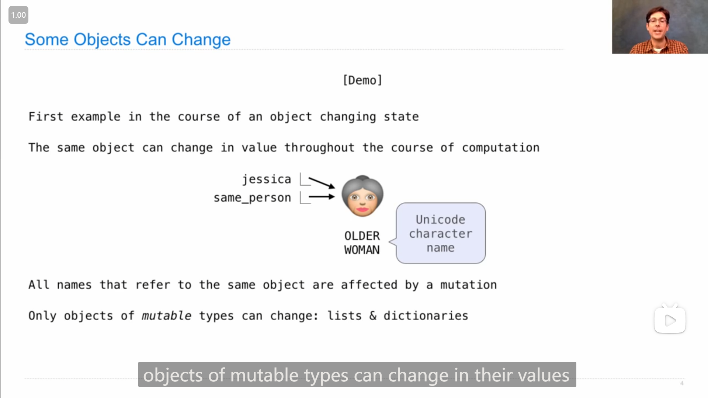
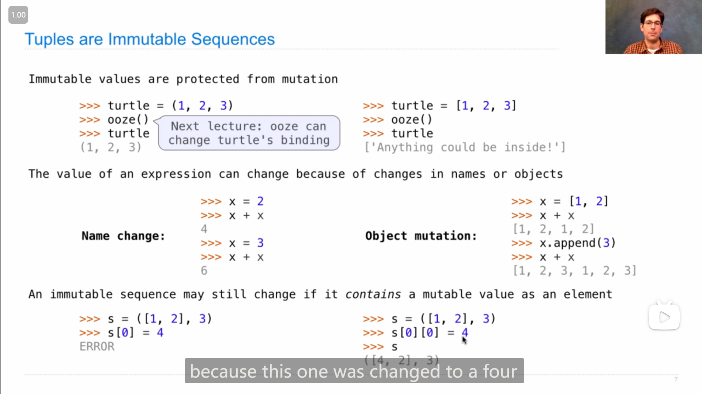
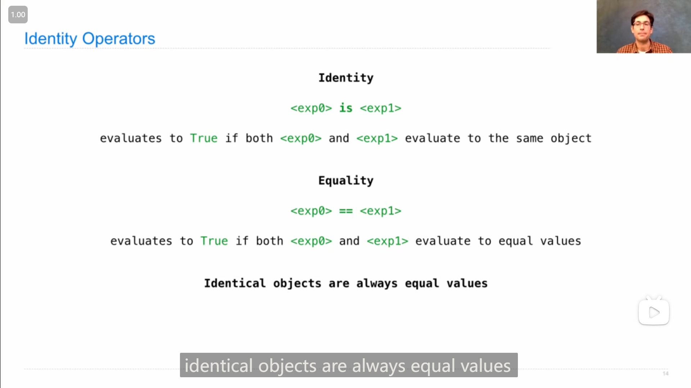
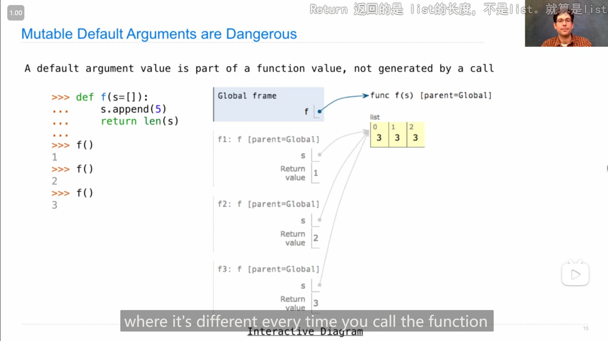
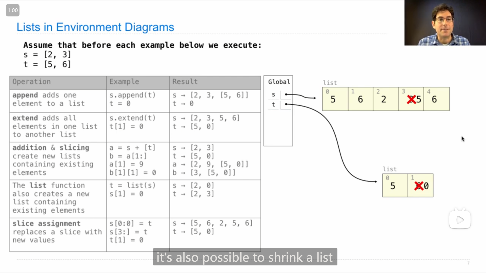

# Lecture 13 Q&A --- Lecture 15 Q&A

## Lecture 13 Q&A

### 1

John关于 `min()` 和 `max()` 的 `key` 参数的一些解释和说明

::: info 引述
...what's going on with the min function and its optional argument called key. sometimes what you want is to find the smallest number among a list, and min will do that for you. but **sometimes what you want is to find a particular number that's extreme in another way, like it's not the smallest, it's not the largest, but it's the closest to five or it's the, it's the thing that when you square it is closest to 24, or you know you could imagine any kind of description, where there's like a some value, that would do this the best**, and min allows you to find that element for any possible condition, and that's the point of that key function. **so the way you do it is that, you start out with your same set of values, of which one is the one that you're looking for, and then you provide a function, and this function is going to be called on every single one of these values**, and yeah, let's use that example of, uh, the square is as close as possible to 24. i don't know why you would want this, but maybe you would for some reason.

```python
>>> min([3, 2, 5, 6], key=lambda x: abs(x * x - 24))
```

so what's going to happen here, is that it's going to square, and then subtract 24 from each of these, and then take the absolute value in order to get some measurement of how close is the square of this x to 24. and it tells us 5 is among these numbers the one that when you square it gets you pretty close to 24. **in fact there's like an important property about this computation that's not shown, which is that 5 squared minus 24 is 1, and there's no 1 in this output, that's all hidden**. what is happening is that, that 1 is computed along with the result of, squaring 3 and subtracting 24, and squaring 6 and subtracting 24. **so it's done it for all of them, and then it has found the one, for which the result of calling this function is the smallest**. why the smallest, because it's min. **so in this way you can use min in order to find the, kind of extreme value for any notion of extreme that you want, but you always get one of these values**. and if there's a tie, then you'll get an arbitrary one i think. you get the first one but i'm not actually sure...

---

...min函数及其名为key的可选参数发生了什么。有时，你想要的是在一个列表中找到最小的数字，min会为你做到这一点。**有时，你想要的是找到一个以另一种方式极端的特定数字，比如它不是最小的，也不是最大的，但它最接近5，或者它是，当你把它平方时，它最接近24，或者你知道你可以想象任何一种描述，其中有一个值，这将是最好的**，min允许你找到任何可能条件下的元素，这就是关键函数的意义所在。**这样做的方法是，你从一组相同的值开始，其中一个是你正在寻找的值，然后你提供一个函数，这个函数将对这些值中的每一个调用**，是的，让我们用这个例子，呃，平方尽可能接近24。我不知道你为什么想要这个，但也许出于某种原因你会想要。

```python
>>> min([3, 2, 5, 6], key=lambda x: abs(x * x - 24))
```

这里要做的是，它要平方，然后从每一个中减去24，然后取绝对值，得到x和24的平方有多接近。它告诉我们，5是这些数字中的一个，当你平方时，它会非常接近24**事实上，这个计算有一个重要的性质没有显示，那就是5的平方减去24是1，而这个输出中没有1，这都是隐藏的**。现在的情况是，1与平方3和减法24、平方6和减法24的结果一起计算。**因此，它对所有这些函数都进行了处理，然后找到了一个函数，调用该函数的结果是最小的**。为什么是最小的，因为它是最小的。**通过这种方式，你可以使用min来找到，任何你想要的极值概念的极值，但你总是得到其中一个值**。如果打成平手，我想你会得到一个任意的平手。你得到了第一个，但我实际上不确定...
:::

### 2

{ loading=lazy }

两个列表在比较大小时，会比较第一个元素的大小( `min()` 函数也类似)，

测试了一下，应该是像字符串一样的规则，即前一个元素能比较出就按照该结果，若相等则比较下一个元素...

```python
>>> [3, 4, 5] > [3, 3]
True
>>> [3, 4, 5] > [4, 3]
False
>>> [3, 4, 5] > [3, 4]
True
>>> [3, 4, 5] > [3, 5]
False
```

## Lecture 14 Circuits

### 1

Hany讲设计电路(Design Circuits)的内容中，构建命题逻辑公式的思路(step 1-3)值得学习

>   1.   step 1. build truth-table for all possible input/output values
>   2.   step 2. build sub-expressions with *and/not* for each output column
>   3.   step 3. combine, two at a time, sub-expressions with an *or*
>   4.   step 4. draw circuit diagram

{ loading=lazy }

1.   先根据真值表写出子表达式
2.   再将子表达式析取(or)到一起

|  a   |  b   |   c   |  d   |
| :--: | :--: | :---: | :--: |
|  0   |  0   |   0   |  0   |
|  0   |  1   | <mark>1</mark> |  0   |
|  1   |  0   |   1   |  0   |
|  1   |  1   |   0   |  1   |

上面真值表中高亮的c的1的输出值，需要的子表达式应为 `c = a' · b` (非a且b)

|  a   |  b   |   c   |  d   |
| :--: | :--: | :---: | :--: |
|  0   |  0   |   0   |  0   |
|  0   |  1   |   1   |  0   |
|  1   |  0   | <mark>1</mark> |  0   |
|  1   |  1   |   0   |  1   |

同理，这个高亮的输出值，对应的子表达式应为 `c = a · b'` 

最后，再析取两个子表达式，即得到

`c = (a' · b) + (a · b') ` 

### 2

二进制数的加法需要构建出有3个输入值和2个输出值的电路

{ loading=lazy }

{ loading=lazy }

### 3

{ loading=lazy }

>   ...okay, remember how the sub expressions work, **you treat each output column separately**, the d and the e. **output column are completely independent of each other**. we're going to identify **wherever there's a one**, and then here here here and here. we're going to build a sub expression **using only and and not**, and then we're going to **combine those sub expressions using the or operator**. and then once we have the final expression, of course we're going to draw some circuitry...
>

感觉有点类似与写出主析取范式

### 4

{ loading=lazy }

写命题逻辑公式的技巧：

1.   变元多的时候可以多个变元合成一组，然后结合表格展示真值
2.   写子表达式时的技巧，如由上图灰色区域，可以发现与a的取值无关，故可以写出子表达式 `b·c·d'`

## Lecture 14 Q&A

### 1

Lab 05 的 Q10

**不使用 built-in zip function:**

{ loading=lazy }

John的方法我认为关键之处在于，用下标去联系两颗树对应的树枝/分支

>   ```python
>   def add_trees(t1, t2):
>       result_label = label(t1) + label(t2)
>       result_branches = []
>       i = 0
>       while i < min(len(branches(t1)), len(branches(t1))):
>           b1, b2 = branches(t1)[i], branches(t2)[i]
>           new_branch = add_trees(b1, b2)
>           result_branches = result_branches + [new_branch]
>           i = i + 1
>       result_branches = result_branches + branches(t1)[i:]
>       result_branches = result_branches + branches(t2)[i:]
>       return tree(result_label, result_branches)
>   ```

**使用 built-in zip function:**

{ loading=lazy }

`zip()` 可以将多个序列中的元素同时提取出来，比如，a列表有5个元素，b列表有8个元素，则 将两者输入到 `zip()` 中，会得到一个含有a列表全部元素和b列表前5个元素的*序列*，序列中每个元素为a b列表中下标对应的元素(像上图中的一样)

**重要的是**可以使用 序列推导式，或者 `for` 语句(利用 `zip()` )**将多个序列中的元素一起提取出来**，如

```python
>>> l1 = [1, 2, 3]
>>> l2 = ["a", "b", "c"]
>>> [[x, y] for x, y in zip(l1, l2)]
[[1, 'a'], [2, 'b'], [3, 'c']]
```

那么使用 `zip` 的代码可以写成：

```python
def add_trees(t1, t2):
    result_label = label(t1) + label(t2)
    result_branches = [add_trees(b1, b2) for b1, b2 in zip(branches(t1), branches(t2))]
    result_branches += branches(t1)[len(result_branches):] + branches(t2)[len(result_branches):]
    return tree(result_label, result_branches)
```

## Lecture 15 Mutable Values

### 1

{ loading=lazy }

::: info 引述
...so objects represent information, **they consist of data and behavior bundled together to create abstractions. objects can represent things, but also properties of things, or interactions, or processes, they're an extremely general concept, anything that has attributes can be represented as an object**. a type of object is called a class, classes are first class values in python, they can be passed in as arguments to functions. and objects are the heart of object oriented programming, which is an approached programming, that allows us to organize large programs using a central metaphor, that a large program is just one big thing, it's a bunch of individual objects, communicating with each other by sending messages back and forth.

---

...所以对象表示信息，**它们由捆绑在一起的数据和行为组成，以创建抽象。对象可以表示事物，也可以表示事物的属性、交互或过程，它们是一个非常通用的概念，任何具有属性的东西都可以表示为对象**。一种类型的对象被称为类，类是python中的第一个类值，它们可以作为参数传递给函数。对象是面向对象编程的核心，这是一种接近编程，它允许我们使用一个中心隐喻来组织大型程序，大型程序只是一件大事，它是一堆单独的对象，通过来回发送消息来相互通信。
:::

### 2

`str` 的几个方法(每种数据类型下的数据都是一个对象，如 `int` 、 `str` )

{ loading=lazy }

### 3

我认为这是一个适合记忆的ascii码表

{ loading=lazy }

这是16进制的ascii码表：

```python
>>> a = 'A'
>>> ord(a)
65
>>> hex(ord(a))
'0x41'
```

### 4

{ loading=lazy }

-   一些 `list` 的方法 
-   列表可以同时修改多个值，如图中 `suit[0:2] = ['heart', 'diamond']`

-   如果将值为一个列表的变量赋值给另一个变量，那么两个变量其实上都指向同一个列表对象，通过二者之一进行改动，都是对对象本身改动(显示另外一个变量的值时会发现也改变了)

>   { loading=lazy }
>
>   从环境图中也可以看到，两个变量指向的时通过一个列表，修改都是对于列表对象本身进行修改

### 5

{ loading=lazy }

所有指向同一个对象的变量(的值，即指向的对象)都会被**一个改变(<mark>mutation</mark>)**影响

并且，只有*可变的*类型才能这样：list 和 dictionary

>   All name thar refer to the same object are affected by a mutation
>
>   Only objects of *mutable* types can change: lists & dictionaries

### 6

{ loading=lazy }

可以使用*列表切片*去来 增添 或 删减 或 替换 列表中的元素

```python
>>> list = [1, 2]
>>> list[4:6] = [4, 5]
>>> list
[1, 2, 4, 5]
>>> list[3:] = [6, 7, 8]
>>> list
[1, 2, 4, 6, 7, 8]
>>> list[2:] = []
>>> list
[1, 2]
```

### 7

{ loading=lazy }

-   被逗号分隔的几个数据也会被认为元组(tuple) (可认为是省略了括号的元组)
-   用一个列表来调用 tuple 的构造函数，会得到含有相同顺序的相同元素的元组
-   逗号 `,` 可以位于元组的最后(应该也可以位于列表和字典的最后，之前有试过)
-   第三点和第一点结合起来可以得到：`2,` 和 `2` 是不一样的(前者是一个元素，后者是一个整数)

### 8

元组能作为字典的 key:

```python
>>> {(1, 2): 3}
{(1, 2): 3}
```

但元组中也不能含有列表:

```python
>>> {(1, [2]): 3}
Traceback (most recent call last):
  File "<stdin>", line 1, in <module>
TypeError: unhashable type: 'list'
```

### 9

{ loading=lazy }

-   可变对象可以通过 *对象突变(Object mutation)* 来改变值，也可以通过 *Name change* 来改变(应该是直接改变指向的对象)，而不可变对象(如元组等)只能通过 *Name change* 来改变
-   如果不可变对象含有可变对象的元素，这个可变对象可以改变(个人认为，可以类比成c中的指针常量，指针本身不改变，但指向的值能改变)

### 10

**恒等运算符(Identity Operators) `is`**

用于判断两个变量是否指向同一个对象

{ loading=lazy }

{ loading=lazy }

### 11

{ loading=lazy }

同一个函数的默认参数是同一个对象，即使多次调用函数，使用默认参数时使用的都是同一个对象

因此如果是可变对象类型，要注意==修改这个对象会导致之后调用函数时(如果使用的话)默认参数会与之前不一样

### 12

list的各种运算

-   `.append()` 方法，将传入的参数添加道列表尾部(如果传入的是一个列表，就将该列表(同一对象)存入尾部)

    { loading=lazy }

-   `.extend()` 方法，应该是传入一个列表(元组或许也可以？(试了，可以))，将列表中的元素依次添加到原列表尾部

    { loading=lazy }

-   **加法** 和 **切片** ，**两者都会创建出一个新的列表**，因此下图中 `a[1] = 9` 并没有使 列表s 的元素改变，但由于 列表a 的第三个元素是列表，同时也是 列表b 的第二个元素，因此通过 列表b 修改时，也会让原本的 列表t 改变

    { loading=lazy }

-   `list()` 列表的构造方法，可以传入一个列表(元组和 `range()` 也可以)，(如果传入的是一个列表)会构建出一个与原列表一样的**新**列表

    { loading=lazy }

-   **列表切片的赋值**，可以对列表进行 **添加(添的比删的多)** / **替换(添的删的一样多)** / **删减(添的比删的少)** 操作，如下图中

    -   `s[0:0] = t` 将t中元素加到(<mark>塞入</mark>)s的头部(0号位置)
    -   `s[3:] = t` 将4号元素删去，并在该位置 塞入 t中的元素

    { loading=lazy }

-   -   `.pop()` 方法，从列表中**拿出**并**返回**最后一个元素
    -   `.remove()` 方法，传入一个参数，在列表中删去第一个跟传入参数相同的元素
    -   用切片赋值的方法去删除列表中的元素

    { loading=lazy }


### 13

{ loading=lazy }

```python
t = [1, 2, 3]
t[1:3] = [t]
t.extend(t)
```

最终得到 `t = [1, [...], 1, [...]]` 的结果的原因，个人的理解：由上图中的环境图可以看到，列表中会有 *无穷循环的指向* 会一直后指向前再从前走到后，因此会得到 `...` 的东西

## Lecture 15 Q&A

### 1

{ loading=lazy }

*切片赋值*需要是一个列表(可能元组或者字符串 或其他*容器(container)*也行？)，如上图中 `s[0:0] = 5` 会报错，应该写成 `s[0:0] = [5]`

###  2

(可以作为上一点的补充)

::: info 引述
good question. so why isn't it that t becomes an element of s, and the reason is that's just how slice assignment works. it's that it takes a container full of elements and **it doesn't put that whole container in s, instead of puts the elements of that container in s**.

---

好问题。为什么t不成为s的一个元素，原因是切片赋值就是这样工作的。它取一个装满元素的容器，**不是将整个容器放在s中，而是将该容器的元素放在s**。
:::

### 3

{ loading=lazy }

下标选择(*selector*)不会改变列表的长度

而切片赋值会改变列表的长度

::: info 引述
...there's only t and this used to be three elements long, it's still three elements long, element assignment never changes the length of the list, it just changes what's in it. slice assignment is different, it changes the length of the list, it replaces an existing slice with some new elements.

---

...只有t，它过去有三个元素长，现在仍然有三个元件长，元素赋值永远不会改变列表的长度，它只是改变其中的内容。切片赋值不同，它改变了列表的长度。它用一些新元素替换了现有的切片。
:::

### 4

Hany关于切片的比喻

::: info 引述
...what you're going to do, is think about it this way, so on the left hand side with the slicing you say, grab those elements, throw them out, and then take whatever's on the right hand side, and shove them into the position, so they can be longer, shorter, it doesn't matter.

---

...你要做的是这样想，所以在切片的左手边，抓住这些元素，把它们扔出去，然后拿走右手边的任何东西，把它们推到这个位置，这样它们就可以更长、更短，这无关紧要。
:::

### 5

关于元组tuple存在和被使用的原因

::: info 引述
**John**:

...but the more common reason is that, people are designing their programs so that they don't have to think about mutation back, when you could just describe every function by its domain range and behavior, life was easier. i'm not saying it was easy, there were plenty of like tricky recursion problems and stuff like that, but at least you knew that, if you called a function, the only thing you really have to worry about is what does it return, not what does it change. and if you use tuples everywhere, since they can't be changed, you kind of don't have to think about what does it change, you just have to think about what it returns, whereas if you're using lists everywhere, if you're not careful, the consequence of calling a function will be not only that it changes something, or that it returns something but also that it changes something, and that's like twice as many things to keep track of when you're writing a big program, and trying to understand how all the parts work, so that's like the main reason to have some immutable version of a sequence, is just to like make sure you write programs in such a way, that nothing can change anything else, except by passing in arguments and returning them.
    
&nbsp;

**Hany**:

it's it's called side effects, the thing that's scary when you call a function is there some side effect, that it that goes beyond just what was passed and what was returned it modified a list, and i, how did i, how do i know that, that how do i control that, and so the tuples are nice...so the tools are nice, because it's essentially like you're locking your data, right, it's giving you data security yeah.

---

**John**:

...但更常见的原因是，人们正在设计他们的程序，这样他们就不必再考虑突变了，当你可以通过每个函数的域范围和行为来描述它时，生活就更容易了。我并不是说这很容易，有很多类似棘手的递归问题和类似的东西，但至少你知道，如果你调用一个函数，你真正需要担心的是它会返回什么，而不是改变什么。如果你在任何地方都使用元组，因为它们是不可更改的，你不必考虑它会改变什么，你只需要考虑它会返回什么，而如果你在所有地方都使用列表，如果你不小心，调用一个函数的后果不仅是它会改变一些东西，或者它会返回一些东西，当你在写一个大程序，并试图了解所有部分是如何工作的时候，这就像是需要跟踪的事情的两倍，所以这就像是拥有一个不可变版本的序列的主要原因，就是要确保你以这样的方式写程序，除了传递参数并返回它们之外，没有什么能改变其他任何事情。
    
&nbsp;

**Hany**:

它被称为副作用，当你调用一个函数时，可怕的是有一些副作用，它超出了传递和返回的内容，它修改了一个列表，我，我是怎么知道的，我是如何控制的，所以元组很好...所以这些工具很好，因为它本质上就像你在锁定你的数据，对吧，它给了你数据安全性。
:::

### 6

Hany和John关于 *类(Class)* 和 *对象(Object)* 的区别的解释

(将 *类* 比作 *蓝图* ，将 *对象* 比作 *依据蓝图修建好的具体的房子*)

::: info 引述
**Hany**:

so the question is what is the difference between a class and an object. the class is, so here's how i think about
it, think about a blueprint for a house, is the class, and the house is the thing you build from the blueprint. okay so i can have a class date, um that is the sort of the definition of the data i'm storing, and the functionality of it, and then i can instantiate, i can create as many of those objects as i want, so they're essentially realizations of the thing that you've created, so the class is, just it's sort of like a definition, nothing exists, and then when you create an object, well now i can sort of do things with it. so there's a class of type list, and then i can define lists, i can define one list, two lists, 50 lists whatever i want, yeah.
    
&nbsp;

**John**:

yeah, and that analogy is nice because you can live in a house, but you can't live in a blueprint, like if you just have the class, you can't really do anything with it, until you construct one of the things that it describes, build the house and then you can go live.
    
&nbsp;

**Hany**:

and you can go live in it, right. and it's sort of like a function definition, right, you define a function, but doesn't do anything, it's just a definition, it just hangs out in the global frame somewhere, but then when you call it, ah now we're actually doing something.

---

**Hany**:

所以问题是类和对象之间的区别是什么。课堂是这样的，所以我是这样想的
想想房子的蓝图，它就是阶级，房子就是你根据蓝图建造的东西。好的，我可以有一个类的日期，嗯，这是我存储的数据的定义，以及它的功能，然后我可以实例化，我可以创建我想要的任意多的对象，所以它们本质上是你创建的东西的实现，所以类是，它有点像一个定义，什么都不存在，然后当你创建一个对象时，现在我可以用它做一些事情了，所以有一类类型列表，然后我可以定义列表，我可以定义一个列表，两个列表，50个列表，我想要的，是的。
    
&nbsp;

**John**:

是的，这个比喻很好，因为你可以住在房子里，但你不能住在蓝图里，就像你只有课，你真的不能用它做任何事情，直到你建造了它描述的东西之一，建造了房子，然后你就可以生活了。
    
&nbsp;

**Hany**:

你可以住在里面，对吧。这有点像函数定义，对吧，你定义了一个函数，但什么都不做，它只是一个定义，它只是挂在全局框架的某个地方，但当你调用它时，啊，现在我们实际上在做一些事情。
:::
