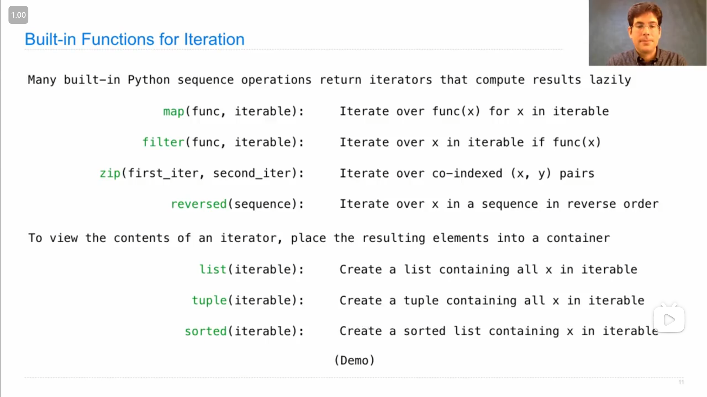
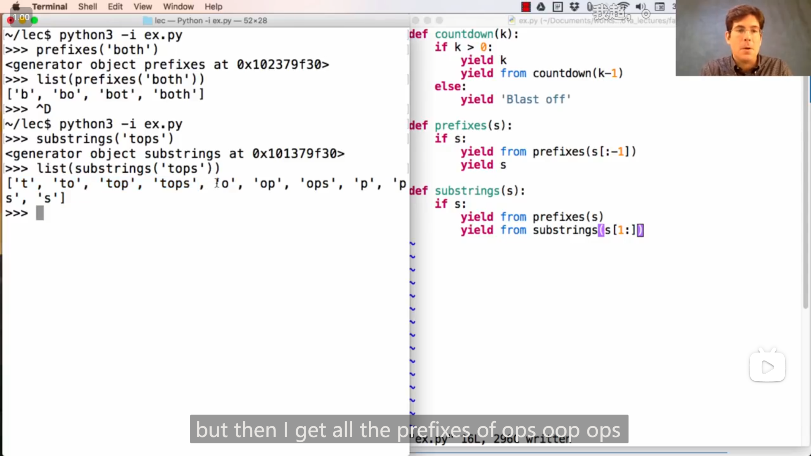

# Lecture 17 --- Lecture 17 Q&A

## Lecture 17 Iterations

### 1

{ loading=lazy }

-   `iter()` 传入一个可以迭代的数据(比如列表)，然后返回一个对应的迭代器(我感觉应该是一个 `iter` 类型的构造函数)，并且迭代器的初始的位置位于数据(如列表)的起始端(第一个元素之前)，并且如果两次对同一个列表调用 `iter()` 函数，返回的是两个不同的迭代器，即

    ```python
    >>> s = [3, 4, 5]
    >>> t = iter(s)
    >>> next(t)
    3
    >>> next(t)
    4
    >>> u = iter(s)
    >>> next(u)
    3
    >>> next(t)
    5
    >>> next(u)
    4
    ```

-   `next()` **传入一个迭代器**(传入可迭代数据会报错)，返回迭代器的后一个元素，并向前移动一个位置，即下次再调用 `next()` 并传入同一个迭代器，返回的会是另一个元素

### 2

如果用 `list()` 去传入一个迭代器，那么会返回一个列表包含迭代器之后的所有元素，**不包含之前的，并且会将迭代器的位置移动到列表的末端**

```python
>>> s = [[1, 2], 3, 4, 5]
>>> s
[[1, 2], 3, 4, 5]
>>> t = iter(s)
>>> next(t)
[1, 2]
>>> next(t)
3
>>> list(t)
[4, 5]
>>> next(t)
Traceback (most recent call last):
  File "<stdin>", line 1, in <module>
StopIteration
```

### 3

>   A dictionary, its keys, its values, and its items are all iterable values

`dict.keys` `dict.values` `dict.items` 都是可以迭代的对象

-   如果对 `iter()` 直接传入一个字典，返回的迭代器对应的是keys的迭代器
-   对 `next()` 传入 `dict.items` 对应的迭代器，返回的是由字典的key和对应的value组成的二元元组

```python
>>> d = {'one': 1, 'two': 2, 'three': 3}
>>> d['zero'] = 0
>>> k = iter(d.keys())  # or iter(d)
>>> next(k)
'one'
>>> next(k)
'two'
>>> next(k)
'three'
>>> next(k)
'zero'
>>> v = iter(d.values())
>>> next(v)
1
>>> next(v)
2
>>> next(v)
3
>>> next(v)
0
>>> i = iter(d.items())
>>> next(i)
('one', 1)
>>> next(i)
('two', 2)
>>> next(i)
('three', 3)
>>> next(i)
('zero', 0)
```

### 4

如果改变一个**字典**的大小(经过测试，给字典添加元素，不会使得之前构建的迭代器失效)，比如添加一组新的键值对，或者删去，会使得之前构建的迭代器不能使用(keys, values, items都不能)

```python
>>> d = {'one': 1, 'two': 2}
>>> k = iter(d)
>>> next(k)
'one'
>>> d['zero'] = 0
>>> next(k)
Traceback (most recent call last):
  File "<stdin>", line 1, in <module>
RuntimeError: dictionary changed size during iteration
>>> d
{'one': 1, 'two': 2, 'zero': 0}
>>> k = iter(d)
>>> next(k)
'one'
>>> next(k)
'two'
>>> d['zero'] = 5
>>> next(k)
'zero'
```

而如果只是**修改已存在的键值对的值**，不会使得之前构建的迭代器失效(values, items对应的迭代器在修改了字典之后连接的会是修改之后的值)

### 5

`for` 语句也可以使用迭代器，但只是从迭代器当前的位置开始，并且会将迭代器的位置移动到最后，(感觉跟第二点很相像)

```python
>>> r = range(3, 6)
>>> ri = iter(r)
>>> next(ri)
3
>>> for i in ri:
...     print(i)
...
4
5
>>> for i in ri:
...     print(i)
...
>>> next(ri)
Traceback (most recent call last):
  File "<stdin>", line 1, in <module>
StopIteration
```

### 6

{ loading=lazy }

一些会返回迭代器的 built-in functions

**<mark>上图中的 `iterable` 也包括迭代器，所以迭代器也算作可迭代对象</mark>**

**John的几个Demo**

1.   这是一个简单展示的利用 `map` 来获取 一个将传入函数套用在迭代出来的数据的迭代器 的例子

     >   ```python
     >   >>> bcd = ['b', 'c', 'd']
     >   >>> [x.upper() for x in bcd]
     >   ['B', 'C', 'D']
     >   >>> map(lambda x: x.upper(), bcd)
     >   <map object at 0x000002597B19F730>
     >   >>> m = map(lambda x: x.upper(), bcd)
     >   >>> next(m)
     >   'B'
     >   >>> next(m)
     >   'C'
     >   >>> next(m)
     >   'D'
     >   >>> next(m)
     >   Traceback (most recent call last):
     >     File "<stdin>", line 1, in <module>
     >   StopIteration
     >   >>>
     >   ```

2.   在这个例子中，可以注意到，map返回的迭代器，**并不是直接把 传入的函数对可迭代对象的每个数据的返回值存在迭代器中，而是将可迭代对象和传入的函数绑定在同一个迭代器里，在迭代时就用<mark>迭代器迭代返回的数据</mark>去调用函数**(所以才会运行 `print` 函数，即打印出东西)

     >   >   ```python
     >   >   def double(x):
     >   >       print('**', x, '=>', 2 * x, '**')
     >   >       return 2 * x
     >   >   ```
     >
     >   ```python
     >   >>> m = map(double, [3, 5, 7])
     >   >>> next(m)
     >   ** 3 => 6 **
     >   6
     >   >>> next(m)
     >   ** 5 => 10 **
     >   10
     >   >>> next(m)
     >   ** 7 => 14 **
     >   14
     >   >>>
     >   ```

3.   **<mark>这个例子</mark>**中，展示了 `filter` ，和 `map` 很类似，也是**将迭代对象和函数绑定到一起(而不是直接取目标的返回值，也没有保存迭代对象的值)**，所以在迭代 <mark>`filter` 返回的迭代器</mark>时，是<mark>先迭代它的迭代对象</mark>，<mark>再将迭代返回值放入函数判断(不符合就继续迭代)</mark>(所以 `double` 内部的print语句才会执行)，<mark>然后返回符合(判断)函数的值</mark>。从这个例子中可以很清晰地看到这一点

     >   ```python
     >   >>> m = map(double, range(3, 7))
     >   >>> f = lambda y: y >= 10
     >   >>> t = filter(f, m)
     >   >>> next(t)
     >   ** 3 => 6 **
     >   ** 4 => 8 **
     >   ** 5 => 10 **
     >   10
     >   >>> next(t)
     >   ** 6 => 12 **
     >   12
     >   >>> list(t)
     >   []
     >   >>> list(filter(f, map(double, range(3, 7))))
     >   ** 3 => 6 **
     >   ** 4 => 8 **
     >   ** 5 => 10 **
     >   ** 6 => 12 **
     >   [10, 12]
     >   >>>
     >   ```

4.   这个例子展现了 `reversed` 返回的是一个迭代器(所以不会等于原来的列表)

     >   ```python
     >   >>> t = [1, 2, 3, 2, 1]
     >   >>> t
     >   [1, 2, 3, 2, 1]
     >   >>> reversed(t)
     >   <list_reverseiterator object at 0x000002597B1D12D0>
     >   >>> reversed(t) == t
     >   False
     >   >>> list(reversed(t))
     >   [1, 2, 3, 2, 1]
     >   >>> list(reversed(t)) == t
     >   True
     >   >>>
     >   ```

5.   这个例子中，字典键值对的顺序和John的demo有点不一样，应该是由于python版本不同的原因

     >   ```python
     >   >>> d = {'a': 1, 'b': 2}
     >   >>> d
     >   {'a': 1, 'b': 2}
     >   >>> items = iter(d.items())
     >   >>> next(items)
     >   ('a', 1)
     >   >>> next(items)
     >   ('b', 2)
     >   >>> items = zip(d.keys(), d.values())
     >   >>> next(items)
     >   ('a', 1)
     >   >>> next(items)
     >   ('b', 2)
     >   >>>
     >   ```
     >
     >   { loading=lazy }
     
### 7

{ loading=lazy }

*生成器和生成器函数 Generators and Generator Functions*

使用 `yield` 而不是 `return` 关键字来返回值的函数，就是*生成器函数*，而*生成器函数*会返回一个*生成器*，*生成器*是一个迭代器，迭代时会按照函数中 `yield` 语句的顺序来返回值，参考上图

John的一个demo

>   >   ```python
>   >   def evens(start, end):
>   >       even = start + (start % 2)
>   >       while even < end:
>   >           yield even
>   >           even += 2
>   >   ```
>
>   ```python
>   >>> t = evens(2, 10)
>   >>> t
>   <generator object evens at 0x000002597B170580>
>   >>> next(t)
>   2
>   >>> next(t)
>   4
>   >>> next(t)
>   6
>   >>> next(t)
>   8
>   >>> next(t)
>   Traceback (most recent call last):
>     File "<stdin>", line 1, in <module>
>   StopIteration
>   >>> list(evens(1, 10))
>   [2, 4, 6, 8]
>   >>>
>   ```

John的解释是，当一个 *Generator Function* 被调用时，函数里面的语句不会被立即执行，而是直接返回一个 *Generator* ，而在 *generator* 每次迭代时，函数内的语句才会被执行，且只执行到下一个 `yield` 处就暂停执行，并返回值

### 8

{ loading=lazy }

**`yield from` 语句**，后面可以是 迭代器 或者 可迭代对象 (如果是迭代器估计会修改迭代器的位置)

上图中还展示了生成器函数的一种类似于递归的写法

>   ```python
>   def countdown(k):
>       if k > 0:
>           yield k
>           for x in countdown(k - 1):
>               yield x
>   ```
>
>   更简洁的写法就是
>
>   ```python
>   def countdown(k):
>       if k > 0:
>           yield k
>           yield from countdown(k - 1)
>   ```

### 9

{ loading=lazy }

John的一个神奇的生成器函数的demo，感觉很像递归的感觉，并且多个生成器函数组合使用可以产生神奇的效果

## Lecture 17 Q&A

### 1

John 关于迭代器的解释

::: info 引述
yeah good question, so if an iterator is not a list, what is it. um, there are lots of different kinds of, uh, iterators, so you know it more by its behavior than its, like what it's constituted of. an iterator is something that you can call next on, and get more elements. in the case of a list, the iterator for a list, is more than just a list, it's kind of a reference to the list along with a position in that list that tells you where you are, so that if you call the next thing the iterator advances, meaning that if you called next again you'd get something else than you did the first time. so in that sense, it's, it has different behavior than a list, because it's both a list and like a marker for where you are. but list iterators are not the only kind of iterators, you could have an iterator through the labels in a tree, you could have an iterator through the prefixes in a string, you could have an iterator kind of through anything, and it's just a description of something that lets you go through multiple elements in some order by calling next on the iterator and getting the next value, and you can do that over and over again. so it's quite an abstract thing as opposed to, feeling quite as concrete as for example a list.

---

好问题，如果迭代器不是一个列表，它是什么。嗯，有很多不同类型的迭代器，所以你更多地通过它的行为而不是它的行为来了解它，比如它是由什么组成的。迭代器是您接下来可以调用并获取更多元素的东西。在列表的情况下，列表的迭代器不仅仅是一个列表，它是对列表的引用，以及列表中的一个位置，告诉你在哪里，所以如果你调用下一个东西，迭代器会前进，这意味着如果你再次调用next，你会得到比第一次不同的东西。从这个意义上说，它的行为与列表不同，因为它既是一个列表，又像是一个你所在位置的标记。但列表迭代器并不是唯一一种迭代器，你可以通过树中的标签有一个迭代器。你可以通过字符串中的前缀有一个迭代器。你也可以通过任何东西有一个iterator。它只是一个东西的描述，让你通过在迭代器上调用next并获得下一个值来按某种顺序遍历多个元素，你可以一次又一次地这样做。所以这是一件非常抽象的事情，而不是像列表一样具体。
:::

### 2

{ loading=lazy }

John展示了一种不使用 `yield` 关键字也可以实现相同功能的写法：

```python
def prefixes(s):
    result = []
    if s:
        for x in prefixes(s[:-1]):
            result.append(x)
    return result

print(list(prefixes('doges')))
```

>   原本的使用 `yield` 的写法
>
>   ```python
>   def prefixes(s):
>       if s:
>           for x in prefixes(s[:-1]):
>               yield x
>           yield s
>   
>   print(list(prefixes('doges')))
>   ```

### 3

John 和 Hany 解释关于迭代器每次迭代时就会被*更改*的特点(一次性使用的特点)

::: info 引述    
```python
s = [1, 2, 3]
t = iter(s)

len(list(t)) #-> returns 3
len(list(t)) #-> returns 0?
```

**John**:

yeah good question, so the questions about this example and why is it the case that when you get the length of, uh, the result of listing out the contents of an iterator twice you get a different thing each time, first time you got three things, next time you got zero things. this isn't something having to do with len, this is having to do with how list interacts with an iterator. when you call list on an iterator, you end up building a list of all the contents of that iterator, but the iterator is used up as a side effect of calling list on it. so, if i have an iterator over these values, um, i can get one thing out of it, but then if i get another thing i get a different thing. list is kind of like calling next over and over again, and putting all the results in a list. so as soon as you call list on t, you're going to get everything that's left over in the iterator, that hasn't been used up or returned already. so we've already seen the one, we've seen the two, therefore calling list on t will just show us the three. and now t is used up, i can't get the next thing in t, because we're already at the end, and so if i try to list everything that's left and t, i'll get an empty list. so your version was start with this, get all the contents of that, which is a list containing one two and three. if i do this, i'm changing t. this is, uh, every time you get elements from an iterator, you're changing that iterator, which means you can't really use it again. so if you get the length of this you get three, you get the length of this you get zero.

&nbsp;

**Hany**:

**so think of these iterators as one use disposable operators, once you've gone through the list, either next next next next, or the list of it is you're essentially enumerating the list, it's gone**. right, so by the way you could have implemented this yourself, you could have written a function that every time you access an element, the next element, you delete that element from the list, that's essentially what's going on here. yeah. and so once you, it's a funny thing about iterators by the way, is that once you look at the list, it's, it's sort of like, uh, what is it, **it's like snapchat, right, the image comes in, you look at it, and then it vanishes, it's gone**.

&nbsp;

**John**:

that is beautiful.

&nbsp;

**Hany**:

yeah, you got to be impressed by somebody my age, making a snapchat reference, that's, that's i think you know, you have a little credit for that.

&nbsp;

**John**:

perfect snapchat analogy.

---

```python
s = [1, 2, 3]
t = iter(s)

len(list(t)) #-> returns 3
len(list(t)) #-> returns 0?
```

**John**:

是的，这是一个很好的问题。关于这个示例的问题是，为什么在两次获取迭代器的内容的长度时，每次都会得到不同的结果？第一次得到三个元素，下一次却得到零个元素？这与 `len` 函数无关，而与 `list` 如何与迭代器交互有关。当你在迭代器上调用 `list` 时，你实际上正在构建一个包含该迭代器的所有内容的列表，但调用 `list` 会消耗迭代器，这是一个副作用。因此，如果我有一个迭代器遍历这些值，我可以从中获取一个元素，但如果我再次获取一个元素，我将得到不同的结果。 `list` 就像一次又一次地调用 `next` ，然后将所有结果放入列表中。因此，一旦在 `t` 上调用 `list` ，你将获得迭代器中剩余的所有内容，这些内容尚未被使用或返回。所以我们已经看到了1和2，因此在 `t` 上调用 `list` 将只显示3。现在 `t` 已经被用完了，我无法再获取 `t` 中的下一个元素，因为我们已经到达末尾，所以如果我尝试列出 `t` 中剩下的所有内容，我将得到一个空列表。所以你的版本是从这个开始，获取了包含1、2和3的列表。如果我做这个，我就改变了 `t` 。每当从迭代器中获取元素时，你都会改变该迭代器，这意味着你不能再次使用它。因此，如果你获取这个的长度，你会得到3，如果你获取这个的长度，你会得到0。

&nbsp;

**Hany**:

**所以把这些迭代器看作是一次性的操作符，一旦你遍历了列表，无论是通过连续调用 `next` 还是通过调用 `list` ，它们都消失了**。对，顺便说一句，你其实可以自己实现这个，你可以编写一个函数，每次访问一个元素，都从列表中删除那个元素，这本质上就是这里发生的事情。是的，所以一旦你看过列表，**这有点像 Snapchat，对吧？图像进来，你看了一眼，然后它就消失了，没有了**。

&nbsp;

**John**:

这太精彩了。

&nbsp;

**Hany**:

是的，你得对我这个年龄的人能够提到 Snapchat 感到印象深刻，我想你应该给我点信用。

&nbsp;

**John**:

完美的 Snapchat 比喻。
:::
