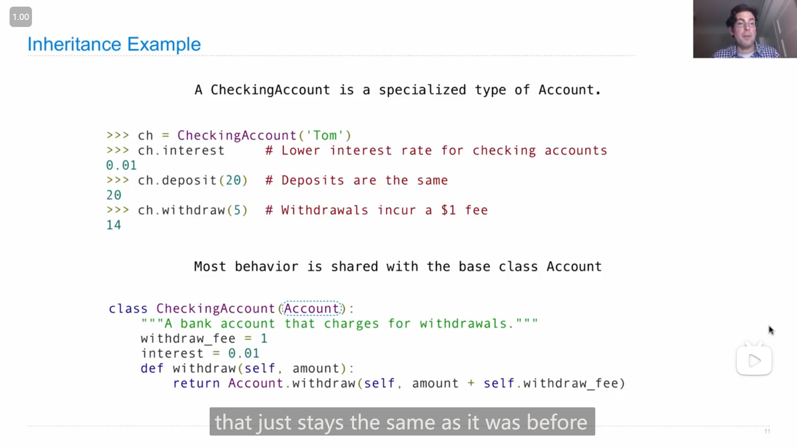
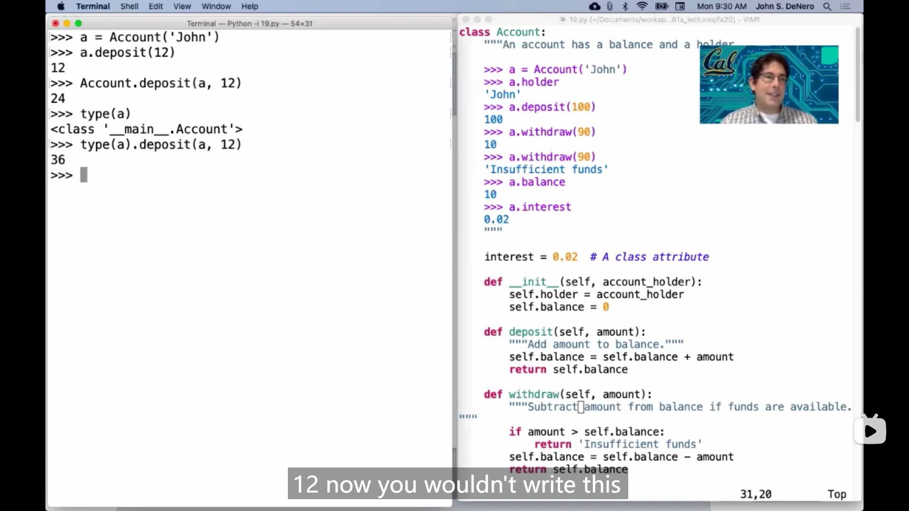

# Lecture 19 --- Lecture 19 Q&A

## Lecture 19 Inheritance

### 1

{ loading=lazy }

用 *点表达式 dot expression* 给属性赋值

<mark>如果*点 `.`* 左边的对象是实例，那么赋值的就是实例的属性，</mark>

<mark>而如果*点 `.`* 左边的对象是类，那么赋值的就是类的属性</mark>

>   这就解释了上节课 Q&A 中的第一点

并且，由于

>   Attribute assignment statement adds or modifies the attribute named ...

所以，属性赋值就是，如果实例/类**还没有**对应名字的属性，那么赋值就会添加一个相对应的属性，而如果已经存在对应名字的属性，那么就会修改这个属性的值

### 2

{ loading=lazy }

通过 `实例.属性` ，实际上是先在实例中先查看是否有对应的属性，如果有就返回，如果没有就到类中去查看是否有对应的属性

{ loading=lazy }

### 3

继承的语法：

```python
class <name>(<base class>):
    <suite>
```

### 4

{ loading=lazy }

一个使用继承的例子，没想到居然可以这样使用父类的方法 来修改成为自己的方法(惊奇地发现 `self` 参数原来是这么用的)

### 5

{ loading=lazy }

子类与父类的属性的使用关系感觉也是和实例与类的属性使用关系很像，即**父类的属性并没有复制并绑定到子类中，而是在使用属性时，现在子类中查看，如果没有就到父类中查看**(如果父类中没有就继续到父类的父类...)

### 6

John在demo中展示了 `CheckingAccount` 的 `withdraw` 方法的两种写法：

-   ```python
    class CheckingAccount(Account):
        ...
        def withdraw(self, amount):
            amount = amount + 1
            if amount > self.balance:
                return 'Insufficient funds'
            self.balance = self.balance - amount
            return self.balance
    ```

-   ```python
    class CheckingAccount(Account):
        ...
        withdraw_fee = 1
        def withdraw(self, amount):
            return Account.withdraw(self, amount + self.withdraw_fee)
    ```

前者相比于后者有个类似于(之前数据抽象相关的课程中提到的)打破抽象的界限的问题，会存在一个隐患，即如果对父类的方法进行修改，那么子类的方法还会是原来的样子，而后者如果父类被修改了，子类也会跟着一起修改

### 7

关于设计继承的时候John的几个**<mark>建议</mark>**：

-   **Don't repeat yourself; use existing implementations.**

    >   **try to avoid copying and pasting code**

    要避免直接复制代码，而是使用已经实现了的(父类的)方法或函数

-   **Attributes that have been overridden are still accessible via class objects.**

    意思就是，父类中被子类*覆写*了的属性，可以通过类名去访问

-   **Look up attributes on instances whenever possible.**

    意思是，尽可能使用实例的属性(值或者方法)，(而不是类的)

### 8

::: info 引述
**Inheritance and Composition**

Object-oriented programming shines when we adopt the metaphor

-   Inheritance is best for representing *is-a* relationships.

    E.g., a checking account **is a** specific type of account.

    So, CheckingAccount inherits from Account.

-   Composition is best for representing *has-a* relationships.

    E.g., a bank **has a** collection of bank accounts it manages.

    So, A bank has a list of accounts as an attribute.
:::

*继承*和*构成* (*Inheritance and Composition*)

<mark>面向对象编程(的思想/概念)很适合类比现实中的事物</mark>

-   **继承**适合表示 **是/属于** 的关系，比如：支票账户**是**银行账户的一种

    所以 支票账户 从 银行账户 继承

-   **构成**适合表示 **有** 的关系，比如：银行**有**很多银行账户

    所以，银行 有 一系列 银行账户 作为它的属性

### 9

{ loading=lazy }

关于第一个语句 `>>> C(2).n` 创建出的右下角的 `C` 类的实例中会存在 `z` 的疑惑和理解

由于**在创建 `C` 类的时候，会调用*初始化函数* `__init__()` ，而 `C` 类本身类中又没有*初始化函数*，所以<mark>会调用父类中的*初始化函数*</mark>**，故会调用 `B` 中的 `__init__()` ，**而值得注意的一点，由于是 `C` 的实例调用*初始化函数*，所以 <mark>`self` 被传入的是 `C` 的实例本身，因此 `self.z = self.f(y)` 这一行语句中，执行的 `f()` 函数是 `C` 类中的 `f()` 方法</mark>，所以最后的结果是，那个实例中会存在一个 值为2的 `z`** 

所以对于python中的 `self` 参数有了新的认知，即**可以使用父类的方法，而 `self` 参数传入的却是子类的实例(所以要注意由于是子类的实例，有可能 `self.xxx` 之类的self的*点表达式*代码，得到的效果会和一般的父类实例不一样，比如上图中 `B` 的*初始化函数*如果传入的是 `B` 类的实例，那么很可能 `self.f(y)` 调用的是 `A` 类中的方法)**

>   在第三个语句中也出现了类似的情况(但是这第三个语句极其地绕)
>
>   `b = B(1)` 中，实例中的 `z` 由于调用了 `A` 中的 `f` 方法，所以指向了另一个 `B` 类实例，而新的实例*初始化函数*中 `z` 又指向的是一个 `C` 类的实例，而 `C` 类实例在初始化时，又需要调用 `B` 的 `__init__()` ，然后就调用了 `C` 类的 `f` 方法(我本来以为会一直 `B` 类 `C` 类来回一直指下去)

### 10

一个类可以继承多个父类，如

```python
class AsSeenOnTVAccount(CheckingAccount, SavingsAccount):
    def __init__(self, account_holder):
        self.holder = account_holder
        self.balance = 1
```

### 11

>   now it's hard for me to show you why this (multiple inheritance tends to make programs complicated) is the case, so instead I'll just show you an analogy about human inheritance.

{ loading=lazy }

在使用多重继承的时候，除非是真的很重要的关系，或者十分必须，在使用时要很注意，因为多重继承会使程序变得复杂，虽然很难举出例子，但是可以参考现实中(生物上)的继承

## Lecture 19 Q&A

### 1

{ loading=lazy }

`type()` 函数如果返回类，可以通过它的返回值来访问类内的属性，如

>   ```python
>   class Account:
>       def __init__(self, account_holder):
>           self.holderr = account_holder
>           self.balance = 0
>           
>       def deposit(self, amount):
>           self.balance = self.balance = amount
>           return self.balance
>   ```

```python
>>> a = Account('John')
>>> type(a).deposit(a, 100)
100
```

但是 Hany 说应该避免使用这种写法，因为大多数人不会怎么写

### 2

{ loading=lazy }

根据 John 的解释，`super()` 的作用是，不在本类中寻找 `.` 之后的东西，而是在上一级父类中寻找

并且在使用父类的*方法*时，会将实例自动传入 `self` 参数，和直接 `父类名.方法` 的使用形式略有不同

### 3

{ loading=lazy }

有多继承的类在使用本类中没有的方法时，是先在**上一级父类**中**按顺序**寻找，比如上图，如果在 `CheckingAccount` 中没找到对应的方法，那么不会在 `CheckingAccount` 的父类( `Acount` 类)中寻找，而是在 `SavingAccount` 类中寻找，**如果所有的上一级父类中都没找到对应的方法，那么才会在上两级父类中寻找(即父类的父类)**

### 4

::: info 引述
**John**:

well i'd say at the outset that it's often the case that tracing through, uh, tree recursion is not something that humans can tolerate, like it's, it's just really messy sometimes, um, so the right answer is to shift the way in which you approach understanding, uh, implementation to get away from tracing, and instead just treat the recursive calls as abstractions, they do the thing that they're supposed to do, but how they do them is not your problem, and then like you can put it together. but this is not, not like obvious or easy so, um, so maybe we can talk about that with a particular example. so maybe while i read this maybe hany can, uh, say whether that makes sense to him.
    
&nbsp;

**Hany**:

i i'll add one more thing to it, so john's absolutely right that tracing tree recursion is very hard, you have to hold a lot in your memory. um, so one way to fix it is as he just said, is to just think differently about it. it's not about tracing, it's about thinking about the fundamental nature of, um, the, the functions and they just do what you want them to do, and the other is to just use toy examples.

---

**John**：

嗯，我首先要说的是，往往情况是，追踪树形递归对人类来说是无法忍受的，就像有时候非常混乱一样。所以正确的答案是改变你理解实现的方式，摆脱追踪，而是将递归调用视为抽象，它们执行它们应该执行的任务，但它们如何执行不是你的问题，然后你可以将它们组合起来。但这并不明显或容易，所以也许我们可以用一个具体的例子来讨论一下。所以也许在我阅读这个的时候，Hany可以说一下这是否有意义。
    
&nbsp;

**Hany**：

我要补充一点，John说得对，追踪树形递归非常困难，你必须记住很多东西。所以解决的一种方法就像他刚才说的那样，只是以不同的方式思考。这不是关于追踪，而是思考函数的基本性质，它们只是执行你想要它们执行的任务，另一种方法是使用简单的示例。
:::

John 和 Hany 说到**对树形递归追踪很难，所以不应该去追踪递归(我认为这里可以理解为，弄清楚递归的每一步的具体效果)，而是换一种想法去思考(即之前总结的假定函数能返回正确/所需的值)**

### 5

{ loading=lazy }

John 解答 Lab04 中的 Q5 ，

提到，在解答/构建递归时，可以先拿简单的例子来进行思考，比如 `n = 123 ; t = 2` (而不要上来就尝试弄清楚 5 位数)，然后通过分析简单的例子，思路就会很清晰
