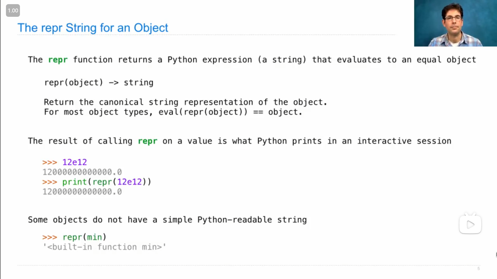

# Lecture 20 --- HW 05

## Lecture 20 Representation

### 1

{ loading=lazy }

`repr()` 函数能把python表达式转换成在自然语言中*规范*的字符串，

返回的字符串和在终端中使用交互式的python，输入表达式时显示的结果一样(即如上图，`12e12` 和 `print(repr(12e12))` 显示的一样)

{ loading=lazy }

`str()` (类)可以将对象转换成(其对应的)字符串(感觉有点类似于 c++ 中 左移运算符 `<<` 的重载)，这个字符串和 使用 `print` 函数 显示的结果是相应的(或者说使用 `print` 函数会隐式地调用 `__str__` 方法)

上图中可以看到 `repr()` 和 `str()` 的不同之处

### 2

`repr()` 和 `str()` 都是通过调用传入参数的方法来实现功能

`repr()` 会调用 `__repr__` 方法，

>   ```python
>   def repr(x):
>       return type(x).__repr__(x)
>   ```
>
>   使用类内方法可以避免在实例中修改了方法

`str()` 会调用 `__str__` 方法

>   如果没有 `__str__` 方法，则调用 `__repr__` 方法
>
>   ```python
>   def str(x):
>       t = type(x)
>       if hasattr(t, '__str__'):
>           return t.__str__(x)
>       else:
>           return t.__repr__(x)
>   ```

### 3

如果一个类没有 `__str__` 方法，在直接调用 `__str__` 方法时，会改为调用 `__repr__` 方法

>   ```python
>   class Bear:
>       """A Bear."""
>       
>       def __repr__(self):
>           return 'Bear()'
>       
>   oski = Bear()
>   print(oski)
>   print(str(oski))
>   print(repr(oski))
>   print(oski.__str__())
>   print(oski.__repr__())
>   ```
>
>   运行以上代码，会显示
>
>   ```bash
>   Bear()
>   Bear()
>   Bear()
>   Bear()
>   Bear()
>   ```

### 4

字符串可以使用 `.format()` 来填入参数(需要注意序号/下标与传入顺序对应)

```python
>>> x = 5
>>> y = 6
>>> "x + y = {0}".format(x + y)
'x + y = 11'
>>> "x + y = {1}".format(x + y, y)
'x + y = 6'
```

或者也可以使用

```python
>>> f"x + y = {x + y}"
'x + y = 11'
```

### 5

{ loading=lazy }

python的一些特殊方法名(前后都有两个下划线的方法)

### 6

{ loading=lazy }

`__add__` 方法是实例在加号左边时使用， `__radd__` 方法是实例在加号右边时使用，

>   John 直接添加了一行代码
>
>   ```python
>   __radd__ = __add__
>   ```

## Lecture 20 Q&A

### 1

{ loading=lazy }

`type` 和 `isinstance` 的区别

-   `isinstance` 会判断一个实例是否是某个类或它的子类们
-   `type` 只会返回实例具体的类

### 2

{ loading=lazy }

John 使用递归和 `yield` 语句来实现输出树的所有根到叶子的路径的方法

```python
def print_all_paths(t):
    """Print all the paths from the root to a leaf.
    
    >>> t = tree(1, [tree(2, [tree(3), tree(5)]), tree(4)])
    >>> print_all_paths(t)
    [1, 2, 3]
    [1, 2, 5]
    [1, 4]
    """
    for path in all_paths(t):
        print(path)

def all_paths(t):
    if is_leaf(t):
        yield [label(t)]
    for b in branches(t):
        for path in all_paths(b):   # path might be [2, 3]
            yield [label(t)] + path # yielding [1, 2, 3]
```

## Lecture 21 Composition

### 1

John 为自定义的 *链表 Linked List* 类 用递归的方式编写了类似于python内置的 `range` `map` `filter` 函数

{ loading=lazy }

>   ```python
>   class Link:
>       empty = ()
>       
>       def __init__(self, first, rest=empty):
>           assert rest is Link.empty or isinstance(rest, Link)
>           self.first = first
>           self.rest = rest
>           
>       def __repr__(self):
>           if self.rest:
>               rest_repr = ', ' + repr(self.rest)
>           else:
>               rest_repr = ''
>           return 'Link()' + repr(self.first) + rest_repr + ')'
>       
>       def __str__(self):
>           string = '<'
>           while self.rest is not Link.empty:
>               string += str(self.first) + ' '
>               slef = self.rest
>           return string + str(self.first) + '>'
>   ```

```python
def range_link(start, end):
    """Return a Link containing consecutive integers from start to end.
    
    >>> range_link(3, 6)
    Link(e, Link(4, Link(5)))
    """
    if start >= end:
        return Link.empty
    else:
        return Link(start, range_link(start + 1, end))
```

```python
def map_link(f, s):
    """Return a link that contains f(x) for each x in Link s.
    
    >>> map_link(square, range_link(3, 6))
    Link(9, Link(16, Link(25)))
    """
    if s is Link.empty:
        return s
    else:
        return Link(f(s.first), map_link(f, s.rest))
```

```python
def filter_link(f, s):
    """Return a Link that contains only the elements x of Link s for which f(x) is a true value.
    
    >>> filter_link(odd, range_link(3, 6))
    Link(3, Link(5))
    """
    if s is Link.empty:
        return s
    filtered_rest = filter_link(f, s.rest)
    if f(s.first):
        return Link(s.first, filtered_rest)
    else:
        return filtered_rest
```

### 2

{ loading=lazy }

John 用递归的方式写的 自定义链表结构 的 `add` 函数(让我觉得看起来很简洁)

```python
def add(s, v):
    """Add v to s, returning modified s.
    
    >>> s = Link(1, Link(3, Link(5)))
    >>> add(s, 0)
    Link(0, Link(1, Link(3, Link(5))))
    >>> add(s, 3)
    Link(0, Link(1, Link(3, Link(5))))
    >>> add(s, 4)
    Link(0, Link(1, Link(3, Link(4, Link(5)))))
    >>> add(s, 6)
    Link(0, Link(1, Link(3, Link(4, Link(5, Link(6))))))
    """
    assert s is not Link.empty
    if s.first > v:
        s.first, s.rest = v, Link(s.first, s.rest)
    elif s.first < v and empty(s.rest):
        s.rest = Link(v)
    elif s.first < v:
        add(s.rest, v)
    return s
```

### 3

John 展示的 `Tree` 类的实现代码

```python
class Tree:
    """A tree is a label and a list of branches."""
    def __init__(self, label, branches=[]):
        self.label = label
        for branch in branches:
            assert isinstance(branch, Tree)
        self.branches = list(branches)
        
    def __repr__(self):
        if self.branches:
            branch_str = ', ' + repr(self.branches)
        else:
            branch_str = ''
        return 'Tree({0}{1})'.format(repr(self.label), branch_str)
    
    def __str__(self):
        return '\n'.join(self.indented())
    
    def indented(self):
        lines = []
        for b in self.branches:
            for line in b.indented():
                lines.append('  ' + line)
        return [str(self.label)] + lines
    
    def is_leaf(self):
        return not self.branches
```

## HW 05

### 1

Q5 中，本来我以为

```python
return [t.label].extend([preorder(b) for b in t.branches])
```

能实现，但是显示没有返回的值，然后进行测试发现，**列表的 `.append()` 和 `.extend()` 方法没有返回值**

### 2

Q6，我的两种实现方式

-   按照原本提供的框架

::: details 代码
```python
def path_yielder(t, value):
    "*** YOUR CODE HERE ***"
    
    if t.label == value:
        yield [t.label]
    for b in t.branches:
        for path in path_yielder(b, value):
    
            "*** YOUR CODE HERE ***"
            yield [t.label] + path
```
:::
    
-   我整合成一行代码

::: details 代码
```python
def path_yielder(t, value):
    yield from (([[t.label]] if t.label == value else []) +
                sum([[[t.label] + path for path in path_yielder(b, value)] for b in t.branches], start=[]))
```
:::

### 3

Q3中，原本我是用递归的方式来实现，但是会稍微麻烦一些，

```python
def store_digits(n):
    if n // 10 == 0:
        return Link(n)
    else:
        pre_digits = store_digits(n // 10)
        last_digits = pre_digits
        while last_digits.rest != Link.empty:
            last_digits = last_digits.rest
        last_digits.rest = Link(n % 10)
        return pre_digits
```

然后在提示视频中看到助教老师说**一般链表会使用递归和迭代的方式来实现功能**，这题使用迭代比较方便，然后我将我的代码改成了用迭代来实现

::: details 代码
```python
def store_digits(n):
    link = Link(n % 10)
    while n // 10:
        n //= 10
        link = Link(n % 10, link)
    return link
```
:::
