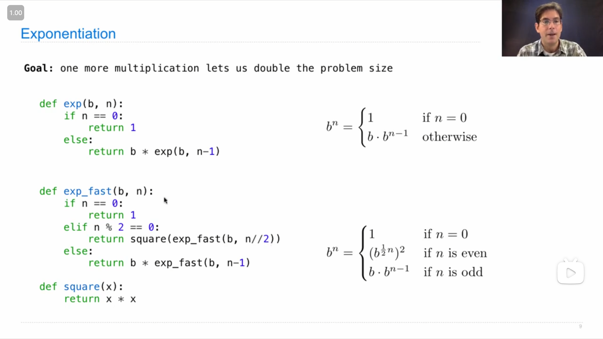
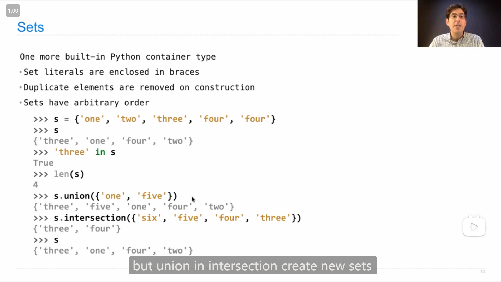
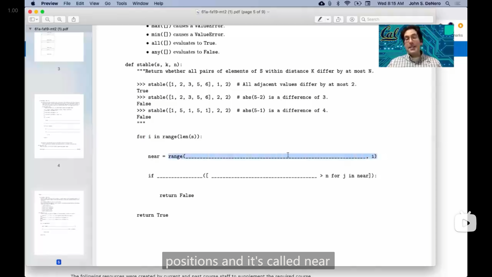
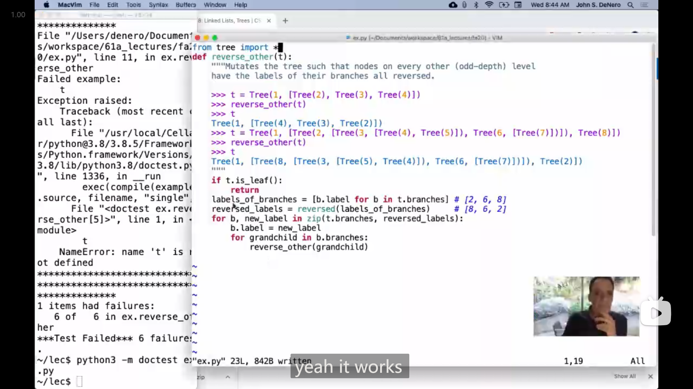
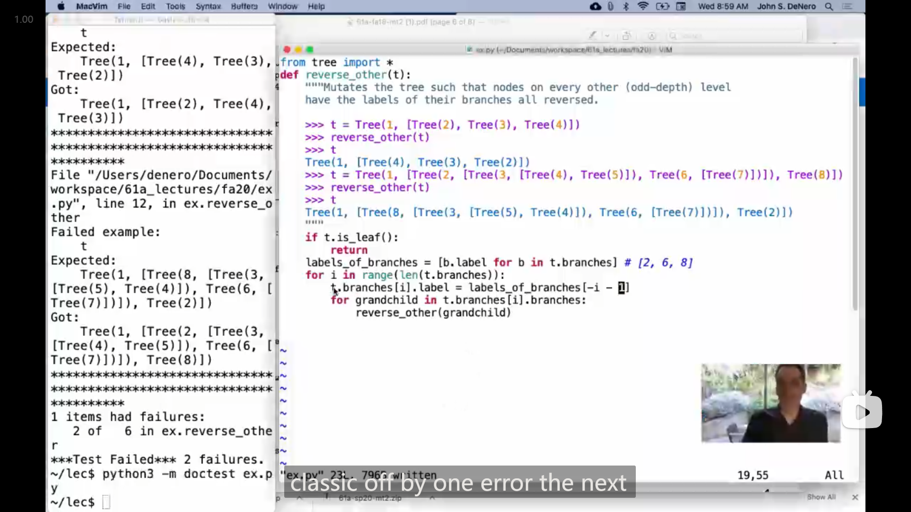

# Lecture 22 --- Lecture 23 Q&A

## Lecture 22 Efficiency

### 1

{ loading=lazy }

从John的demo演示中可以看到， `def` 定义出的函数似乎也可以像类一样拥有*属性 Attribute* (可以使用 `.` 来访问)

### 2

**函数内部的变量具体指向的对象 取决于 <mark>调用时</mark> 的情况**，

例如

```python
>>> def f(n):
...     return f(n-1) if n else n
...
>>> ori_f = f
>>> f = 6
>>> ori_f(4)
Traceback (most recent call last):
  File "<stdin>", line 1, in <module>
  File "<stdin>", line 2, in f
TypeError: 'int' object is not callable
>>>
```

在定义好 `f` 函数之后，将 `f` 修改为 `6` ，那么之后调用**原本的函数 `f`** 时，在进行递归调用(访问 `f` 变量)时，获取到的是整型 `6` ，所以会显示

```python
TypeError: 'int' object is not callable
```

所以，下面图中 John 演示的 demo 我觉得应该这样理解

{ loading=lazy }

```python
def fib(n):
    if n == 0 or n == 1:
        return n
    else:
        return fib(n-2) + fib(n-1)
    
def count(f):
    def counted(n):
        counted.call_count += 1
        return f(n)
    counted.call_count = 0
    return counted

def memo(f):
    cache = {}
    def memoized(n):
        if n not in cache:
            cache[n] = f(n)
        return cache[n]
    return memoized
```

-   第一步

    ```python
    >>> fib = count(fib)
    >>> counted_fib = fib
    ```

    将 `fib` 函数传入 `count` 函数中，获得 第一个 `counted` (与之后第二个 `counted` 作区分)

    ```mermaid
    flowchart LR
    变量名fib --> 第一个counted函数 --"f"--> fib函数
    counted_fib --> 第一个counted函数
    ```

-   第二步

    ```python
    >>> fib = memo(fib)
    ```

    这里 `fib` 指向的是 第一个 `counted` ，所以传入 `memo` 的是 第一个 `counted` ，

    然后获得 `memoized` 函数

    ```mermaid
    flowchart LR
    counted_fib --> 第一个counted函数 --"f"--> fib函数
    变量名fib --> memoized函数 --"f"--> 第一个counted函数
    ```

-   第三步

    ```python
    >>> fib = count(fib)
    ```

    和刚才类似，这里是将 `memoized` 函数传入 `count` ，然后获得 第二个 `counted` 函数

    ```mermaid
    flowchart LR
    counted_fib --> 第一个counted函数 --"f"--> fib函数
    memoized函数 --"f"--> 第一个counted函数
    变量名fib --> 第二个counted函数 --"f"--> memoized函数
    ```

-   而 `fib` 函数内部在递归时，会访问 变量名 `fib` ，所以关系可以进一步理解为

    ```mermaid
    flowchart LR
    变量名fib --> 第二个counted函数 --"f"--> memoized函数
    counted_fib --> 第一个counted函数 --"f"--> fib函数
    memoized函数 --"f"--> 第一个counted函数
    fib函数 -.-> 变量名fib
    ```

    所以，每次调用(原本的) `fib` 函数时，递归调用的是 第二个 `counted` 函数，并且由于是 *树形递归*，所以 第二个 `counted` 函数的 `call_count` 大约为 `n` (30)的两倍，

    而 第一个 `counted` 函数，只有 `memoized` 函数中传入未被记录结果的 `n` 时，才会被调用，因此 第一个 `counted` 函数 的 `call_count` 为 `31` ，刚好对应 0 到 30

### 3

{ loading=lazy }

John 给出了一种利用平方来加速 幂运算 的方法：

$$
b^n = \begin{cases}
1 & \mathrm{if} \ n = 0 \\
(b^{\frac{1}{2}n})^2 & \mathrm{if} \ n \ \mathrm{is \ even} \\
b \cdot b^{n-1} & \mathrm{if} \ n \ \mathrm{is \ odd} \\
\end{cases}
$$

```python
def exp(b, n):
    if n == 0:
        return 1
    elif n % 2 == 0:
        return square(exp(b, n // 2))
    else:
        return b * exp(b, n - 1)
    
def square(x):
    return x * x
```

### 4

John 展示了一下 Jupyter Notebook 的使用

::: info 引述
John:

...this environment is called a jupiter notebook, you can read about them online. it's a common way that people use in order to execute python code when the output is a graph or a chart.

---

John:

...这个环境被称为Jupyter笔记本，你可以在网上了解更多相关信息。这是人们在执行输出为图表或图表的Python代码时常用的一种方式。
:::

{ loading=lazy }

{ loading=lazy }

感觉用来画图会很方便

## Lab 08

### 1

Q5 的额外挑战 extra challenge，实现检测链表是否带有循环，但是只能使用固定大小的/恒定的空间

我一开始没想出来，第二天重新思考的时候，想到有循环就意味着会来到曾经来过的节点，那么就意味着 这个节点可以用比当前更少的步数从链表头到达，所以，我打算使用恒定空间来记录当前走过的步数，

最后成功实现了功能

::: details 代码
```python
def has_cycle_constant(link):
    head = link
    count = 0
    while link.rest:
        link = link.rest
        count += 1
        sublist = head
        for _ in range(count):
            if sublist is link:
                return True
            sublist = sublist.rest
    return False
```
:::

## Lecture 23 Decomposition

### 1

{ loading=lazy }

一个之前没怎么使用过的python的数据类型 **set** ，它的特性

-   只能包含不同的元素，如果创建时有多个相同的元素，则只会保留一个
-   元素的顺序是无序的
-   John介绍说，使用 `in` 语句查询某个元素是否在一个 set 中，所需的时间是常数级的，不会随着 set 的长度增长(像列表就会随着长度增长，是线性级的)
-   `.union()` 和 `.intersection()` 分别是 set 取**并集**和**交集**的方法，并且 John 说道，这两个方法并不会对原本的 set 进行修改，而是会创建出一个新的 set

## Lecture 23 Q&A

### 1

有人提问的一道考试题目

{ loading=lazy }

我感觉还蛮有意思，于是我就暂停尝试了一下

```python
def stable(s, k, n):
    """Return whether all pairs of elements of S within distance K differ by at most N.
    
    >>> stable([1, 2, 3, 5, 6], 1, 2)  # All adjacent values differ by at most 2.
    True
    >>> stable([1, 2, 3, 5, 6], 2, 2)  # abs(5-2) is a difference of 3.
    False
    >>> stable([1, 5, 1, 5, 1], 2, 2)  # abs(5-1) is a difference of 4.
    False
    """
    for i in range(len(s)):
        near = range(max(i - k, 0), i)
        if any([abs(s[j] - s[i]) > n for j in near]):
            return False
    return True
```

运行进行测试，成功通过

```bash
> python -m doctest -v .\test.py
Trying:
    stable([1, 2, 3, 5, 6], 1, 2)  # All adjacent values differ by at most 2.
Expecting:
    True
ok
Trying:
    stable([1, 2, 3, 5, 6], 2, 2)  # abs(5-2) is a difference of 3.
Expecting:
    False
ok
Trying:
    stable([1, 5, 1, 5, 1], 2, 2)  # abs(5-1) is a difference of 4.
Expecting:
    False
ok
1 items had no tests:
    test
1 items passed all tests:
   3 tests in test.stable
3 tests in 2 items.
3 passed and 0 failed.
Test passed.
```

### 2

{ loading=lazy }

::: info 引述
```python
"""A: (3 pts) Implement is_power, which takes a positive integer base and a
non-negative integer s. It returns whether s is power of base, meaning that there
is some non-negative integer n such that pow(base, n) equals s.

IMPORTANT: You may not call pow, use the ** operator, or import any function
(such as math.log). Your solution must be recursive.

Check the doctests with: python3 -q a
"""
def is_power(base, s):
    """Return whether s is a power of base.
    
    >>> is_power(5, 625)  # pow(5, 4) = 5 * 5 * 5 * 5 = 625
    True
    >>> is_power(5, 1)    # pow(5, 0) = 1
    True
    >>> is_power(5, 5)    # pow(5, 1) = 5
    True
    >>> is_power(5, 15)   # 15 is not a power of 5 (it's multiple)
    False
    >>> is_power(3, 9)
    True
    >>> is_power(3, 8)
    False
    >>> is_power(3, 10)
    False
    >>> is_power(1, 8)
    False
    >>> is_power(2, 0)    # 0 is not a power of any positive base.
    False
    
    >>> is_power(4, 16)
    True
    >>> is_power(4, 64)
    True
    >>> is_power(4, 63)
    False
    >>> is_power(4, 65)
    False
    >>> is_power(4, 32)
    False
    """
    assert base > 0 and s >= 0
    assert type(base) is int and type(s) is int
    if ______:
        return True
    elif ______:
        return False
    else:
        return ______


curry2 = lambda f: lambda x: lambda y: f(x, y)

"""B: (5 pts) Implement powers, a generator function which takes positive
integers n and k. It yields all integers m that are both powers of k and whose
digits appear in order in n.

Assume thar is_power is implemented correctly.

Note: powers may yield its results in any order. The doctests below check what
is yielded, but not the order. The built-in sorted funcion used in the doctests
takes in an iterable object and returns a list containing the elements of the
iterable in non-decreasing order.

Check the doctests with: python3 ok -q b"""
def powers(n, k):
    """Yield all powers of k whose digits appear in order in n.
    
    >>> sorted(powers(12345, 5))
    [1, 5, 25, 125]
    >>> sorted(powers(54321, 5))  # 25 and 125 are not in order
    [1, 5]
    >>> sorted(powers(2493, 3))
    [3, 9, 243]
    
    >>> sorted(powers(2493, 2))
    [2, 4]
    >>> sorted(powers(164352, 2))
    [1, 2, 4, 16, 32, 64]
    """
    def build(seed):
        """Yield all non-negetive integers whose digits appear in order in seed.
        0 is yielded because 0 has no digits, so all its digits are in seed.
        """
        if seed == 0:
            yield 0
        else:
            for x in ______:
                ______
                ______
    yield from filter(curry2(______)(______), build(n))
```
:::

有人提问的一道题目，我有点想尝试一下，

本来只是想做一下第二题/第二部分，但是看题目要求好像第二题需要用到第一题的函数，于是就连第一题一起做完了😂

```python
def is_power(base, s):
    """Return whether s is a power of base.
    
    >>> is_power(5, 625)  # pow(5, 4) = 5 * 5 * 5 * 5 = 625
    True
    >>> is_power(5, 1)    # pow(5, 0) = 1
    True
    >>> is_power(5, 5)    # pow(5, 1) = 5
    True
    >>> is_power(5, 15)   # 15 is not a power of 5 (it's multiple)
    False
    >>> is_power(3, 9)
    True
    >>> is_power(3, 8)
    False
    >>> is_power(3, 10)
    False
    >>> is_power(1, 8)
    False
    >>> is_power(2, 0)    # 0 is not a power of any positive base.
    False
    
    >>> is_power(4, 16)
    True
    >>> is_power(4, 64)
    True
    >>> is_power(4, 63)
    False
    >>> is_power(4, 65)
    False
    >>> is_power(4, 32)
    False
    """
    assert base > 0 and s >= 0
    assert type(base) is int and type(s) is int
    if s == 1:
        return True
    elif base == 0 or base == 1 or s == 0 or s % base != 0:
        return False
    else:
        return is_power(base, s // base)
    
    
curry2 = lambda f: lambda x: lambda y: f(x, y)

def powers(n, k):
    """Yield all powers of k whose digits appear in order in n.
    
    >>> sorted(powers(12345, 5))
    [1, 5, 25, 125]
    >>> sorted(powers(54321, 5))  # 25 and 125 are not in order
    [1, 5]
    >>> sorted(powers(2493, 3))
    [3, 9, 243]
    
    >>> sorted(powers(2493, 2))
    [2, 4]
    >>> sorted(powers(164352, 2))
    [1, 2, 4, 16, 32, 64]
    """
    def build(seed):
        """Yield all non-negetive integers whose digits appear in order in seed.
        0 is yielded because 0 has no digits, so all its digits are in seed.
        """
        if seed == 0:
            yield 0
        else:
            for x in build(seed // 10):
                yield x
                yield x * 10 + seed % 10
    yield from filter(curry2(is_power)(k), build(n))
```

### 3

{ loading=lazy }

John 提到了 lab 08 的 Q6 `reverse_other` 这题，基本的思路和之前我做的时候的思路感觉差不多，但是在具体处理上，我觉得老师的一些处理值得学习，

首先就是，用到了之前的练习中也有提到的 `zip` 函数，利用了 `zip` 感觉就比我之前的写法更加简洁，

然后是处理 **隔一层反转** 的操作上，是直接在子节点的循环中再次循环，就刚好能拿到 孙子节点，我之前的做法就稍微麻烦，还需要一个 `helper` 函数来辅助计数

{ loading=lazy }

John又展示了不使用 `zip` 的实现方法，而他这次利用了**负的下标**来实现翻转

```python
for i in range(len(t.branches)):
    t.branches[i].label = labels_of_branches[-i - 1]
    ...
```

### 4

有人提问，如果一个类继承自两个不同的类，那么它使用 `super` 时会怎样

::: info 引述
John:

so if you use super on a class that inherits from two different classes, what have you built, you built something very strange, but basically whay you've built is the same object except for, it's gonna not look up things is its class, it's gonna look at them up in one of the base classes, and which one, well, it looks at them in the order that you inherit, so if have a class that inherits from both b and c, it's gonna look in b first and then it's gonna look at c, to find the corresponding attribute that you're looking at.

---

John:

当你在一个从两个不同类继承的类上使用 super 时，你构建了一些非常奇怪的东西，但基本上你构建的是相同的对象，只是它不会在其类中查找属性，而是会在其中一个基类中查找。而具体是哪一个基类呢？它会按照你继承的顺序查找，所以如果有一个类同时继承自类B和类C，它会首先在B中查找，然后再在C中查找相应的属性。
:::
