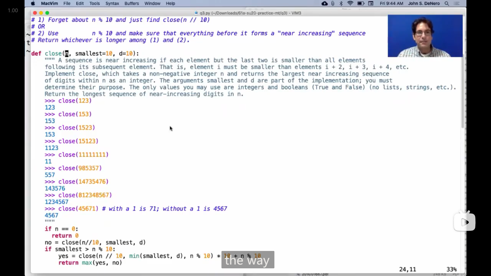

# Lecture 24 --- Lab 09

## Lecture 24 Data Example

### 1

{ loading=lazy }

尝试自己做了一下这四题，下面是我写的

```python
def indices_of_min_abs(s):
    """
    >>> indices_of_min_abs([-4, -3, -2, 3, 2, 4])
    [2, 4]
    >>> indices_of_min_abs([1, 2, 3, 4, 5])
    [0]
    """
    min_abs = min([abs(x) for x in s])
    return [i for i in range(len(s)) if abs(s[i]) == min_abs]

def largest_sum_of_adjacency(s):
    """
    >>> largest_sum_of_adjacency([-4, -3, -2, 3, 2, 4])
    6
    >>> largest_sum_of_adjacency([-4, 3, -2, -3, 2, -4])
    1
    """
    return max([s[i] + s[i + 1] for i in range(len(s) - 1)])

def map_digit_to_element(s):
    """
    >>> map_digit_to_element([5, 8, 13, 21, 34, 55, 89])
    {1: [21], 3: [13], 4: [34], 5: [5, 55], 8: [8], 9: [89]}
    """
    result = {}
    for x in s:
        d = x % 10
        if d not in result:
            result[d] = [x]
        else:
            result[d] += [x]
    return {d: result[d] for d in sorted(result)}

def every_element_has_equal_value(s):
    """
    >>> every_element_has_equal_value([-4, -3, -2, 3, 2, 4])
    False
    >>> every_element_has_equal_value([4, 3, 2, 3, 2, 4])
    True
    """
    for i in range(len(s)):
        if all([i == j or s[i] != s[j] for j in range(len(s))]):
            return False
    return True
```

---

在做第三个问题时，发现了如果 `sorted` 函数传入的是一个字典，那么会返回以键为元素排好序的列表

### 2

John 第一个问题中运用了 `map` 函数来获取 `min_abs` ，感觉比我的代码看起来更简洁些

```python
min_abs = min(map(abs, s))
```

John `return` 的那一行代码，提供了使用 `filter` 函数的另一种写法(由于 `filter` 返回的是一个迭代器，所以需要转换成列表)，

```python
return list(filter(lambda i: abs(s[i]) == min_abs, range(len(s))))
```

{ loading=lazy }

---

John 在第二个问题中又提供了第二种方法，利用 `zip` 函数，并且**利用切片来获取相邻元素**(感觉太强了😲，完全没想到能这样用 `zip` )

```python
return max([a + b for a, b in zip(s[:-1], s[1:])])
```

{ loading=lazy }

---

第三个问题 John 用了跟我的思路不同的另一种思路来实现

```python
return {d: [x for x in s if x % 10 == d] for d in range(10) if any([x % 10 == d for x in s])}
```

{ loading=lazy }

---

第四个问题，John 一开始的思路感觉感觉和我的差不多，但是也比我的代码要简洁，

```python
return all([s[i] in s[:i] + s[i + 1:] for i in range(len(s))])
```

但是 John 提供了第二种思路，**<mark>如果列表中有两个相同的数，那么意味着这个数的个数大于等于2</mark>**，

{ loading=lazy }

因此可以这样写

```python
return all([sum([1 for y in s if y == x]) > 1 for x in s])
```

而进一步，可以借助 `min` 来判断最小的结果大于 1 就可以了，

而然后，列表有一个 `.count()` 方法，计算某个元素的个数，因此得到(应该是)最简洁的写法(真给我看得全程惊呆了😲)

```python
return min([s.count(x) for x in s]) > 1
```

{ loading=lazy }

### 3

{ loading=lazy }

这里的第三和第四个问题感觉有点意思，第四个问题我一开始想没有想出来，最后看了 John 的编写才想明白

{ loading=lazy }

```python
def merge(s, t):
    """Return a sorted Link with the elements of sorted s & t.
    
    >>> a = Link(1, Link(5))
    >>> b = Link(1, Link(4))
    >>> merge(a, b)
    Link(1, Link(1, Link(4, Link(5))))
    >>> a
    Link(1, Link(5))
    >>> b
    Link(1, Link(4))
    """
    if s is Link.empty:
        return t
    elif t is Link.empty:
        return s
    elif s.first <= t.first:
        return Link(s.first, merge(s.rest, t))
    else:
        return Link(t.first, merge(s, t.rest))
    
def merge_in_place(s, t):
    """Return a sorted Link with the elements of sorted s & t.
    
    >>> a = Link(1, Link(5))
    >>> b = Link(1, Link(4))
    >>> merge(a, b)
    Link(1, Link(1, Link(4, Link(5))))
    >>> a
    Link(1, Link(1, Link(4, Link(5))))
    >>> b
    Link(1, Link(4, Link(5)))
    """
    if s is Link.empty:
        return t
    elif t is Link.empty:
        return s
    elif s.first <= t.first:
        # return Link(s.first, merge(s.rest, t))
        s.rest = merge_in_place(s.rest, t)
        return s
    else:
        # return Link(t.first, merge(s, t.rest))
        t.rest = merge_in_place(s, t.rest)
        return t
```

## Lecture 24 Q&A

### 1

提到的17春(第二次期中模拟考)的一个题目

::: info 引述
**Perfect Engine!**

You are in an apocalyptic society and have been charged with making an n-gen, or a generator that computes all of the n-perfect numbers. However, in this apocalyptic society, **built-in AND user-defined Python multiplication is forbidden** in any form!

You have a blueprint for building a few n-gins from a natural number generator:

```txt
A 2-gen:
1 2 3 4 5 6 7 8 9 ...
1 4 9 16 25 ...
```

```txt
A 3-gen:
1 2 3 4 5 6 7 8 9 ...
1 3 7 12 19 27 ...
1 8 27 ...
```

Hint: Here is how `yield from` works. When used inside an iterable `yield from` will issue each element from another iterable as though it was issued from the first iterable. The following code is equivalent:

```python
def generator1 ():
    for item in generator2 ():
        yield item
    # do more things in this generator
```

```python
def generator1 ():
    yield from generator2 ()
    # more things on this generator
```

Now its your job to build the perfect n-gen and power society out of the apocalypse! Good luck!

```python
def nats():
    """
    A generator that yields
    all natural numbers.
    Might be helpful!
    """
    curr = 0
    while True:
        curr += 1
        yield curr
        
def create_skip(n, gen):
    if n == 1:
        yield from ____________
    curr , skip = ________, ________
    for elem in ____________:
        if skip == n:
            ___________________
        else:
            curr = __________________
            skip = _________________
            yield _________________
        
def perfect_ngen(n):
    """
    >>> two_gen = perfect_ngen(2)
    >>> next(two_gen)
    1
    >>> next(two_gen)
    4
    >>> next(two_gen)
    9
    >>> three_gen = perfect_ngen(3)
    >>> next(three_gen)
    1
    >>> next(three_gen)
    8
    >>> next(three_gen)
    27
    """
    gen = create_skip(____, _______)
    while _________________:
        n = _________________
        gen = create_skip(____, _______)
    return gen
```
:::

感觉这题有点好玩，用到了一些数学上的结论，看了好一会才看懂题目，

大概是，要实现一个能返回 自然数的 n 次方生成器 的函数，而且不能使用乘法，

从给出的两个例子看，输出平方数列的方法是，将自然数列中的偶数(2的倍数)跳过，再将数列中之前的其他数加起来，和就刚好是平方，

而对于立方数列，与平方类似，先是将自然数列中 3的倍数跳过，然后将之前的其他数加起来，得到一个数列，再将这个数列再进行一次同样的操作(即跳过 3的倍数，取之前数的和，看到这里会发现 **自然数列中，3的倍数刚好间隔为3，而新数列中刚好间隔为2**，这一点会在给出的代码框架中被用上)，最后得到的数列就是立方数列(感觉好神奇😲)，

所以我就尝试了一下这个题目

```python
def nats():
    """
    A generator that yields
    all natural numbers.
    Might be helpful!
    """
    curr = 0
    while True:
        curr += 1
        yield curr
        
def create_skip(n, gen):
    if n == 1:
        yield from gen
    curr , skip = 0, 1
    for elem in gen:
        if skip == n:
            skip = 1
        else:
            curr = curr + elem
            skip = skip + 1
            yield curr
        
def perfect_ngen(n):
    """
    >>> two_gen = perfect_ngen(2)
    >>> next(two_gen)
    1
    >>> next(two_gen)
    4
    >>> next(two_gen)
    9
    >>> three_gen = perfect_ngen(3)
    >>> next(three_gen)
    1
    >>> next(three_gen)
    8
    >>> next(three_gen)
    27
    """
    gen = create_skip(n, nats())
    while n != 1:
        n = n - 1
        gen = create_skip(n, gen)
    return gen
```

{ loading=lazy }

### 2

{ loading=lazy }

::: info 引述
```python
def close(n, smallest=10, d=10):
    """ A sequence is near increasing if each element but the last two is smaller than all elements
    following its subsequent element. That is, element i must be smaller than elements i + 2, i + 3, i + 4 etc.
    Implement close, which takes a non-negative integer n and returns the largest near increasing sequence
    of digits within n as an integer. The arguments smallest and d are part of the implementation; you must
    determine their purpose. The only values you may use are integers and booleans (True and False) (no lists, strings, etc.).
    Return the longest sequence of near-increasing digits in n.
    >>> close(123)
    123
    >>> close(153)
    153
    >>> close(1523)
    153
    >>> close(15123)
    1123
    >>> close(11111111)
    11
    >>> close(985357)
    557
    >>> close(14735476)
    143576
    >>> close(812348567)
    1234567
    >>> close(45671) # with a 1 is 71; without a 1 is 4567
    4567
    """
    if n == 0:
        return 0
    no = close(n // 10, smallest, d)
    if smallest > ______:
        yes = ______
        return ______(yes, no)
    return ______
```
:::

这道题有点难想，一开始看完了 John 写出答案的整个过程但还是没想明白，

然后 John 换了一个简单的例子来讲解，实现获得最大的递增子序列函数

{ loading=lazy }

::: info 引述
John:

...let's let's solve a simpler one, more complicated than this, but less complicated than this, let's get rid of this notion of near increasing, and just, uh, look for the longest increasing sequence within n. we would need to keep track of some notion of what's the smallest thing i've done so far, um, so what does this do, return the sequence of digits within n, sorry, the largest sequence of digits within n that is increasing. so how might it work, if i call increasing on here's some digits, let's see what we got we could have two, then four, then seven and eight, that's pretty long try one more, uh we could have three four five six seven, that's pretty long. i didn't check too carefully but it's about right.

```python
def increasing(n, smallest=10):
    """Return the largest sequence of digits within n that is increasing.
    
    >>> increasing(87247861)
    2478
    >>> increasing(367456751)
    34567
    """
```

how will we do this one, if n equals zero, return zero. otherwise, if um the last digit of n is less than whatever is the smallest thing i've seen so far, then i might want to include it. so i'm going to just write this as, maybe i'll use n percent 10 in the result, or maybe not.

```python
def increasing(n, smallest=10):
    """Return the largest sequence of digits within n that is increasing.
    
    >>> increasing(87247861)
    2478
    >>> increasing(367456751)
    34567
    """
    if n == 0:
        return 0
    elif n % 10 < smallest:
        # Maybe I'll use n % 10 in the result or maybe not
    else:
```

if n if the last digit is not allowed because it's bigger, than something that i've already decided i'm going to use, then i just can't use it. so that means the best i can do, is find the biggest increasing number within n divided by 10. okay so now we're going to have this notion of no and yes. no says i ignore n percent ten.

```python
def increasing(n, smallest=10):
    """Return the largest sequence of digits within n that is increasing.
    
    >>> increasing(87247861)
    2478
    >>> increasing(367456751)
    34567
    """
    if n == 0:
        return 0
    elif n % 10 < smallest:
        # Maybe I'll use n % 10 in the result or maybe not
        no = increasing(n // 10)
        yes
    else:
        return increasing(n // 10)
```

this is the same as that, which is why this had kind of a funny structure, we'll talk about that later. it is important that when you're looking for the smallest thing within, and ignoring the last digit you still respect, how whatever digits you've decided to keep already along the way, so you have to pass in this notion of what's the smallest thing i've already decided to use. and then if you decide to use n percent 10, which is smaller than the smallest, now you can still find more digits, but they're not allowed to just be smaller than the smallest thing you had previously seen, now they have to be smaller than n percent 10. it turns out that this could be simplified, because we know that this is smaller than that, so i could trim this down, and i'd get the same result. but i'm going to leave it like this just so we can compare it with the other thing in a minute. and then here i would say, well, maybe i found the best thing without using this digit.

```python
def increasing(n, smallest=10):
    """Return the largest sequence of digits within n that is increasing.
    
    >>> increasing(87247861)
    2478
    >>> increasing(367456751)
    34567
    """
    if n == 0:
        return 0
    elif n % 10 < smallest:
        # Maybe I'll use n % 10 in the result or maybe not
        no = increasing(n // 10, smallest)
        yes = increasing(n // 10, min(n % 10, smallest)) * 10 + n % 10
        return max(no, yes)
    else:
        return increasing(n // 10, smallest)
```

...so uh so what now, if you can understand this, then you can eventually understand this, but i agree that like close is just a much, like a considerably more complicated version of increasing. so i would focus on understanding this first what's going on here. let's just look at the mechanics, we either use one or we don't, in the in the choice where we don't, we just kind of pretend it's not there, and then we either use six or we don't, and in the choice where we don't we just pretend it's not there, and then we either use eight or we don't, in the choice that we do now, we have to make sure that everything else that we choose from here is smaller than eight. so we're going to have eight in the end, but we make a recursive call, that is i want the longest increasing sequence within eight seven two four seven, you know everything that's left over, except for all of the digits there have to be smaller than eight, and that's how i got this number. so if that makes sense then look at the difference between this, and that the difference between this and that is that, like we're just tucking away the most recent digit, and we're gonna include it in this notion of smallest, one step later than we otherwise would. so you're allowed to ignore the five, when you're checking to make sure that one is small enough, because that's just the rules of how this works.

---

John:

...让我们解决一个更简单的问题，比这个复杂，但比这个简单，让我们摆脱近似递增的概念，只是寻找n中最长的递增序列。我们需要保持某种关于到目前为止我做过的最小的概念，那么这个函数是干什么的，返回n中递增的最大数字序列。所以它可能是怎么工作的，如果我在这里的一些数字上调用increasing，让我们看看我们得到了什么，我们可能有2，然后4，然后7和8，这很长，再试一次，我们可能有3，4，5，6，7，这也很长。我没有仔细检查，但大致是对的。

```python
def increasing(n, smallest=10):
    """Return the largest sequence of digits within n that is increasing.
    
    >>> increasing(87247861)
    2478
    >>> increasing(367456751)
    34567
    """
```

我们要如何解决这个问题，如果n等于零，返回零。否则，如果n的最后一位数字小于到目前为止我看到的最小值，那么我可能想要包含它。所以我将写成这样，也许我会在结果中使用n % 10，或者也许不会。

```python
def increasing(n, smallest=10):
    """Return the largest sequence of digits within n that is increasing.
    
    >>> increasing(87247861)
    2478
    >>> increasing(367456751)
    34567
    """
    if n == 0:
        return 0
    elif n % 10 < smallest:
        # Maybe I'll use n % 10 in the result or maybe not
    else:
```

如果n的最后一位不允许，因为它比我已经决定要使用的某个东西要大，那么我就不能使用它。所以这意味着我能做的最好的事情是，在n除以10的范围内找到最大的递增数。好的，现在我们将有no和yes的概念。no表示我忽略n除以10的余数。

```python
def increasing(n, smallest=10):
    """Return the largest sequence of digits within n that is increasing.
    
    >>> increasing(87247861)
    2478
    >>> increasing(367456751)
    34567
    """
    if n == 0:
        return 0
    elif n % 10 < smallest:
        # Maybe I'll use n % 10 in the result or maybe not
        no = increasing(n // 10)
        yes
    else:
        return increasing(n // 10)
```

这与那个相同，这就是为什么这个有点奇怪的结构，我们稍后会讨论的原因。在查找最小值时，忽略最后一位数字时，仍然要尊重沿途已经决定要保留的任何数字的规则，因此您必须传递这个已经决定使用的最小值的概念。然后，如果决定使用n % 10，这小于最小值，现在仍然可以找到更多的数字，但它们不能仅仅小于之前已经看到的最小值，现在它们必须小于n % 10。事实证明，这可以简化，因为我们知道这小于那，所以我可以缩短这个，然后得到相同的结果。但我会保留它，只是为了在一分钟内与另一种情况进行比较。然后在这里我会说，嗯，也许我已经找到了不使用这个数字的最好的结果。

```python
def increasing(n, smallest=10):
    """Return the largest sequence of digits within n that is increasing.
    
    >>> increasing(87247861)
    2478
    >>> increasing(367456751)
    34567
    """
    if n == 0:
        return 0
    elif n % 10 < smallest:
        # Maybe I'll use n % 10 in the result or maybe not
        no = increasing(n // 10, smallest)
        yes = increasing(n // 10, min(n % 10, smallest)) * 10 + n % 10
        return max(no, yes)
    else:
        return increasing(n // 10, smallest)
```

...所以，如果您能理解这一点，那么最终您就能理解这一点，但我同意close只是increasing的一个更复杂的版本。所以我建议先理解这个，这里发生了什么。让我们只看看机制，我们要么使用数字1，要么不使用，在我们不使用的选择中，我们只是假装它不存在，然后我们要么使用6，要么不使用，在我们不使用的选择中，我们只是假装它不存在，然后我们要么使用8，要么不使用，在我们使用的选择中，我们必须确保从这里选择的其他所有东西都小于8。所以最后我们会得到8，但是我们进行递归调用，也就是我要找到87247中最长的递增序列，你知道除了所有的数字之外，都必须小于8，这就是我得到这个数字的方式。所以如果这有意义，然后看看这个和那个之间的区别，这和那个之间的区别是，我们只是藏起了最近的数字，然后我们会在这个最小值的概念中包含它，比我们本来想的要晚一步。所以在检查1是否足够小时，您可以忽略5，因为这只是这个工作规则。
:::

所以，如果拿 `increasing` 的例子来理解，就是先判断 `n` 的个位是否比 之前(之前即当前数位右边的数位，可以通过递归的方式来理解)浏览/判断过的位数的最小值 小，小就意味着是可以构成递增序列/满足递增条件的，那么再分出是否使用这个位数的两种情况，如果打算使用，就将最小值更新( `min(n % 10, smallest)` ，但由于 `elif` 已经判断过了，确实也可以直接使用 `n % 10` )，如果不打算使用就不改变最小值。而如果不满足递增条件，就刚好跟不打算使用的情况一样。

理解了 `increasing` 再去理解 `close` 就会好理解很多，除了 `d` 几乎都一样，而 `d` 的作用就是为了让位数晚传一位(满足 near increasing 的要求)

### 3

{ loading=lazy }

John 提到了一种使用 *同时赋值 Simultaneous Assignment* 的特殊情况，

John 说到在使用*同时赋值*时，会先计算等号右边的结果，再**按顺序**赋值给左边的，所以在这一行代码中

```python
L.rest, L = L.rest.rest, L.rest.rest
```

会先将 `L.rest` 指向 `L.rest.rest` ，然后再将变量名 `L` 指向 `L.rest.rest` ，所以会有如下图的改变

-   "前"

    { loading=lazy }

-   "后"

    { loading=lazy }

先是含有 `1` 的节点的 `rest` 指向含有 `3` 的节点(即 `L.rest.rest` )，再是 `L` 指向含有 `3` 的节点

## Lab 09

### 1

Q3，做的时候想了好一会，做完之后我感觉蛮有意思的，

这一题和上一题Q2很像，但是需要判断是否是(非严格)升序，所以提供的框架是构建一个 `subseq_helper` 函数，来记录前一个数的大小，

-   如果当前的数比前一个数小，就可以直接忽略这个数
-   如果大于等于，就需要分情况，当前这个数是否被使用(感觉算是Q2的升级版)

::: details 代码
```python
def inc_subseqs(s):
    def subseq_helper(s, prev):
        if not s:
            return [[]]
        elif s[0] < prev:
            return subseq_helper(s[1:], prev)
        else:
            a = subseq_helper(s[1:], s[0])
            b = subseq_helper(s[1:], prev)
            return insert_into_all(s[0], a) + b
    return subseq_helper(s, 0)
```
:::

### 2

Q4 这题也有点意思，我想到的递归的思路就是，把大的树分成两个小的，

然后一开始是把两个小的加起来，然后错了，捋了一下，发现应该是把两个小的 结果/可能 相乘，最后就对了

::: details 代码
```python
def num_trees(n):
    if n == 1:
        return 1
    return sum([num_trees(i) * num_trees(n - i) for i in range(1, n)])
```
:::

### 3

Q5，有点难想感觉(但是做完以后感觉这题又不是很复杂😂)

>   一开始 `for` 语句里 `g` 之后没写 `()` ，然后就发生了报错😅
>
>   ```python
>   Traceback (most recent call last):
>     File "E:\Courses\cs61a\lab\lab09\lab09.py", line 121, in make_generators_generator
>       for _ in g:
>   TypeError: 'function' object is not iterable
>   ```
>
>   之后这样类似的要注意

::: details 代码
```python
def make_generators_generator(g):
    def gen(i):
        for e in g():
            if i == 0:
                break
            yield e
            i -= 1
    count = 0
    for _ in g():
        count += 1
        yield gen(count)
```
:::

### 4

Q12，感觉这题蛮有意思，定义了某种模板(可以从 doctest 中看出来)，感觉之后说不定能参考

```python
def make_to_string(front, mid, back, empty_repr):
    """ Returns a function that turns linked lists to strings.

    >>> kevins_to_string = make_to_string("[", "|-]-->", "", "[]")
    >>> jerrys_to_string = make_to_string("(", " . ", ")", "()")
    >>> lst = Link(1, Link(2, Link(3, Link(4))))
    >>> kevins_to_string(lst)
    '[1|-]-->[2|-]-->[3|-]-->[4|-]-->[]'
    >>> kevins_to_string(Link.empty)
    '[]'
    >>> jerrys_to_string(lst)
    '(1 . (2 . (3 . (4 . ()))))'
    >>> jerrys_to_string(Link.empty)
    '()'
    """
    def printer(lnk):
        if ______________:
            return _________________________
        else:
            return _________________________
    return printer
```

::: details 代码
```python
def make_to_string(front, mid, back, empty_repr):
    def printer(lnk):
        if lnk is Link.empty:
            return empty_repr
        else:
            return front + str(lnk.first) + mid + printer(lnk.rest) + back
    return printer
```
:::

### 5

Q13，给的代码框架感觉值得学习，而且一开始还没想明白要怎么编写😂

```python
def prune_small(t, n):
    while ___________________________:
        largest = max(_______________, key=____________________)
        _________________________
    for __ in _____________:
        ___________________
```

::: details 代码
```python
def prune_small(t, n):
    while len(t.branches) > n:
        largest = max([b for b in t.branches], key=lambda t: t.label)
        t.branches.remove(largest)
    for b in t.branches:
        prune_small(b, n)
```
:::
