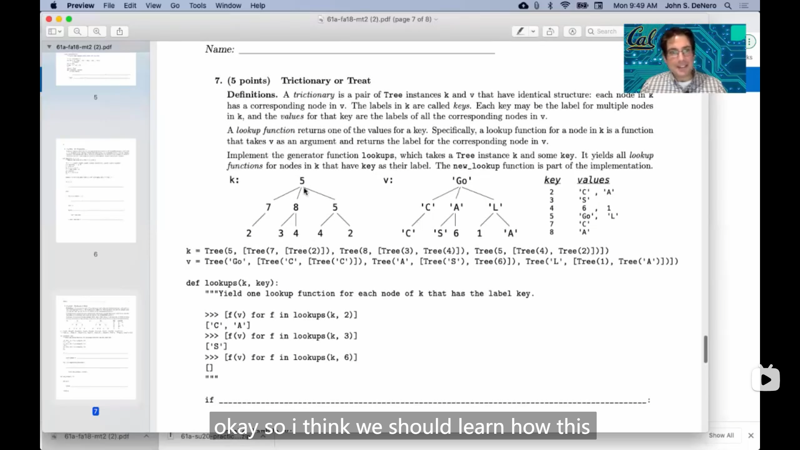

# Lecture 25 --- Lecture 25 Q&A

## Lecture 25 Users

### 1

::: info 引述
Alan Kay:

...We realized that was an incredibly important principle for user interface design. Why spend two weeks trying to read an MS-DOS manual to see how to copy a file or open up an application? What do you get from it? Much better to find a way of designing the user interface so that the person who uses it acts like an intermediate from the first time they sit down, and then they get into a process that is rewarding in itself.

---

Alan Kay:

...我们意识到这是界面设计中非常重要的原则。为什么要花两周的时间阅读MS-DOS手册，看如何复制文件或打开应用程序呢？从中得到了什么？更好的方法是设计用户界面，使使用者从第一次坐下来就像一个中间人，然后他们进入一个本身就是有益的过程。
:::

Alan Kay 借助一个实验，

>   让一个40多岁的大妈，通过简单的训练，短时间内上手网球的实验，
>
>   实验者通过教会这个大妈网球对打和发球的一些诀窍，而不是系统学习，来让她快速上手网球

提到了用户界面设计的一个重要的理念，用户界面应该要设计得能让用户快速学会并上手(而不是需要花大量的时间去查阅说明书来学习)，使用户感觉自己像一个 *中等水平的学生 intermediate* ，于是之后的学习就能得到积极的反馈(所以就会有兴趣去学习)

## Lecture 25 Q&A

### 1

提到的20春(第二次期中考试)的一题

{ loading=lazy }

::: info 引述
```python
"""This question involves plucking the leaves off a tree one by one.

Definitions:

1) A "number tree" is a Tree whose labels are _unique_ positive integers.
    No repeated labels appear in a number tree.
    
2) A "plucking order" for a number tree t is a sequence of unique positive
    integers that are all labels of t.
    
3) A plucking order is "valid" if both of these conditions are true:
    (a) the plucking order contains all labels of t, and
    (b) in the plucking order contains all labels of t, and
        the labels of all its descendant nodes. Thus, leaves appear first.
        
Note: redwood, pine, and cyprus are all kinds of trees.
"""

"""A: (3 pts) Implement order, which takes a number tree called rewood. It returns
a valid plucking order as a list of numbers. If there is more than one valid
plucking order for redwood, your order function can return any one of them.

IMPORTANT: You do not need to return EVERY valid plucking order; just one.

Check the doctests with: python3 ok -q a
"""
def order(redwood):
    """Return a list containing a valid plucking order for the labels of t.
    
    >>> order(Tree(1, [Tree(2, [Tree(3, [Tree(4)])])]))               # The only valid plucking order.
    [4, 3, 2, 1]
    >>> order(Tree(1, [Tree(2), Tree(3)])) in [[2, 3, 1], [3, 2, 1]]  # Therre are 2 valid orders.
    True
    >>> o = order(Tree(1, [Tree(2, [Tree(3)]), Tree(4, [Tree(5)])]))  # There are many valid orders,
    >>> o.index(5) < o.index(4)                                       # but all have 5 before 4,
    True
    >>> o.index(3) < o.index(2)                                       # and 3 before 2,
    True
    >>> o[4:]                                                         # and 1 at the end.
    [1]

    >>> order(Tree(7, [Tree(4, [Tree(6)]), Tree(5)])) in [[6, 5, 4, 7], [5, 6, 4, 7], [6, 4, 5, 7]]
    True
    """
    plucking_order = []
    for b in ______:
        ______
    return plucking_order + [redwood.label]


"""B: (5 pts) Implement pluck, which takes a number tree called pine and returns
a function that is called repeatedly on the elements of a plucking order. If that
plucking order is valid, the final call returns 'success!'. Otherwise, if one of
the repeated calls is on a number that is not part of a valid plucking order, the
error string 'Hey, not valid!' is returned.

Since pine is a number tree and the values passed to plucker form a plucking
order, you can assume that:
- The labels of pine are unique,
- All values k passed to the plucker function are unique for a given pine, and
- All values k are labels of pine.

Check the doctests with: python3 ok -q b
"""
def pluck(pine):
    """Return a function that returns whether a plucking order is valid
    for a number tree t when called repeatedly on elements of a plucking order.

    Calling the function returned by pluck should not mutate pine.

            +---+
            | 1 |
            +---+
            /   \----          /                 +---+         +---+
        | 2 |         | 6 |
        +---+         +---+
            |            /          |           /          +---+      +---+ +---+
        | 3 |      | 7 | | 8 |
        +---+      +---+ +---+
        / \               |
        /   \              |
    +---+ +---+         +---+
    | 4 | | 5 |         | 9 |
    +---+ +---+         +---+

    >>> b0 = Tree(2, [Tree(3, [Tree(4), Tree(5)])])
    >>> b1 = Tree(6, [Tree(7), Tree(8, [Tree(9)])])
    >>> t = Tree(1, [b0, b1])
    >>> pluck(t)(9)(8)(7)(6)(5)(4)(3)(2)(1)
    'success!'
    >>> pluck(t)(5)(9)(4)(7)(3)(8)(6)(2)(1)
    'success!'
    >>> pluck(t)(2)
    'Hey, not valid!'
    >>> pluck(t)(5)(9)(7)(6)
    'Hey, not valid!'

    >>> pluck(b0)(5)(2)
    'Hey, not valid!'
    >>> pluck(b0)(4)(5)(3)(2)
    'success!'
    """
    def plucker(k):
        def pluck_one_leaf(cyprus):
            """Return a copy of cyprus without leaf k and check that k is a
            leaf label, not an interior node label.
            """
            if ______:
                ______
            plucked_branches = []
            for b in cyprus.branches:
                skip_this_leaf = ______ and ______
                if not skip_this_leaf:
                    plucked_branch_or_error = pluck_one_leaf(b)
                    if isinstance(plucked_branch_or_error, str):
                        return plucked_branch_or_error
                    else:
                        ______
            return Tree(______, plucked_branches)
        nonlocal pine
        if pine.is_leaf():
            assert k == pine.label, 'all k must appear in pine'
            return 'success!'
        ______
        if isinstance(pine, str):
            return pine
        return plucker
    return plucker
```
:::

>   需要用到的 *树 Tree* 类
>
>   ```python
>   class Tree:
>       def __init__(self, label, branches=[]):
>           self.label = label
>           for branch in branches:
>               assert isinstance(branch, Tree)
>           self.branches = list(branches)
>           
>       def is_leaf(self):
>           return not self.branches
>   ```

于是尝试写了一下，

a题十分地简单

```python
def order(redwood):
        plucking_order = []
    for b in redwood.branches:
        plucking_order += order(b)
    return plucking_order + [redwood.label]
```

b题有点难度，但是照着框架去分析思考，最终也不难做出来

```python
def pluck(pine):
    def plucker(k):
        def pluck_one_leaf(cyprus):
            """Return a copy of cyprus without leaf k and check that k is a
            leaf label, not an interior node label.
            """
            if k == cyprus.label and not cyprus.is_leaf():
                return "Hey, not valid!"
            plucked_branches = []
            for b in cyprus.branches:
                skip_this_leaf = b.is_leaf() and b.label == k
                if not skip_this_leaf:
                    plucked_branch_or_error = pluck_one_leaf(b)
                    if isinstance(plucked_branch_or_error, str):
                        return plucked_branch_or_error
                    else:
                        plucked_branches += [plucked_branch_or_error]
            return Tree(cyprus.label, plucked_branches)
        nonlocal pine
        if pine.is_leaf():
            assert k == pine.label, 'all k must appear in pine'
            return 'success!'
        pine = pluck_one_leaf(pine)
        if isinstance(pine, str):
            return pine
        return plucker
    return plucker
```

### 2

提到了18秋第二次期中考试的一题

{ loading=lazy }

::: info 引述
**Trictionary or Treat**

**Definition.** A *trictionary* is a pair of `Tree` instances `k` and `v` that have identical structure: each node in `k` has a corresponding node in `v` . The labels in `k` are called *keys*. Each key may be the label for multiple nodes in `k` , and the *values* for that key are the labels of all the corresponding nodes in `v` .

A *lookup function* returns one of the values for a key. Specifically, a lookup function for a node in `k` is a function that takes `v` as an argument and returns the label for the corresponding node in `v` .

Implement the generator function `lookups` , which takes a `Tree` instance `k` and some `key` . It yields all *lookup functions* for nodes in `k` that have `key` as their label. The `new_lookup` function is part of the implementation.

-   `k` :

    ```txt
            5
            / | \
        7   8   5
        /   / |  / \
    2    3  4  4  2 
    ```

-   `v` :

    ```txt
            'Go'
            / | \
        'C' 'A' 'L'
        /   / |  / \
    'C'  'S' 6  1 'A' 
    ```

| <u>*key*</u> | <u>*values*</u> |
| ------------ | --------------- |
| 2            | 'C', 'A'        |
| 3            | 'S'             |
| 4            | 6, 1            |
| 5            | 'Go', 'L'       |
| 7            | 'C'             |
| 8            | 'A'             |

```python
k = Tree(5, [Tree(7, [Tree(2)]), Tree(8, [Tree(3), Tree(4)]), Tree(5, [Tree(4), Tree(2)])])
v = Tree('Go', [Tree('C', [Tree('C')]), Tree('A', [Tree('S'), Tree(6)]), Tree('L', [Tree(1), Tree('A')])])

def lookups(k, key):
    """Yield one lookup function for each node of k that has the label key.
    
    >>> [f(v) for f in lookups(k, 2)]
    ['c', 'A']
    >>> [f(v) for f in lookups(k, 3)]
    ['S']
    >>> [f(v) for f in lookups(k, 6)]
    []
    """
    if ______:
        yield lambda v: ______
    for i in range(len(k.branches)):
        ______:
            yield new_lookup(i, lookup)
        
def new_lookup(i, f):
    def g(v):
        return ______
    return g
```
:::

这题有点难度，首先使理解题目的意思，`lookups` 是需要生成能返回在(输入的) 树 `v` 中对应位置的值的函数。

题目给的框架也不是很容易看懂，我先是看到 `yield new_lookup(i, lookup)` 这行(看到 `lookup` )，所以猜上面一行是

```python
for lookup in lookups(k.branches[i], key):
```

这一行应该是用来递归，所以进而就很容易想到上面的 `if` 语句是 **base case** 即走到了叶子节点，于是，在最简单的情况下，就直接判断 树 `k` 的值和 `key` 是否相等就行了，所以

```python 
if k.is_leaf() and k.label == key:
    return lambda v: v.label
```

最后是 `new_lookup` 的部分(想了一会才想出来)，看到 `i` 所以想到 `i` 是用来传递路径相关的信息的(重点是需要理解传入的 `lookup` ，是子树的查找函数，所以 `new_lookup` 中需要的也是传入对应 `v` 的子树)，因此

```python
return f(v.branches[i])
```

>   完整代码
>
>   ```python
>   def lookups(k, key):
>       if k.is_leaf() and k.label == key:
>           yield lambda v: v.label
>       for i in range(len(k.branches)):
>           for lookup in lookups(k.branches[i], key):
>               yield new_lookup(i, lookup)
>           
>   def new_lookup(i, f):
>       def g(v):
>           return f(v.branches[i])
>       return g
>   ```

---

看了John的讲解，发现 `if` 那一行正确答案应该没有 `k.is_leaf()` ，上面的代码能通过只是因为刚好测试的值都在叶子节点，所以正确的代码应该是

```python
def lookups(k, key):
    if k.label == key:
        yield lambda v: v.label
    for i in range(len(k.branches)):
        for lookup in lookups(k.branches[i], key):
            yield new_lookup(i, lookup)
        
def new_lookup(i, f):
    def g(v):
        return f(v.branches[i])
    return g
```

{ loading=lazy }
