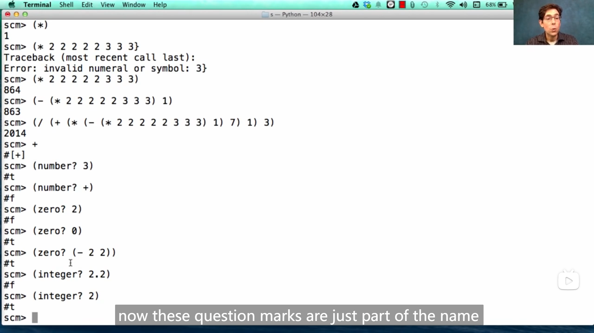
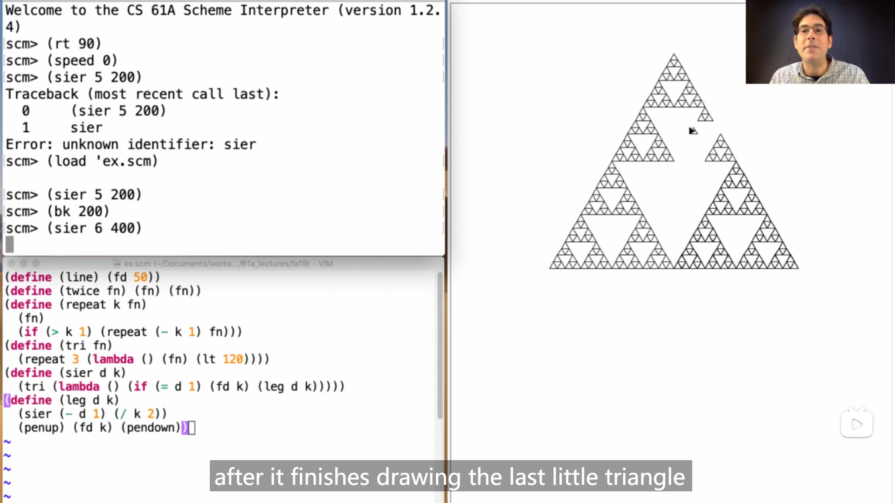
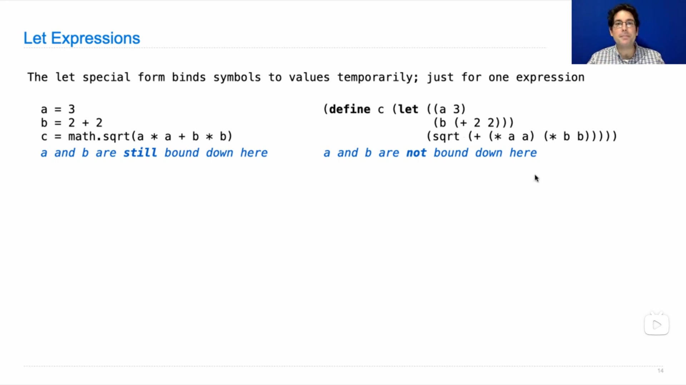
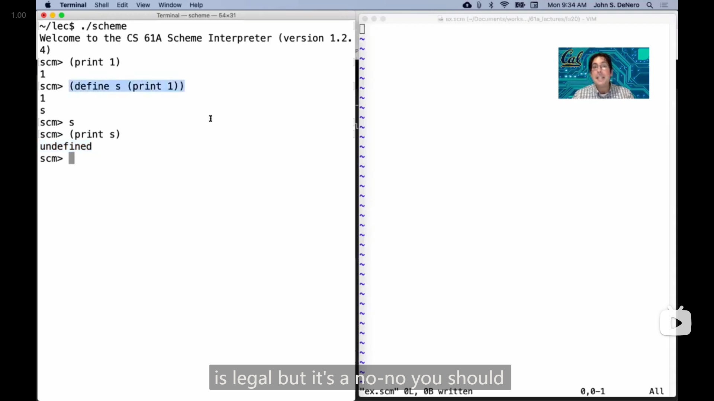
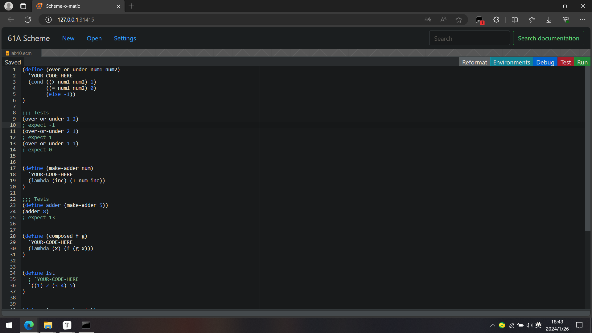

# Lecture 26 --- HW 06

## Lecture 26 Ethical AI & Data

### 1

{ loading=lazy }

Hany 在介绍 *监督学习 supervised learning* 时，提到了**线性**处理二维数据一种方法，通过找到一个投影面(线)，使得在投影面上，同类之间距离尽可能小，而异类之间的距离尽可能大，于是通过其法线就可以获得分割线

### 2

Hany在这节课的最后关于AI的使用的看法，我认为说的很好

::: info 引述
Hany:

...We just seem to be stuck at around 65% (accuracy).

Okay, I posit I cannot prove, but I posit: I think that this is a fundamentally hard problem, and I am unconvinced that you can actually do better than this. Because think about what you're asking the algorithm to do. You're asking it to predict the future from a relatively small amount of data, and the future, two years in advance, of a fairly complex set of social, economic, personal, and just what is random dumb luck going to happen in somebody's life. And I don't think that's a stretch of imagination to say that this is really hard.

So here's a question for you: should we even be doing this? Should we actually be trying to predict whether somebody's going to commit a crime in the future and then incarcerate them if we think that they are, if the accuracy is 65%? What if the accuracy is 75%? What if it's 85%? What if it's you? What if it's somebody you love? Do you want this algorithm being applied to somebody with this kind of error rate? What's an acceptable error rate? Are these things really better than humans? How do you deal with the bias? Nobody has good answers to these things.

So here's a question. Now I come back to the title. right? Just because you can do something doesn't mean you should. And as you enter into what is undoubtedly an incredibly exciting time for us in terms of computation and AI and data, and the impact that we can have on the world, we have to start thinking about what are the negative aspects of what we are doing. Should we be trying to make these decisions? And if we do, the answer may be yes, but then are they accurate? Are they fair? Do they disproportionately affect women, people of color, LGBTQ community, people who are not born in this country, people who aren't native speakers, whatever it is? We have to think about the consequences of that.

We have spent the last 20 years with the mantra of "move fast and break things," and while lots of good things have come from that, some really bad things have come from this. Bias in algorithms for hiring, bias in algorithms in healthcare, bias in algorithms in the financial sectors, bias in algorithms in the criminal justice system, bias in facial recognition. We've got to tread lightly here. And what that means is you can't come at this after the fact. You can't develop, deploy, and then debug on the fly. This isn't a word processing software. If you have a bug, somebody loses a document. This is the real world where you make a mistake and somebody sits in jail, or somebody doesn't get a home loan, or somebody doesn't get a small business loan, or somebody doesn't get a job or go to the university. We are impacting real people's lives with our algorithms and our data, and if we don't understand these things, we have the potential to do way more harm than we do good.

And so the free-for-all of the last two decades, in my opinion, should be over. And I want to emphasize that I am not anti-technology. I'm not saying don't do things. I'm not saying don't innovate. But I'm saying think, think carefully about the consequences of what you are doing and make sure that there is transparency, there is fairness, and there is accuracy in how these technologies are being used. And more generally, making sure that you understand how your technologies can be misused as well because almost all technologies have benefits and drawbacks, and we have to start thinking about those things up front and simply try to mitigate the harm while harnessing the phenomenal power of technology and AI and data.

All right, I'm done. I hope you enjoyed this and I hope you learned something from it. We'll see you soon.

---

Hany:

...我们似乎卡在了65%左右（准确率）。

好的，我假设我不能证明，但我假设：我认为这是一个基本上的难题，我不相信你能做得比这更好。因为想想你要算法做什么。你让它从相对较少的数据中预测未来，未来是两年后，涉及到一组相当复杂的社会、经济、个人因素，还有在某人生活中会发生的随机运气。我认为这并不是一种夸张，说这真的很难。

那么这里有一个问题给你：我们甚至应该这样做吗？我们真的应该尝试预测某人将来是否会犯罪，然后如果我们认为他们会犯罪就监禁他们，即使准确率是65%吗？如果准确率是75%怎么办？如果是85%呢？如果是你呢？如果是你爱的人呢？你希望这种算法应用于有这种错误率的人吗？什么是可以接受的错误率？这些东西真的比人类更好吗？如何处理偏见？没有人对这些问题有好的答案。

所以这里有一个问题。现在我回到标题，对吧？仅仅因为你能做某事并不意味着你应该这样做。当你进入计算、人工智能和数据方面无疑是一个非常激动人心的时刻，以及我们可以对世界产生的影响时，我们必须开始思考我们正在做的事情的负面方面。我们应该尝试做这些决定吗？如果是，答案可能是肯定的，但它们是否准确？是否公平？它们是否对女性、有色人种、LGBTQ社区、不在这个国家出生的人、不是本土说话者的人等产生不成比例的影响？我们必须考虑这些后果。

在过去的20年里，我们一直奉行“迅速行动并打破一切”的口号，虽然从中获得了很多好处，但也从中产生了一些非常糟糕的事情。在招聘算法中存在的偏见，在医疗保健领域的算法中存在的偏见，在金融领域的算法中存在的偏见，在刑事司法系统的算法中存在的偏见，在面部识别中存在的偏见。我们必须小心行事。这意味着你不能在事后就这么做。你不能开发、部署，然后在飞行中调试。这不是文字处理软件。如果有一个错误，某人就会丢失一份文件。这是真实的世界，你犯了一个错误，有人坐在监狱里，或者有人没有获得房屋贷款，或者有人没有获得小额贷款，或者有人没有得到工作或上大学。我们正在影响真实人们的生活，用我们的算法和数据，如果我们不理解这些事情，我们可能会造成比做好事更多的伤害。

因此，在我看来，过去20年的放任态度应该结束了。我想强调的是，我并不是反对技术。我并不是说不要做事情。我并不是说不要创新。但我说的是要考虑，要仔细考虑你正在做的事情的后果，并确保在使用这些技术的方式上有透明度、公平性和准确性。更一般地说，确保你了解你的技术如何被滥用，因为几乎所有技术都有利弊，我们必须开始从一开始就考虑这些事情，尽力减轻伤害，同时利用技术和人工智能和数据的巨大力量。

好了，我说完了。希望你喜欢这个，希望你从中学到了一些东西。我们很快就会见面。
:::

## Lecture 27 Scheme

### 1

{ loading=lazy }

感觉 scheme 这个表达式有点像逆波兰式😂

---

{ loading=lazy }

scheme 语言里的一些用法(看John的demo应该就可以看懂了)

---

{ loading=lazy }

scheme 中的一些语句

>   John 说到 scheme 使用的 *环境模型 model of environments* 和 python 的一样

### 2

{ loading=lazy }

John 演示scheme中的嵌套函数时，构造了一个求平方根的递归函数，

```scheme
(define (sqrt x)
  (define (update guess)
    (if (= (square guess) x)
        guess
        (update (average guess (/ x guess)))))
  (update 1))
```

> 翻译成 python 应该大致是这样
>
> ```python
> def sqrt(x):
>  def update(guess):
>      if guess ^ 2 == x:
>          return guess
>      else:
>          return update((x // guess + guess) // 2)
>  return update(1)
> ```

并且其中使用了
$$
guess = \frac{x}{guess} + guess
$$
的迭代方法，感觉很厉害

---

询问了同学之后，发现这就是(以前学过的)对勾函数，最后收敛于 $\sqrt{x}$ 😂

### 3

{ loading=lazy }

scheme中的 lambda 匿名函数(类比 python 中的很好理解)

### 4

{ loading=lazy }

John 演示用 scheme 画 *谢尔宾斯基三角形 Sierpinski's Triangle* ，

用递归的方式画，每个大的三角形(的三条边)由(三个)小的三角形组成，因此

```scheme
(define (repeat k fn)
  (fn)
  (if (> k 1) (repeat (- k 1) fn)))
(define (tri fn)
  (repeat 3 (lambda () (fn) (lt 120))))
(define (sier d k)
  (tri (lambda () (if (= d 1) (fd k) (leg d k)))))
(define (leg d k)
  (sier (- d 1) (/ k 2))
  (penup) (fd k) (pendown))
```

代码大概是 `sier` 和 `leg` 相互调用的递归，

翻译成 python 大致是这样

```python
def repeat(k, fn):
    fn()
    if k > 1:
        repeat(k - 1, fn)

def tri(fn):
    repeat(3, lambda: fn() and turn_left(120))

def sier(d, k):
    tri(lambda: (move_forward(k) if d == 1 else leg(d, k)))

def leg(d, k):
    sier(d - 1, k // 2)
    pen_up()
    move_forward(k)
    pen_down()
```

>   其中 `turn_left` `move_forward` `pen_up` `pen_down` 
>
>   分别对应 scheme 中的内置函数 `lr` `fd` `penup` `pendown`

### 5

{ loading=lazy }

`cond` 语句，可以类比 `if-elif-else` 语句，而且，可以理解为这个语句也可以返回值，所以可以像图中右上一样写

`begin` 语句，将多个语句合成一个( `begin` )语句

---

{ loading=lazy }

`let` 可以在其中定义临时的变量，格式是 `(let ((a 1) (b 2) ...) (...))` ，`let` 后第一个括号内是若干个定义临时变量的 *对 part* ，第二个括号是要执行的语句或者要返回的值

### 6

{ loading=lazy }

scheme 中 链表 list 相关内容

### 7

{ loading=lazy }

***引用 quotation*** (感觉似乎理解了 c++ 中的引用)，可以将**符号本身**传入到表达式中

>   Special form to indicate that the expression itself is the value.
>
>   表示表达式本身就是值的特殊形式。

```scheme
scm> '(+ a b)
(+ a b)
scm> '(zero? a)
(zero? a)
```

也可以是在表达式前加 单引号 `'` ，那么表达式中的符号都会以*引用*的形式使用

---

John 的demo演示

```scheme
scm> '(1 2)
(1 2)
scm> '(1 a)
(1 a)
scm> (list 1 'a)
(1 a)
scm> (list 1 a)
Traceback (most recent call last):
  0     (list 1 a)
  1     a
Error: unknown identifier: a
```

::: info 引述
John:

When quoting a list, you get a list, but all the expressions within it are quoted as well.

...I can't evaluate a until I've define it, but I can refer to a before I've defined it, because it's just a symbol. It could mean something in the future, it just hasn't been defined yet.

---

John:

引用列表时，你会得到一个列表，但其中的所有表达式也会被引用。

...在定义a之前，我无法评估它，但在定义之前，我可以参考a，因为它只是一个符号。它可能在未来有意义，只是还没有定义。
:::

### 8

{ loading=lazy }

scheme 的内置函数 `eval` 可以计算引用形式的表达式(可见于上图) (感觉可以理解为 反向引用，或者说 解引用)

### 9

John 关于符号表达式的演示(看起来感觉很厉害😲)

{ loading=lazy }

>   ```scheme
>   (define (fact n)
>     (if (= n 1) 1 (* n (fact (- n 1)))))
>   
>   (define (fact-exp n)
>     (if (= n 1) 1 (list '* n (fact-exp (- n 1)))))
>   ```

{ loading=lazy }

>   ```scheme
>   (define (fib n)
>     (if (<= n 1) n (+ (fib (- n 2)) (fib (- n 1)))))
>   
>   (define (fib-exp n)
>     (if (<= n 1) n (list '+ (fib-exp (- n 2)) (fib-exp (- n 1)))))
>   ```

### 10

{ loading=lazy }

*准引用 quasiquotation* ，可以被**中断**的引用

反引号 <code>\`</code> 的引用效果可以被 逗号 `,` 中断，即 `,` 后的括号以及更里面的括号取消引用效果，而其他地方还是有引用效果

```scheme
scm> `(a ,(+) b)
(a 0 b)
scm> `(a (+) b)
(a (+) b)
```

### 11

John 关于 *准引用 quasiquotation* 引用的演示，

用*准引用*构造了类似于 `while` 的(某种程度上)通用的循环结构(给我看傻了😲)

{ loading=lazy }

>   **分号 `;` 表示注释**

我的理解是，如果 `begin` 中的 `condition` `add-to-total` 等不加逗号 `,` 的话，返回的表达式中会直接就是 `condition` `add-to-total` 等**这些符号本身**，而加了逗号 `,` 之后，最后的表达式就会是 在使用 `sum-while` 时 具体传入的值，因此在使用 `sum-while` 时应该传入的是引用形式的表达式(即如 John 演示的一样，`(sum-while 1 '(< (* x x) 50) 'x '(+ x 1))` )

>   ```scheme
>   (define (sum-while initial-x condition       add-to-total update-x)
>     ;     (sum-while 1         '(< (* x x) 50) 'x           '(+ x 1))
>     `(begin
>        (define (f x total)
>          (if ,condition
>            (f ,update-x (+ total ,add-to-total))
>            total))
>        (f ,initial-x 0)))
>   ```

## Lecture 27  Q&A

### 1

{ loading=lazy }

有人向提问到 scheme 中的 `print` 的返回值是什么，于是 John 开始演示

```scheme
scm> (define s (print 1))
1
s
scm> s
scm> print(s)
undefined
```

John之后解释道，scheme 中的 `undefined` 和 python 中的 `None` 类似，但也有区别， `None` 还会用于一些比较，但 `undefined` 基本上不会被使用

::: info 引述
John:

Well, we get this special value called "undefined." That's it. It's kind of close to Python's "None," except for here's the rule. This is more of a conventional rule than enforced by the language, but here's the rule: you're never supposed to do anything with the undefined value.

Whereas in Python, people use "None" for all kinds of stuff. They compare whether something is "None," etc. That basically never shows up in Scheme code. So when you get this undefined value, which happens to exist, the idea is you should never do anything with it. You should never check to see if it's equal to another undefined. You should never check to see how many undefineds there are in a list or something like that. You should just stop.

So basically, like this expression is legal, but it's a no-no. You should never take the value of "print" and do something else with it.

---

John:

嗯，我们有这个特殊的值叫做 "undefined"。就是这样，它有点类似于 Python 的 "None"，除了这里有一个规则。这更像是一种约定俗成的规则，而不是语言强制的，但这就是规则：你永远不应该对 "undefined" 值做任何事情。

而在 Python 中，人们用 "None" 来处理各种事情。他们比较某个东西是否为 "None" 等等。这基本上在 Scheme 代码中几乎不会出现。所以当你得到这个存在的 "undefined" 值时，理念是你不应该对它做任何事情。你不应该检查它是否等于另一个 "undefined"，你不应该检查列表中有多少个 "undefined" 等等。你应该停止。

所以基本上，像这个表达式是合法的，但是是不推荐的。你永远不应该获取 "print" 的值然后用它做其他事情。
:::

### 2

{ loading=lazy }

有人问道 scheme 中有没有与 python 中 `non local` 类似的操作，

于是 John 演示了使用 `set!` 的一种方式

```scheme
(define (make-withdraw balance)
  (define (withdraw amount)
    (set! balance (- balance amount))
    balance)
  withdraw)
```

### 3

{ loading=lazy }

John 提到 scheme 中的 `=` 和 `equal?`

::: info 引述
John:

So anyway, there's a bunch of different equals, and no, I don't think you need to know the difference between all of them. But if you want to know, like this ( `eq?` ), it is like `is` . This ( `=` ) is like nothing that exists in Python because it only works for numbers.

This ( `equal?` ) is a lot like the equal sign. Yeah, in Python, I think that just like this will check, okay, so yeah, this ( `equal?` ) will check whether two things are generally equal, just like in Python, 2 equals 2 is true, and also a list containing 2 and a list containing 2 is true. So, um, yeah, this ( `equal?` ) is usually the one you want.

But if you want to check for "is", it looks like that ( `eq?` ), and this ( `=` ) is some like weird thing that only works with numbers.

---

John:

总之，有很多不同的等号，我不认为你需要了解它们之间的区别。但是如果你想知道，比如这个( `eq?` )，就像 `is` 。这个( `=` )在Python中并不存在，因为它只适用于数字。

这个( `equal?` )很像等号。是的，在Python中，我认为就像这个会检查，好的，所以是的，这个( `equal?` )将检查两个东西是否大致相等，就像在Python中，2等于2是真的，还有一个包含2的列表和一个包含2的列表也是真的。所以，嗯，这个( `equal?` )通常是你想要的。

但是如果你想检查“is”，它看起来像这样( `eq?` )，而这个( `=` )是一些奇怪的东西，只对数字起作用。
:::

## Lab 10

### 1

指导网页上有写如何使用提供的 scheme 解释器以及编辑器

::: info 引述
**Scheme**

Scheme is a famous functional programming language from the 1970s. It is a dialect of Lisp (which stands for LISt Processing). The first observation most people make is the unique syntax, which uses a prefix notation and (often many) nested parentheses (see http://xkcd.com/297/). Scheme features first-class functions and optimized tail-recursion, which were relatively new features at the time.

>   Our course uses a custom version of Scheme (which you will build for Project 4) included in the starter ZIP archive. To start the interpreter, type `python3 scheme`. To run a Scheme program interactively, type `python3 scheme -i <file.scm>`. To exit the Scheme interpreter, type `(exit)`.

You may find it useful to try [code.cs61a.org/scheme](https://code.cs61a.org/scheme) when working through problems, as it can draw environment and box-and-pointer diagrams and it lets you walk your code step-by-step (similar to Python Tutor). Don't forget to submit your code through Ok though!

**Scheme Editor**

As you're writing your code, you can debug using the Scheme Editor. In your `scheme` folder you will find a new editor. To run this editor, run `python3 editor`. This should pop up a window in your browser; if it does not, please navigate to [localhost:31415](localhost:31415) and you should see it.

Make sure to run `python3 ok` in a separate tab or window so that the editor keeps running.

If you find that your code works in the online editor but not in your own interpreter, it's possible you have a bug in code from an earlier part that you'll have to track down. Every once in a while there's a bug that our tests don't catch, and if you find one you should let us know!
:::

运行

```bash
python ./scheme [-i <file.scm>]
```

打开 scheme 解释器，以及加载文件并打开。

运行

```bash
python editor
```

打开 scheme 编辑器，在线编辑和测试(网址在 [http://127.0.0.1:31415](http://127.0.0.1:31415))

{ loading=lazy }

### 2

Q5中，需要将 `'YOUR-CODE-HERE` 这一行注释掉或者删去，否则会有如下报错

```scheme
Traceback (most recent call last):
  0     (define lst (quote your-code-here) 1)
Error: too many operands in form
```

### 3

Q6 中，本来以为很简单，一开始递归的 base case 是用 `(= lst nil)` 来判断，但是报错了

```bash
Error: operand 0 (()) is not a number
```

大概应该指的是， `lst` 和 `nil` 不是数，所以不能用 `=` 比较。

最后在在线终端解释器中，摸索了好一会，发现了一个函数 `length` ，能返回*链表*的长度，于是将判断条件改成

```scheme
(zero? (length lst))
```

最终解决

::: details 代码
```scheme
(define (remove item lst)
    'YOUR-CODE-HERE
    (if (zero? (length lst))
        nil
        (if (= item (car lst))
            (remove item (cdr lst))
            (cons (car lst) (remove item (cdr lst)))))
)
```
:::

---

之后发现其实还可以用 `equal?` (或 `eq?` )函数，

```scheme
scm> (equal? () nil)
#t
scm> (equal? '() nil)
#t
```

---

写到 hw07 时发现，其实这题提示中说的 `filter-lst` 函数其实想说的是 `filter` ，之前输入 `filter-lst` 显示没有这个函数，

用上 `filter` 函数答案就会变得非常简单

```scheme
(define (remove item lst)
  'YOUR-CODE-HERE
  (filter (lambda (x) (not (= x item))) lst)
)
```

## HW 06

### 1

Q3中，在处理奇数情况时，一开始我写的是

```scheme
(* x (square (pow x (/ y 2))))
```

但是在跑第一个测试用例时，

```scheme
(pow 2 5)
```

显示递归溢出了

```bash
# Error: expected
#     32
# but got
#     Traceback (most recent call last):
#       ...
#     RecursionError: maximum recursion depth exceeded in __instancecheck__
```

猜测是因为除法的问题，于是去测试了一下，发现 `/` 不是整除

```scheme
scm> (/ 5 2)
2.5
scm> (/ 4 2)
2
```

于是将基数情况的代码修改成了

```scheme
(* x (square (pow x (/ (- y 1) 2))))
```

::: details 代码
```scheme
(define (pow x y)
    'YOUR-CODE-HERE
    (if (= y 1)
        x
        (if (even? y)
            (square (pow x (/ y 2)))
            (* x (square (pow x (/ (- y 1) 2))))))
)
```
:::
