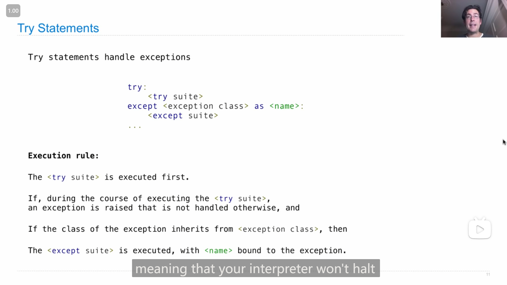
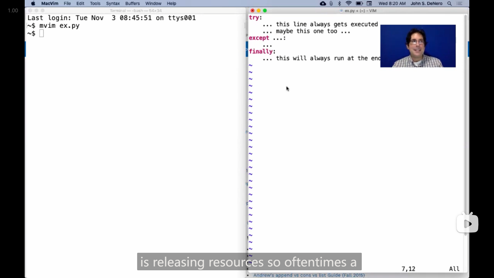
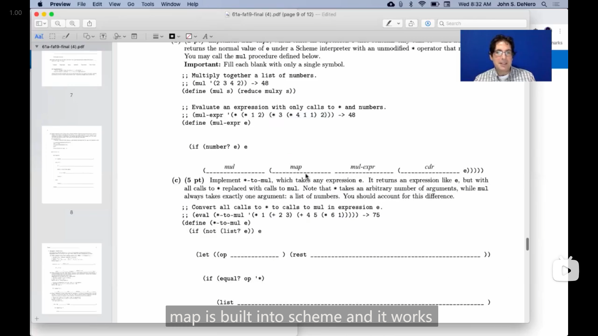
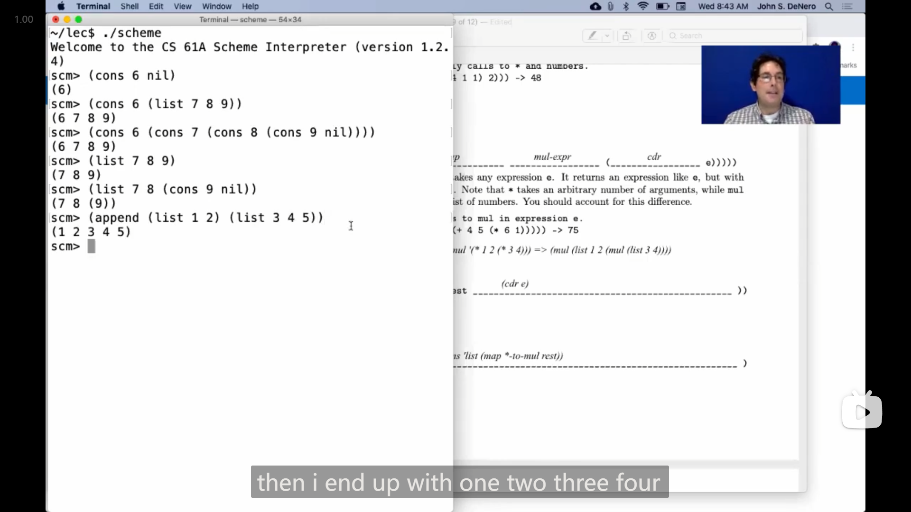
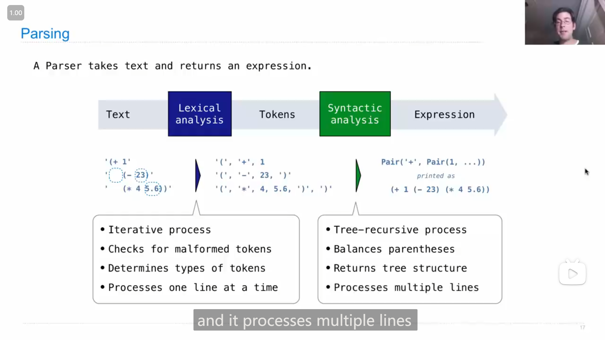
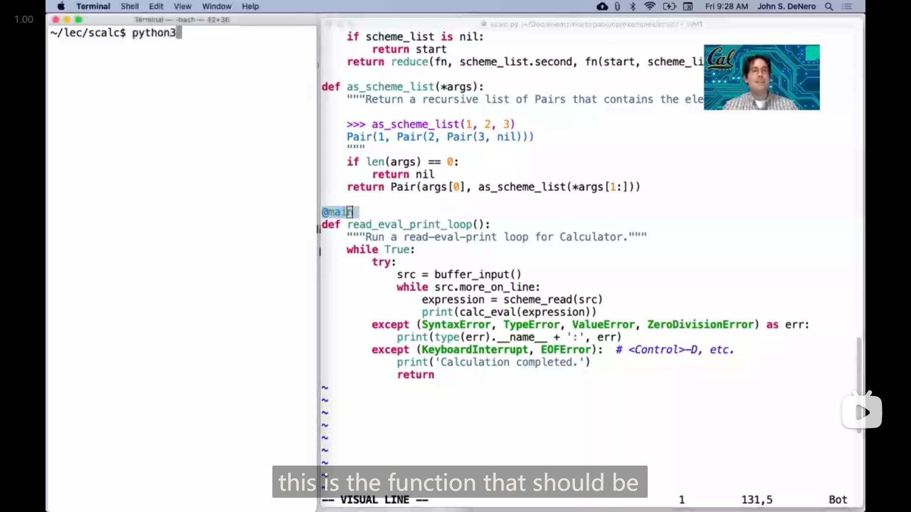

# Lecture 28 --- Lab 11

## Lecture 28 Exception

### 1

{ loading=lazy }

在运行 `py` 文件时，可以使用 `-O` 选项来忽略 `assert` 语句来提高程序执行效率

```bash
python -O
```

---

{ loading=lazy }

`__debug__` 可以查看 `assert` 语句是否会被执行

```bash
C:\Users\Ronald>python
Python 3.10.9 (tags/v3.10.9:1dd9be6, Dec  6 2022, 19:43:38) [MSC v.1934 32 bit (Intel)] on win32
Type "help", "copyright", "credits" or "license" for more information.
>>> __debug__
True
>>> ^Z


C:\Users\Ronald>python -O
Python 3.10.9 (tags/v3.10.9:1dd9be6, Dec  6 2022, 19:43:38) [MSC v.1934 32 bit (Intel)] on win32
Type "help", "copyright", "credits" or "license" for more information.
>>> __debug__
False
>>>
```

### 2

{ loading=lazy }

*引发错误 raise error*

`raise` 后的表达式必须是 `BaseException` 的实例或者它的子类，

如上图，John 还介绍了中*错误*类型

---

John 的 demo 演示

{ loading=lazy }

### 3

{ loading=lazy }

`try` 语句的用法，如果在执行 `try` 之后的代码中引起了错误，并且错误是 `except` 后 `<exception class>` 的子类时，就会执行 `except` 中的语句(如果没有引起错误就不会执行)

John的demo演示

{ loading=lazy }

### 4

{ loading=lazy }

John提到了一个 `reduce` 函数(python没内置，scheme内置了)，在之后的demo演示中，分别用迭代和递归实现了 `reduce`

-   迭代
    
    ```python
    def reduce(f, s, initial):
        """Combine elements of s using f starting with initial.
        
        >>> reduce(mul, [2, 4, 8], 1)
        64
        >>> reduce(add, [1, 2, 3, 4], 0)
        10
        """
        for x in s:
            initial = f(initial, x)
        return initial
    ```

-   递归
    
    ```python
    def reduce(f, s, initial):
        """Combine elements of s using f starting with initial.
        
        >>> reduce(mul, [2, 4, 8], 1)
        64
        >>> reduce(add, [1, 2, 3, 4], 0)
        10
        """
        if not s:
            return initial
        else:
            first, rest = s[0], s[1:]
            return reduce(f, rest, f(initial, first))
    ```

## Lecture 28 Q&A

### 1

{ loading=lazy }

`try` 语句结构中的 `finally` 语句，

`finally` 中的代码无论 `try` 中是否引发错误最终都会被执行(从图上 John 的演示中可以看到)，所以 `finally` 中一般用来释放资源释放内存(如关闭在 `try` 中加载的文件，或者断开网络连接)

### 2

有人提问 `try` 中引发的错误是否存在于 `global` 框架中，John 进行演示

```python
>>> try:
...     1/0
... except ZeroDivisionError as n:
...     print("n is", n)
...
n is division by zero
>>> n
Traceback (most recent call last):
  File "<stdin>", line 1, in <module>
Nameerror: name 'n' is not defined
```

随后 John 又展示了一下错误实例

```python
def return_an_error():
    try:
        1/0
    except ZeroDivisionError as n:
        print("n is", n)
        return n
```

```python
>>> e = return_an_error()
n is division by zero
>>> e
ZeroDivisionError('division by zero')
>>> str(e)
'division by zero'
>>> repr(e)
"ZeroDivisionError('division by zero')"
>>> isinstance(e, Exception)
True
>>> isinstance(e, ZeroDivisionError)
True
```

### 3

有人提问19年秋季期末考试的这一题

::: info 引述
**Mull It Over**

*Uh oh!* Someone evaluated `(define * +)` . Now `(* 3 2)` evaluates to 5 instead of 6! Let's fix it.

**Important**: Answer all questions on this page without calling the built-in multiplication procedure.

**(a)** Implement `mulxy` , which multiplies integers `x` and `y` . **Hint**: `(- 2)` evaluates to -2.

```scheme
;; multiply x by y (without using the * operator).
;; (mulxy 3 4) -> 12           ; 12 = 3 + 3 + 3 + 3
;; (mulxy (- 3) (- 4)) -> 12   ; 12 = - ( -3 + -3 + -3 + -3 )
(define (mulxy x y)
    (cond ((< y 0) (- ______ ))
        ((= y 0) 0)
        (else ( ______ x (mulxy x ______)))))
```

**(b)** Implement `mul-expr` , which takes an expression `e` that contains only calls to `*` and numbers. It returns the normal value of `e` under a Scheme interpreter with an unmodified `*` operator that multiplies.

You may call the `mul` procedure defined below.

**Important**: Fill each blank with only a single symbol.

```scheme
;; Multiply together a list of numbers.
;; (mul '(2 3 4 2)) -> 48
(define (mul s) (reduce mulxy s))

;; Evaluate an expression with only calls to * and numbers.
;; (mul-expr '(* (* 1 2) (* 3 (* 4 1 1) 2))) -> 48
(define (mul-expr e)
    (if (number? e) e
        (______ (______ ______ (______ e)))))
```

**(c)** Implement `*-to-mul` , which takes any expression `e` . It returns an expression like `e` , but with all calls to `*` replaced with calls to `mul` . Note that `*` takes an arbitrary number of arguments, while `mul` always takes exactly one argument: a list of numbers. You should account for this difference.

```scheme
;; Convert all calls to * to calls to mul in expression e.
;; (eval (*-to-mul '(* 1 (+ 2 3) (+ 4 5 (* 6 1))))) -> 75
(define (*-to-mul e)
    (if (not (list? e)) e
        (let ((op ______ ) (rest ______))
        (if (equal? op '*)
            (list ______)
            (cons op rest)))))
```
:::

我先尝试自己做了一下，

第一题很简单

```scheme
(define (mulxy x y)
  (cond ((< y 0) (- (mulxy x (- y))))
        ((= y 0) 0)
        (else (+ x (mulxy x (- y 1))))))
```

第二题由于每一个空只能填一个 symbol，想了很久没想到可行的填法，感觉应该是需要使用一些特殊的函数。

John 使用了scheme内置的 `map` 函数

{ loading=lazy }

scheme 中的 `map` 和 python 中的 `map` 效果差不多，都是传入一个函数和一个链表/序列，然后将函数应用到每一个元素上，

因此

```scheme
(define (mul-expr e)
  (if (number? e) e
      (mul (map mul-expr (cdr e)))))
```

第三题也比较难，先是根据我的理解写出了

```scheme
(define (*-to-mul e)
  (if (not (list? e)) e
      (let ((op (car e)) (rest (map *-to-mul (cdr e))))
        (if (equal? op '*)
            (list ______)
            (cons op rest)))))
```

`(list ______)` 这一行，一开始尝试 `(list mul rest)` ，但是测试时显示

```scheme
scm> (eval (*-to-mul '(* 1 (+ 2 3) (+ 4 5 (* 6 1)))))
Traceback (most recent call last):
  0     (eval (*-to-mul (quote (* 1 (+ 2 3) (+ 4 5 (* 6 1))))))
  1     ((lambda (s) (reduce mulxy s)) (1 (+ 2 3) (+ 4 5 ((lambda (s) (reduce mulxy s)) (6 1)))))
  2     (lambda (s) (reduce mulxy s))
Error: malformed list: (lambda (s) (reduce mulxy s))
scm> (*-to-mul '(* 1 (+ 2 3) (+ 4 5 (* 6 1))))
((lambda (s) (reduce mulxy s)) (1 (+ 2 3) (+ 4 5 ((lambda (s) (reduce mulxy s)) (6 1)))))
```

然后我意识到，应该把 `mul` 改成 `'mul` ，因为**需要返回的是一个表达式，表达式中的符号和函数应该是引用的形式**，

修改成 `(list 'mul rest)` 之后，测试显示

```scheme
scm> (eval (*-to-mul '(* 1 (+ 2 3) (+ 4 5 (* 6 1)))))
Traceback (most recent call last):
  0     (eval (*-to-mul (quote (* 1 (+ 2 3) (+ 4 5 (* 6 1))))))
  1     (mul (1 (+ 2 3) (+ 4 5 (mul (6 1)))))
  2     (1 (+ 2 3) (+ 4 5 (mul (6 1))))
Error: int is not callable: 1
```

>   本来看到上面的
>
>   ```scheme
>   ;; (mul '(2 3 4 2)) -> 48
>   ```
>
>   将代码尝试改成了
>
>   ```scheme
>   (list 'mul ('quote rest))
>   ```
>
>   但是测试时显示
>
>   ```scheme
>   Traceback (most recent call last):
>     ...   ...
>     4     (list (quote mul) ((quote quote) rest))
>     5     ((quote quote) rest)
>   Error: str is not callable: quote
>   ```

最后想不出答案。

{ loading=lazy }

John 利用一个例子来进行讲解，

```scheme
(*-to-mul '(* 1 2 (* 3 4)))
```

**应该得到的是**(感觉我之前做的时候是没想到这个关键的地方)

```scheme
(mul (list 1 2 (mul (list 3 4))))
```

>   Hany 期间问道为什么不是 `(mul (1 2 (mul (3 4))))`
>
>   John 说 因为 `1` 不是可调用的，如果这样写**就会调用 `1`**

所以最后正确的答案是(John 的代码有一些问题，递归应该发生在定义 `rest` 的时候(否则如果第一个是 `+` 就会不发生替换))

```scheme
(define (*-to-mul e)
  (if (not (list? e)) e
      (let ((op (car e)) (rest (map *-to-mul (cdr e))))
        (if (equal? op '*)
            (list 'mul (cons 'list rest))
            (cons op rest)))))
```

(这题是真的难想😱)

### 4

::: info 引述
John:

You can think of a list as built from a bunch of `cons` . `cons` is like the most fundamental operation, and what it does is it just adds one element to the beginning of an existing list.

---

John:

你可以将列表看作是由一堆 `cons` 构建而成的。 `cons` 就像是最基本的操作，它的作用是在现有列表的开头添加一个元素。
:::

我觉得 John 这个对 `cons` 函数的解释很好，把 `cons` 理解成 **一个在现有列表开头插入新元素的函数** 就更方便

### 5

{ loading=lazy }

John 又提到了scheme中的 `append` 函数，能将两个链表合并到一起

## Lecture 29 Calculater

### 1

John 讲解 *解析 parse* 一个语言的语句的过程

{ loading=lazy }

### 2

{ loading=lazy }

scheme 中的减法和除法稍微特殊一些，如果只有一个参数，就直接取相反数或者倒数，如果有多个参数，就是拿第一个去减或除之后剩余的数

### 3

用 python 实现 scheme 中(适用于数学运算表达式的) `eval` 函数

{ loading=lazy }

### 4

{ loading=lazy }

***交互式解释器 interactive interpreter* 的工作流程 *读取-求值-输出循环 Read-Eval-Print Loop (REPL)*** 

- 从用户的文本输入中读取
- 将文本 *解析 parse* 为表达式
- 计算表达式
- 如果发生错误，报告错误
- 输出表达式计算结果的值，并重复上述过程

### 5

John 说到 *交互式解释器 interactive interpreter* 不能因为程序的错误就中断整个程序，所以需要进行 exception 的处理

::: info 引述
John:

...So, an interactive interpreter should print information about each error. So that when those errors occur, the programmer who generated them can figure out what to change in order to get rid of the error. And a well-designed interactive interpreter should never really halt; it should stop evaluating the current expression and print out the arrow, but then give the programmer a chance to revise what they've done. So, the user should have the opportunity to try again in the current environment, instead of having the whole program crash. And that's exactly what happens here.

So, as you can see, I'm able to continue entering expressions. The only way I can quit out of this game calculator is by pressing in my system control "d," which says this is the end of the file. Then it will say, "Calculation is complete," and finally, the program will end.

Now, how do we control for all this? Well, we put both the parsing and evaluation within a `try` statement,

```python
@main
def read_eval_print_loop():
    """Run a read-eval-print loop for Calculator."""
    while True:
        try:
            src = buffer_input()
            while src.more_on_line:
                expression = scheme_read(src)
                print(calc_eval(expression))
        except (SyntaxError, TypeError, ValueError, ZeroDivisionError) as err:
            print(type(err).__name__ + ':', err)
        except (KeyboardInterrupt, EOFError):  # <Control>-D, etc.
            print('Calculation completed.')
            return
```

that knows to look for syntax, type, value, and zero division errors – all the things that can occur, and just prints those errors out. And then, since this is all embedded within the suite of a `while` statement, we'll go back and try again. So, the only way to stop is to reach the end of a file or a keyboard interrupt, at which point it will print "Calculation is complete."

---

John:

因此，交互式解释器应该打印有关每个错误的信息，以便当这些错误发生时，生成它们的程序员能够弄清楚要更改什么以消除错误。一个设计良好的交互式解释器实际上不应该停止；它应该停止评估当前表达式并打印出箭头，然后给程序员一个机会来修改他们所做的事情。因此，用户应该有机会在当前环境中再次尝试，而不是使整个程序崩溃。这正是这里发生的情况。

所以，正如你所见，我能够继续输入表达式。退出这个游戏计算器的唯一方法是按下我的系统控制 “d”，这表示这是文件的结尾。然后它将显示 “Calculation is complete”，最后程序将结束。

现在，我们如何控制所有这些呢？嗯，我们将解析和评估都放在一个 `try` 语句中， 

```python
@main
def read_eval_print_loop():
    """Run a read-eval-print loop for Calculator."""
    while True:
        try:
            src = buffer_input()
            while src.more_on_line:
                expression = scheme_read(src)
                print(calc_eval(expression))
        except (SyntaxError, TypeError, ValueError, ZeroDivisionError) as err:
            print(type(err).__name__ + ':', err)
        except (KeyboardInterrupt, EOFError):  # <Control>-D, etc.
            print('Calculation completed.')
            return
```

该语句知道如何查找语法、类型、值和零除错误，即所有可能发生的事情，并只是打印出这些错误。然后，由于所有这些都嵌套在一个 `while` 语句的套件中，我们将回到并尝试再次执行。因此，唯一停止的方式是到达文件的末尾或键盘中断，此时它将打印 “Calculation is complete”。
:::

## Lecture 29 Q&A

### 1

{ loading=lazy }

有人提问道(python)代码中的 `@main` 有什么作用，

::: info 引述
John:

...Yeah, so this main decorator is something that's specific to 61a. It just says if you run the file, this is the function that should be called. So if I run the whole `scalc.py` file, it's not going to call as scheme list instead, it's going to call `read_eval_print_loop` .

---

John:

...是的，所以这个主装饰器是61a特有的东西。它只是说，如果你运行文件，这就是应该调用的函数。因此，如果我运行整个 `scalc.py` 文件，它不会调用scheme-list，而是调用 `read_eval_print_loop` 。
:::

这个和

```python 
if __name__ = '__main__':
    ...
```

有点像，不过封装成函数再加上 `@main` 还有一点好处就是还可以再次进行调用

## HW 07

### 1

在 Q1 的题目说明中提到了 `filter` 函数，跟这题要实现的 `filter-lst` 用法一样(用于链表上)，也是需要一个 *谓词 predicate* (传入一个参数然后返回真假的函数) 和一个链表，然后就会筛选出为真的元素

```scheme
scm> (define (x y) (> y 1))
x
scm> (filter x '(1 2 3 4 5))
(2 3 4 5)
```

>   这题要求实现的函数叫做 `filter-lst` ，所以有可能 `filter` 函数还可以作用于其他的数据类型

---

::: details 代码
```scheme
(define (filter-lst fn lst)
    'YOUR-CODE-HERE
    (if (eq? lst nil)
        nil
        (if (fn (car lst))
            (cons (car lst) (filter-lst fn (cdr lst)))
            (filter-lst fn (cdr lst))))
)
```
:::

### 2

Q4 这题有点难(主要是一直想用python中的 `in` 而scheme中用不了😅)，

最后写出来主要是题目中提示可以使用第一题中实现的 `filter-lst` 函数，然后我又猜测还是需要使用递归来实现，那么**传入 `filter-lst` 函数的链表应该就是 `(cdr lst)`** ，

进而， `filter-lst` 筛出来的链表应该还要递归地放入 `no-repeats` 中，最后再加上 base case 就成功实现了

::: details 代码
```scheme
(define (no-repeats lst)
    'YOUR-CODE-HERE
    (if (equal? lst nil)
        nil
        (cons (car lst)
            (no-repeats (filter-lst (lambda (x) (not (= x (car lst))))
                                    (cdr lst)))))
)
```
:::

## Lab 11

### 1

Q3这题需要把题目意思理解清楚， `CallExpr` 实例中的 `operator` 和 `operands` 相当于变量名，需要调用它们的 `eval` 方法并传入环境来获取对应的值或者实例，

最后，操作符 `operator` 需要调用 `apply` 方法来进行使用

>   **Hint:** Since the operator and operands are all instances of `Expr`, you can evaluate them by calling their `eval` methods. Also, you can apply a function (an instance of `PrimitiveFunction` or `LambdaFunction`) by calling its `apply` method, which takes in a list of arguments (`Value` instances).

::: details 代码
```python
class CallExpr(Expr):
    def eval(self, env):
        return self.operator.eval(env).apply([operand.eval(env) for operand in self.operands])
```
:::

### 2

Q4中，需要更新以字典形式存储的环境，结合Q3的函数说明，可以知道可以使用字典的 `update` 方法，

> 在终端中试了一下
>
> ```python
> >>> dict
> <class 'dict'>
> >>> dict.update
> <method 'update' of 'dict' objects>
> >>> dict.extend
> Traceback (most recent call last):
> File "<stdin>", line 1, in <module>
> AttributeError: type object 'dict' has no attribute 'extend'
> >>> dict.append
> Traceback (most recent call last):
> File "<stdin>", line 1, in <module>
> AttributeError: type object 'dict' has no attribute 'append'
> ```

---

`dict.update()` 没有返回值(和列表的 `append` 和 `extend` 一样)，所以一开始我用

```python
new_env = self.parent.copy().update(dict(zip(self.parameters, arguments)))
```

然后报了 `NoneType` 的错误。

::: details 代码
```python
class LambdaFunction(Value):
    def apply(self, arguments):
        if len(self.parameters) != len(arguments):
            raise TypeError("Oof! Cannot apply number {} to arguments {}".format(
                comma_separated(self.parameters), comma_separated(arguments)))
        "*** YOUR CODE HERE ***"
        new_env = self.parent.copy()
        new_env.update(dict(zip(self.parameters, arguments)))
        return self.body.eval(new_env)
```
:::

### 3

Q5没什么明确的要求，我直接在

```python
except (SyntaxError, NameError, TypeError, OverflowError, ZeroDivisionError) as err:
```

这一行添加了 `OverflowError` 和 `ZeroDivisionError`
