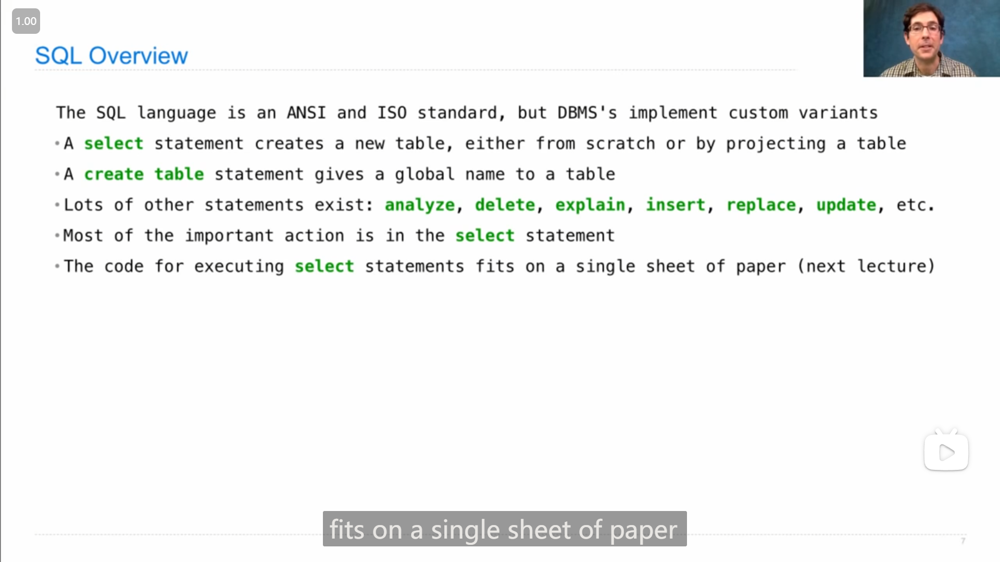
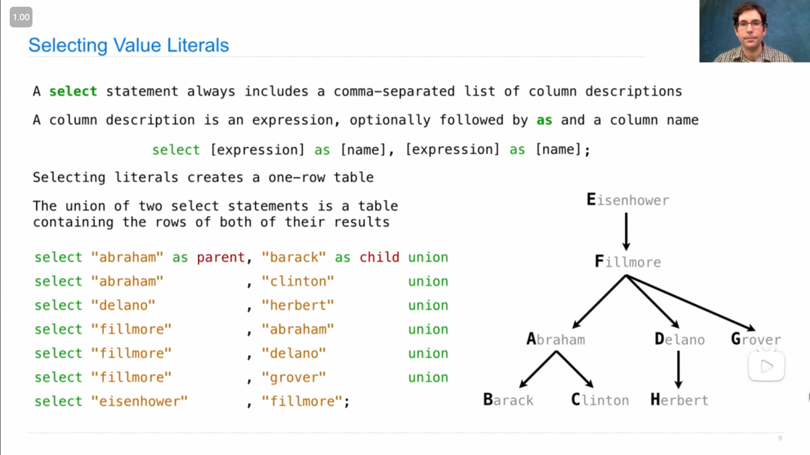
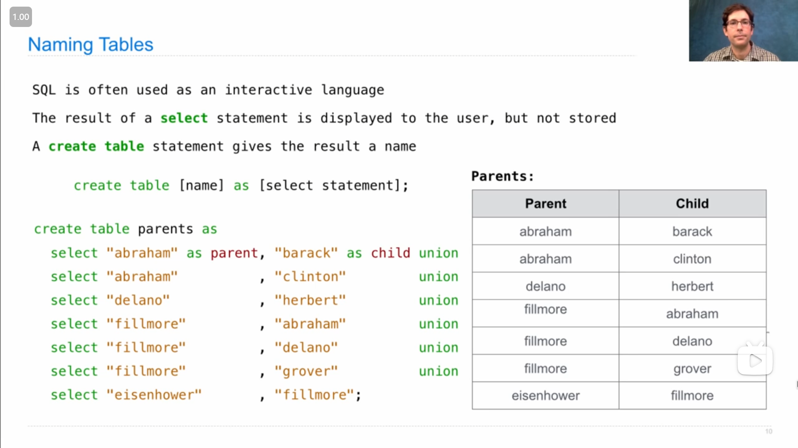
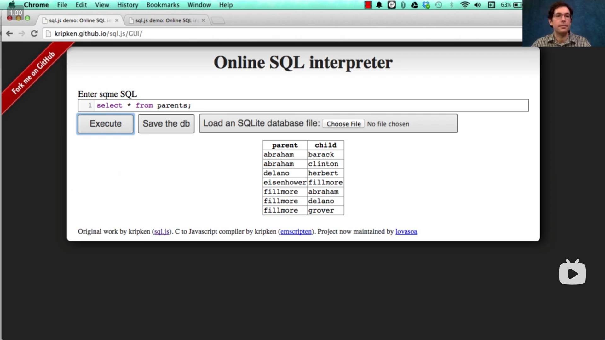
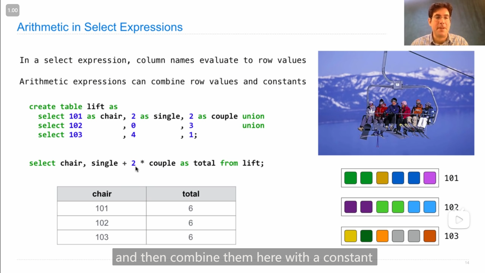
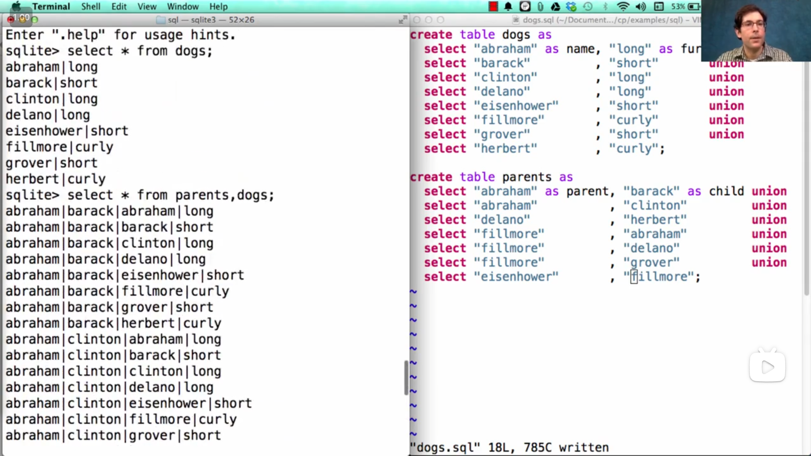
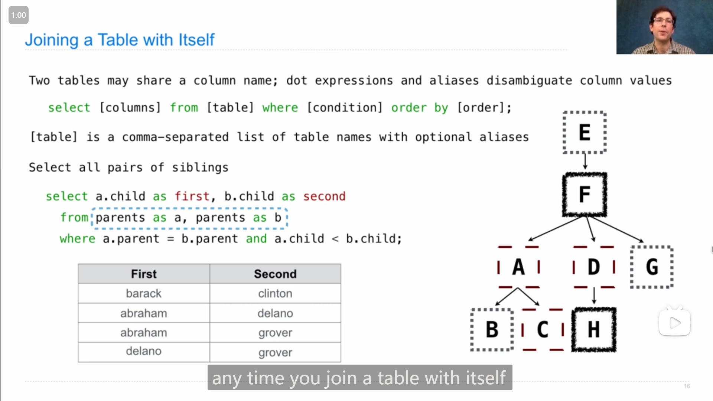
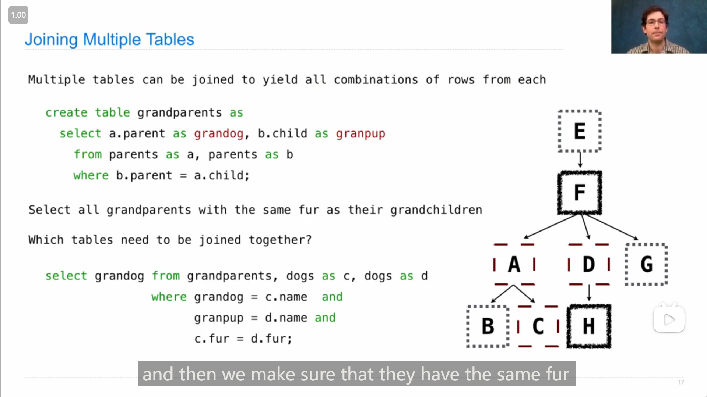
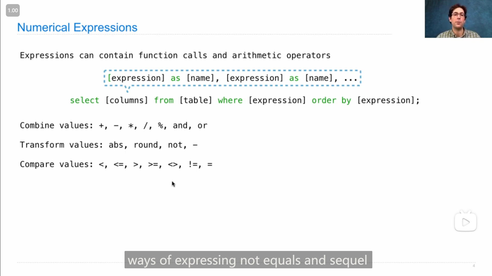
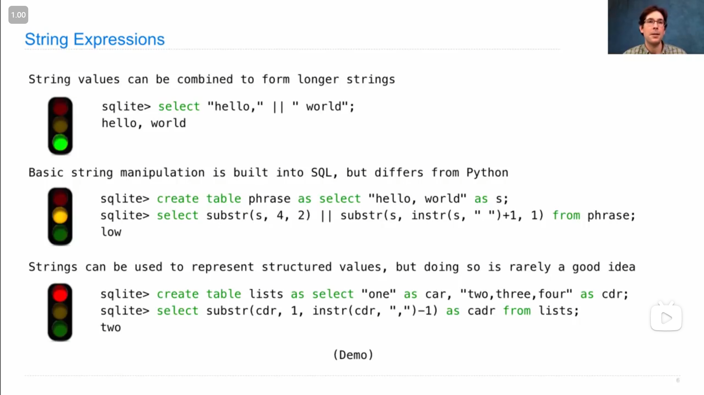

# Lecture 31 --- Lab 12

## Lecture 31 Declarative Programming

### 1

{ loading=lazy }

John解释什么是 *声明式语言 declarative language* ，以及和 *命令式语言 imperative language* 的区别，

主要在于，***命令式语言*只会固定地执行写好的程序，而*声明式语言*会根据需要处理的情况来自己选择合适的处理方法**

::: info 引述
John:

SQL is a declarative programming language. What's that? Well, in a declarative language, SQL is the most common example, but there are many others such as Prolog. A program is a description of the desired result that you want your computer to generate. The interpreter's job is to figure out how to generate that result for you. That's different from an imperative language, such as Python or Scheme. In an imperative language, when you write a program in that language, it's a description of some computational process or processes that you want to be carried out. The job of an interpreter in an imperative language is to carry out the execution and evaluation rules in order to have a correctly interpreted program, and you've done this in your project.

So, there's more flexibility in a declarative language interpreter. We'll see what I mean by that in time, but here's a place to start: in an imperative language, if you write a quadratic time algorithm by specifying that computational process, it's probably gonna run in quadratic time. But in a declarative language, you just say what you want, and if there are multiple ways to compute that, one of which runs in quadratic time and one of which runs in linear time, well, it's up to the interpreter to choose among those options in order to compute what you want as efficiently as possible.

So, a lot of the interesting research in declarative languages is in making decisions about how to compute the desired result, given that there are many ways to compute it correctly, but some of them are faster than others.

---

John:

SQL是一种声明式编程语言。那是什么？嗯，在声明式语言中，SQL是最常见的例子，但还有许多其他语言，比如Prolog。程序是对你想让计算机生成的期望结果的描述。解释器的任务是弄清楚如何为你生成该结果。这与命令式语言不同，比如Python或Scheme。在命令式语言中，当你在该语言中编写程序时，它是对你想执行的一些计算过程或过程的描述。命令式语言中解释器的任务是执行执行和评估规则，以确保正确解释程序，而你在项目中已经做到了这一点。

因此，在声明式语言解释器中有更多的灵活性。我们会在后面详细讨论这一点，但这里是一个起点：在命令式语言中，如果你通过指定计算过程来编写一个二次时间复杂度的算法，它可能会运行在二次时间复杂度。但在声明式语言中，你只需说明你想要的结果，如果有多种计算该结果的方式，其中一种是二次时间复杂度，另一种是线性时间复杂度，那么由解释器来在这些选项中选择，以尽可能高效地计算出你想要的结果。

因此，在声明式语言中，关于如何计算期望结果的有趣研究很多，鉴于有许多正确计算结果的方式，但其中一些比其他方式更快。
:::

### 2

{ loading=lazy }

SQL语言的一些基本语句，John说(除了 `select` `create table` )其他的语句对于理解SQL的核心不太重要

::: info 引述
John:

...They're important if you're actually going to use one of these systems in a large industrial application, but they're not too important for understanding the heart of how SQL works. Most of the important action is in the SELECT statement.

---

John:

...它们在实际应用于大型工业应用程序时非常重要，但对于理解 SQL 工作的核心并不太重要。大部分重要的操作都在 SELECT 语句中。
:::

### 3

{ loading=lazy }

`select` 语句的基本用法

```sql
select [expression] as [name], [expression] as [name], ... ;
```

分号 `;` 表示结束， `as [name]` 部分是可选的。

一个 `select` 语句只会生成一个一行的数据表，可以使用 `union` 将多个表合并，**合并要求两个表的列数是一样的**，使用第一个表的列名作为新表的列名(所以可以看到展示的代码中，之后 `select` 语句(即之后的表)都可以不用添加列名不用写 `as [name]` )

::: info 引述
John:

...If you `select` literals, which are expressions like the number `2` or the string `"Berkeley"` , that will create a one-row table. But if you want to create a multi-row table, you can union together two `select` statements. The union of two `select` statements is another table, but it contains the rows of both. You can only union together tables that have the same number of columns and the same type of information in each column. But the two `select` statements that you union together don't need to have the same names for the columns; it will just use the names of the first `select` statement in order to name the columns in the final result.

---

John:

...如果你选择（ `select` ）字面量，这些表达式可以是像数字 `2` 或字符串 `"Berkeley"` 这样的表达式，那将创建一个一行的表。但如果你想创建一个多行的表，你可以将两个 `select` 语句联合在一起。两个 `select` 语句的联合是另一个表，但它包含了两者的行。你只能联合那些具有相同列数和每列相同类型信息的表。但你联合在一起的两个 `select` 语句的列名不需要相同；它将只使用第一个 `select` 语句的列名来命名最终结果中的列。
:::

---

{ loading=lazy }

`select` 语句只会展示数据表，但并不会将数据表储存，所以如果需要储存数据表，可以使用 `create table` 语句(如上图)

### 4

**用 `select` 语句来 *投影 project* 现有数据表**

>   project官方的翻译是*投影*，但我觉得这里理解为 处理 也可以

{ loading=lazy }

可以用 `from` 来选择一个已有的表，可以用 `where` 来筛选符合条件的行(感觉有点像python列表推到式中的 `if` )，可以用 `order by` 来给新表设置排序规则

---

在John的demo演示中，使用 `*` 来选择所有列

```sql
select * from parents;
```

{ loading=lazy }

### 5

{ loading=lazy }

`select` 语句中也可以进行数学的处理(如上图)

### 6

{ loading=lazy }

在 sql 终端中，可以使用 `-init xxx.sql` 来加载 `.sql` 文件

---

John提到 `select * from ints` 后，新表与原表顺序不一致的现象

::: info 引述
John:

Notice something quite interesting. These rows don't appear in the order that I wrote them out in the first place. When you union together a bunch of `select` statements, you get no guarantees about the order of the result. That's up to the declarative programming engine, which tries to compute the result efficiently.

Now, one thing that `union` does is it discards repeats, and the way that it discards repeats in some cases is to sort all the rows to look for whether there's repetition. And that's exactly what happened here. So, you can see that it's written all of these in an alphabetical order according to the word, which is not what I asked for in the first place, but that's what I got.

And this is one of the properties of declarative programming languages. There's no particular procedure that's defined in advance that tells me how to compute the result of unioning together a bunch of `select` statements. Instead, it's up to the system to create the correct result in whatever way it chooses, and that might involve building the table in a different order than you might expect.

---

John:

请注意一些相当有趣的事情。这些行并不按照我最初写出它们的顺序出现。当你联合一堆 `select` 语句时，你无法保证结果的顺序。这由声明性编程引擎决定，它试图有效地计算结果。

现在， `union` 的一项功能是丢弃重复项，而在某些情况下丢弃重复项的方法是对所有行进行排序，以查看是否有重复。这正是这里发生的情况。所以你可以看到，它按照单词的字母顺序写出了所有这些，这不是我最初要求的，但这就是我得到的结果。

这是声明性编程语言的一个特性。没有预先定义的特定过程告诉我如何计算联合一堆 `select` 语句的结果。相反，这取决于系统以任何它选择的方式创建正确的结果，这可能涉及以与你期望的不同的顺序构建表。
:::

### 7

{ loading=lazy }

问题B，最后John用了一种我没想到的方法😂，

```sql
select word from ints
where one + two/2 + four/4 + eight/8 = 1;
```

即判断是否只有一个为正，

我想到的是，将1 2 4 8加起来(算自己的值)然后取模为零(但不知道sql中有没有取模运算，有的话应该就可行)

## Lecture 32 Tables

### 1

{ loading=lazy }

{ loading=lazy }

*联接 join* 两个表的方法，使用 逗号 `,` 来*联接*，结果是得到一个每个表的每一行与其他表的每一行组合的新的表(从上图John的demo演示中可以看到)

---

{ loading=lazy }

如果遇到不同的表有相同名字的列，或者需要使用同一个表(如上图)，就需要使用 *别名 alias* ( `from [table] as [alias]` )，然后使用 点表达式 `.` 来使用不同表/别名中的相同名字的列

---

John展示了*联接*‘多个表的应用，

{ loading=lazy }

筛选出祖父和孙子毛发类型一样的数据

```sql
select grandog from grandparents, dogs as c, dogs as d
  where grandog = c.name and
        granpup = d.name and
        c.fur = d.fur;
```

### 2

{ loading=lazy }

sql中的一些数学运算相关的表达式，

其中不等号有两种 `<>` 和 `!=` ，而等号是 `=` (和python中的 `==` 不一样)

### 3

{ loading=lazy }

John展示的sql中字符串string的一些用法，

-   字符串的 *连接 concatenation*，使用 `||` 可以将两个字符串*连接*，

-   子字符串 `substr` ，第一个位置是字符串，第二个位置是起始字符的位置(从1开始)，第三个位置是子串长度

    >   所以上图中， `substr(s, 4, 2)` 的结果是 `lo`

-   字符串中字符的位置 `instr` ，第一个位置是字符串，第二个位置是要找的字符(可能子字符串也可以)，然后返回第一个对应的位置

## Lecture 32 Q&A

### 1

有人提问到 *动态作用域 dynamic scope* ，John解释了这个概念一些相关信息

::: info 引述
John:

...Dynamic scope, which is different from lexical scope, is what you're used to. Lexical scope basically says that all of the variables within a function can be identified just by looking at the code. This is true in Python; if you have an inner function like the `adder` function within `make_adder`, you can see all the names within the `adder` function in the code. They might be part of the `adder` function; they might be part of the `make_adder` function, the enclosing scope, but they're all kind of there. That's what's called lexical scope. It's the most common way in which programming languages work.

In other offerings of this course, we talk about an alternative called dynamic scope, which is hardly ever used. It's kind of interesting intellectually, and there are a few cases where it gets used, but mostly it doesn't exist in modern programming languages. So, for that reason, it's fine to just not know about it. But if you want to know about it, the story is basically that when you call a function, that function's environment inherits all of the names that already existed from wherever it was called. That means when you look at the body of the function, it might have names in it that you just can't see anywhere in the code because they're actually defined where that function is called, maybe in a different file or something like that.

Dynamic scope allows you to set up your environment and then make a function call, which is pretty different from lexical scope where you have to pass in everything that's relevant. But for that reason, it can simplify some things where, instead of passing in several different arguments, you just kind of have them already, and you don't have to pass any of them in. So, that's kind of the story with dynamic scope. It's just the same as lexical scope, except for the parent of a frame is always the frame from which that function was called, as opposed to where that function was defined.

---

John:

...动态作用域（dynamic scope）与词法作用域（lexical scope）不同，而你可能已经习惯了词法作用域。词法作用域基本上表示一个函数内的所有变量都可以通过查看代码来确定。在Python中是这样的；如果你有一个内部函数，比如在 `make_adder` 内的 `adder` 函数，你可以在代码中看到 `adder` 函数中的所有名称。它们可能是 `adder` 函数的一部分；它们可能是 `make_adder` 函数的一部分，即封闭作用域，但它们都在那里。这就是所谓的词法作用域，这是大多数编程语言工作的最常见方式。

在本课程的其他部分，我们谈到了一种叫做动态作用域的替代方案，但它几乎从不被使用。从智力上讲，它有点有趣，而且有一些情况下会用到，但在现代编程语言中它基本不存在。因此，出于这个原因，你可以不了解它。但如果你想了解，故事基本上是，当你调用一个函数时，该函数的环境继承了从它被调用的任何地方已经存在的所有名称。这意味着当你查看函数的主体时，它可能包含在代码中你无法看到的名称，因为它们实际上是在调用该函数的地方定义的，可能在不同的文件中等。

动态作用域允许你设置你的环境然后进行函数调用，这与词法作用域相当不同，在词法作用域中，你必须传入所有相关的内容。但因为这个原因，它可以简化一些事情，而不是传递多个不同的参数，你可以直接使用它们，而无需传递它们。因此，这就是动态作用域的故事，它与词法作用域基本相同，只是一个框架的父级始终是调用该函数的框架，而不是定义该函数的地方。
:::

关于*动态作用域*，我觉得关键的地方在于，**<mark>函数内部的参数是基于被调用时的环境的</mark>**

### 2

John举例解释道scheme中表达式*求值*的顺序

```scheme
(if (= (+ 1 2) 3) (print 5) (print 6))

--------------------------------------
    -------------
     - ------- -
        - - -     
                  ---------
                   ----- -
                   
(define (cube x) (* x x x))

---------------------------

(cube (+ 1 2))

--------------
 ---- -------
       - - -
       
                 ---------
                  - - - -
```

可以看到是先进行表达式的*求值*，然后再去对表达式内部的字进行*求值*

## Lab 12

### 1

这个lab中需要运行命令

```bash
python sqlite_shell.py --init lab12.sql
```

来加载 `lab12.sql` 文件以及启动sql的终端，但是在2020年秋季课程网页(不知什么原因)给出的 `lab12.zip` 中， `sqlite_shell.py` 是个空文件，

然后我就去查看了lab网页中的 `Troubleshooting` ，这里提到了另一种替代方法

>   If running `python3 sqlite_shell.py` didn't work, you can download a precompiled sqlite directly by following the following instructions and then use `sqlite3` and `./sqlite3` instead of `python3 sqlite_shell.py` based on which is specified for your platform.

在SQLite官网下载已经编译好的可执行文件，于是我按照网页上的指示下载好了 `sqlite-tools-win-x64-3450100.zip` ，然后能在终端正常打开 `sqlite.exe` ，但是我在使用命令

```bash
./sqlite3 < lab12.sql
```

和

```bash
./sqlite3 --init lab12.sql
```

加载 `lab12.sql` 时，都显示相同的报错

```bash
-- Loading resources from lab12.sql
Parse error near line 4: no such column: 11/13/2020 14:28:25
   "Image 3", 129                   UNION    SELECT "11/13/2020 14:28:25"
                                      error here ---^
Parse error near line 401: no such column: 11/13/2020 14:28:25
  True" , "False", "False", "False" UNION    SELECT "11/13/2020 14:28:25"
                                      error here ---^
...
```

不知道是什么原因。

之后我分别去查看了23、21、19年秋季的对应的SQL的lab(lab12或lab13)，这几个学期的sql lab压缩包内的 `sqlite_shell.py` 文件都不是空文件，并且似乎三个学期的 `sqlite_shell.py` 文件哈希值都一样(说明是同一个文件)，于是我就将23秋季的 `sqlite_shell.py` 解压替换了原有的文件，最后可以运行最初的命令。

::: details python代码
::: code-group

```python [sqlite_shell.py]
#!/usr/bin/env python

# Licensed under the MIT license

# A simple SQLite shell that uses the built-in Python adapter.

import codecs
import io
import os
import sys
import sqlite3
import time
import warnings

try: FileNotFoundError
except NameError: FileNotFoundError = OSError

if str != bytes: buffer = bytes
if str != bytes: unicode = str

try: import msvcrt
except ImportError: msvcrt = None

CP_UTF8 = 65001
pythonapi = None
if msvcrt:
    import ctypes
    (BOOL, DWORD, HANDLE, UINT) = (ctypes.c_long, ctypes.c_ulong, ctypes.c_void_p, ctypes.c_uint)
    GetConsoleCP = ctypes.WINFUNCTYPE(UINT)(('GetConsoleCP', ctypes.windll.kernel32))
    SetConsoleCP = ctypes.WINFUNCTYPE(BOOL, UINT)(('SetConsoleCP', ctypes.windll.kernel32))
    GetConsoleOutputCP = ctypes.WINFUNCTYPE(UINT)(('GetConsoleOutputCP', ctypes.windll.kernel32))
    SetConsoleOutputCP = ctypes.WINFUNCTYPE(BOOL, UINT)(('SetConsoleOutputCP', ctypes.windll.kernel32))
    GetConsoleMode = ctypes.WINFUNCTYPE(BOOL, HANDLE, ctypes.POINTER(DWORD), use_last_error=True)(('GetConsoleMode', ctypes.windll.kernel32))
    GetNumberOfConsoleInputEvents = ctypes.WINFUNCTYPE(BOOL, HANDLE, ctypes.POINTER(DWORD), use_last_error=True)(('GetNumberOfConsoleInputEvents', ctypes.windll.kernel32))
    ReadConsoleW = ctypes.WINFUNCTYPE(BOOL, HANDLE, ctypes.c_void_p, DWORD, ctypes.POINTER(DWORD), ctypes.c_void_p, use_last_error=True)(('ReadConsoleW', ctypes.windll.kernel32))
    WriteConsoleW = ctypes.WINFUNCTYPE(BOOL, HANDLE, ctypes.c_void_p, DWORD, ctypes.POINTER(DWORD), ctypes.c_void_p, use_last_error=True)(('WriteConsoleW', ctypes.windll.kernel32))
    class Py_buffer(ctypes.Structure): _fields_ = [('buf', ctypes.c_void_p), ('obj', ctypes.py_object), ('len', ctypes.c_ssize_t), ('itemsize', ctypes.c_ssize_t), ('readonly', ctypes.c_int), ('ndim', ctypes.c_int), ('format', ctypes.c_char_p), ('shape', ctypes.POINTER(ctypes.c_ssize_t)), ('strides', ctypes.POINTER(ctypes.c_ssize_t)), ('suboffsets', ctypes.POINTER(ctypes.c_ssize_t))] + ([('smalltable', ctypes.c_ssize_t * 2)] if sys.version_info[0] <= 2 else []) + [('internal', ctypes.c_void_p)]
    try: from ctypes import pythonapi
    except ImportError: pass
if pythonapi:
    def getbuffer(b, writable):
        arr = Py_buffer()
        pythonapi.PyObject_GetBuffer(ctypes.py_object(b), ctypes.byref(arr), ctypes.c_int(writable))
        try: buf = (ctypes.c_ubyte * arr.len).from_address(arr.buf)
        finally: pythonapi.PyBuffer_Release(ctypes.byref(arr))
        return buf

ENCODING = 'utf-8'

if sys.version_info[0] < 3:
    class NotASurrogateError(Exception): pass
    def surrogateescape_handler(exc):
        # Source: https://github.com/PythonCharmers/python-future/blob/aef57391c0cd58bf840dff5e2bc2c8c0f5b0a1b4/src/future/utils/surrogateescape.py
        mystring = exc.object[exc.start:exc.end]
        try:
            if isinstance(exc, UnicodeDecodeError):
                decoded = []
                for ch in mystring:
                    if isinstance(ch, int):
                        code = ch
                    else:
                        code = ord(ch)
                    if 0x80 <= code <= 0xFF:
                        decoded.append(unichr(0xDC00 + code))
                    elif code <= 0x7F:
                        decoded.append(unichr(code))
                    else:
                        raise NotASurrogateError()
                decoded = str().join(decoded)
            elif isinstance(exc, UnicodeEncodeError):
                decoded = []
                for ch in mystring:
                    code = ord(ch)
                    if not 0xD800 <= code <= 0xDCFF:
                        raise NotASurrogateError()
                    if 0xDC00 <= code <= 0xDC7F:
                        decoded.append(unichr(code - 0xDC00))
                    elif code <= 0xDCFF:
                        decoded.append(unichr(code - 0xDC00))
                    else:
                        raise NotASurrogateError()
                decoded = str().join(decoded)
            else:
                raise exc
        except NotASurrogateError:
            raise exc
        return (decoded, exc.end)
    codecs.register_error('surrogateescape', surrogateescape_handler)

def exception_encode(ex, codec):
    if str == bytes:
        reduced = ex.__reduce__()
        ex = reduced[0](*tuple(map(lambda arg: codec.decode(arg)[0] if isinstance(arg, bytes) else arg, reduced[1])))
    return ex

def sql_commands(read_line):
    delims = ['"', "'", ';', '--']
    counter = 0
    in_string = None
    j = i = 0
    prev_line = None
    line = None
    concat = []
    while True:
        if line is None:
            while True:  # process preprocessor directives
                counter += 1
                not_in_the_middle_of_any_input = not in_string and i == j and all(map(lambda chunk_: len(chunk_) == 0, concat))
                line = read_line(counter - 1, not_in_the_middle_of_any_input, prev_line)
                empty_string = line[:0] if line is not None else line
                prev_line = line
                if not line:
                    break
                if not_in_the_middle_of_any_input and line.startswith("."):
                    yield line
                    line = None
                else:
                    break
            if not line:
                break
            j = i = 0
        if j < len(line):
            (j, delim) = min(map(lambda pair: pair if pair[0] >= 0 else (len(line), pair[1]), map(lambda d: (line.find(d, j), d), in_string or delims if in_string != '--' else "\n")))
            if i < j: concat.append(line[i:j]); i = j
            if not in_string:
                if j < len(line):
                    j += len(delim)
                    if delim == ';':
                        i = j
                        concat.append(line[j : j + len(delim)])    # ensure delimeter is the same type as the string (it may not be due to implicit conversion)
                        # Eat up any further spaces until a newline
                        while j < len(line):
                            delim = line[j:j+1]
                            if not delim.isspace(): break
                            j += 1
                            if delim == "\n": break
                        if i < j: concat.append(line[i:j]); i = j
                        yield empty_string.join(concat)
                        del concat[:]
                    else:
                        in_string = delim
            else:
                if j < len(line):
                    ch = line[j:j+1]
                    assert ch == in_string or in_string == '--'
                    j += 1
                    i = j
                    concat.append(ch)
                    in_string = None
        else:
            if i < j: concat.append(line[i:j]); i = j
            line = None

class WindowsConsoleIOMixin(object):
    # Ctrl+C handling with ReadFile() is messed up on Windows starting on Windows 8... here's some background reading:
    #   https://stackoverflow.com/a/43260436
    #   https://github.com/microsoft/terminal/issues/334
    # We use ReadConsole when we can, so it doesn't affect us, but it's good info to know regardless.
    def __init__(self, fd):
        assert isatty(fd), "file descriptor must refer to a console (note that on Windows, NUL satisfies isatty(), but is not a console)"
        self.fd = fd
        self.handle = msvcrt.get_osfhandle(fd)
    def fileno(self): return self.fd
    def isatty(self): return isatty(self.fd)
    def seekable(self): return False
    def readable(self): return GetNumberOfConsoleInputEvents(self.handle, ctypes.byref(DWORD(0))) != 0
    def writable(self): n = DWORD(0); return WriteConsoleW(self.handle, ctypes.c_void_p(), n, ctypes.byref(n), ctypes.c_void_p()) != 0
    def readwcharsinto(self, buf, n):
        nr = DWORD(n)
        old_error = ctypes.get_last_error()
        ctypes.set_last_error(0)
        success = ReadConsoleW(self.handle, buf, nr, ctypes.byref(nr), ctypes.c_void_p())
        error = ctypes.get_last_error()
        ctypes.set_last_error(old_error)
        if not success: raise ctypes.WinError(error)
        ERROR_OPERATION_ABORTED = 995
        if nr.value == 0 and error == ERROR_OPERATION_ABORTED:
            # Apparently this can trigger pending KeyboardInterrupts?
            time.sleep(1.0 / (1 << 64))
            raise KeyboardInterrupt()  # If Python doesn't raise it, we can
        return nr.value
    def writewchars(self, buf, n):
        nw = DWORD(n)
        if not WriteConsoleW(self.handle, buf, nw, ctypes.byref(nw), ctypes.c_void_p()):
            raise ctypes.WinError()
        return nw.value

class WindowsConsoleRawIO(WindowsConsoleIOMixin, io.RawIOBase):
    def readinto(self, b):
        wordsize = ctypes.sizeof(ctypes.c_wchar)
        return self.readwcharsinto(getbuffer(b, True), len(b) // wordsize) * wordsize
    def write(self, b):
        wordsize = ctypes.sizeof(ctypes.c_wchar)
        return self.writewchars(getbuffer(b, False), len(b) // wordsize) * wordsize

class WindowsConsoleTextIO(WindowsConsoleIOMixin, io.TextIOBase):
    buf = None
    buffered = unicode()
    translate = True
    def getbuf(self, ncodeunits):
        buf = self.buf
        if buf is None or len(buf) < ncodeunits:
            self.buf = buf = ctypes.create_unicode_buffer(ncodeunits)
        return buf
    @staticmethod  # Don't let classes override this... they can override the caller instead
    def do_read(self, nchars, translate_newlines):
        prenewline = os.linesep[:-1]
        newline = os.linesep[-1:]
        empty = os.linesep[:0]
        if nchars is None or nchars < -1: nchars = -1
        ncodeunits = nchars if nchars >= 0 else io.DEFAULT_BUFFER_SIZE  # Unit mismatch, but doesn't matter; we'll loop
        buf = None
        istart = 0
        while True:
            iend = self.buffered.find(newline, istart, min(istart + nchars, len(self.buffered)) if nchars >= 0 else None) if newline is not None else nchars
            if iend >= 0: iend += len(newline) if newline is not None else 0
            if 0 <= iend <= len(self.buffered):
                break
            if buf is None: buf = self.getbuf(ncodeunits)
            istart = len(self.buffered)
            chunk = buf[:self.readwcharsinto(buf, ncodeunits)]
            if translate_newlines: chunk = chunk.replace(prenewline, empty)
            if chunk.startswith('\x1A'):  # EOF on Windows (Ctrl+Z) at the beginning of a line results in the entire rest of the buffer being discarded
                iend = istart
                break
            # Python 2 and Python 3 behaviors differ on Windows... Python 2's sys.stdin.readline() just deletes the next character if it sees EOF in the middle of a string! I won't emulate that here.
            self.buffered += chunk  # We're relying on Python's concatenation optimization here... we don't do it ourselves, since we want self.buffered to be valid every iteration in case there is an exception raised
        result = self.buffered[:iend]
        self.buffered = self.buffered[iend:]
        return result
    def read(self, nchars=-1): return WindowsConsoleTextIO.do_read(self, nchars, None, self.translate)
    def readline(self, nchars=-1): return WindowsConsoleTextIO.do_read(self, nchars, self.translate)
    def write(self, text): buf = ctypes.create_unicode_buffer(text); return self.writewchars(buf, max(len(buf) - 1, 0))

def wrap_windows_console_io(stream, is_output):
    fd = None
    if stream is not None and sys.version_info[0] < 3 and msvcrt and (is_output or pythonapi) and isatty(stream):
        try: fd = stream.fileno()
        except io.UnsupportedOperation: pass
    result = stream
    if fd is not None:
        f = GetConsoleOutputCP if is_output else GetConsoleCP
        if not f or f() != CP_UTF8:
            try:
                if True or is_output:
                    result = WindowsConsoleTextIO(fd)
                else:
                    result = io.TextIOWrapper((io.BufferedWriter if is_output else io.BufferedReader)(WindowsConsoleRawIO(fd)), 'utf-16-le', 'strict', line_buffering=True)
            except IOError: pass
    return result

class NonOwningTextIOWrapper(io.TextIOWrapper):
    def __init__(self, base_textiowrapper, **kwargs):
        assert isinstance(base_textiowrapper, io.TextIOWrapper)
        self.base = base_textiowrapper  # must keep a reference to this alive so it doesn't get closed
        super(NonOwningTextIOWrapper, self).__init__(base_textiowrapper.buffer, **kwargs)
    def close(self):
        super(NonOwningTextIOWrapper, self).flush()

def wrap_unicode_stdio(stream, is_writer, encoding):  # The underlying stream must NOT be used directly until the stream returned by this function is disposed of
    if isinstance(stream, io.TextIOWrapper):
        stream.flush()  # Make sure nothing is left in the buffer before we re-wrap it
        none = object()
        kwargs = {}
        for key in ['encoding', 'errors', 'newline', 'line_buffering', 'write_through']:
            value = getattr(stream, 'newlines' if key == 'newline' else key, none)
            if value is not none:
                kwargs[key] = value
        kwargs['encoding'] = encoding
        result = NonOwningTextIOWrapper(stream, **kwargs)
    elif 'PYTHONIOENCODING' not in os.environ and str == bytes and stream in (sys.stdin, sys.stdout, sys.stderr):
        result = (codecs.getwriter if is_writer else codecs.getreader)(encoding)(stream)
    else:
        result = stream
    return result

class StringEscapeParser(object):
    def __init__(self):
        import re
        self.pattern = re.compile("\"((?:[^\"\\n]+|\\\\.)*)(?:\"|$)|\'([^\'\\n]*)(?:\'|$)|(\\S+)")
        self.escape_pattern = re.compile("\\\\(.)", re.DOTALL)
    @staticmethod
    def escape_replacement(m):
        text = m.group(1)
        if text == "\\": text = "\\"
        elif text == "/": text = "\n"
        elif text == "n": text = "\n"
        elif text == "r": text = "\r"
        elif text == "t": text = "\t"
        elif text == "v": text = "\v"
        elif text == "f": text = "\f"
        elif text == "a": text = "\a"
        elif text == "b": text = "\b"
        return text
    def __call__(self, s):
        escape_pattern = self.escape_pattern
        escape_replacement = self.escape_replacement
        result = []
        for match in self.pattern.finditer(s):
            [m1, m2, m3] = match.groups()
            if m1 is not None: result.append(escape_pattern.sub(escape_replacement, m1))
            if m2 is not None: result.append(m2)
            if m3 is not None: result.append(escape_pattern.sub(escape_replacement, m3))
        return result

class Database(object):
    def __init__(self, name, *args, **kwargs):
        self.connection = sqlite3.connect(name, *args, **kwargs)
        self.cursor = self.connection.cursor()
        self.name = name  # assign name only AFTER cursor is created

def isatty(file_or_fd):
    result = True
    method = getattr(file_or_fd, 'isatty', None) if not isinstance(file_or_fd, int) else None  # this check is just an optimization
    if method is not None:
        try: tty = method()
        except io.UnsupportedOperation: tty = None
        result = result and tty is not None and tty
    method = getattr(file_or_fd, 'fileno', None) if not isinstance(file_or_fd, int) else None  # this check is just an optimization
    if method is not None:
        try: fd = method()
        except io.UnsupportedOperation: fd = None
        result = result and fd is not None and os.isatty(fd) and (not msvcrt or GetConsoleMode(msvcrt.get_osfhandle(fd), ctypes.byref(DWORD(0))) != 0)
    return result

def can_call_input_for_stdio(stream):
    return stream == sys.stdin and sys.version_info[0] >= 3

class StdIOProxy(object):
    # Maybe useful later: codecs.StreamRecoder(bytesIO, codec.decode, codec.encode, codec.streamwriter, codec.streamreader, errors='surrogateescape')
    def __init__(self, stdin, stdout, stderr, codec, allow_set_code_page):
        self.codec = codec
        streams = (stdin, stdout, stderr)
        for stream in streams:
            assert isinstance(stream, io.IOBase) or sys.version_info[0] < 3 and isinstance(stream, file) or hasattr(stream, 'mode'), "unable to determine stream type"
            assert not isinstance(stream, io.RawIOBase), "RAW I/O APIs are different and not supported"
        self.streaminfos = tuple(map(lambda stream:
            (
                stream,
                isinstance(stream, io.BufferedIOBase) or isinstance(stream, io.RawIOBase) or not isinstance(stream, io.TextIOBase) and 'b' in stream.mode,
                isinstance(stream, io.TextIOBase) or not (isinstance(stream, io.BufferedIOBase) or isinstance(stream, io.RawIOBase)) and 'b' not in stream.mode,
                allow_set_code_page
            ),
            streams))
    @property
    def stdin(self): return self.streaminfos[0][0]
    @property
    def stdout(self): return self.streaminfos[1][0]
    @property
    def stderr(self): return self.streaminfos[2][0]
    def _coerce(self, streaminfo, codec, arg):
        stream = streaminfo[0]
        can_binary = streaminfo[1]
        can_text = streaminfo[2]
        if not isinstance(arg, bytes) and not isinstance(arg, buffer) and not isinstance(arg, unicode):
            arg = unicode(arg)
        if isinstance(arg, bytes) or isinstance(arg, buffer):
            if not can_binary:
                arg = codec.decode(arg, 'surrogateescape')[0]
        elif isinstance(arg, unicode):
            if not can_text:
                arg = codec.encode(unicode(arg), 'strict')[0]
        return arg
    @staticmethod
    def _do_readline(stream, allow_set_code_page, *args):
        new_code_page = CP_UTF8
        old_code_page = GetConsoleCP() if msvcrt and GetConsoleCP and isatty(stream) else None
        if old_code_page == new_code_page: old_code_page = None  # Don't change code page if it's already correct...
        if old_code_page is not None:
            if not SetConsoleCP(new_code_page):
                old_code_page = None
        try:
            result = stream.readline(*args)
        finally:
            if old_code_page is not None:
                SetConsoleCP(old_code_page)
        return result
    @staticmethod
    def _do_write(stream, allow_set_code_page, *args):
        new_code_page = CP_UTF8
        old_code_page = GetConsoleOutputCP() if msvcrt and GetConsoleOutputCP and isatty(stream) else None
        if old_code_page == new_code_page: old_code_page = None  # Don't change code page if it's already correct...
        if old_code_page is not None:
            if not SetConsoleOutputCP(new_code_page):
                old_code_page = None
        try:
            result = stream.write(*args)
        finally:
            if old_code_page is not None:
                SetConsoleCP(old_code_page)
        return result
    def _readln(self, streaminfo, codec, prompt):
        stream = streaminfo[0]
        can_binary = streaminfo[1]
        allow_set_code_page = streaminfo[3]
        if can_call_input_for_stdio(stream) and not can_binary:  # input() can't work with binary data
            result = self._coerce(streaminfo, codec, "")
            try:
                result = input(*((self._coerce(streaminfo, codec, prompt),) if prompt is not None else ()))
                result += self._coerce(streaminfo, codec, "\n")
            except EOFError: pass
        else:
            self.output(*((prompt,) if prompt is not None else ()))
            self.error()
            result = StdIOProxy._do_readline(stream, allow_set_code_page)
        return result
    def _writeln(self, streaminfo, codec, *args, **kwargs):
        stream = streaminfo[0]
        allow_set_code_page = streaminfo[3]
        flush = kwargs.pop('flush', True)
        kwargs.setdefault('end', '\n')
        kwargs.setdefault('sep', ' ')
        end = kwargs.get('end')
        sep = kwargs.get('sep')
        first = True
        for arg in args:
            if first: first = False
            elif sep is not None:
                StdIOProxy._do_write(stream, allow_set_code_page, self._coerce(streaminfo, codec, sep))
            StdIOProxy._do_write(stream, allow_set_code_page, self._coerce(streaminfo, codec, arg))
        if end is not None:
            StdIOProxy._do_write(stream, allow_set_code_page, self._coerce(streaminfo, codec, end))
        if flush: stream.flush()
    def inputln(self, prompt=None): return self._readln(self.streaminfos[0], self.codec, prompt)
    def output(self, *args, **kwargs): kwargs.setdefault('end', None); return self._writeln(self.streaminfos[1], self.codec, *args, **kwargs)
    def outputln(self, *args, **kwargs): return self._writeln(self.streaminfos[1], self.codec, *args, **kwargs)
    def error(self, *args, **kwargs): kwargs.setdefault('end', None); return self._writeln(self.streaminfos[2], self.codec, *args, **kwargs)
    def errorln(self, *args, **kwargs): return self._writeln(self.streaminfos[2], self.codec, *args, **kwargs)

class bytes_comparable_with_unicode(bytes):  # For Python 2/3 compatibility, to allow implicit conversion between strings and bytes when it is safe. (Used for strings like literals which we know be safe.)
    codec = codecs.lookup('ascii')  # MUST be a safe encoding
    @classmethod
    def coerce(cls, other, for_output=False):
        return cls.codec.encode(other)[0] if not isinstance(other, bytes) else bytes_comparable_with_unicode(other) if for_output else other
    @classmethod
    def translate_if_bytes(cls, value):
        if value is not None and isinstance(value, bytes): value = cls(value)
        return value
    def __hash__(self): return super(bytes_comparable_with_unicode, self).__hash__()  # To avoid warning
    def __eq__(self, other): return super(bytes_comparable_with_unicode, self).__eq__(self.coerce(other))
    def __ne__(self, other): return super(bytes_comparable_with_unicode, self).__ne__(self.coerce(other))
    def __lt__(self, other): return super(bytes_comparable_with_unicode, self).__lt__(self.coerce(other))
    def __gt__(self, other): return super(bytes_comparable_with_unicode, self).__gt__(self.coerce(other))
    def __le__(self, other): return super(bytes_comparable_with_unicode, self).__le__(self.coerce(other))
    def __ge__(self, other): return super(bytes_comparable_with_unicode, self).__ge__(self.coerce(other))
    def __getitem__(self, index): return self.coerce(super(bytes_comparable_with_unicode, self).__getitem__(index), True)
    def __add__(self, other): return self.coerce(super(bytes_comparable_with_unicode, self).__add__(self.coerce(other)), True)
    def __iadd__(self, other): return self.coerce(super(bytes_comparable_with_unicode, self).__iadd__(self.coerce(other)), True)
    def __radd__(self, other): return self.coerce(self.coerce(other).__add__(self), True)
    def find(self, other, *args): return super(bytes_comparable_with_unicode, self).find(self.coerce(other), *args)
    def join(self, others): return self.coerce(super(bytes_comparable_with_unicode, self).join(map(self.coerce, others)), True)
    def startswith(self, other): return super(bytes_comparable_with_unicode, self).startswith(self.coerce(other))
    def __str__(self): return self.codec.decode(self)[0]
    if str == bytes:
        __unicode__ = __str__
        def __str__(self): raise NotImplementedError()

def wrap_bytes_comparable_with_unicode_readline(readline):
    def callback(*args):
        line = readline(*args)
        line = bytes_comparable_with_unicode.translate_if_bytes(line)
        return line
    return callback

def main(program, *args, **kwargs):  # **kwargs = dict(stdin=file, stdout=file, stderr=file); useful for callers who import this module
    import argparse  # slow import (compiles regexes etc.), so don't import it until needed
    argparser = argparse.ArgumentParser(
        prog=os.path.basename(program),
        usage=None,
        description=None,
        epilog=None,
        parents=[],
        formatter_class=argparse.RawTextHelpFormatter)
    argparser.add_argument('-version', '--version', action='store_true', help="show SQLite version")
    argparser.add_argument('-batch', '--batch', action='store_true', help="force batch I/O")
    argparser.add_argument('-init', '--init', metavar="FILE", help="read/process named file")
    argparser.add_argument('filename', nargs='?', metavar="FILENAME", help="is the name of an SQLite database.\nA new database is created if the file does not previously exist.")
    argparser.add_argument('sql', nargs='*', metavar="SQL", help="SQL commnds to execute after opening database")
    argparser.add_argument('--readline', action='store', metavar="(true|false)", default="true", choices=("true", "false"), help="whether to import readline if available (default: %(default)s)")
    argparser.add_argument('--self-test', action='store_true', help="perform a basic self-test")
    argparser.add_argument('--cross-test', action='store_true', help="perform a basic test against the official executable")
    argparser.add_argument('--unicode-stdio', action='store', metavar="(true|false)", default="true", choices=("true", "false"), help="whether to enable Unicode wrapper for standard I/O (default: %(default)s)")
    argparser.add_argument('--console', action='store', metavar="(true|false)", default="true", choices=("true", "false"), help="whether to auto-detect and use console window APIs (default: %(default)s)")
    argparser.add_argument('--encoding', default=ENCODING, help="the default encoding to use (default: %(default)s)")
    (stdin, stdout, stderr) = (kwargs.pop('stdin', sys.stdin), kwargs.pop('stdout', sys.stdout), kwargs.pop('stderr', sys.stderr))
    parsed_args = argparser.parse_args(args)
    codec = codecs.lookup(parsed_args.encoding or argparser.get_default('encoding'))
    if parsed_args.self_test: self_test(codec)
    if parsed_args.cross_test: cross_test("sqlite3", codec)
    parse_escaped_strings = StringEscapeParser()
    if parsed_args.unicode_stdio == "true":
        stdin = wrap_unicode_stdio(stdin, False, codec.name)
        stdout = wrap_unicode_stdio(stdout, True, codec.name)
        stderr = wrap_unicode_stdio(stderr, True, codec.name)
    if parsed_args.console == "true":
        stdin = wrap_windows_console_io(stdin, False)
        stdout = wrap_windows_console_io(stdout, True)
        stderr = wrap_windows_console_io(stderr, True)
    allow_set_code_page = sys.version_info[0] < 3 and False  # This is only necessary on Python 2 if we use the default I/O functions instead of bypassing to ReadConsole()/WriteConsole()
    stdio = StdIOProxy(stdin, stdout, stderr, codec, allow_set_code_page)
    db = None
    no_args = len(args) == 0
    init_sql = parsed_args.sql
    is_nonpipe_input = stdin.isatty()  # NOT the same thing as TTY! (NUL and /dev/null are the difference)
    init_show_prompt = not parsed_args.batch and is_nonpipe_input
    if not parsed_args.batch and isatty(stdin) and (parsed_args.readline == "true" or __name__ == '__main__') and parsed_args.readline != "false":
        try:
            with warnings.catch_warnings():
                warnings.filterwarnings('ignore', category=DeprecationWarning)
                import readline
        except ImportError: pass
    if parsed_args and parsed_args.version:
        stdio.outputln(sqlite3.sqlite_version);
    else:
        filename = parsed_args.filename
        if filename is None: filename = ":memory:"
        db = Database(filename, isolation_level=None)
    def exec_script(db, filename, ignore_io_errors):
        try:
            with io.open(filename, 'r', encoding=codec.name) as f:  # Assume .sql files are text -- any binary data inside them should be X'' encoded, not embedded directly
                for command in sql_commands(wrap_bytes_comparable_with_unicode_readline(lambda *args: (lambda s: (s) or None)(f.readline()))):
                    result = exec_command(db, command, False and ignore_io_errors)
                    if result is not None:
                        return result
        except IOError as ex:
            stdio.errorln(ex)
            if not ignore_io_errors: return ex.errno
    def raise_invalid_command_error(command):
        if isinstance(command, bytes): command = codec.decode(command)[0]
        if command.startswith("."): command = command[1:]
        raise RuntimeError("Error: unknown command or invalid arguments:  \"%s\". Enter \".help\" for help" % (command.rstrip().replace("\\", "\\\\").replace("\"", "\\\""),))
    def exec_command(db, command, ignore_io_errors):
        results = None
        query = None
        query_parameters = {}
        try:
            if command.startswith("."):
                args = list(parse_escaped_strings(command))
                if args[0] in (".quit", ".exit"):
                    return 0
                elif args[0] == ".help":
                    stdio.error("""
.cd DIRECTORY          Change the working directory to DIRECTORY
.dump                  Dump the database in an SQL text format
.exit                  Exit this program
.help                  Show this message
.open FILE             Close existing database and reopen FILE
.print STRING...       Print literal STRING
.quit                  Exit this program
.read FILENAME         Execute SQL in FILENAME
.schema ?PATTERN?      Show the CREATE statements matching PATTERN
.show                  Show the current values for various settings
.tables ?TABLE?        List names of tables
""".lstrip())
                elif args[0] == ".cd":
                    if len(args) != 2: raise_invalid_command_error(command)
                    os.chdir(args[1])
                elif args[0] == ".dump":
                    if len(args) != 1: raise_invalid_command_error(command)
                    foreign_keys = db.cursor.execute("PRAGMA foreign_keys;").fetchone()[0]
                    if foreign_keys in (0, "0", "off", "OFF"):
                        stdio.outputln("PRAGMA foreign_keys=OFF;", flush=False)
                    for line in db.connection.iterdump():
                        stdio.outputln(line, flush=False)
                    stdio.output()
                elif args[0] == ".open":
                    if len(args) <= 1: raise_invalid_command_error(command)
                    filename = args[-1]
                    for option in args[+1:-1]:
                        raise ValueError("option %s not supported" % (repr(option),))
                    try: db.__init__(filename)
                    except sqlite3.OperationalError as ex:
                        ex.args = ex.args[:0] + ("Error: unable to open database \"%s\": %s" % (filename, ex.args[0]),) + ex.args[1:]
                        raise
                elif args[0] == ".print":
                    stdio.outputln(*args[1:])
                elif args[0] == ".read":
                    if len(args) != 2: raise_invalid_command_error(command)
                    exec_script(db, args[1], ignore_io_errors)
                elif args[0] == ".schema":
                    if len(args) > 2: raise_invalid_command_error(command)
                    pattern = args[1] if len(args) > 1 else None
                    query_parameters['type'] = 'table'
                    if pattern is not None:
                        query_parameters['pattern'] = pattern
                    query = "SELECT sql || ';' FROM sqlite_master WHERE type = :type" + (" AND name LIKE :pattern" if pattern is not None else "") + ";"
                elif args[0] == ".show":
                    if len(args) > 2: raise_invalid_command_error(command)
                    stdio.errorln("    filename:", db.name)
                elif args[0] == ".tables":
                    if len(args) > 2: raise_invalid_command_error(command)
                    pattern = args[1] if len(args) > 1 else None
                    query_parameters['type'] = 'table'
                    if pattern is not None:
                        query_parameters['pattern'] = pattern
                    query = "SELECT name FROM sqlite_master WHERE type = :type" + (" AND name LIKE :pattern" if pattern is not None else "") + ";"
                else:
                    raise_invalid_command_error(args[0])
            else:
                query = command
            if query is not None:
                results = db.cursor.execute(query if isinstance(query, unicode) else codec.decode(query, 'surrogatereplace')[0], query_parameters)
        except (RuntimeError, OSError, FileNotFoundError, sqlite3.OperationalError) as ex:
            stdio.errorln(exception_encode(ex, codec))
        if results is not None:
            for row in results:
                stdio.outputln(*tuple(map(lambda item: item if item is not None else "", row)), sep="|", flush=False)
            stdio.output()
    if db:
        if parsed_args and parsed_args.init:
            if is_nonpipe_input: stdio.errorln("-- Loading resources from", parsed_args.init)
            exec_script(db, parsed_args.init, False)
        def read_stdin(index, not_in_the_middle_of_any_input, prev_line):
            show_prompt = init_show_prompt
            to_write = []
            if index < len(init_sql):
                line = init_sql[index]
                if not line.startswith(".") and not line.rstrip().endswith(";"):
                    line += ";"
            elif index == len(init_sql) and len(init_sql) > 0:
                line = None
            else:
                if show_prompt:
                    if not_in_the_middle_of_any_input:
                        show_prompt = False
                        if index == 0:
                            to_write.append("SQLite version %s (adapter version %s)\nEnter \".help\" for usage hints.\n" % (sqlite3.sqlite_version, sqlite3.version))
                            if no_args:
                                to_write.append("Connected to a transient in-memory database.\nUse \".open FILENAME\" to reopen on a persistent database.\n")
                    if index > 0 and not prev_line:
                        to_write.append("\n")
                    to_write.append("%7s " % ("sqlite%s>" % ("",) if not_in_the_middle_of_any_input else "...>",))
                try:
                    line = stdio.inputln("".join(to_write))
                except KeyboardInterrupt:
                    line = ""
                    raise  # just kidding, don't handle it for now...
            return line
        for command in sql_commands(wrap_bytes_comparable_with_unicode_readline(read_stdin)):
            result = exec_command(db, command, True)
            if result is not None:
                return result
        if init_show_prompt and len(init_sql) == 0:
            stdio.outputln()

def call_program(cmdline, input_text):
    import subprocess
    return subprocess.Popen(cmdline, bufsize=0, stdin=subprocess.PIPE, stdout=subprocess.PIPE, stderr=subprocess.PIPE, universal_newlines=False).communicate(input_text)

def test_query():
    hexcodec = codecs.lookup('hex_codec')
    ascii = 'ascii'
    data1 = b"\xD8\xA2"
    data2 = b"\x01\x02\xFF\x01\xFF\xFE\xFD"
    values = [data1, data2]
    query_bytes = b'SELECT %s;' % (b", ".join(map(lambda b: b"X'%s'" % (hexcodec.encode(b)[0].upper(),), values)),)
    expected_bytes = b"%s\n" % (b"|".join(values),)
    return query_bytes, expected_bytes

def cross_test(sqlite_cmdline, codec):
    (query_bytes, expected_bytes) = test_query()
    (official_output, official_error) = call_program(sqlite_cmdline, query_bytes)
    # We can't use os.linesep here since binaries may belong to different platforms (Win32/MinGW vs. MSYS/Cygwin vs. WSL...)
    official_output = official_output.replace(b"\r\n", b"\n")
    official_error = official_error.replace(b"\r\n", b"\n")
    if official_output != expected_bytes:
        raise sqlite3.ProgrammingError("expected bytes are wrong: official %s != expected %s" % (repr(official_output), repr(expected_bytes)))
    if official_error:
        raise sqlite3.ProgrammingError("did not expect errors from official binary")

def self_test(codec):
    (query_bytes, expected_bytes) = test_query()
    if not (lambda stdin, stdout, stderr: not main(sys.argv[0], stdin=stdin, stdout=stdout, stderr=stderr) and stdout.getvalue() == expected_bytes)(io.BytesIO(query_bytes), io.BytesIO(), io.BytesIO()):
        raise sqlite3.ProgrammingError("byte I/O is broken")
    if not (lambda stdin, stdout, stderr: not main(sys.argv[0], stdin=stdin, stdout=stdout, stderr=stderr) and stdout.getvalue() == codec.decode(expected_bytes, 'surrogateescape'))(io.StringIO(query_bytes.decode(ascii)), io.StringIO(), io.StringIO()):
        raise sqlite3.ProgrammingError("string I/O is broken")

if __name__ == '__main__':
    import sys
    exit_code = main(*sys.argv)
    if exit_code not in (None, 0): raise SystemExit(exit_code)

```

:::

### 2

Q4中，我本来写的是

```sql
CREATE TABLE matchmaker AS
  select pet, song, a.color, b.color from students as a, students as b
  where a.pet = b.pet and a.song = b.song and a.time < b.time;
```

但是显示了这样的报错

```bash
ambiguous column name: pet
no such table: matchmaker
```

分析应该是用表*联接*自身并加上了*别名*时，列的名称也需要加上*别名*，修改后最后通过

::: details 代码
```sql
CREATE TABLE matchmaker AS
    select a.pet, a.song, a.color, b.color from students as a, students as b
    where a.pet = b.pet and a.song = b.song and a.time < b.time;
```
:::

### 3

在做Q5时发现，**如果*联接*了多个表，每个表的列名需要使用 `.` 来使用**，即使这个列名在其他表中不存在，例如

```sql
select * from students, numbers where '7' = 'True';
```

这行语句运行后没有结果，或者说没有匹配的行，

```sql
select * from students, numbers where students.'7' = 'True';
```

但这一行语句就会有结果

::: details 代码
```sql
CREATE TABLE sevens AS
    select a.seven from students as a, numbers as b where a.time = b.time and a.number = 7 and b.'7' = 'True';
```
:::
