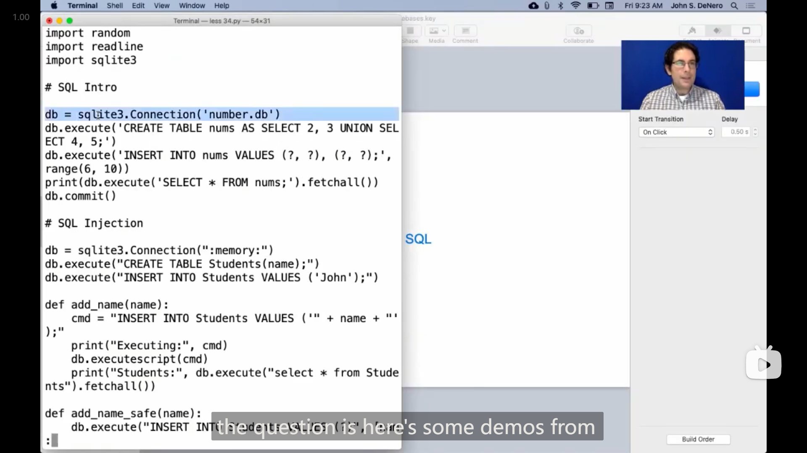

# Lecture 33 --- HW 09

## Lecture 33 Aggregation

### 1

{ loading=lazy }

sql中的*聚合函数 Aggregation function* ，可以使用多行的数据进行处理，比如

-   `max` `min` 取最大/最小
-   `sum` 取所有数据的和
-   `avg` 取所有数据的平均值
-   `count` 获取数据的个数

在传入参数(列名)时，还可以在参数前添加 `distinct` ，表示这一列中重复的元素只取用一个，可以参考下图

{ loading=lazy }

---

{ loading=lazy }

{ loading=lazy }

*聚合函数*也可以和其他普通的表达式一起混合使用，来获取其他有用的信息(同一行数据的其他信息)，如上图中John的演示，

但有些*聚合函数*结果不会是某行数据中的数值，

::: info 引述
John:

...So, you have to be careful about selecting single values in conjunction with aggregations. Some aggregations give you a meaningful value, like `min` and `max` ; others don't, like `avg` .

---

John:

...当你与聚合函数一起选择单一值时，你必须小心。有些聚合函数会给你一个有意义的值，比如 `min` 和 `max` ，而其他一些却不会，比如 `avg` 。
:::

并且，从John的demo演示中可以看到，在使用 `min` 或 `max` 时，即使有多行数据都是最小/大值，但是却只是返回了一个结果

>   ```sql
>   sqlite> select max(legs), kind from animals;
>   4|cat
>   ```

### 2

{ loading=lazy }

{ loading=lazy }

*分组 group*

可以使用 `group by` 进行分组，在 `group by` 后写**(单个或多个)列名或表达式**，就会把每个相同的值对应的那一行分到同一个组，而如果使用*聚合函数*就会分别作用于每个组(而不是作用于整个表所有行的数据)，可以参考上图中John的demo演示

---

{ loading=lazy }

在*分组*时，还可以使用 `having` 来**对组进行筛选**(区别于 `where` 是对单行数据进行筛选)

## Lecture 33 Q&A

### 1

有人向John提问的mentor13(在网站上没找到)的一题，

::: info 引述
Fill in `skip-list` , which takes in a potentially nested list `lst` and a single-argument filter function `filter-fn` that returns a boolean when called, and goes through each element in order. It returns a new list that contains all elements that return true when passed into `filter-fn` . The returned list is *not nested*.

```scheme
;Doctests
scm> (skip-list '(1 (3)) even?)
()
scm> (skip-list'(1 (2 (3 4) 5) 6 (7) 8 9) odd?)
(1 3 5 7 9)
```

```scheme
(define (skip-list lst filter-fn)
    (define (helper lst lst-so-far next)
        (cond
            ((null? lst)
                (if (null? ______)
                    ______
                    ______)
            )
            ((pair? ______)
                (______))
            ((filter-fn (car lst))
                ______)
            (else
                ______)
        )
    )
    (helper ______)
)
```
:::

于是自己写了一下，

由于不清楚 `null?` 和 `pair?` 的作用，于是先试了一下，发现 `null?` 只在传入空列表 `nil` 或者 `()` 时才返回 `true` ，而 `pair?` 只在传入东西为列表，且列表不为空时返回 `true` (传入 `(())` 时也返回 `true` )。

最后写了好一会才写出来，这题有点复杂，因为需要把嵌套的列表给展开，

所以为了处理这样的情况，在进入更深层的列表时，就需要通过 `next` 参数来标记之前的位置(一开始还以为 `next` 指的是列表的之后的部分，但是想到这样的情况一般使用 `rest` 来命名)，

最好想的就是 `(filter-fn (car lst)` 和 `else` 两行，因为这两行就对应普通的情况，即列表不是嵌套的，那么就大概可以得到

```scheme
((filter-fn (car lst))
    (helper (cdr lst) (append lst-so-far (list (car lst))) next))
(else
    (helper (cdr lst) lst-so-far next))
```

>   这里我使用了scheme中的 `append` 函数，因为需要将符合筛选条件的元素拼接到 `lst-so-far` 的尾部，
>
>   `append` 函数的用法是传入**多个列表**，将他们按顺序拼到一起，所以这里的代码就写成了 `(list (car lst))` 
>
>   >   一开始写的是
>   >
>   >   ```scheme
>   >   (append lst-so-far (car lst))
>   >   ```
>   >
>   >   然后运行测试时就报错了😅
>   >
>   >   ```scheme
>   >   scm> (skip-list '(1 (3)) even?)
>   >   ()
>   >   scm> (skip-list '(1 (2 (3 4) 5) 6 (7) 8 9) odd?)
>   >   Traceback (most recent call last):
>   >     1     (append lst-so-far (car lst))
>   >   Error: argument 0 of append has wrong type (int)
>   >   ```

接着来处理 `pair?` 这个情况，根据刚才的两种情况大概就能猜到这里应该就是判断第一个元素是不是列表，所以 `(pair? (car lst))` ，

于是如果是第一个元素是列表，那么肯定需要向内继续走，可以猜到这种情况下递归调用的 `helper` 的第一个参数会是 `(car lst)` ，

然后最关键的地方在于，需要记住 `lst` 之后的元素，一开始我以为 `helper` 第三个参数就是 `(cdr lst)` ，但想到如果再有一层嵌套的列表，原本的 `next` 就会被覆盖丢失，

最后想了好久终于想到应该是把两者合并到一起(这样两者的信息都包含了)，所以

```scheme
((pair? (car lst))
    (helper (car lst) lst-so-far (cons (cdr lst) next)))
```

于是base case的情况就不难想了，结束递归时返回 `lst-so-far` 即可，

```scheme
((null? lst)

    (if (null? next)
        lst-so-far
        (helper (car next) lst-so-far (cdr next)))
)
```

所以 `skip-list` 中的那一行就是

```scheme
(helper lst nil nil)
```

完整的答案为

```scheme
(define (skip-list lst filter-fn)
    (define (helper lst lst-so-far next)
        (cond
            ((null? lst)
                (if (null? next)
                    lst-so-far
                    (helper (car next) lst-so-far (cdr next)))
            )
            ((pair? (car lst))
                (helper (car lst) lst-so-far (cons (cdr lst) next)))
            ((filter-fn (car lst))
                (helper (cdr lst) (append lst-so-far (list (car lst))) next))
            (else
                (helper (cdr lst) lst-so-far next))
        )
    )
    (helper lst nil nil)
)
```

---

John最后的答案和我的有些区别，他是使用了 `append` 来连接 `(cdr lst)` 和 `next` ，

```scheme
(helper (car lst) lst-so-far (append (cdr lst) next))
```

而base case中就是

```scheme
(if (null? next)
    lst-so-far
    (helper next lst-so-far nil))
```

::: details 代码
```scheme
(define (skip-list lst filter-fn)
    (define (helper lst lst-so-far next)
        (cond
            ((null? lst)
                (if (null? next)
                    lst-so-far
                    (helper next lst-so-far nil))
            )
            ((pair? (car lst))
                (helper (car lst) lst-so-far (append (cdr lst) next))
            ((filter-fn (car lst))
                (helper (cdr lst) (append lst-so-far (list (car lst))) next))
            (else
                (helper (cdr lst) lst-so-far next))
        )
    )
    (helper lst nil nil)
)
```
:::

---

而John又说到这题提供的代码框架中的 `helper` 函数，其实让这题变得复杂了， `lst-so-far` 对应着从头(左边)加载结果，而如果按照以往的思路，从末尾(右边)加载结果，会更简单，代码是

```scheme
(define (skip-list s f)
  (cond ((null? s) nil)
        ((list? (car s)) (append (skip-list (car s) f) (skip-list (cdr s) f)))
        ((f (car s)) (cons (car s) (skip-list (cdr s) f)))
        (else (skip-list (cdr s) f))))
```

### 2

有人提问的17年秋季的期末考试第6题

::: info 引述
**Simplify! Simplify!** For this problem, consider a very small subset of Scheme containing only **if** expression, `(if pred then=part else part)` , and atoms including symbols, `#t` for true, and `#f` for false. Such expressions can be simplified according to the following transformation rules. Here, `P` , `E1` , and `E2` are Scheme expressions in the subset, and `P'` , `E1'` , and `E2'` are their simplified versions.

-   The expression `(if P E1 E2)` simplified to
    -   `E1'` if `P'` is `#t` .
    -   `E2'` if `P'` is `#f` .
    -   `E1'` if `E1'` equals `E2`‘ .
    -   Otherwise, an `if` expression with `P'` , `E1'` , and `E2'` as the predicate, then-part, and else-part.
-   Any expression, `E` , simplies to `#t` if `E` is *known to be true* (see below); or to `#f` if it is *known to be false*.
-   Finally, in the expression `(if P E1 E2)` , `P'` is known to be true while simplifying `E1` and is known to be false while simplifying `E2` . Initially, only `#t` is known to be true and only `#f` is known to be false.

Fill in the blanks on the next page so that `(simp E)` returns the simplied version of `E` according to these rules, and the helper function `(simp-ontext E known-t known-f)` returns the simpliation of `E` given that `known-t` is a list of expressions known to be true, and `known-f` is a list of expressions known to be false.

For convenience, assume that `(nth k L)` is defined to return element *k* of list `L` (where 0 is the first), and that `(in? E L)` is defined to return true if and only if *E* is `equal?` to a member of the list *L*.

```scheme
scm> (simp '(if a b c))
(if a b c)
scm> (simp '(if a b b))
b
scm> (simp '(if #t (if #f a b) c))
b
scm> (simp '(if a (if a b c) (if a d e)))
(if a b e)
scm> (simp '(if (if #t a b) (if a d e) f))
(if a d f)
scm> (simp '(if (if a b b) (if b c d) (if e f f)))
(if b c f)
scm> (simp '(if (if a b c) (if (if a b c) x y) (if (if a b c) y z)))
(if (if a b c) x z)
scm> (simp '(if (if a b c) (if (if a (if a b b) c) d e) f))
(if (if a b c) d f)
```

```scheme
(define (simp expr)
    (simp-context expr ______ ______))

(define (simp-context expr known-t known-f)
    (define simp-expr (if (pair? expr)
                        (simp-if (nth 1 expr) (nth 2 expr) (nth 3 expr) known-t known-f)
                        expr))
    (cond (______ #t)
        (______ #f)
        (else ______)))

(define (simp-if pred then-part else-part known-t known-f)
    (let ((simp-pred (simp-context pred ______)))
    (define simp-then
        ______)
    (define simp-else
        ______)
    (cond ((equal? simp-pred #t) simp-then)
            (______ simp-else)
            (______ simp-then)
            (else ______))))
```
:::

于是自己写了一下

>   题目中提到但解释器中并没有的两个函数 `nth` 和 `in?` ，于是我自己用代码实现
>
>   ```scheme
>   (define (nth k L)
>    (if (= k 0)
>        (car L)
>        (nth (- k 1) (cdr L))))
>   
>   (define (in? E L)
>    (cond ((null? L) false)
>          ((equal? E (car L)) true)
>          (else (in? E (cdr L)))))
>   ```
>

看完了题目感觉没明白需要干什么😅，但看到提供的例子就明白了。

题目是要实现化简 `if` 表达式的函数，

```scheme
scm> (simp '(if a b b))
b
scm> (simp '(if #t (if #f a b) c))
b
```

这两个例子展示了最简单的能化简的情况，

-   如果满足和不满足条件，返回的两种结果是一样的，那么直接表达式可以化简成这个结果
-   如果条件**可以确定为真**，那么就返回 满足时的表达式的**简化版** ，而如果**可以确定为假**，就返回 不满足时的表达式的**简化版**

而更复杂的情况可以参考第4个例子

```scheme
scm> (simp '(if a (if a b c) (if a d e)))
(if a b e)
```

>   一开始看到这个例子没想明白要如何实现这样的操作，但之后看到了代码就明白了

在这个例子中，需要理解一个**关键之处**， `(if a b c)` 能转变成 `b` ，是因为如果已经进入到需要运算 `(if a b c)` 表达式时，**说明 `a` 已经确定为真了**(因为联系到题目中说到 `known-t` 和 `known-f` 是 确定为真/假的表达式的列表)

然后看代码，核心的部分是 `simp-if` 再是 `simp-context` ，看到 `simp-if` 中的这一行，

```scheme
(let ((simp-pred (simp-context pred ______))) ...)
```

我就明白了，`simp-context` 是用来**化简单个表达式**，继而明白 `simp-if` 是用来化简 `if` 表达式的，

因此大概可以猜出，这一行的空应该就是最简单的 `known-t known-f` ，继而又很容易可以想到 `simp-then` 和 `simp-else` 也需要调用 `simp-context` 并各自把 `pred` 加上

```scheme
(define simp-then
  (simp-context then-part (cons simp-pred known-t) known-f))
(define simp-else
  (simp-context else-part known-t (cons simp-pred known-f)))
```

于是最后的 `cond` 中，就对应题目中的四个情况，不难写出代码，但需要注意均要使用化简之后的表达式，其中最后一种情况对应不能化简的情况，则需要把各个部分重新(用 `list` )拼成 `if` 表达式，

```scheme
(cond ((equal? simp-pred #t) simp-then)
      ((equal? simp-pred #f) simp-else)
      ((equal? simp-then simp-else) simp-then)
      (else (list 'if simp-pred simp-then simp-else)))))
```

然后 `simp-context` 中，就是需要判断化简后的表达式 `simp-expr` (给了肯定有用肯定是要用上的😅)是不是在 `known-t` 或者 `known-f` 中，

```scheme
(cond ((in? simp-expr known-t) #t)
      ((in? simp-expr known-f) #f)
      (else simp-expr)))
```

最后的 `simp` 中就很容易了，

所以完整的代码是这样

```scheme
(define (simp expr)
  (simp-context expr '(#t) '(#f)))

(define (simp-context expr known-t known-f)
  (define simp-expr (if (pair? expr)
                        (simp-if (nth 1 expr) (nth 2 expr) (nth 3 expr) known-t known-f)
                        expr))
  (cond ((in? simp-expr known-t) #t)
        ((in? simp-expr known-f) #f)
        (else simp-expr)))

(define (simp-if pred then-part else-part known-t known-f)
  (let ((simp-pred (simp-context pred known-t known-f)))
    (define simp-then
      (simp-context then-part (cons simp-pred known-t) known-f))
    (define simp-else
      (simp-context else-part known-t (cons simp-pred known-f)))
    (cond ((equal? simp-pred #t) simp-then)
          ((equal? simp-pred #f) simp-else)
          ((equal? simp-then simp-else) simp-then)
          (else (list 'if simp-pred simp-then simp-else)))))
```

感觉这题还是挺有意思的

### 3

在测试scheme代码时发现，课程(之前hw和lab中)提供的scheme解释器中内置了加载 `.scm` 文件的函数 `load` ，

发现了几种加载的方式，

-   1

    ```scheme
    (load "文件名")
    ```

-   2

    ```scheme
    (load '文件名)
    ```

以及，如果不添加文件后缀名，会默认认为是scm文件，即会自动添加 `.scm`

```scheme
scm> (load "a")
Traceback (most recent call last):
  0     (load "a")
Error: [Errno 2] No such file or directory: 'a.scm' 
scm> (load '../a)  
Traceback (most recent call last):
  0     (load (quote ../a))
Error: [Errno 2] No such file or directory: '../a.scm' 
```

## Lecture 34 Database

### 1

{ loading=lazy }

sql中创建数据表的操作，

John说到，只需要掌握部分即可(图中黑色的部分)

---

{ loading=lazy }

删除表的操作

---

{ loading=lazy }

在表上的插入的操作

---

John的demo演示

```sql
sqlite> create table primes(n, prime);
sqlite> drop table if exists primes;
sqlite> select * from primes;
Error: no such table: primes
sqlite> create table primes(n UNIQUE, prime DEFAULT 1);
sqlite> select * from primes;
sqlite> INSERT INTO primes VALUES (2, 1), (3, 1);
sqlite> select * from primes;
2|1
3|1
sqlite> INSERT INTO primes(n) VALUES (4), (5), (6), (7);
sqlite> select * from primes;
2|1
3|1
4|1
5|1
6|1
7|1
sqlite> INSERT INTO primes(n) SELECT n+6 FROM primes;
sqlite> select * from primes;
2|1
3|1
4|1
5|1
6|1
7|1
8|1
9|1
10|1
11|1
12|1
13|1
sqlite> INSERT INTO primes(n) SELECT n+12 FROM primes;
sqlite> select * from primes;
2|1
3|1
4|1
5|1
6|1
7|1
8|1
9|1
10|1
11|1
12|1
13|1
14|1
15|1
16|1
17|1
18|1
19|1
20|1
21|1
22|1
23|1
24|1
25|1
```

---

{ loading=lazy }

更新表中列的数据的操作 `update`

John的demo演示

```sql
sqlite> UPDATE primes SET prime=0 WHERE n>2 AND n%2=0;
sqlite> select * from primes;
2|1
3|1
4|0
5|1
6|0
7|1
8|0
9|1
10|0
11|1
12|0
13|1
14|0
15|1
16|0
17|1
18|0
19|1
20|0
21|1
22|0
23|1
24|0
25|1
sqlite> UPDATE primes SET prime=0 WHERE n>3 AND n%3=0;
sqlite> UPDATE primes SET prime=0 WHERE n>5 AND n%5=0;
sqlite> select * from primes;
2|1
3|1
4|0
5|1
6|0
7|1
8|0
9|0
10|0
11|1
12|0
13|1
14|0
15|0
16|0
17|1
18|0
19|1
20|0
21|0
22|0
23|1
24|0
25|0
```

---

{ loading=lazy }

表中删除的操作

John的demo演示

```sql
sqlite> DELETE FROM primes WHERE prime=0;
sqlite> select * from primes;
2|1
3|1
5|1
7|1
11|1
13|1
17|1
19|1
23|1
```

### 2

John demo演示了如何在python中使用sql

{ loading=lazy }

-   使用 `sqlite3.Connection("xxx.db")` 来加载db文件，然后会返回一个 `Connection` 类的实例

    >   db文件是*数据库 database*文件

-   使用 `execute` 方法可以执行sql的命令/语句

    并且，可以有如上图中的这样的操作

    ```python
    db.execute("INSERT INTO nums VALUES (?), (?), (?);", range(4, 7))
    ```

-   调用 `execute` 方法，方法的返回值有 `fetchall` 方法，可以将本来应该显示的数据转换成元组，如上图中的

    ```python
    print(db.execute("SELECT * FROM nums;").fetchall())
    ```

    ```bash
    ~/lec$ python3 ex.py
    [(2,), (3,), (4,), (5,), (6,)]
    ```

-   使用 `commit` 方法可以将数据储存到对应的db文件中，如果没有这个文件会新建一个文件，上图John的demo演示中，运行 `python3 ex.py` 前已经运行 `rm n.db` 命令

### 3

{ loading=lazy }

John说道，为了避免在python中使用sql，插入某些特殊的名字而引发的一些错误，要(如上图)使用 `execute` 方法来插入名字，

而不是使用python的字符串拼接和 `executescript` 方法( `executescript` 方法会执行多行sql语句)

## Lecture 34 Q&A

### 1

{ loading=lazy }

John解释之前课上用python和sql模拟*赌场21点 Casino Blackjack*游戏的代码中的 `sqlite3.Connection` 类的具体作用

::: info 引述
John:

The question is, here are some demos from today's lecture. There's this line that's like "build a connection" to some database,

```python
db = sqlite3.Connection('number.db')
```

and then, you know, we give it a name – give it any name you want, "db" or "n" or something like that. What would happen if you evaluated this same expression a second time? Would that give you a new database or the same database, or would it erase the old one? Like, what's the story?

And the story is that this name, which describes the name of a file on your file system, is a database that won't ever just get erased. Instead, it's persistent. Even if you quit Python and start Python again, it will retain whatever information was in it before. If you evaluate this expression multiple times, then you just get multiple connections to the same database with the same data in it, and that's okay. Actually, databases are designed to have multiple connections.

And what do these connections mean? That means different programs might all be changing the database or querying the database at the same time. But that doesn't mean that the database is going to get refreshed or changed or something like that. It basically just stays there and accumulates information over time. If one program changes it and then another program queries it, that second program is going to see the changes from the first program.

So, I think within a particular Python program, there really isn't a good reason to have multiple connections. Usually, those multiple connections come from multiple Python programs, or maybe they're not all Python, but you certainly could do it, and I don't think anything would break.

---

John:

问题是，这里有今天讲座中的一些演示。有这样一行代码，类似于“建立一个连接”到某个数据库，

```python
db = sqlite3.Connection('number.db')
```

然后，你知道，我们给它一个名字 - 随便取个名字，比如“db”或“n”之类的。如果你多次评估相同的表达式会发生什么？这会给你一个新的数据库还是相同的数据库，或者会擦除旧的数据库？这是什么情况？

故事是，这个描述你文件系统上文件名的名称是一个数据库，它不会被轻易擦除。相反，它是持久的。即使你退出 Python 并重新启动 Python，它将保留之前的所有信息。如果你多次评估这个表达式，那么你只是得到对同一个数据库的多个连接，其中包含相同的数据，这是可以的。实际上，数据库被设计为具有多个连接。

那么这些连接意味着什么？这意味着不同的程序可能会同时更改数据库或查询数据库。但这并不意味着数据库会被刷新、更改或类似的事情。它基本上就在那里，并随着时间累积信息。如果一个程序更改了它，然后另一个程序查询它，那么第二个程序将看到第一个程序的更改。

因此，我认为在一个特定的 Python 程序中，没有真正需要有多个连接的好理由。通常，这些多个连接来自多个 Python 程序，或者它们并非全部都是 Python，但你当然可以这样做，我认为不会有什么问题。
:::

### 2

{ loading=lazy }

有人提问scheme中在 `let` 中的 `define` 是否会影响到全局框架，

John进行演示，发现 **`let` 语句中嵌套的 `define` 语句并不会修改上一层框架，而只会修改 `let` 的框架**

```scheme
scm> (let ((x 1)) (define a x) (+ x 1))
2
scm> a
Traceback (most recent call last):
  0     a
Error: unknown identifier: a
scm> (let ((x 1)) (define a x) (+ x a))
2
```

### 3

{ loading=lazy }

有人提问sql中 `select` 能不能嵌套在 `where` 中，于是John演示了一种用法

```sql
sqlite> CREATE TABLE numbers AS SELECT 1 AS n UNION SELECT 2 UNION SELECT 3 UNION SELECT 5;
sqlite> SELECT * FROM numbers;
1
2
3
5
sqlite> SELECT * FROM numbers WHERE (SELECT MAX(n) FROM NUMBERS) > n;
1
2
3
```

一开始还没理解这是什么意思😅，看了一会之后才明白，括号内的 `select` 语句大概是从原来的表创建了一行新的数据，然后用这行新的数据在 `where` 中进行筛选，所以这里 `MAX(n)` 最后获得的是5，而小于5的只有1 2 3

但是觉得这种用法确实如同John说的一样没什么太大的作用😅

## HW 09

### 1

Q2中，一开始想的是判断父母在不在 `parents` 中，但最后发现排序需要按照父母的身高来排序，所以发现只能判断子女在不在 `parents` 中，

并且需要注意的是，是从高到矮排序，所以需要乘一个 `-1` (一开始没注意结果刚好反过来了😅)

::: details 代码
```sql
CREATE TABLE by_parent_height AS
    select a.child from parents as a, dogs as b
    where b.name = a.parent order by b.height*-1;
```
:::

### 2

Q3题目的提示中提到sql中连接字符串要使用 `||`

>   **Hint**: In order to concatenate two strings into one, use the `||` operator.

::: details 代码
```sql
CREATE TABLE siblings AS
    select a.child as first_child, b.child as second_child from parents as a, parents as b
    where a.child < b.child and a.parent = b.parent;

CREATE TABLE sentences AS
    select "The two siblings, "||a.first_child||" plus "||a.second_child||" have the same size: "||b.size 
    from siblings as a, size_of_dogs as b, size_of_dogs as c 
    where a.first_child = b.name and a.second_child = c.name and b.size = c.size;
```
:::
