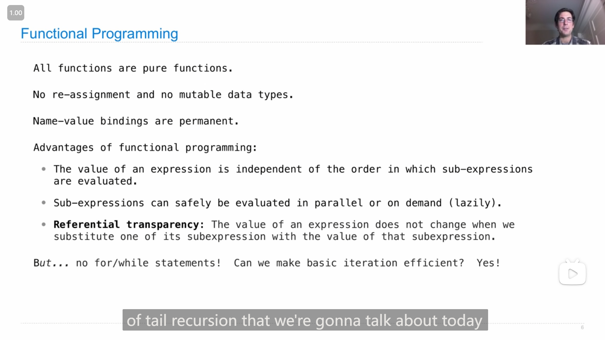
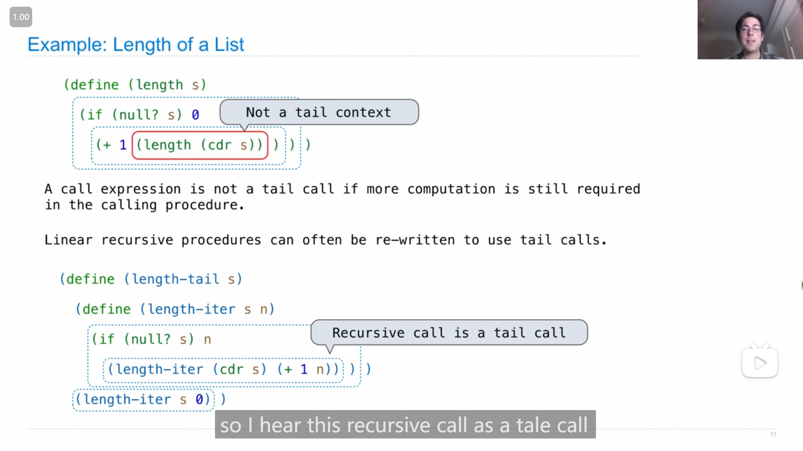
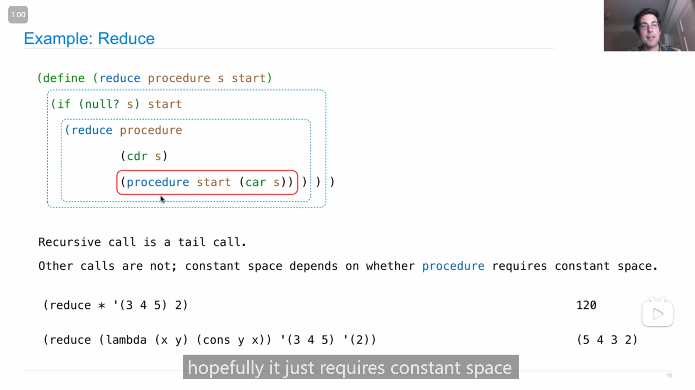
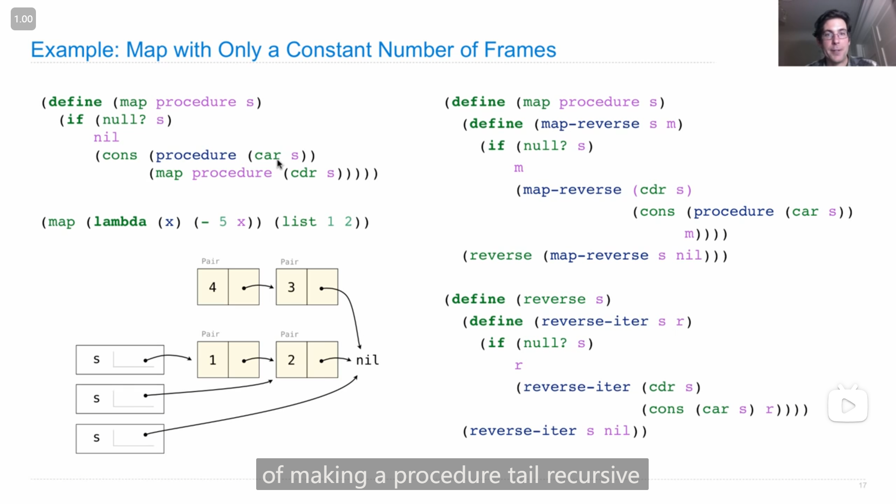
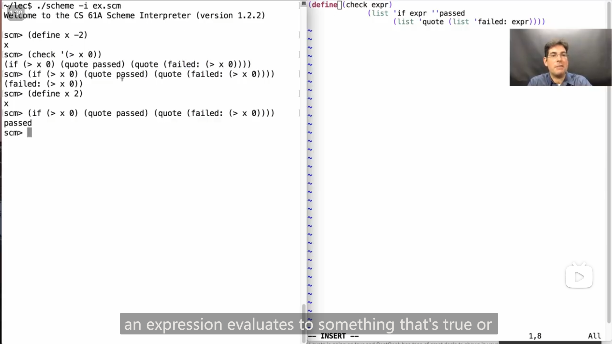

# Lecture 35 --- Lab 14

## Lecture 35 Tail Calls

### 1

John介绍了一下 *函数式编程 Functional Programming*

{ loading=lazy }

>   所有的函数都是纯函数。
>
>   没有重新赋值，也没有可变的数据类型。
>
>   名称-值的绑定是永久的。
>
>   函数式编程的优势：
>
>   -   表达式的值与子表达式求值的顺序无关。
>   -   子表达式可以安全地并行或按需(惰性地)进行求值。
>   -   **引用透明性**：当我们用子表达式的值替换该子表达式的值时，表达式的值不会改变。

### 2

John提到了区分出尾调用的一种方法，

::: info 引述
John:

...It's a distinction that figures out whether, when one procedure is calling another procedure, is there more work to do when that called procedure is finished or not. If there isn't anything else to do, besides just return the value of the expression you call, well then that's a tail call.

---

John:

...这是一种区分的方法，用于确定当一个过程调用另一个过程时，调用的过程完成后是否还有其他工作要做。如果除了返回你调用的表达式的值之外没有其他事情要做，那么这就是一个尾调用。
:::

然后又介绍了尾调用的一些特征

{ loading=lazy }

### 3

{ loading=lazy }

John说道 是*线性递归 linear recursion*但不是/不满足尾调用格式的函数，可以被改写成尾递归/尾调用的形式，并用求链表长度的函数来说明

### 4

John举了几个例子说明**是尾递归**的函数是什么样的

{ loading=lazy }

### 5

{ loading=lazy }

John在用 `reduce` 函数讲解尾调用，说在 `reduce` 的实现中，除了 `(procedure start (car s))` 都是尾调用，而最终 `reduce` 是否只需使用固定大小的空间 取决于 `procedure` 是否使用固定大小的空间

### 6

{ loading=lazy }

John讲解如何将 `map` 函数改写成尾递归的形式，

大致的思路是，先将应用函数到目标链表上，得到一个倒序的链表(因为要尾递归的话就只能从尾部开始)，然后再将倒序的链表的顺序转换回来( `reverse` 函数)，而这个过程也是尾递归的，所以整个 `map` 就实现了尾递归的形式

## Lab 13

### 1

发现这个lab的zip中的 `sqlite_shell.py` 文件和lab12中一样是**空的**

### 2

在写Q3时，发现 `where` 放在 `group by` 之后会报错，

```sql
near "where": syntax error
```

然后调整了一下顺序之后就好了

::: details 代码
```sql
create table helper as
    select a.name as name, min(a.MSRP/a.rating), b.store as store 
    from products as a, lowest_prices as b where a.name = b.item group by category;

CREATE TABLE shopping_list AS
    -- SELECT "REPLACE THIS LINE WITH YOUR SOLUTION";
    select name, store from helper;
```
:::

## Lecture 36 Macros

### 1

{ loading=lazy }

关于 *宏 Macro* 的一些说明

>   宏调用表达式的求值过程:
>
>   -   计算操作符子表达式，其结果为一个宏
>   -   对操作数表达式进行调用，<u>*而不先对它们进行求值*</u>
>   -   计算从宏过程返回的表达式

### 2

{ loading=lazy }

John演示了如果不使用*宏*，就无法实现 `twice` 函数，

### 3

John演示了使用 `define-macro` 和 `define` 应用于同样的代码的不同效果

{ loading=lazy }

{ loading=lazy }

## Lecture 36 Q&A

### 1

有人提问19年秋季期末考试第6题c题，

::: info 引述
**(20 points) Palindromes**

**Definition.** A palindrome is a sequence that has the same elements in normal and reverse order.

**(a) (3 pt)** Implement `pal` , which takes a positive integer `n` and returns a positive integer with the digits of `n` followed by the digits of `n` in reverse order.

**Important:** You may not write `str` , `repr` , `list` , `tuple` , `[` , or `]` .

```python
def pal(n):
    """Return a palindrome starting with n.

    >>> pal(12430)
    1243003421
    """
    m = n
    while m:
        n, m = ____________________________________ , ____________________________________
    return n
```

**(b) (4 pt)** Implement `contains` , which takes non-negative integers `a` and `b` . It returns whether all of the digits of a also appear in order among the digits of `b` .

**Important:** You may not write `str` , `repr` , `list` , `tuple` , `[` , or `]` .

```python
def contains(a, b):
    """Return whether the digits of a are contained in the digits of b.

    >>> contains(357, 12345678)
    True
    >>> contains(753, 12345678)
    False
    >>> contains(357, 37)
    False
    """
    if a == b:
        return True
    if ________________________________________ > _________________________________________:
        return False
    if ________________________________________ == ________________________________________:
        return contains( _______________________________ , _______________________________ )
    else:
        return contains( _______________________________ , _______________________________ )
```

**(c) (6 pt)** Implement `big` , a helper function for `biggest_palindrome` . The `biggest_palindrome` function takes a non-negative integer `n` and returns the largest palindrome integer with an even number of digits that appear among the digits of `n` in order. If there is no even-length palindrome among the digits of `n` , then `biggest_palindrome(n)` returns 0. You may call `pal` and `contains` . 

**Important:** You may not write `str` , `repr` , `list` , `tuple` , `[` , or `]` .

```python
def biggest_palindrome(n):
    """Return the largest even-length palindrome in n.

    >>> biggest_palindrome(3425534)
    4554
    >>> biggest_palindrome(126130450234125)
    21300312
    """
    return big(n, 0)

def big(n, k):
    """A helper function for biggest_palindrome."""
    if n == 0:
        return 0
    choices = [big( _________________ , k) , big( _________________ , _________________ )]
    if contains(k, ______________________________________________________________________):
        __________________________________________________________________________________
    return max(choices)
```

**(d) (1 pt)** Circle the term that fills in the blank: the `is_palindrome` function defined below runs in \_\_\_\_ time in the length of its input.

-   Constant
-   Logarithmic
-   Linear
-   Quadratic
-   Exponential
-   None of these

```python
def is_palindrome(s):
    """Return whether a list of numbers s is a palindrome."""
    return all([s[i] == s[len(s) - i - 1] for i in range(len(s))])
```

Assume that `len` runs in constant time and `all` runs in linear time in the length of its input. Selecting an element of a list by its index requires constant time. Constructing a `range` requires constant time.

**(e) (6 pt)** Implement `outer` , a helper function for `palinkdrome` . The `palinkdrome` function takes a positive integer `n` and returns a one-argument function that, when called repeatedly `n` times, returns a `Link` containing the sequence of arguments to the repeated calls followed by that sequence in reverse order. The `Link` class appears on Page 2 (left column) of the Midterm 2 study guide.

```python
def palinkdrome(n):
    """Return a function that returns a palindrome starting with the args of n repeated calls.
    >>> print(palinkdrome(3)(5)(6)(7))
    <5 6 7 7 6 5>
    >>> print(palinkdrome(1)(4))
    <4 4>
    """
    return outer(Link.empty, n)

def outer(r, n):
    def inner(k):
        s = Link(k, ______________________________________________________________)
        if n == 1:
            t = __________________________________________________________________
            while s is not Link.empty:
                t, s = Link(________________, ________________) , ________________
            return t
        else:
            return ____________________________________________________________
    return ________________________________________________________________________
```
:::

>   ```python
>   class Link:
>       """A linked list.
>   
>       >>> s = Link(1)
>       >>> s.first
>       1
>       >>> s.rest is Link.empty
>       True
>       >>> s = Link(2, Link(3, Link(4)))
>       >>> s.first = 5
>       >>> s.rest.first = 6
>       >>> s.rest.rest = Link.empty
>       >>> s                                    # Displays the contents of repr(s)
>       Link(5, Link(6))
>       >>> s.rest = Link(7, Link(Link(8, Link(9))))
>       >>> s
>       Link(5, Link(7, Link(Link(8, Link(9)))))
>       >>> print(s)                             # Prints str(s)
>       <5 7 <8 9>>
>       """
>       empty = ()
>   
>       def __init__(self, first, rest=empty):
>           assert rest is Link.empty or isinstance(rest, Link)
>           self.first = first
>           self.rest = rest
>   
>       def __repr__(self):
>           if self.rest is not Link.empty:
>               rest_repr = ', ' + repr(self.rest)
>           else:
>               rest_repr = ''
>           return 'Link(' + repr(self.first) + rest_repr + ')'
>   
>       def __str__(self):
>           string = '<'
>           while self.rest is not Link.empty:
>               string += str(self.first) + ' '
>               self = self.rest
>           return string + str(self.first) + '>'
>   ```

于是尝试自己写一下，发现确实c题难想😅，

我看到代码的时候，大概能想到他的大致想法/思路，但是不知到要如何用代码实现(跟他给的代码框架对不上)。

一开始看完了代码之后，我最先猜到的是 `choices` 这行的作用

```python
choices = [big(_________________, k), big(_________________, _________________ )]
```

我想到应该是**考虑最后一位是否算入回文数中/是否取用最后一位**，

>   比如 213123 这个数字，如果取用3，那么结果只能是33，如果不取用3的话，结果应是2112

并且将两种情况的结果都放到 `choices` 中，最后再选其中的最大值(对应 `return max(choices)` 这行代码)，

然后又注意到这是个递归的结构，所以应该是要将 `n // 10` 传入，所以大概猜测这行代码是这样

```python
choices = [big(n // 10, k), big(n // 10, k * 10 + n % 10)]
```

而在 `if` 中，感觉应该是满足一个什么条件，会把一个结果加到 `choices` 中，然后又根据之前写的代码中 `k` 只是回文的一半，所以感觉这行可能是

```python
choices += [pal(k)]
```

而由于我忽略了 `k * 10 + n % 10` 这里刚好**会 <mark>以倒过来的顺序</mark> 把原始数字的数位放到 `k` 上**，所以一开始在 `if` 的判断条件中，我写的是

```python
if contains(k, pal(n)):
```

但是测试时与正确结果不对

```python
Failed example:
    biggest_palindrome(126130450234125)
Expected:
    21300312
Got:
    2143223412
```

本来已经想不出要如何修改了，但随便尝试修改了一下

```python
if contains(k, n):
```

然后惊奇地发现通过测试了😮，于是之后就想明白了原因

```python
def biggest_palindrome(n):
    """Return the largest even-length palindrome in n.

    >>> biggest_palindrome(3425534)
    4554
    >>> biggest_palindrome(126130450234125)
    21300312
    """
    return big(n, 0)

def big(n, k):
    """A helper function for biggest_palindrome."""
    if n == 0:
        return 0
    choices = [big(n // 10, k), big(n // 10, k * 10 + n % 10)]
    if contains(k, n):
        choices += [pal(k)]
    return max(choices)
```

所有的题目的代码

::: code-group

```python [(a)]
def pal(n):
    """Return a palindrome starting with n.

    >>> pal(12430)
    1243003421
    """
    m = n
    while m:
        n, m = n * 10 + m % 10, m // 10
    return n
```

```python [(b)]
def contains(a, b):
    """Return whether the digits of a are contained in the digits of b.

    >>> contains(357, 12345678)
    True
    >>> contains(753, 12345678)
    False
    >>> contains(357, 37)
    False
    """
    if a == b:
        return True
    if a > b:
        return False
    if a % 10 == b % 10:
        return contains(a // 10, b // 10)
    else:
        return contains(a, b // 10)
```

```python [(c)]
def biggest_palindrome(n):
    """Return the largest even-length palindrome in n.

    >>> biggest_palindrome(3425534)
    4554
    >>> biggest_palindrome(126130450234125)
    21300312
    """
    return big(n, 0)

def big(n, k):
    """A helper function for biggest_palindrome."""
    if n == 0:
        return 0
    choices = [big(n // 10, k), big(n // 10, k * 10 + n % 10)]
    if contains(k, n):
        choices += [pal(k)]
    return max(choices)
```

```python [(e)]
def palinkdrome(n):
    """Return a function that returns a palindrome starting with the args of n repeated calls.
    >>> print(palinkdrome(3)(5)(6)(7))
    <5 6 7 7 6 5>
    >>> print(palinkdrome(1)(4))
    <4 4>
    """
    return outer(Link.empty, n)

def outer(r, n):
    def inner(k):
        s = Link(k, r)
        if n == 1:
            t = s
            while s is not Link.empty:
                t, s = Link(s.first, t), s.rest
            return t
        else:
            return outer(s, n - 1)
    return inner
```

:::

---

有人问道John是如何处理这个问题的，下面是John的解释

::: info 引述
John:

Yeah, great question. So how do you approach this problem? What are the steps? Um, one is to recognize that there's a tree recursion problem. You could do that from the syntax because there are two calls to `big` , or you could do that from the kind of nature of the problem, which is they were doing some search among all the possible subsets of digits in here. Which one's the biggest looks like a tree recursion problem. Um, so you have to look for a way to distill that into a sequence of choices.

And, uh, a common sequence of choices that you have is to keep the last digit or you don't. I mean, we've seen that in a few different examples. Um, but and so it happens to apply here. Sometimes it's not clear what kind of sequence of choices you need to make, but that is a big part of solving a tree recursion problem. So, um, yeah, how you figure out what that choice is is to think about all the different possibilities that you need to consider. So, all the different palindromes within here, and how would I enumerate that set? Well, all the ones that have a four at the end and all the ones that don't is a way of partitioning that set using an operation that I could repeat over and over again. So, that's how you kind of figure out what choice you're going to be making.

I guess that got us as far as thinking probably what we're going to do is call `big` where we keep the last digit and `big` where we don't. Now is the hard part, which is how are we going to represent this notion of keeping the last digit? It's not like we have a list called digits where we're appending the last digit to. Instead, what we're doing is we're effectively reassigning k. Here, k either stays the same or k includes one more digit than it was before. So, whenever you make a recursive call, a good way to think about what you're doing is that you're assigning these formal parameters to new values.

So, I guess that starts to explain what's going on here. The last piece is very problem-specific. How would you know that you've found a palindrome and therefore you want to consider that as one of the choices? You know, these two lines wouldn't show up in any other tree recursion problems. They're really just about palindromes because it happens to be that one way of describing a palindrome is that you find some digits within half the number, and then you make sure those digits also appear in the other half of the number in reverse order. How would you discover this? I guess, um, hopefully, the definition of the palindrome would get you there. Like, how do you describe a palindrome? It's like some digits, and then those digits also have to be contained in the other half of the number in reverse order.

---

John:

是的，这是一个很好的问题。那么你如何解决这个问题？有哪些步骤？嗯，首先要认识到这是一个树递归问题。你可以从语法上看出来，因为有两次对 `big` 的调用，或者你可以从问题的性质上看出来，他们在这里进行了一些搜索，搜索所有可能的数字子集，找出其中最大的一个，看起来像一个树递归问题。那么，你必须寻找一种将其归纳为一系列选择的方法。

而且，你通常会有一系列共同的选择，比如保留最后一位数字或者不保留。我的意思是，我们在几个不同的例子中都看到过。但是在某些情况下，不清楚需要做出什么样的选择，但这是解决树递归问题的一个重要部分。所以，嗯，你如何确定这个选择是什么，就是考虑你需要考虑的所有不同可能性。

所以，在这里面的所有不同回文数，我该如何枚举这个集合呢？嗯，所有以四结尾的回文数和所有不以四结尾的回文数是一种划分这个集合的方法，使用一个可以一遍又一遍重复的操作。所以，这就是你如何想出你将要做出的选择的方式。

我想，这让我们想到，我们可能要做的事情是调用保留最后一位数字的 `big` ，和不保留的 `big` 。现在，困难的部分来了，就是我们如何表示保留最后一位数字的这个概念呢？这不像我们有一个名为digits的列表，我们在其中添加最后一位数字。相反，我们正在有效地重新分配k。在这里，k要么保持不变，要么比以前多包含一位数字。所以，每当你进行递归调用时，思考你正在做的事情的一个好方法是，你正在将这些形式参数赋予新的值。

所以，我想这开始解释这里发生了什么。最后一块是非常特定于问题的。你如何知道找到了一个回文数，因此你想把它视为选择之一？你知道，这两行不会出现在任何其他树递归问题中。它们实际上只涉及回文数，因为碰巧描述回文数的一种方式是，在数字的一半中找到一些数字，然后确保这些数字也以相反的顺序出现在数字的另一半中。你如何发现这一点呢？我想，希望回文数的定义会让你明白。就像，你如何描述一个回文数，就是一些数字，然后这些数字也必须包含在数字的另一半中，并且是相反的顺序。
:::

### 2

有人提问19年夏季期末考试的第8题

::: info 引述
**(10 points) The Big SQL**

The `ingredients` table describes the `dish` and `part` for each part of each dish at a restaurant. The `shops` table describes the `food` , `shop` , and `price` for each part of a dish sold at each of two shops. All ingredients (parts) are sold by both shops, and each ingredient will only appear once for each shop. Write your SQL statements so that they would still be correct if table contents changed. You can assume the shops table will only ever contain two shops ( `A` and `B` ).

```sql
CREATE TABLE ingredients AS
    SELECT "chili" AS dish, "beans" AS part UNION
    SELECT "chili"        , "onions"        UNION
    SELECT "soup"         , "broth"         UNION
    SELECT "soup"         , "onions"        UNION
    SELECT "beans"        , "beans";

CREATE TABLE shops AS
    SELECT "beans" AS food, "A" AS shop, 2 AS price UNION
    SELECT "beans"        , "B"        , 2 AS price UNION
    SELECT "onions"       , "A"        , 3          UNION
    SELECT "onions"       , "B"        , 2          UNION
    SELECT "broth"        , "A"        , 3          UNION
    SELECT "broth"        , "B"        , 5;
```

**(a) (2 pt)**  Select a two-column table with one row per food that describes the lowest price for each food.

```sql
SELECT food, _________________ FROM shops ________________________;
```

```sql
beans|2
broth|3
onions|2
```

**(b) (4 pt)** Select a two-column table with one row per dish that describes the total cost of each dish if all parts are purchased from shop A.

```sql
SELECT ________________________ FROM _____________________________
    WHERE __________________________________________________________;
```

```sql
beans|2
chili|5
soup|6
```

**(c) (4 pt)** In two different ways, select a one-column table of all foods that have a different price at each store.

```sql
SELECT _________ FROM __________________________________, __________________________________
    WHERE ____________________________________________________________________________________;
SELECT _________ FROM shops GROUP BY _______________________________________________________;
```

```sql
onions
broth
```
:::

自己做了一下这题，最后感觉除了c题中要实现的第二种方法，其他都不是很难

>   ```bash
>   python sqlite_shell.py -i test.sql
>   ```

::: code-group

```sql [(a)]
SELECT food, min(price) FROM shops GROUP BY food;
```

```sql [(b)]
SELECT a.dish, sum(b.price) FROM ingredients AS a, shops AS b
    WHERE a.part = b.food AND b.shop = "A" GROUP BY a.dish;
```

```sql [(c)]
SELECT a.food FROM shops AS a, shops AS b
    WHERE a.food = b.food AND a.shop < b.shop AND a.price != b.price;
SELECT food FROM shops GROUP BY food HAVING min(price) != max(price);
```

:::

---

看了John的解答，发现他c题的第二种写法比我更简洁一些

```sql
SELECT food FROM shops GROUP BY food HAVING MIN(price) != MAX(price);
```

## Lab 14

### 1

Q1，需要注意没有返回值(从测试文档中可以得知)

::: details 代码
```python
def prune_min(t):
    "*** YOUR CODE HERE ***"
    if t.is_leaf():
        return
    min_b = min(t.branches, key=lambda t: t.label)
    prune_min(min_b)
    t.branches = [min_b]
```
:::

### 2

Q2这题没有给例子，所以导致我一开始没理解准确题目的意思😅，理解准确了就不是很难了，

这是两个测试的例子

```scheme
scm> (car (split-at '(1 2 3 4 5) 3))
(1 2 3)
scm> (cdr (split-at '(1 2 3 4 5) 3))
(4 5)
```

::: details 代码
```scheme
(define (split-at lst n)
    'YOUR-CODE-HERE
    (if (or (null? lst) (= n 0))
        (cons nil lst)
        (let ((rest (split-at (cdr lst) (- n 1))))
            (cons (cons (car lst) (car rest)) (cdr rest))))
)
```
:::

### 3

Q3这题有点难想，我想了一会才想出代码

::: details 代码
```scheme
(define (compose-all funcs)
    'YOUR-CODE-HERE
    (if (null? funcs)
        (lambda (x) x)
        (lambda (x) ((compose-all (cdr funcs)) ((car funcs) x))))
)
```
:::

### 4

Q4这题挺难的，想了好久才想出来

一开始以为，需要将列表中的元素一个一个递归地去除来判断(可能是scheme写多了的原因😅)，然后尝试了很久都没有思路，

在重新理解这个例子时，

```python
>>> num_splits([1, 5, 4], 0)  # splits to [1, 4] and [5]
1
```

突然想到 `1 - 5 + 4 = 0` ，然后就想到了可以**通过给数字加上正负号来判断分到哪一边**，于是写了一个辅助函数

```python
def spliter(s, d, current_diff):
    if s == []:
        return 1 if current_diff >= 0 and current_diff <= d else 0
    else:
        return spliter(s[1:], d, current_diff + s[0]) + spliter(s[1:], d, current_diff - s[0])
```

判断 `current_diff >= 0` 本来是想通过这样来去掉相反顺序/边的一半(顺序相反的话最后的差值应该刚好是相反数)，但是就在 `num_splits([1, 5, 4], 0)` 这个例子中，重复的另一半**差值也刚好是0**，于是最后得到了2

然后思考了一会后，修改成了直接算出包含重复的所有的情况，再除2就好了

::: details 代码
```python
def num_splits(s, d):
    "*** YOUR CODE HERE ***"
    def spliter(s, d, current_diff):
        if s == []:
            return 1 if abs(current_diff) <= d else 0
        else:
            return spliter(s[1:], d, current_diff + s[0]) + spliter(s[1:], d, current_diff - s[0])
    return spliter(s, d, 0) // 2
```
:::

### 4

Q6，这题题目看着比较复杂，但其实大概的代码框架基本上都已经写好了，需要填充的部分思路和之前的一题大致上是类似的，所以最后写起来还是比较好写的

写的过程中发现，**python中字符串不能用 切片赋值**

```python
>>> align_skeleton(skeleton="i", code="i")
Traceback (most recent call last):
  File "C:\Courses\cs61a\lab\lab14\lab14.py", line 189, in align_skeleton
    result, cost = helper_align(0, 0)
  File "C:\Courses\cs61a\lab\lab14\lab14.py", line 178, in helper_align
    match_match[0:0] = skel_char
TypeError: 'str' object does not support item assignment
```

::: details 代码
```python
def align_skeleton(skeleton, code):
    """
    Aligns the given skeleton with the given code, minimizing the edit distance between
    the two. Both skeleton and code are assumed to be valid one-line strings of code. 

    >>> align_skeleton(skeleton="", code="")
    ''
    >>> align_skeleton(skeleton="", code="i")
    '+[i]'
    >>> align_skeleton(skeleton="i", code="")
    '-[i]'
    >>> align_skeleton(skeleton="i", code="i")
    'i'
    >>> align_skeleton(skeleton="i", code="j")
    '+[j]-[i]'
    >>> align_skeleton(skeleton="x=5", code="x=6")
    'x=+[6]-[5]'
    >>> align_skeleton(skeleton="return x", code="return x+1")
    'returnx+[+]+[1]'
    >>> align_skeleton(skeleton="while x<y", code="for x<y")
    '+[f]+[o]+[r]-[w]-[h]-[i]-[l]-[e]x<y'
    >>> align_skeleton(skeleton="def f(x):", code="def g(x):")
    'def+[g]-[f](x):'
    """
    skeleton, code = skeleton.replace(" ", ""), code.replace(" ", "")

    def helper_align(skeleton_idx, code_idx):
        """
        Aligns the given skeletal segment with the code.
        Returns (match, cost)
            match: the sequence of corrections as a string
            cost: the cost of the corrections, in edits
        """
        if skeleton_idx == len(skeleton) and code_idx == len(code):
            return "", 0
        if skeleton_idx < len(skeleton) and code_idx == len(code):
            edits = "".join(["-[" + c + "]" for c in skeleton[skeleton_idx:]])
            return edits, len(skeleton) - skeleton_idx
        if skeleton_idx == len(skeleton) and code_idx < len(code):
            edits = "".join(["+[" + c + "]" for c in code[code_idx:]])
            return edits, len(code) - code_idx

        possibilities = []
        skel_char, code_char = skeleton[skeleton_idx], code[code_idx]
        # Match
        if skel_char == code_char:
            match_match, cost_match = helper_align(skeleton_idx + 1, code_idx + 1)
            match_match = skel_char + match_match
            possibilities .append((match_match, cost_match))
        # Insert
        match_insert, cost_insert = helper_align(skeleton_idx, code_idx + 1)
        # match_insert[0:0] = "+[" + code_char + "]"
        match_insert = "+[" + code_char + "]" + match_insert
        possibilities.append((match_insert, cost_insert + 1))
        # Delete
        match_delete, cost_delete = helper_align(skeleton_idx + 1, code_idx)
        # match_delete[0:0] = "-[" + skel_char + "]"
        match_delete = "-[" + skel_char + "]" + match_delete
        possibilities.append((match_delete, cost_delete + 1))
        return min(possibilities, key=lambda x: x[1])
    result, cost = helper_align(0, 0)
    return result
```
:::

### 5

Q8，这题一开始没看见需要用 `foldl` 或者 `foldr` 来实现，所以直接写出来了

```python
def filterl(lst, pred):
    "*** YOUR CODE HERE ***"
    if lst is Link.empty:
        return lst
    elif pred(lst.first):
        return Link(lst.first, filterl(lst.rest, pred))
    else:
        return filterl(lst.rest, pred)
```

之后用 `foldl` 实现了，但是感觉用了 `foldl` 的我的代码并没有比之前简单😅

```python
def filterl(lst, pred):
    "*** YOUR CODE HERE ***"
    def fn_pred(r, v):
        if not pred(v):
            return r
        elif r is Link.empty:
            return Link(v, r)
        else:
            r.rest = Link(v)
            return r
    return foldl(lst, fn_pred, Link.empty)
```

然后想了想，按照题目的意思，使用 `foldl` 或者 `foldr` 应该是能简化代码，又想到 `foldl` 中是将链表中的元素**从左到右**应用到 `fn` 中，所以 `foldr` 函数就应该(刚好相反)是**从右到左**应用链表中的元素，于是用代码实现了 `foldr` 

```python
def foldr(link, fn, z):
    """ Right fold """
    if link is Link.empty:
        return z
    return fn(foldr(link.rest, fn, z), link.first)
```

然后用 `foldr` 实现了这题(这样就简单多了😊)

```python
def filterl(lst, pred):
    "*** YOUR CODE HERE ***"
    return foldr(lst, lambda r, v: Link(v, r) if pred(v) else r, Link.empty)
```

---

之后去[21年秋季学期的lab14](https://inst.eecs.berkeley.edu/~cs61a/fa21/lab/lab14/)中，看到了实现 `foldr` 函数的题目[Fold Right](https://inst.eecs.berkeley.edu/~cs61a/fa21/lab/lab14/#q12-fold-right)

```python
def foldr(link, fn, z):
    """ Right fold
    >>> lst = Link(3, Link(2, Link(1)))
    >>> foldr(lst, sub, 0) # (3 - (2 - (1 - 0)))
    2
    >>> foldr(lst, add, 0) # (3 + (2 + (1 + 0)))
    6
    >>> foldr(lst, mul, 1) # (3 * (2 * (1 * 1)))
    6
    """
    "*** YOUR CODE HERE ***"
```

发现就跟我刚才想的一样，

不过需要注意的是， **`fn` 的两个参数的位置和我之前的实现是反过来的**，因此最后 `foldr` 和 `filterl` **正确的实现代码**应该是

```python
def foldr(link, fn, z):
    """ Right fold """
    if link is Link.empty:
        return z
    return fn(link.first, foldr(link.rest, fn, z))
```

```python
def filterl(lst, pred):
    "*** YOUR CODE HERE ***"
    return foldr(lst, lambda v, r: Link(v, r) if pred(v) else r, Link.empty)
```

### 6

Q9，这题有点意思，题目中说需要用到之前实现的 `foldl` 函数，并且只需要一行代码就可以实现了，

一开始我写的是

```python
return foldl(lst, lambda l, r: Link(l.first, r), Link.empty)
```

然后发生了报错

```python
Traceback (most recent call last):
  ...
  File "C:\Courses\cs61a\lab\lab14\lab14.py", line 237, in <lambda>
    return foldl(lst, lambda l, r: Link(l.first, r), Link.empty)
AttributeError: 'tuple' object has no attribute 'first'
```

然后意识到传入的 `fn` 应该原始的值在第一个参数位，于是修改了一下顺序

```python
return foldl(lst, lambda r, l: Link(l.first, r), Link.empty)
```

但是还是报错了

```python
AttributeError: 'int' object has no attribute 'first'
```

然后我意识到 `foldl` 函数中拿到的应该是 `lst` 的元素，于是最后就改好了

::: details 代码
```python
def reverse(lst):
    "*** YOUR CODE HERE ***"
    return foldl(lst, lambda r, l: Link(l.first, r), Link.empty)
```
:::

---

写完Q10之后尝试了一下 Extra for experience，即不适用 `Link` 构造函数来实现 `reverse` (可以不使用 `foldl` 和 `foldr` )，感觉还行，写了一个辅助函数就能实现了

::: details 代码
```python
def reverse(lst):
    "*** YOUR CODE HERE ***"
    def reverse_helper(lst, rest):
        if lst is Link.empty:
            return rest
        else:
            old_rest, lst.rest = lst.rest, rest
            return reverse_helper(old_rest, lst)
    return reverse_helper(lst, Link.empty)
```
:::

### 7

Q10，这题题目不难理解，但是代码的实现思路有点绕，我想了好一会才捋清楚(因为要把顺序反过来😅)

我最后是借助第一个测试用例来理解的，

```python
>>> lst = Link(3, Link(2, Link(1)))
>>> foldr(lst, sub, 0) # (3 - (2 - (1 - 0)))
```

>   把这个测试用例中的 `-` 看成是 `fn`

和

```python
>>> list = Link(3, Link(2, Link(1)))
>>> foldl2(list, sub, 0) # (((0 - 3) - 2) - 1)
```

在 `foldr` 中，到达链表的末尾时，就会直接返回初始值 `z` ，即 `identity` 函数，然后 `step` 就会接收到 `1` 和 `identity` (分别对应 `x` 和 `g` )，而在 `foldl2` 中，是需要把 `1` **<mark>套在最外面</mark>**，所以这里的 `step` 是需要返回一个 `f(?) = (? - 1)` 函数的函数，

而最后返回到了最开始时， `x` 对应 `3` ， `g` 就应该对应的是一个 `f(?) = ((? - 2) - 1)` 的函数，而这时会被传入 `foldl2` 的 `z` 和 `3` ，所以 `?` 对应的就是 `fn(z, x)` ，即 `step` 中应该是 `g(fn(z, x))` ，最后差不多就做出来了

::: details 代码
```python
def foldl2(link, fn, z):
    def step(x, g):
        "*** YOUR CODE HERE ***"
        return lambda z: g(fn(z, x))
    return foldr(link, step, identity)(z)
```
:::
