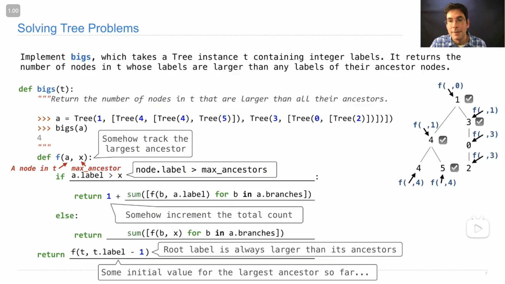
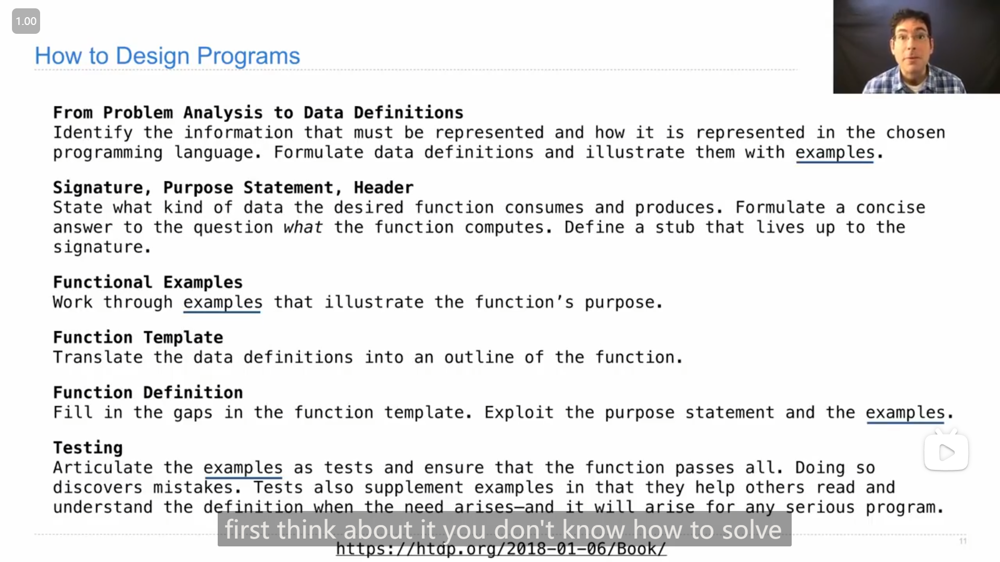
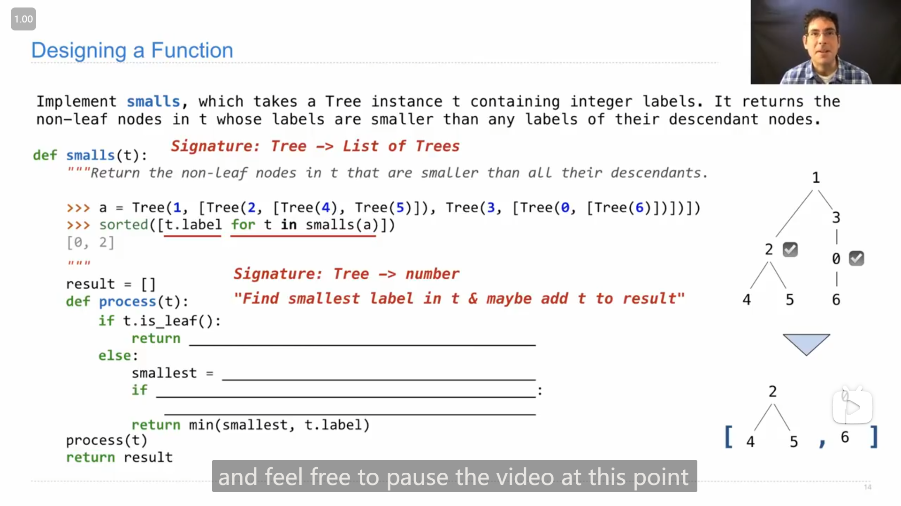

# Lecture 37 --- Lecture 38

## Lecture 37 Final Examples

### 1

{ loading=lazy }

尝试实现课上的这题

>   ```python
>   class Tree:
>       """
>       >>> t = Tree(3, [Tree(2, [Tree(5)]), Tree(4)])
>       >>> t.label
>       3
>       >>> t.branches[0].label
>       2
>       >>> t.branches[1].is_leaf()
>       True
>       """
>       def __init__(self, label, branches=[]):
>           for b in branches:
>               assert isinstance(b, Tree)
>           self.label = label
>           self.branches = list(branches)
>   
>       def is_leaf(self):
>           return not self.branches
>   
>       def map(self, fn):
>           """
>           Apply a function `fn` to each node in the tree and mutate the tree.
>   
>           >>> t1 = Tree(1)
>           >>> t1.map(lambda x: x + 2)
>           >>> t1.map(lambda x : x * 4)
>           >>> t1.label
>           12
>           >>> t2 = Tree(3, [Tree(2, [Tree(5)]), Tree(4)])
>           >>> t2.map(lambda x: x * x)
>           >>> t2
>           Tree(9, [Tree(4, [Tree(25)]), Tree(16)])
>           """
>           self.label = fn(self.label)
>           for b in self.branches:
>               b.map(fn)
>   
>       def __contains__(self, e):
>           """
>           Determine whether an element exists in the tree.
>   
>           >>> t1 = Tree(1)
>           >>> 1 in t1
>           True
>           >>> 8 in t1
>           False
>           >>> t2 = Tree(3, [Tree(2, [Tree(5)]), Tree(4)])
>           >>> 6 in t2
>           False
>           >>> 5 in t2
>           True
>           """
>           if self.label == e:
>               return True
>           for b in self.branches:
>               if e in b:
>                   return True
>           return False
>   
>       def __repr__(self):
>           if self.branches:
>               branch_str = ', ' + repr(self.branches)
>           else:
>               branch_str = ''
>           return 'Tree({0}{1})'.format(self.label, branch_str)
>   
>       def __str__(self):
>           def print_tree(t, indent=0):
>               tree_str = '  ' * indent + str(t.label) + "\n"
>               for b in t.branches:
>                   tree_str += print_tree(b, indent + 1)
>               return tree_str
>           return print_tree(self).rstrip()
>   ```

```python
def bigs(t):
    """Return the number of nodes in t that are larger than all their ancestor nodes.
    
    >>> a = Tree(1, [Tree(4, [Tree(4), Tree(5)], Tree(3, [Tree(0, [Tree(2)])])])
    >>> bigs(a)
    4
    """
    def f(a, x):
        if ____________________________________________________:
            return 1 + ________________________________________
        else:
            return ____________________________________________
    return ____________________________________________________
```

感觉不算难

```python
def bigs(t):
    def f(a, x):
        if a.label > x:
            return 1 + sum([f(b, a.label) for b in a.branches])
        else:
            return sum([f(b, x) for b in a.branches])
    return 1 + sum([f(b, t.label) for b in t.branches])
```

---

{ loading=lazy }

John最后展示了如何一步步得到最后的答案/代码

---

{ loading=lazy }

John展示了另一种使用 `nonlocal` 语句来实现的递归的方法

### 2

{ loading=lazy }

John展示了一种编写程序解决问题的步骤，他认为这虽然不是一个完美的方法，但是是一个比较有用和考虑周到的方法，可以在第一眼不知道问题如何解决时想想这样的方法

>   **从问题分析到数据定义**
>
>   确定必须表示的信息以及在选择的编程语言中如何表示这些信息。制定数据定义并用<u>例子</u>加以说明。
>
>   **签名、目的语句、头部**
>
>   说明所需函数消耗和产生的数据类型。对问题“函数计算*什么*”提出简明的回答。定义一个符合签名的存根。
>
>   **功能示例**
>
>   通过<u>例子</u>演示函数的目的。
>
>   **函数模板**
>
>   将数据定义转化为函数的大纲。
>
>   **测试**
>
>   将<u>例子</u>表达为测试，并确保函数通过所有测试。这样做有助于发现错误。测试也可以作为例子的补充，帮助他人在需要时阅读和理解定义-而对于任何严肃的程序，这是必要的。
>

### 3

{ loading=lazy }

尝试实现这一题

```python
def smalls(t):
    """Return the non-leaf nodes in t that are smaller than all their descendants.
    
    >>> a = Tree(1, [Tree(2, [Tree(4), Tree(5)]), Tree(3, [Tree(0, [Tree(6)])])])
    >>> sorted([t.label for t in smalls(a)])
    [0, 2]
    """
    result = []
    def process(t):
        if t.is_leaf():
            return __________________________________________
        else:
            smallest = ______________________________________
            if ______________________________________________:
                _____________________________________________
            return min(smallest, t.label)
    process(t)
    return result
```

我的实现

```python
def smalls(t):
    result = []
    def process(t):
        if t.is_leaf():
            return t.label
        else:
            smallest = min([process(b) for b in t.branches])
            if t.label < smallest:
                result.append(t)
            return min(smallest, t.label)
    process(t)
    return result
```

---

{ loading=lazy }

## Lecture 37 Q&A

### 1

课上提到的18年春季期末考试的第5题

::: info 引述
**(12 points) Function As Expected**

**Definition**. For $n > 1$ , an *order n function* takes one argument and returns an onder $n - 1$ function.

An order 1 function is any function that takes one argument.

**(a) (6 pt)** Implement `scurry` , which takes a function `f` and a positive integers `n` . `f` must be a function that takes a list as its argument. `scurry` returns an order *n* function that, when called successively *n* times on a sequence of values $x_1, x_2, ... x_n$ , returns the result of calling `f` on a list containing $x_1, x_2, ... x_n$ .

```python
def scurry(f, n):
    """Return a function that calls f on a list of arguments after being called n times.
    
    >>> scurry(sum, 4)(1)(1)(3)(2)  # equivalent to sum([1, 1, 3, 2])
    7
    >>> scurry(len, 3)(7)([8])(-9)  # equivalent to len([7, [8], -9])
    3
    """
    def h(k, args_so_far):
        if k == 0:
            return ________________________________________________________________________
        return ____________________________________________________________________________
    return ________________________________________________________________________________
```

**(b) (6 pt)** Implement `factorize` , which takes two integers `n` and `k` , both larger than 1. It returns the number of ways that `n` can be expressed as a product of non-decreasing integers greater than or equal to `k` .

```python
def factorize(n, k=2):
    """Return the number of ways to factorize positive integer n.
    
    >>> factorize(7)  # 7
    1
    >>> factorize(12) # 2*2*3, 2*6, 3*4, 12
    4
    >>> factorize(36) # 2*2*3*3, 2*2*9, 2*3*6, 2*18, 3*3*4, 3*12, 4*9, 6*6, 36
    9
    """
    if _____________________________________________________________________________________:
        return 1
    elif ___________________________________________________________________________________:
        return 0
    elif ___________________________________________________________________________________:
        return factorize(_________________________________, ________________________________)
    return _________________________________________________________________________________
```
:::

自己尝试做了一下，感觉还蛮有意思，

感觉是因为已经做过很多类似的题目，所以做b题时，很快就想到了 `if` 的几种情况，分别是 刚好相等整除得1，无法除，能整除，不能整除

::: code-group

```python [(a)]
def scurry(f, n):
    def h(k, args_so_far):
        if k == 0:
            return f(args_so_far)
        return lambda x: h(k - 1, args_so_far + [x])
    return h(n, [])
```

```python [(b)]
def factorize(n, k=2):
    if k == n:
        return 1
    elif k > n:
        return 0
    elif n % k != 0:
        return factorize(n, k + 1)
    return factorize(n // k, k) + factorize(n, k + 1)
```

:::

---

John解答这题时说到b题第一种情况中 `n == k` 和 `n == 1` 两个判断条件都可以，然后试了一下发现真的能通过

### 2

John提到scheme中也有类似python中 `*args` 的传入不定个数参数的方法，在定义函数时，可以使用 `. args` 的形式来获取所有的参数(可见于下图)，然后 `args` 就会是一个链表

{ loading=lazy }

## Lecture 38 Conclusion

### 1

John和Hany提到的一些关于技术的思考(的其中一部分)

::: info 引述
John:

...Yeah, and so the one thing I'd love to leave you all with is the idea that you don't just decide, "I'm gonna become a software engineer for life" or, "Oh, I'm gonna become a regulator for life." That's just not how it is. I mean, so many people take meandering paths in their lives where they do some of both. They understand the technology well enough that they realize, "Oh, their impact should be figuring out how to collaborate with government to regulate it in a way that has the right sorts of trade-offs."

&nbsp;

Hany:

Yeah, let me add one more thing too, John, and this is something you need to practice from a very young age, like right now, which is how do you talk to people who are not technical about technical things? There's always this language barrier between us computer scientists and our regulators and our lawyers. It's really good to get in the habit of thinking about how do you take these, in some cases, very complex things and explain them in honest and clear ways so that people can understand them, process them, and then reason about them properly.

---

John:

...是的，所以我想留给大家的一个想法是，你不只是决定“我要成为一名终身软件工程师”或“哦，我要终身成为监管者”。情况并非如此。我意味着很多人在他们的生活中走过曲折的道路，既涉足技术，又理解得足够深刻，以至于意识到他们的影响应该是弄清楚如何与政府合作，以一种具有正确权衡的方式进行监管。

&nbsp;

Hany:

是的，约翰，再补充一点，这是你需要从很小的时候就开始练习的事情，就像现在这样，那就是如何与不懂技术的人谈论技术问题？我们计算机科学家、监管者和律师之间总是存在这种语言障碍。养成一个习惯，思考如何以真实而清晰的方式解释这些，有时是非常复杂的事情，以便人们能够理解、处理，并正确地进行推理。
:::

### 2

John和Hany谈到人生/生活(life)

::: info 引述
John:

Here's my spiel about life. You know, I'm not going to tell you how to live your life, but I wanted to remind you of a few things.

One is about freedom, which is that when you learn how to write software, then your skills are going to be in demand. There's no question about that. Lots of people are going to work with you. In fact, there are so many different problems to solve that we can't solve them all with the people that we've trained to do this kind of thing. So, that means that what you decide to work on actually influences what gets built in the world.

What you decide to work on will also influence your own experience. I think I've known a lot of people now in the tech industry, and the ones who make the most money are not the ones that seem most fulfilled or most happy to me. The ones that seem like they're very comfortable with their life usually have found something that they're good at, something that they enjoy, and it also happens to be something that matters to the world in some way. You know, if you find that combination, then great. So, when I say freedom, I mean you can choose what you work on. You don't have to just take the internship from the company that's got the flashiest website or the best reputation. There are lots of cool things to do out there, and you should be selective and search for something that is a good fit for you.

&nbsp;

Hany:

Yeah, I think that's exactly right, John. I think one of the greatest gifts in life is being able to wake up every day and do the things that you find fulfilling, that you're good at, that you're excited about. And, by the way, to boot, somebody's willing to pay you to do them. It's an incredible gift.

Thinking about what are you prioritizing? For some people, the priority is they want to make a lot of money. That's fine, that's a different choice. But think about what's going to be important to you. And here's the rub, by the way: What's important to you when you're 20, and when you're 30, 40, 50, and 60, it's going to be different. And I will tell you, I have a lot of friends who left grad school, made a lot of money on Wall Street, but when they turned 40 and started looking down the line at what's their legacy, it wasn't quite as good.

Whereas I can look at my legacy as an academic and interact with smart young people, trying to inspire and motivate them. You can feel really good about that. So try to think not just about what's today but also, you know, 10, 20, 30 years from now.

&nbsp;

John:

Yeah, exactly. And you might change course. You know, I didn't discover that I liked teaching until I tried it, which was when I went to grad school. I didn't do any of that in undergrad. So, if you haven't figured out the perfect thing for you yet, don't worry. But, make sure that you think about the kind of long-term implications of whatever you do commit to.

---

John:

关于人生，我想说的一些话。我不会告诉你如何过你的人生，但我想提醒你一些事情。

首先是关于自由的问题，学会写软件后，你的技能将会受到需求，毫无疑问。很多人会和你一起工作。事实上，有很多不同的问题需要解决，而我们无法仅凭我们培训出来的人来解决所有问题。所以，这意味着你决定工作的实际上会影响在世界上构建什么。

你决定从事什么工作也将影响你自己的经验。我认识了很多科技行业的人，最赚钱的人并不是我认为最充实或最幸福的人。那些看起来非常舒适的人通常找到了自己擅长的事情，喜欢做的事情，而且这事情恰好对世界有意义。你知道，如果你找到了这种组合，那就太好了。所以，当我说自由时，我是指你可以选择你要从事的工作。你不必只是选择那家网站最炫或声誉最好的公司的实习机会。有很多有趣的事情等着你去做，你应该有选择地寻找适合你的东西。
    
&nbsp;

Hany:

是的，我认为约翰说得对。我认为人生中最伟大的礼物之一是每天醒来，做你觉得充实、擅长并且感到兴奋的事情。而且，顺便说一下，还有人愿意为你付钱来做这些事情。这是一份难以置信的礼物。

考虑一下你正在优先考虑什么？对于一些人来说，优先考虑的是他们想赚很多钱。那没问题，这是一个不同的选择。但要考虑对你来说什么才重要。而且顺便说一下，现在是关键：当你20岁、30岁、40岁、50岁和60岁时，对你重要的东西会有所不同。我告诉你，我有很多朋友离开研究生学校，在华尔街赚了很多钱，但当他们40岁时开始思考自己的遗产时，情况就不那么理想了。

而我作为一名学者，可以看待我的遗产，与聪明的年轻人互动，试图激发和激励他们。你可以因此感到非常自豪。因此，试着不只考虑今天，还要考虑，你知道，未来10、20、30年。

&nbsp;

John:

是的，确实。而且你可能会改变方向。你知道，我直到尝试才发现我喜欢教学，那是我上研究生学校时。在本科时我没有尝试过这些。所以，如果你还没找到完全适合你的事情，不用担心。但是，请确保你考虑你所承诺的事情的长远影响。
:::

### 3

John和Hany提到不只要专精于计算机专业的技术，学习其他领域的知识会更好

::: info 引述
Hany:

Ah, what would be a good career path if someone were to want to go into law and policy regarding tech? Since, as John mentioned, they need someone who understands the law and tech side of things.

Yeah, that's a good question. A lot of the big companies these days are hiring people to work on policy. For example, there are people who are responsible for global policy, domestic policy. They often are lawyers, which is good in some ways, but I would like to see some more technologists there.

For me, I like people who, maybe instead of a CS major, they're a CS minor or, in addition to a CS major, they've also studied politics or economics or something in the social sciences where they can think about the implications of policies. I find historians really fascinating in this regard, political scientists who think about laws, for example, understanding that. But typically, it's that kind of dual career that is very useful.

&nbsp;

John:

Yeah, a lot of people I know who are really interesting and really effective, they know something really well, and then they know something else quite well. And by quite well, I mean not just like they've read a lot of New York Times articles about it, but like, you know, they've gone pretty deep.

So yeah, whether it's, you know, the software really well and the policy issues pretty well, or vice versa, you can be extraordinarily effective in either way, much more so than being like, "Yeah, just even more deep into policy but you don't understand the technology."

---

Hany:

啊，如果有人想要从事与科技相关的法律和政策工作，什么样的职业道路会是一个不错的选择呢？正如John所提到的，他们需要了解法律和技术方面的人才。

是的，这是一个很好的问题。如今，很多大公司都在招聘负责政策方面工作的人员。例如，有人负责全球政策、国内政策。他们通常是律师，从某些方面来说是好的，但我希望能看到更多的技术人才加入。

对我来说，我喜欢那些可能不是计算机科学专业主修的人，而是计算机科学专业辅修或者同时学习政治、经济或社会科学等方面的人，他们能够思考政策的影响。在这方面，我觉得历史学家在这方面非常迷人，政治科学家也在思考法律等方面的问题，理解这些是很有帮助的。但通常来说，这种双重职业背景是非常有用的。

&nbsp;

John:

是的，我认识的许多非常有趣且非常有效的人，他们擅长某个领域，然后又对另一个领域了解得相当透彻。当我说相当透彻时，我指的不仅仅是读了很多《纽约时报》的文章，而是深入了解了许多。

所以，是的，无论是对软件了解得很透彻，对政策问题也了解得相当透彻，还是相反，你都可以在任一方面取得非凡的成就，远比只是深入了解政策而对技术一无所知更为有效。
:::

### 4

有人提问居家上学感到与学校脱离，Hany进行回答，并提到处于低谷中的建议

::: info 引述
Hany:

What, um, yeah, god, this is a tough question. I don't know that I have an answer, but I want to answer the question anyway. Um, what advice would you have for someone living at home for this year and feeling kind of detached from the university and academia?

Oh man, I gotta tell you, that question just breaks my heart because I know a lot of people are going through that. So I don't know if I have a good answer for you, but let me try a few things. Um, this will end. We will come out at the other end of this. And the one thing that I've learned, having been around for a few decades now, is when you're in the middle of a hard time like this, whether it's something like this global pandemic or it's family or it's work or it's a relationship or it's personal or it's health, when you're in the middle of it, it feels really bad. And it is, but you always come out the other end.

And in all of these cases, I will look back at it and will say to myself, you know what, I've come back from this, better, stronger, more mature. Um, and there will be positives that come from this. So for me, what I do is I try to think down the line, six months, nine months from now, we're going to be back, and will we be better for this? We will be, hopefully, better human beings, better societies, and we will learn how to work through hardships. It's a shitty answer, by the way, for what to do right now, but it's a more hopeful answer for what's downstream for you.

---

Hany:

嗯，嗯，天哪，这是一个棘手的问题。我不知道我是否有一个答案，但我还是想回答这个问题。嗯，对于那些今年留在家里并感到有点脱离大学和学术界的人，你有什么建议？

哦，天啊，我得告诉你，这个问题真的让我心碎，因为我知道很多人都经历了这种情况。所以我不知道我是否有一个好的答案给你，但让我试试几个方法。嗯，这会结束的。我们会度过难关的。而我学到的一件事是，经历了几十年，当你处于这样的艰难时刻，无论是像这样的全球大流行，还是家庭、工作、人际关系、个人问题或健康问题，当你正处于其中时，感觉真的很糟糕。确实如此，但你总会走出困境。

在所有这些情况下，我会回顾一下，对自己说，你知道吗，我从中走了出来，变得更好、更强大、更成熟。嗯，会有一些积极的方面。所以对我来说，我做的是尽量往前看，六个月、九个月后，我们会回来的，我们会因此变得更好吗？我们会，希望成为更好的人类，更好的社会，我们会学会如何克服困境。这对于现在该怎么办来说是一个糟糕的答案，但对于你未来的情况而言，这是一个更有希望的答案。
:::

### 5

John提到不要与他人比较，而是注重自我的提升

::: info 引述
John:

Yeah, we've got two minutes left. Maybe, um, since I started by talking about the final exam, I'll end with something related, which is a piece of advice that I got when I was getting married. So, I was a Ph.D. student at the time, and my mom pulled me aside on my wedding day and said, "John, I want to give you some advice." And I was like, "Oh, great. She's going to tell me to listen to my wife or whatever." But she didn't. She said only two words that have stuck with me for a long time. She said, "Don't compare." And then she was like, "Okay, you can go back to doing whatever you're doing."

At the time, this was very hard for me to process because I was in a university, which is all about comparing people based on, like, what their exam score was. And, you know, it turns out that out there in the world, there are no exams that everybody takes that are standardized anymore. All that matters is what you go and get done on your own particular path. So, comparing yourselves to other people becomes meaningless rapidly, as what really matters is what you can do yourself, like what you're capable of and what you bother to do and how you choose to spend your time.

But it took years of this two-word phrase, "Don't compare," to marinate inside of me, and for me to realize that my self-worth really has nothing to do with what other people can do and whether I can do it better than them or worse than them, and it has everything to do with what I've done and what I'm gonna do next, and how I spend my time to better myself. So, I should just focus on improving myself and forget about what everybody else is doing.

So, um, you're gonna go take a final, and a bunch of other people are gonna take this final exam too. But who cares? This course is not graded on a curve; it's just you doing your best work. So, I do hope you prepare, I do hope you get some good sleep and all of that, but at the same time, I don't think you need to worry about the histogram and how your friends are doing. Just help each other out and focus on yourself in the end.

&nbsp;

Hany:

That's incredibly beautiful, John. I want to say two things. First of all, I'm gonna go talk to my mother because I didn't get nearly such good advice growing up, so I'm gonna have a word with her. I want to re-emphasize this because this is something that took me a long time in life to understand - not to compare. There's a trap too that we fall into, which is that we compare, for example, how big our house is to that one friend, how much money we make to another friend, the kind of clothes we have to this friend, and how smart we are to that friend. We pick and choose these things, and that's, first of all, even doing that individually is meaningless. But also, it's a trap, and this is the problem with social media - you see these curated worlds of other people, and it's a trap. One of the great things about getting older (and you will get there, I promise you) is that you will realize it's a trap and it means absolutely nothing. It really is a very internal thing. What are you doing? Who do you want to be? How do you want to go through this world? How do you want to treat other people? At the end of the day, that, and almost nothing else, is going to matter. And you've got to just trust that it's going to be there.

---

John:

是的，我们还有两分钟左右，也许，由于我一开始谈到期末考试，我会以与之相关的事情结束。这与我结婚时获得的一些建议有关。那时，我还是一名博士生，我妈妈在我婚礼那天拉着我一边说：“John，我想给你一些建议。”我当时觉得：“哦，太好了，她会告诉我听从妻子的话或其他什么的。”但她没有。她只说了两个词，这两个词一直在我心中。她说：“不要比较。”然后她说：“好吧，你可以回去做你正在做的事情了。”

当时，这对我来说很难理解，因为我身处一个大学，那里一切都是关于根据考试成绩比较人们的地方。你知道，事实证明，在这个世界上，没有人再接受标准化的考试了。真正重要的是你按照自己的特定路径所做的事情。因此，与其他人比较变得迅速变得毫无意义，因为真正重要的是你自己能做什么，你有什么本领，以及你选择如何度过时间。

但是，“不要比较”这两个词在我内心发酵了好多年，我才意识到我的自我价值实际上与其他人能做什么无关，我是否能做得比他们好或差，而与我已经做了什么以及我将来会做什么，以及我如何花时间来提升自己有关。所以，我应该专注于改善自己，忘记其他人在做什么。

所以，你要去参加期末考试，其他很多人也会参加这个期末考试。但谁在乎呢？这门课不是按照曲线评分的，这只是你尽力而为。所以，我希望你做好准备，也希望你有充足的睡眠等等，但与此同时，我认为你无需担心直方图和你的朋友们的情况。互相帮助，最终专注于自己。

&nbsp;

Hany:

这真的非常美好，约翰。我想说两件事。首先，我要去找我妈妈聊聊，因为我在成长过程中没有得到这么好的建议，所以我要和她谈谈。我想重申一下，因为这是我很长时间才明白的事情——不要比较。我们也会陷入一个陷阱，比如我们会比较我们的房子有多大，与朋友相比我们挣多少钱，与另一个朋友相比我们有什么样的衣服，甚至与那位朋友相比我们有多聪明。我们选择这些事情，首先，单独做这些是毫无意义的。但同样，这是一个陷阱，这就是社交媒体的问题——你看到其他人经过精心策划的世界，这是一个陷阱。变老的一个好处（你会到达那里的，我向你保证）是你会意识到这是一个陷阱，它毫无意义。这确实是一种非常内在的东西。你在做什么？你想成为谁？你想如何度过这个世界？你想如何对待其他人？在一天结束时，那几乎是唯一重要的事情。你只需相信它会在那里。
:::
